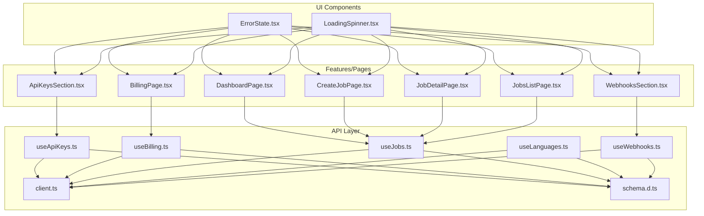
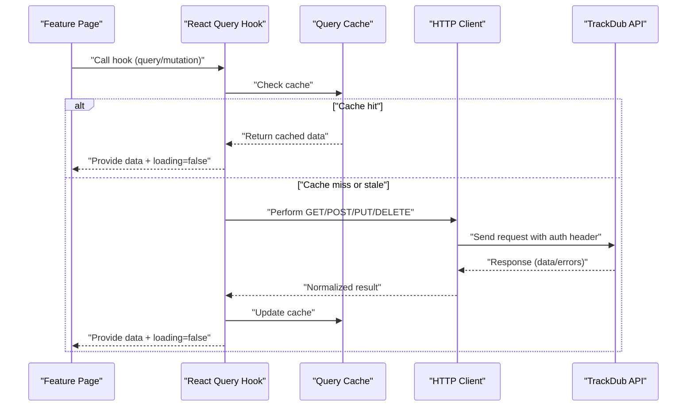
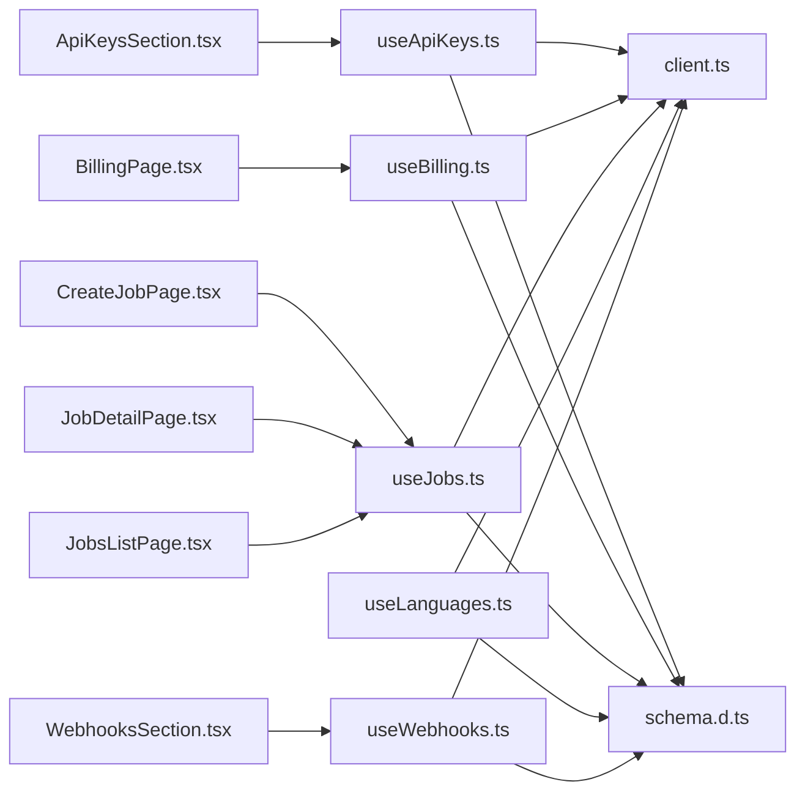

# API Integration

<cite>
**Referenced Files in This Document**
- [client.ts](file://src/api/client.ts)
- [schema.d.ts](file://src/api/schema.d.ts)
- [useApiKeys.ts](file://src/api/hooks/useApiKeys.ts)
- [useBilling.ts](file://src/api/hooks/useBilling.ts)
- [useJobs.ts](file://src/api/hooks/useJobs.ts)
- [useLanguages.ts](file://src/api/hooks/useLanguages.ts)
- [useWebhooks.ts](file://src/api/hooks/useWebhooks.ts)
- [index.ts](file://src/hooks/index.ts)
- [config.ts](file://src/lib/config.ts)
- [error-capture.ts](file://src/lib/error-capture.ts)
- [ErrorState.tsx](file://src/components/portal/ErrorState.tsx)
- [LoadingSpinner.tsx](file://src/components/portal/LoadingSpinner.tsx)
- [DashboardPage.tsx](file://src/features/dashboard/DashboardPage.tsx)
- [BillingPage.tsx](file://src/features/billing/BillingPage.tsx)
- [CreateJobPage.tsx](file://src/features/jobs/CreateJobPage.tsx)
- [JobDetailPage.tsx](file://src/features/jobs/JobDetailPage.tsx)
- [JobsListPage.tsx](file://src/features/jobs/JobsListPage.tsx)
- [ApiKeysSection.tsx](file://src/features/settings/ApiKeysSection.tsx)
- [WebhooksSection.tsx](file://src/features/settings/WebhooksSection.tsx)
</cite>

## Table of Contents
1. [Introduction](#introduction)
2. [Project Structure](#project-structure)
3. [Core Components](#core-components)
4. [Architecture Overview](#architecture-overview)
5. [Detailed Component Analysis](#detailed-component-analysis)
6. [Dependency Analysis](#dependency-analysis)
7. [Performance Considerations](#performance-considerations)
8. [Troubleshooting Guide](#troubleshooting-guide)
9. [Conclusion](#conclusion)
10. [Appendices](#appendices)

## Introduction
This document describes the client-side API integration for TrackDub Portal. It covers the HTTP client configuration, custom React Query hooks for data fetching (API keys, billing, jobs), error handling strategies, request/response schemas, and TypeScript type safety patterns. It also provides guidance on making API calls, managing authentication, handling loading states, implementing optimistic updates, and extending the API layer with new endpoints while maintaining consistency.

## Project Structure
The API layer is organized under src/api with a clear separation between the HTTP client, schema definitions, and feature-specific hooks:
- Client configuration and base URL management live in a single client module.
- Shared TypeScript types and Zod-like schemas are centralized for consistent validation.
- Feature-scoped hooks encapsulate queries and mutations for each domain (API keys, billing, jobs, languages, webhooks).
- UI components provide standardized error and loading states consumed by pages.

**Diagram sources**
- [client.ts](file://src/api/client.ts)
- [schema.d.ts](file://src/api/schema.d.ts)
- [useApiKeys.ts](file://src/api/hooks/useApiKeys.ts)
- [useBilling.ts](file://src/api/hooks/useBilling.ts)
- [useJobs.ts](file://src/api/hooks/useJobs.ts)
- [useLanguages.ts](file://src/api/hooks/useLanguages.ts)
- [useWebhooks.ts](file://src/api/hooks/useWebhooks.ts)
- [ErrorState.tsx](file://src/components/portal/ErrorState.tsx)
- [LoadingSpinner.tsx](file://src/components/portal/LoadingSpinner.tsx)
- [DashboardPage.tsx](file://src/features/dashboard/DashboardPage.tsx)
- [BillingPage.tsx](file://src/features/billing/BillingPage.tsx)
- [CreateJobPage.tsx](file://src/features/jobs/CreateJobPage.tsx)
- [JobDetailPage.tsx](file://src/features/jobs/JobDetailPage.tsx)
- [JobsListPage.tsx](file://src/features/jobs/JobsListPage.tsx)
- [ApiKeysSection.tsx](file://src/features/settings/ApiKeysSection.tsx)
- [WebhooksSection.tsx](file://src/features/settings/WebhooksSection.tsx)

**Section sources**
- [client.ts](file://src/api/client.ts)
- [schema.d.ts](file://src/api/schema.d.ts)
- [useApiKeys.ts](file://src/api/hooks/useApiKeys.ts)
- [useBilling.ts](file://src/api/hooks/useBilling.ts)
- [useJobs.ts](file://src/api/hooks/useJobs.ts)
- [useLanguages.ts](file://src/api/hooks/useLanguages.ts)
- [useWebhooks.ts](file://src/api/hooks/useWebhooks.ts)
- [ErrorState.tsx](file://src/components/portal/ErrorState.tsx)
- [LoadingSpinner.tsx](file://src/components/portal/LoadingSpinner.tsx)

## Core Components
- API Client: Centralized HTTP client configuration including base URL, headers, interceptors for auth tokens, and error normalization.
- Schema Definitions: Shared TypeScript types and runtime validation schemas to ensure consistent request/response shapes across hooks and UI.
- Custom Hooks: React Query-based hooks that encapsulate queries and mutations for specific domains, providing caching, retries, and optimistic updates.

Key responsibilities:
- client.ts: Base URL, default headers, token injection, response parsing, and error mapping.
- schema.d.ts: Type definitions for API payloads and responses used by hooks and components.
- useApiKeys.ts: CRUD operations for API keys with caching and mutation callbacks.
- useBilling.ts: Fetching billing info, usage metrics, and invoices.
- useJobs.ts: Job lifecycle operations including creation, status polling, and retrieval.
- useLanguages.ts: Language metadata and availability.
- useWebhooks.ts: Webhook registration and event delivery logs.

**Section sources**
- [client.ts](file://src/api/client.ts)
- [schema.d.ts](file://src/api/schema.d.ts)
- [useApiKeys.ts](file://src/api/hooks/useApiKeys.ts)
- [useBilling.ts](file://src/api/hooks/useBilling.ts)
- [useJobs.ts](file://src/api/hooks/useJobs.ts)
- [useLanguages.ts](file://src/api/hooks/useLanguages.ts)
- [useWebhooks.ts](file://src/api/hooks/useWebhooks.ts)

## Architecture Overview
The client-side architecture follows a layered pattern:
- UI layers consume React Query hooks for data access.
- Hooks call the centralized HTTP client to perform network requests.
- The client handles authentication, serialization, and error normalization.
- Shared schemas enforce type safety and validate payloads at runtime.

**Diagram sources**
- [client.ts](file://src/api/client.ts)
- [useJobs.ts](file://src/api/hooks/useJobs.ts)
- [useBilling.ts](file://src/api/hooks/useBilling.ts)
- [useApiKeys.ts](file://src/api/hooks/useApiKeys.ts)

## Detailed Component Analysis

### API Client Configuration
Responsibilities:
- Configure base URL from environment settings.
- Attach authentication headers using stored tokens.
- Normalize errors into a consistent shape for UI consumption.
- Provide typed methods for common HTTP operations.

Typical usage patterns:
- Import the client instance in hooks.
- Use typed wrappers for GET/POST/PUT/DELETE.
- Handle normalized errors in hooks and propagate to UI.

Best practices:
- Keep base URL configuration centralized.
- Ensure all responses are validated against shared schemas.
- Centralize retry and timeout policies.

**Section sources**
- [client.ts](file://src/api/client.ts)
- [config.ts](file://src/lib/config.ts)

### Schema Definitions and Type Safety
Responsibilities:
- Define TypeScript interfaces for request and response payloads.
- Provide runtime validation schemas aligned with server contracts.
- Export reusable types for hooks and UI components.

Type safety patterns:
- Use strict typing for query parameters and mutation inputs.
- Validate responses before passing to UI state.
- Maintain backward compatibility when evolving schemas.

**Section sources**
- [schema.d.ts](file://src/api/schema.d.ts)

### useApiKeys Hook
Responsibilities:
- Fetch list of API keys.
- Create, update, and delete API keys.
- Manage optimistic updates for immediate UI feedback.
- Invalidate caches after mutations.

Common flows:
- Query: Retrieve keys with pagination and filters.
- Mutation: Create key with generated secret; handle success and error callbacks.
- Optimistic Update: Temporarily add new key to cache before server confirmation.

Error handling:
- Map server errors to user-friendly messages.
- Roll back optimistic changes on failure.

**Section sources**
- [useApiKeys.ts](file://src/api/hooks/useApiKeys.ts)
- [ApiKeysSection.tsx](file://src/features/settings/ApiKeysSection.tsx)

### useBilling Hook
Responsibilities:
- Fetch current billing tier, usage metrics, and invoice history.
- Refresh usage data periodically.
- Handle errors gracefully and display summaries.

Data flow:
- Query billing summary on page load.
- Poll usage metrics at intervals.
- Render charts and tables based on fetched data.

**Section sources**
- [useBilling.ts](file://src/api/hooks/useBilling.ts)
- [BillingPage.tsx](file://src/features/billing/BillingPage.tsx)

### useJobs Hook
Responsibilities:
- Create new jobs with file uploads and metadata.
- Retrieve job details and status.
- List jobs with filtering and pagination.
- Implement polling for job completion.

Optimistic updates:
- Immediately add newly created job to the list.
- Update job status in cache upon receiving server events.

Error handling:
- Distinguish between network errors and server validation errors.
- Provide actionable messages for failed uploads.

**Section sources**
- [useJobs.ts](file://src/api/hooks/useJobs.ts)
- [CreateJobPage.tsx](file://src/features/jobs/CreateJobPage.tsx)
- [JobDetailPage.tsx](file://src/features/jobs/JobDetailPage.tsx)
- [JobsListPage.tsx](file://src/features/jobs/JobsListPage.tsx)

### useLanguages Hook
Responsibilities:
- Fetch available languages and their capabilities.
- Cache language metadata globally.
- Provide type-safe options for job creation forms.

**Section sources**
- [useLanguages.ts](file://src/api/hooks/useLanguages.ts)

### useWebhooks Hook
Responsibilities:
- Register and manage webhooks for event delivery.
- View webhook delivery logs and statuses.
- Handle failures and retries.

**Section sources**
- [useWebhooks.ts](file://src/api/hooks/useWebhooks.ts)
- [WebhooksSection.tsx](file://src/features/settings/WebhooksSection.tsx)

### Authentication Flow
Responsibilities:
- Inject authentication tokens into requests via client headers.
- Refresh tokens when expired.
- Redirect unauthenticated users to login routes.

Flow overview:
- On app initialization, check for stored credentials.
- Attach Authorization header to all requests.
- Handle 401 responses by prompting re-authentication.

**Section sources**
- [client.ts](file://src/api/client.ts)
- [config.ts](file://src/lib/config.ts)

### Error Handling Strategy
Responsibilities:
- Normalize network and server errors into a consistent structure.
- Display user-friendly messages through ErrorState component.
- Log errors for debugging and monitoring.

Patterns:
- Centralized error mapper in the client.
- Hook-level try/catch blocks with informative messages.
- Global error capture for unhandled exceptions.

**Section sources**
- [client.ts](file://src/api/client.ts)
- [error-capture.ts](file://src/lib/error-capture.ts)
- [ErrorState.tsx](file://src/components/portal/ErrorState.tsx)

### Loading States Management
Responsibilities:
- Expose isLoading flags from React Query hooks.
- Render LoadingSpinner during data fetches.
- Avoid unnecessary re-renders by memoizing derived values.

Patterns:
- Conditional rendering based on loading states.
- Skeleton loaders for better perceived performance.

**Section sources**
- [LoadingSpinner.tsx](file://src/components/portal/LoadingSpinner.tsx)
- [DashboardPage.tsx](file://src/features/dashboard/DashboardPage.tsx)
- [BillingPage.tsx](file://src/features/billing/BillingPage.tsx)
- [JobsListPage.tsx](file://src/features/jobs/JobsListPage.tsx)

## Dependency Analysis
The API layer has clear dependencies:
- Hooks depend on the HTTP client for network operations.
- All hooks reference shared schemas for type safety.
- UI components consume hooks and render standardized error/loading states.

**Diagram sources**
- [useApiKeys.ts](file://src/api/hooks/useApiKeys.ts)
- [useBilling.ts](file://src/api/hooks/useBilling.ts)
- [useJobs.ts](file://src/api/hooks/useJobs.ts)
- [useLanguages.ts](file://src/api/hooks/useLanguages.ts)
- [useWebhooks.ts](file://src/api/hooks/useWebhooks.ts)
- [client.ts](file://src/api/client.ts)
- [schema.d.ts](file://src/api/schema.d.ts)
- [ApiKeysSection.tsx](file://src/features/settings/ApiKeysSection.tsx)
- [BillingPage.tsx](file://src/features/billing/BillingPage.tsx)
- [CreateJobPage.tsx](file://src/features/jobs/CreateJobPage.tsx)
- [JobDetailPage.tsx](file://src/features/jobs/JobDetailPage.tsx)
- [JobsListPage.tsx](file://src/features/jobs/JobsListPage.tsx)
- [WebhooksSection.tsx](file://src/features/settings/WebhooksSection.tsx)

**Section sources**
- [useApiKeys.ts](file://src/api/hooks/useApiKeys.ts)
- [useBilling.ts](file://src/api/hooks/useBilling.ts)
- [useJobs.ts](file://src/api/hooks/useJobs.ts)
- [useLanguages.ts](file://src/api/hooks/useLanguages.ts)
- [useWebhooks.ts](file://src/api/hooks/useWebhooks.ts)
- [client.ts](file://src/api/client.ts)
- [schema.d.ts](file://src/api/schema.d.ts)

## Performance Considerations
- Leverage React Query caching to minimize redundant network requests.
- Implement pagination and infinite scrolling for large datasets.
- Use optimistic updates to improve perceived responsiveness.
- Debounce search inputs and throttle polling intervals.
- Memoize expensive computations and derived state.

[No sources needed since this section provides general guidance]

## Troubleshooting Guide
Common issues and resolutions:
- Network errors: Check connectivity and server availability; review client error normalization.
- Authentication failures: Verify token storage and refresh logic; ensure Authorization header is set.
- Validation errors: Inspect request payloads against shared schemas; confirm field requirements.
- Stale data: Invalidate caches after mutations; adjust refetch intervals.

Debugging tips:
- Enable detailed logging in development mode.
- Use browser dev tools to inspect network requests and responses.
- Review error logs captured by the global error handler.

**Section sources**
- [client.ts](file://src/api/client.ts)
- [error-capture.ts](file://src/lib/error-capture.ts)
- [ErrorState.tsx](file://src/components/portal/ErrorState.tsx)

## Conclusion
The TrackDub Portal’s client-side API integration is built around a robust HTTP client, shared schemas, and feature-specific React Query hooks. This design ensures type safety, consistent error handling, and efficient data management. By following the patterns outlined here, developers can extend the API layer with new endpoints while maintaining reliability and performance.

[No sources needed since this section summarizes without analyzing specific files]

## Appendices

### Extending the API Layer
Steps to add a new endpoint:
1. Define request/response types in schema.d.ts.
2. Add a new method to the HTTP client if needed.
3. Create a custom hook in src/api/hooks with appropriate queries/mutations.
4. Consume the hook in relevant features/pages.
5. Implement error handling and loading states consistently.

Consistency guidelines:
- Use shared schemas for all payloads.
- Follow naming conventions for hooks and methods.
- Centralize error normalization and logging.

**Section sources**
- [schema.d.ts](file://src/api/schema.d.ts)
- [client.ts](file://src/api/client.ts)
- [useApiKeys.ts](file://src/api/hooks/useApiKeys.ts)
- [useBilling.ts](file://src/api/hooks/useBilling.ts)
- [useJobs.ts](file://src/api/hooks/useJobs.ts)