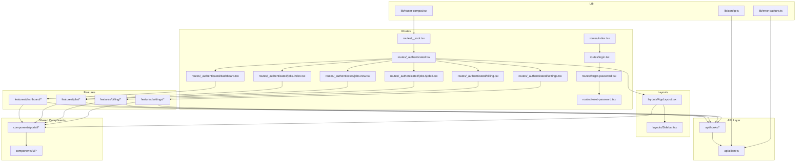
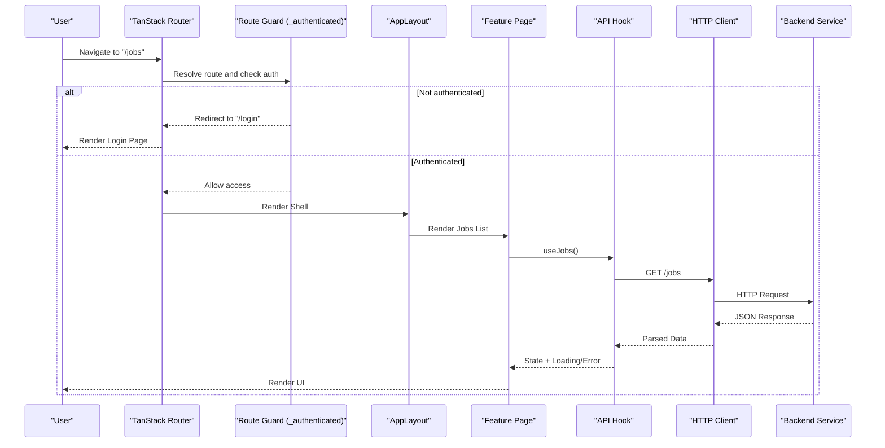
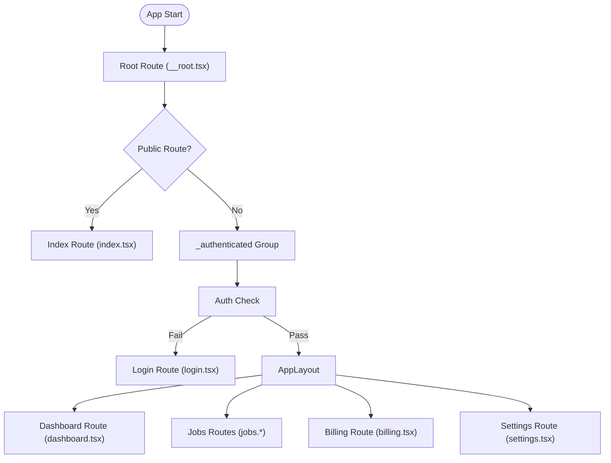
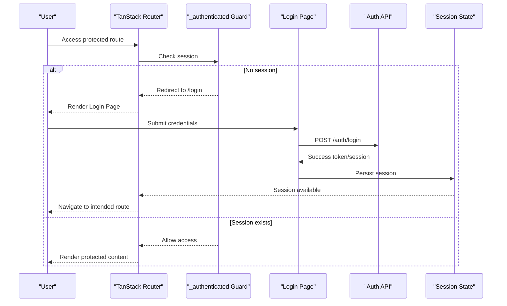
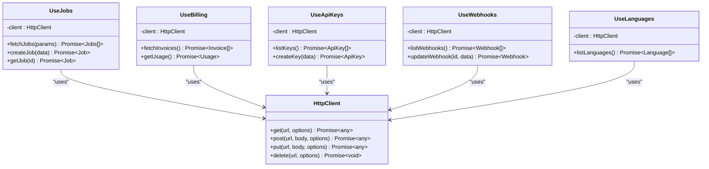
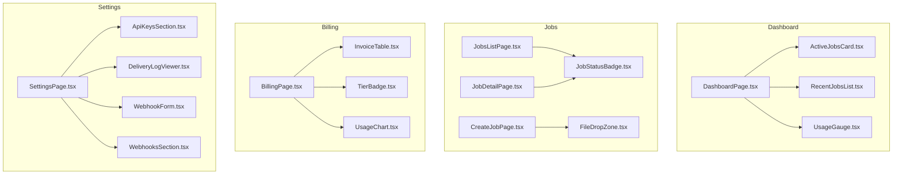
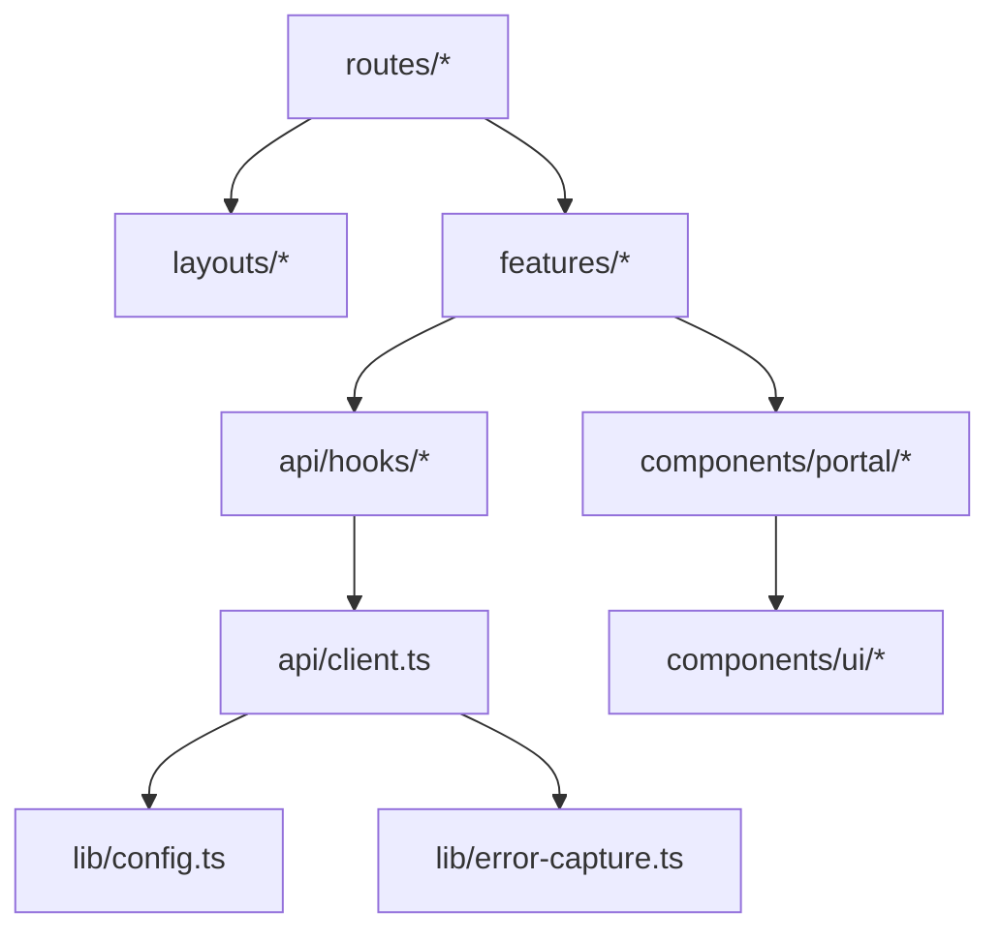

# Architecture & Design

<cite>
**Referenced Files in This Document**
- [router.tsx](file://src/router.tsx)
- [routeTree.gen.ts](file://src/routeTree.gen.ts)
- [__root.tsx](file://src/routes/__root.tsx)
- [_authenticated.tsx](file://src/routes/_authenticated.tsx)
- [index.tsx](file://src/routes/index.tsx)
- [login.tsx](file://src/routes/login.tsx)
- [forgot-password.tsx](file://src/routes/forgot-password.tsx)
- [reset-password.tsx](file://src/routes/reset-password.tsx)
- [dashboard.tsx](file://src/routes/_authenticated/dashboard.tsx)
- [jobs.index.tsx](file://src/routes/_authenticated/jobs.index.tsx)
- [jobs.new.tsx](file://src/routes/_authenticated/jobs.new.tsx)
- [jobs.$jobId.tsx](file://src/routes/_authenticated/jobs.$jobId.tsx)
- [billing.tsx](file://src/routes/_authenticated/billing.tsx)
- [settings.tsx](file://src/routes/_authenticated/settings.tsx)
- [AppLayout.tsx](file://src/layouts/AppLayout.tsx)
- [Sidebar.tsx](file://src/layouts/Sidebar.tsx)
- [client.ts](file://src/api/client.ts)
- [useApiKeys.ts](file://src/api/hooks/useApiKeys.ts)
- [useBilling.ts](file://src/api/hooks/useBilling.ts)
- [useJobs.ts](file://src/api/hooks/useJobs.ts)
- [useLanguages.ts](file://src/api/hooks/useLanguages.ts)
- [useWebhooks.ts](file://src/api/hooks/useWebhooks.ts)
- [DashboardPage.tsx](file://src/features/dashboard/DashboardPage.tsx)
- [ActiveJobsCard.tsx](file://src/features/dashboard/ActiveJobsCard.tsx)
- [RecentJobsList.tsx](file://src/features/dashboard/RecentJobsList.tsx)
- [UsageGauge.tsx](file://src/features/dashboard/UsageGauge.tsx)
- [CreateJobPage.tsx](file://src/features/jobs/CreateJobPage.tsx)
- [FileDropZone.tsx](file://src/features/jobs/FileDropZone.tsx)
- [JobDetailPage.tsx](file://src/features/jobs/JobDetailPage.tsx)
- [JobStatusBadge.tsx](file://src/features/jobs/JobStatusBadge.tsx)
- [JobsListPage.tsx](file://src/features/jobs/JobsListPage.tsx)
- [BillingPage.tsx](file://src/features/billing/BillingPage.tsx)
- [InvoiceTable.tsx](file://src/features/billing/InvoiceTable.tsx)
- [TierBadge.tsx](file://src/features/billing/TierBadge.tsx)
- [UsageChart.tsx](file://src/features/billing/UsageChart.tsx)
- [SettingsPage.tsx](file://src/features/settings/SettingsPage.tsx)
- [ApiKeysSection.tsx](file://src/features/settings/ApiKeysSection.tsx)
- [DeliveryLogViewer.tsx](file://src/features/settings/DeliveryLogViewer.tsx)
- [WebhookForm.tsx](file://src/features/settings/WebhookForm.tsx)
- [WebhooksSection.tsx](file://src/features/settings/WebhooksSection.tsx)
- [Button.tsx](file://src/components/portal/Button.tsx)
- [Card.tsx](file://src/components/portal/Card.tsx)
- [ConfirmDialog.tsx](file://src/components/portal/ConfirmDialog.tsx)
- [ErrorState.tsx](file://src/components/portal/ErrorState.tsx)
- [LoadingSpinner.tsx](file://src/components/portal/LoadingSpinner.tsx)
- [Pagination.tsx](file://src/components/portal/Pagination.tsx)
- [Skeleton.tsx](file://src/components/portal/Skeleton.tsx)
- [Table.tsx](file://src/components/portal/Table.tsx)
- [config.ts](file://src/lib/config.ts)
- [error-capture.ts](file://src/lib/error-capture.ts)
- [error-page.ts](file://src/lib/error-page.ts)
- [lovable-error-reporting.ts](file://src/lib/lovable-error-reporting.ts)
- [router-compat.tsx](file://src/lib/router-compat.tsx)
- [utils.ts](file://src/lib/utils.ts)
- [server.ts](file://src/server.ts)
- [sites.tsx](file://src/sites.tsx)
- [start.ts](file://src/start.ts)
- [vite.config.ts](file://vite.config.ts)
</cite>

## Table of Contents
1. Introduction
2. Project Structure
3. Core Components
4. Architecture Overview
5. Detailed Component Analysis
6. Dependency Analysis
7. Performance Considerations
8. Troubleshooting Guide
9. Conclusion

## Introduction
This document describes the architecture and design of TrackDub Portal, a React-based web application that provides job management, billing, and settings capabilities through a feature-driven UI. The frontend is built with React and uses TanStack Router for routing, with a clear separation between features, shared components, and API layers. Authentication, state management, and data fetching are implemented using hooks and typed client abstractions. The system emphasizes scalability, performance, and security patterns across its layers.

## Project Structure
The project follows a feature-based organization under src:
- routes: Route definitions for public and authenticated sections, including nested routes for jobs and settings.
- layouts: Shared layout components such as AppLayout and Sidebar.
- features: Feature modules (dashboard, jobs, billing, settings), each containing page-level components and related UI pieces.
- components: Reusable UI primitives grouped into portal-specific components and generic ui components.
- api: Typed HTTP client and hooks encapsulating data fetching logic per domain.
- lib: Utilities, configuration, error handling, and router compatibility helpers.
- server.ts and start.ts: Entry points for development and runtime initialization.
- vite.config.ts: Build configuration for Vite.

**Diagram sources**
- [router.tsx:1-200](file://src/router.tsx#L1-L200)
- [routeTree.gen.ts:1-200](file://src/routeTree.gen.ts#L1-L200)
- [__root.tsx:1-200](file://src/routes/__root.tsx#L1-L200)
- [_authenticated.tsx:1-200](file://src/routes/_authenticated.tsx#L1-L200)
- [index.tsx:1-200](file://src/routes/index.tsx#L1-L200)
- [login.tsx:1-200](file://src/routes/login.tsx#L1-L200)
- [forgot-password.tsx:1-200](file://src/routes/forgot-password.tsx#L1-L200)
- [reset-password.tsx:1-200](file://src/routes/reset-password.tsx#L1-L200)
- [dashboard.tsx:1-200](file://src/routes/_authenticated/dashboard.tsx#L1-L200)
- [jobs.index.tsx:1-200](file://src/routes/_authenticated/jobs.index.tsx#L1-L200)
- [jobs.new.tsx:1-200](file://src/routes/_authenticated/jobs.new.tsx#L1-L200)
- [jobs.$jobId.tsx:1-200](file://src/routes/_authenticated/jobs.$jobId.tsx#L1-L200)
- [billing.tsx:1-200](file://src/routes/_authenticated/billing.tsx#L1-L200)
- [settings.tsx:1-200](file://src/routes/_authenticated/settings.tsx#L1-L200)
- [AppLayout.tsx:1-200](file://src/layouts/AppLayout.tsx#L1-L200)
- [Sidebar.tsx:1-200](file://src/layouts/Sidebar.tsx#L1-L200)
- [client.ts:1-200](file://src/api/client.ts#L1-L200)
- [useJobs.ts:1-200](file://src/api/hooks/useJobs.ts#L1-L200)
- [useBilling.ts:1-200](file://src/api/hooks/useBilling.ts#L1-L200)
- [useApiKeys.ts:1-200](file://src/api/hooks/useApiKeys.ts#L1-L200)
- [useWebhooks.ts:1-200](file://src/api/hooks/useWebhooks.ts#L1-L200)
- [useLanguages.ts:1-200](file://src/api/hooks/useLanguages.ts#L1-L200)
- [config.ts:1-200](file://src/lib/config.ts#L1-L200)
- [error-capture.ts:1-200](file://src/lib/error-capture.ts#L1-L200)
- [router-compat.tsx:1-200](file://src/lib/router-compat.tsx#L1-L200)

**Section sources**
- [router.tsx:1-200](file://src/router.tsx#L1-L200)
- [routeTree.gen.ts:1-200](file://src/routeTree.gen.ts#L1-L200)
- [__root.tsx:1-200](file://src/routes/__root.tsx#L1-L200)
- [_authenticated.tsx:1-200](file://src/routes/_authenticated.tsx#L1-L200)
- [index.tsx:1-200](file://src/routes/index.tsx#L1-L200)
- [login.tsx:1-200](file://src/routes/login.tsx#L1-L200)
- [forgot-password.tsx:1-200](file://src/routes/forgot-password.tsx#L1-L200)
- [reset-password.tsx:1-200](file://src/routes/reset-password.tsx#L1-L200)
- [dashboard.tsx:1-200](file://src/routes/_authenticated/dashboard.tsx#L1-L200)
- [jobs.index.tsx:1-200](file://src/routes/_authenticated/jobs.index.tsx#L1-L200)
- [jobs.new.tsx:1-200](file://src/routes/_authenticated/jobs.new.tsx#L1-L200)
- [jobs.$jobId.tsx:1-200](file://src/routes/_authenticated/jobs.$jobId.tsx#L1-L200)
- [billing.tsx:1-200](file://src/routes/_authenticated/billing.tsx#L1-L200)
- [settings.tsx:1-200](file://src/routes/_authenticated/settings.tsx#L1-L200)
- [AppLayout.tsx:1-200](file://src/layouts/AppLayout.tsx#L1-L200)
- [Sidebar.tsx:1-200](file://src/layouts/Sidebar.tsx#L1-L200)
- [client.ts:1-200](file://src/api/client.ts#L1-L200)
- [useJobs.ts:1-200](file://src/api/hooks/useJobs.ts#L1-L200)
- [useBilling.ts:1-200](file://src/api/hooks/useBilling.ts#L1-L200)
- [useApiKeys.ts:1-200](file://src/api/hooks/useApiKeys.ts#L1-L200)
- [useWebhooks.ts:1-200](file://src/api/hooks/useWebhooks.ts#L1-L200)
- [useLanguages.ts:1-200](file://src/api/hooks/useLanguages.ts#L1-L200)
- [config.ts:1-200](file://src/lib/config.ts#L1-L200)
- [error-capture.ts:1-200](file://src/lib/error-capture.ts#L1-L200)
- [router-compat.tsx:1-200](file://src/lib/router-compat.tsx#L1-L200)

## Core Components
TrackDub Portal organizes UI into three primary layers:
- Routes and Layouts: Define navigation structure and shell chrome (e.g., sidebar, header).
- Features: Domain-focused pages and components (dashboard, jobs, billing, settings).
- Shared Components: Reusable UI primitives (buttons, cards, dialogs, tables, pagination, skeletons).

Key responsibilities:
- Routes encapsulate route guards, authentication checks, and page composition.
- Layouts provide consistent chrome and navigation context.
- Features implement business logic presentation and compose shared components.
- API layer centralizes HTTP requests, typing, and hook-based data access.

**Section sources**
- [AppLayout.tsx:1-200](file://src/layouts/AppLayout.tsx#L1-L200)
- [Sidebar.tsx:1-200](file://src/layouts/Sidebar.tsx#L1-L200)
- [DashboardPage.tsx:1-200](file://src/features/dashboard/DashboardPage.tsx#L1-L200)
- [JobsListPage.tsx:1-200](file://src/features/jobs/JobsListPage.tsx#L1-L200)
- [CreateJobPage.tsx:1-200](file://src/features/jobs/CreateJobPage.tsx#L1-L200)
- [BillingPage.tsx:1-200](file://src/features/billing/BillingPage.tsx#L1-L200)
- [SettingsPage.tsx:1-200](file://src/features/settings/SettingsPage.tsx#L1-L200)
- [client.ts:1-200](file://src/api/client.ts#L1-L200)

## Architecture Overview
The application uses TanStack Router to define a type-safe route tree. Public routes include login, forgot password, and reset password. Authenticated routes are grouped under a protected segment and render the main app layout. Each feature has dedicated route files that compose feature pages. Data fetching is centralized via hooks that call a typed HTTP client configured with environment variables and error capture utilities.

**Diagram sources**
- [router.tsx:1-200](file://src/router.tsx#L1-L200)
- [routeTree.gen.ts:1-200](file://src/routeTree.gen.ts#L1-L200)
- [_authenticated.tsx:1-200](file://src/routes/_authenticated.tsx#L1-L200)
- [AppLayout.tsx:1-200](file://src/layouts/AppLayout.tsx#L1-L200)
- [jobs.index.tsx:1-200](file://src/routes/_authenticated/jobs.index.tsx#L1-L200)
- [useJobs.ts:1-200](file://src/api/hooks/useJobs.ts#L1-L200)
- [client.ts:1-200](file://src/api/client.ts#L1-L200)

## Detailed Component Analysis

### Routing and Navigation
- Root route sets up global providers and error boundaries.
- Public routes handle login, forgot password, and reset password flows.
- Authenticated routes wrap content with AppLayout and enforce authentication.
- Feature routes map to feature pages and compose domain-specific components.

**Diagram sources**
- [__root.tsx:1-200](file://src/routes/__root.tsx#L1-L200)
- [index.tsx:1-200](file://src/routes/index.tsx#L1-L200)
- [_authenticated.tsx:1-200](file://src/routes/_authenticated.tsx#L1-L200)
- [login.tsx:1-200](file://src/routes/login.tsx#L1-L200)
- [forgot-password.tsx:1-200](file://src/routes/forgot-password.tsx#L1-L200)
- [reset-password.tsx:1-200](file://src/routes/reset-password.tsx#L1-L200)
- [dashboard.tsx:1-200](file://src/routes/_authenticated/dashboard.tsx#L1-L200)
- [jobs.index.tsx:1-200](file://src/routes/_authenticated/jobs.index.tsx#L1-L200)
- [jobs.new.tsx:1-200](file://src/routes/_authenticated/jobs.new.tsx#L1-L200)
- [jobs.$jobId.tsx:1-200](file://src/routes/_authenticated/jobs.$jobId.tsx#L1-L200)
- [billing.tsx:1-200](file://src/routes/_authenticated/billing.tsx#L1-L200)
- [settings.tsx:1-200](file://src/routes/_authenticated/settings.tsx#L1-L200)

**Section sources**
- [__root.tsx:1-200](file://src/routes/__root.tsx#L1-L200)
- [_authenticated.tsx:1-200](file://src/routes/_authenticated.tsx#L1-L200)
- [index.tsx:1-200](file://src/routes/index.tsx#L1-L200)
- [login.tsx:1-200](file://src/routes/login.tsx#L1-L200)
- [forgot-password.tsx:1-200](file://src/routes/forgot-password.tsx#L1-L200)
- [reset-password.tsx:1-200](file://src/routes/reset-password.tsx#L1-L200)
- [dashboard.tsx:1-200](file://src/routes/_authenticated/dashboard.tsx#L1-L200)
- [jobs.index.tsx:1-200](file://src/routes/_authenticated/jobs.index.tsx#L1-L200)
- [jobs.new.tsx:1-200](file://src/routes/_authenticated/jobs.new.tsx#L1-L200)
- [jobs.$jobId.tsx:1-200](file://src/routes/_authenticated/jobs.$jobId.tsx#L1-L200)
- [billing.tsx:1-200](file://src/routes/_authenticated/billing.tsx#L1-L200)
- [settings.tsx:1-200](file://src/routes/_authenticated/settings.tsx#L1-L200)

### Authentication Flow
Authentication is enforced at the route level. Unauthenticated users are redirected to login. After successful login, users gain access to protected routes. Password recovery flows are exposed via dedicated routes.

**Diagram sources**
- [_authenticated.tsx:1-200](file://src/routes/_authenticated.tsx#L1-L200)
- [login.tsx:1-200](file://src/routes/login.tsx#L1-L200)
- [forgot-password.tsx:1-200](file://src/routes/forgot-password.tsx#L1-L200)
- [reset-password.tsx:1-200](file://src/routes/reset-password.tsx#L1-L200)

**Section sources**
- [_authenticated.tsx:1-200](file://src/routes/_authenticated.tsx#L1-L200)
- [login.tsx:1-200](file://src/routes/login.tsx#L1-L200)
- [forgot-password.tsx:1-200](file://src/routes/forgot-password.tsx#L1-L200)
- [reset-password.tsx:1-200](file://src/routes/reset-password.tsx#L1-L200)

### Data Fetching Strategy
Data fetching is abstracted through domain-specific hooks that call a typed HTTP client. Hooks manage loading, error, and success states, enabling components to remain declarative.

**Diagram sources**
- [useJobs.ts:1-200](file://src/api/hooks/useJobs.ts#L1-L200)
- [useBilling.ts:1-200](file://src/api/hooks/useBilling.ts#L1-L200)
- [useApiKeys.ts:1-200](file://src/api/hooks/useApiKeys.ts#L1-L200)
- [useWebhooks.ts:1-200](file://src/api/hooks/useWebhooks.ts#L1-L200)
- [useLanguages.ts:1-200](file://src/api/hooks/useLanguages.ts#L1-L200)
- [client.ts:1-200](file://src/api/client.ts#L1-L200)

**Section sources**
- [useJobs.ts:1-200](file://src/api/hooks/useJobs.ts#L1-L200)
- [useBilling.ts:1-200](file://src/api/hooks/useBilling.ts#L1-L200)
- [useApiKeys.ts:1-200](file://src/api/hooks/useApiKeys.ts#L1-L200)
- [useWebhooks.ts:1-200](file://src/api/hooks/useWebhooks.ts#L1-L200)
- [useLanguages.ts:1-200](file://src/api/hooks/useLanguages.ts#L1-L200)
- [client.ts:1-200](file://src/api/client.ts#L1-L200)

### Feature Modules
- Dashboard: Displays active jobs, recent activity, and usage metrics. Composes dashboard-specific components and uses data hooks.
- Jobs: Provides listing, creation, and detail views for jobs. Includes file upload UX and status indicators.
- Billing: Shows invoices, tier information, and usage charts. Integrates billing-related hooks.
- Settings: Manages API keys, webhooks, and delivery logs. Uses forms and sectioned UI components.

**Diagram sources**
- [DashboardPage.tsx:1-200](file://src/features/dashboard/DashboardPage.tsx#L1-L200)
- [ActiveJobsCard.tsx:1-200](file://src/features/dashboard/ActiveJobsCard.tsx#L1-L200)
- [RecentJobsList.tsx:1-200](file://src/features/dashboard/RecentJobsList.tsx#L1-L200)
- [UsageGauge.tsx:1-200](file://src/features/dashboard/UsageGauge.tsx#L1-L200)
- [JobsListPage.tsx:1-200](file://src/features/jobs/JobsListPage.tsx#L1-L200)
- [CreateJobPage.tsx:1-200](file://src/features/jobs/CreateJobPage.tsx#L1-L200)
- [JobDetailPage.tsx:1-200](file://src/features/jobs/JobDetailPage.tsx#L1-L200)
- [JobStatusBadge.tsx:1-200](file://src/features/jobs/JobStatusBadge.tsx#L1-L200)
- [FileDropZone.tsx:1-200](file://src/features/jobs/FileDropZone.tsx#L1-L200)
- [BillingPage.tsx:1-200](file://src/features/billing/BillingPage.tsx#L1-L200)
- [InvoiceTable.tsx:1-200](file://src/features/billing/InvoiceTable.tsx#L1-L200)
- [TierBadge.tsx:1-200](file://src/features/billing/TierBadge.tsx#L1-L200)
- [UsageChart.tsx:1-200](file://src/features/billing/UsageChart.tsx#L1-L200)
- [SettingsPage.tsx:1-200](file://src/features/settings/SettingsPage.tsx#L1-L200)
- [ApiKeysSection.tsx:1-200](file://src/features/settings/ApiKeysSection.tsx#L1-L200)
- [DeliveryLogViewer.tsx:1-200](file://src/features/settings/DeliveryLogViewer.tsx#L1-L200)
- [WebhookForm.tsx:1-200](file://src/features/settings/WebhookForm.tsx#L1-L200)
- [WebhooksSection.tsx:1-200](file://src/features/settings/WebhooksSection.tsx#L1-L200)

**Section sources**
- [DashboardPage.tsx:1-200](file://src/features/dashboard/DashboardPage.tsx#L1-L200)
- [JobsListPage.tsx:1-200](file://src/features/jobs/JobsListPage.tsx#L1-L200)
- [CreateJobPage.tsx:1-200](file://src/features/jobs/CreateJobPage.tsx#L1-L200)
- [JobDetailPage.tsx:1-200](file://src/features/jobs/JobDetailPage.tsx#L1-L200)
- [BillingPage.tsx:1-200](file://src/features/billing/BillingPage.tsx#L1-L200)
- [SettingsPage.tsx:1-200](file://src/features/settings/SettingsPage.tsx#L1-L200)

### Shared Components
Shared components provide consistent UI elements across features:
- Portal components: Button, Card, ConfirmDialog, ErrorState, LoadingSpinner, Pagination, Skeleton, Table.
- UI primitives: Form controls, overlays, navigation aids, and layout helpers.

These components are composed by feature pages to build cohesive user experiences while maintaining reusability and testability.

**Section sources**
- [Button.tsx:1-200](file://src/components/portal/Button.tsx#L1-L200)
- [Card.tsx:1-200](file://src/components/portal/Card.tsx#L1-L200)
- [ConfirmDialog.tsx:1-200](file://src/components/portal/ConfirmDialog.tsx#L1-L200)
- [ErrorState.tsx:1-200](file://src/components/portal/ErrorState.tsx#L1-L200)
- [LoadingSpinner.tsx:1-200](file://src/components/portal/LoadingSpinner.tsx#L1-L200)
- [Pagination.tsx:1-200](file://src/components/portal/Pagination.tsx#L1-L200)
- [Skeleton.tsx:1-200](file://src/components/portal/Skeleton.tsx#L1-L200)
- [Table.tsx:1-200](file://src/components/portal/Table.tsx#L1-L200)

## Dependency Analysis
The application exhibits clear layering:
- Routes depend on layouts and feature pages.
- Feature pages depend on API hooks for data.
- API hooks depend on the HTTP client and configuration.
- Shared components are consumed by features and layouts.

**Diagram sources**
- [router.tsx:1-200](file://src/router.tsx#L1-L200)
- [routeTree.gen.ts:1-200](file://src/routeTree.gen.ts#L1-L200)
- [AppLayout.tsx:1-200](file://src/layouts/AppLayout.tsx#L1-L200)
- [DashboardPage.tsx:1-200](file://src/features/dashboard/DashboardPage.tsx#L1-L200)
- [useJobs.ts:1-200](file://src/api/hooks/useJobs.ts#L1-L200)
- [client.ts:1-200](file://src/api/client.ts#L1-L200)
- [config.ts:1-200](file://src/lib/config.ts#L1-L200)
- [error-capture.ts:1-200](file://src/lib/error-capture.ts#L1-L200)

**Section sources**
- [router.tsx:1-200](file://src/router.tsx#L1-L200)
- [routeTree.gen.ts:1-200](file://src/routeTree.gen.ts#L1-L200)
- [AppLayout.tsx:1-200](file://src/layouts/AppLayout.tsx#L1-L200)
- [DashboardPage.tsx:1-200](file://src/features/dashboard/DashboardPage.tsx#L1-L200)
- [useJobs.ts:1-200](file://src/api/hooks/useJobs.ts#L1-L200)
- [client.ts:1-200](file://src/api/client.ts#L1-L200)
- [config.ts:1-200](file://src/lib/config.ts#L1-L200)
- [error-capture.ts:1-200](file://src/lib/error-capture.ts#L1-L200)

## Performance Considerations
- Route-level code splitting: TanStack Router enables lazy loading of route segments to reduce initial bundle size.
- Data caching and retries: API hooks can leverage caching strategies and retry policies to minimize network calls and improve perceived performance.
- Optimistic updates: For mutations (e.g., creating jobs or toggling settings), optimistic UI updates provide immediate feedback while background requests complete.
- Memoization and selective rendering: Components should memoize expensive computations and avoid unnecessary re-renders.
- Image and asset optimization: Lazy-load heavy assets and use appropriate formats/sizes.
- Pagination and virtualization: For large lists (jobs, invoices), paginate or virtualize rows to maintain smooth scrolling.

[No sources needed since this section provides general guidance]

## Troubleshooting Guide
Common issues and resolutions:
- Network errors: Inspect HTTP client responses and ensure proper error handling in hooks. Use error capture utilities to log and report failures.
- Authentication failures: Verify session persistence and guard behavior; ensure redirects occur when sessions expire.
- Route mismatches: Validate route definitions against the generated route tree and ensure path parameters match expected shapes.
- UI state inconsistencies: Check loading and error states in hooks; ensure components handle undefined or partial data gracefully.

Recommended debugging steps:
- Enable verbose logging in development for API calls.
- Use browser dev tools to inspect network payloads and timing.
- Add error boundaries around feature modules to catch and display errors without crashing the app.

**Section sources**
- [error-capture.ts:1-200](file://src/lib/error-capture.ts#L1-L200)
- [error-page.ts:1-200](file://src/lib/error-page.ts#L1-L200)
- [lovable-error-reporting.ts:1-200](file://src/lib/lovable-error-reporting.ts#L1-L200)
- [client.ts:1-200](file://src/api/client.ts#L1-L200)

## Conclusion
TrackDub Portal’s architecture leverages TanStack Router for robust routing, feature-based modules for clear separation of concerns, and a typed API layer for predictable data interactions. The design supports scalability through modular features, reusable components, and centralized data fetching. Security is reinforced via route guards and secure session handling. Performance optimizations like code splitting, caching, and optimistic updates enhance user experience. This documentation provides a foundation for understanding and extending the system while maintaining consistency and reliability.

[No sources needed since this section summarizes without analyzing specific files]