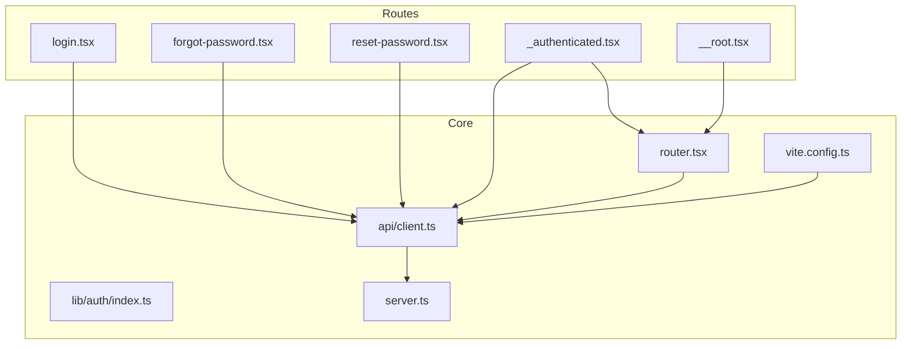
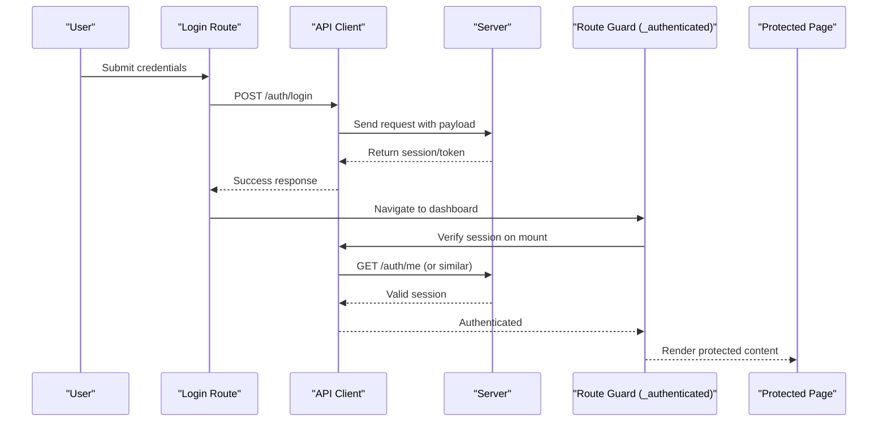
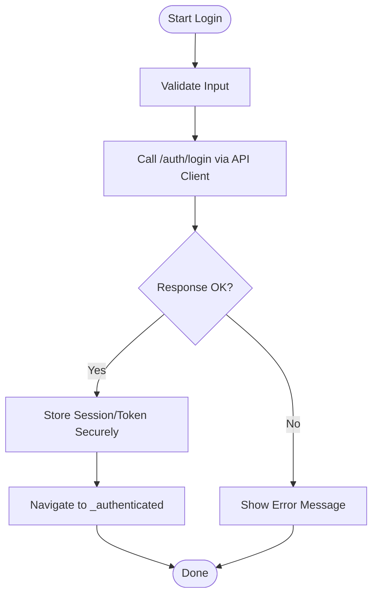
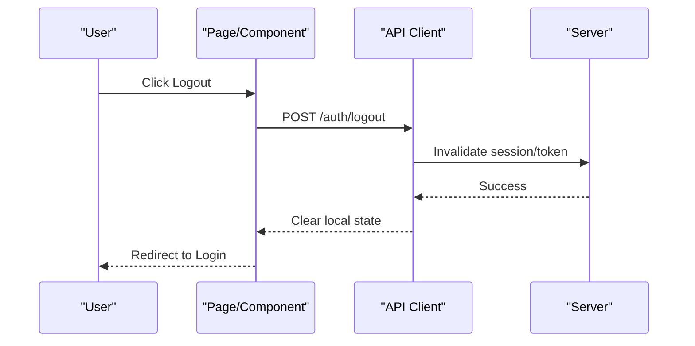
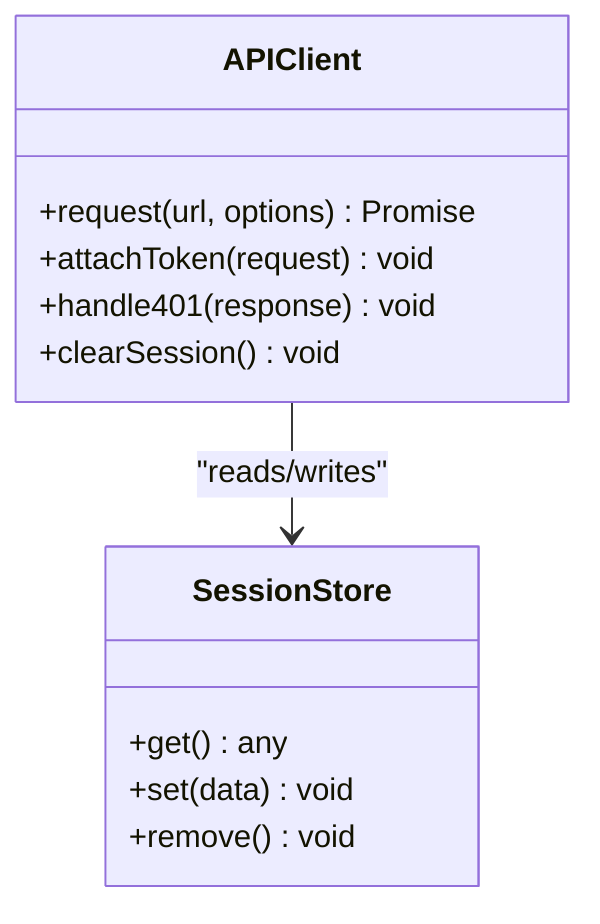
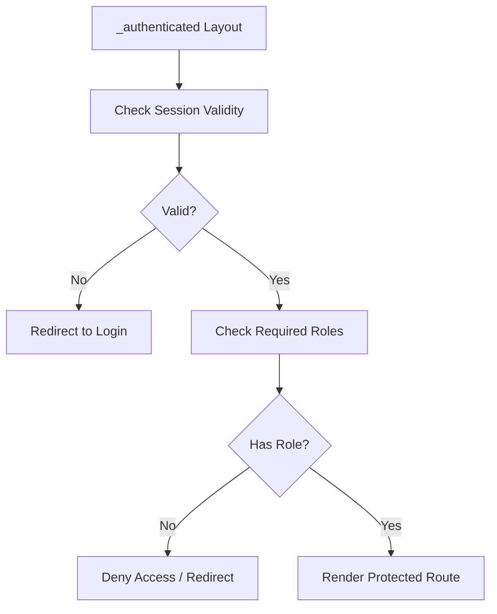
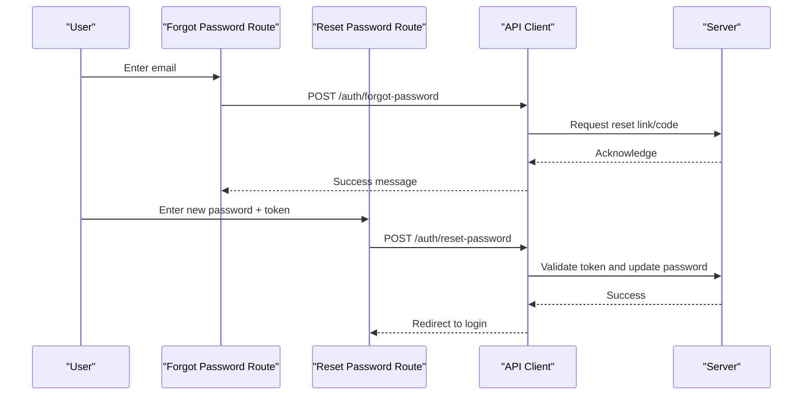
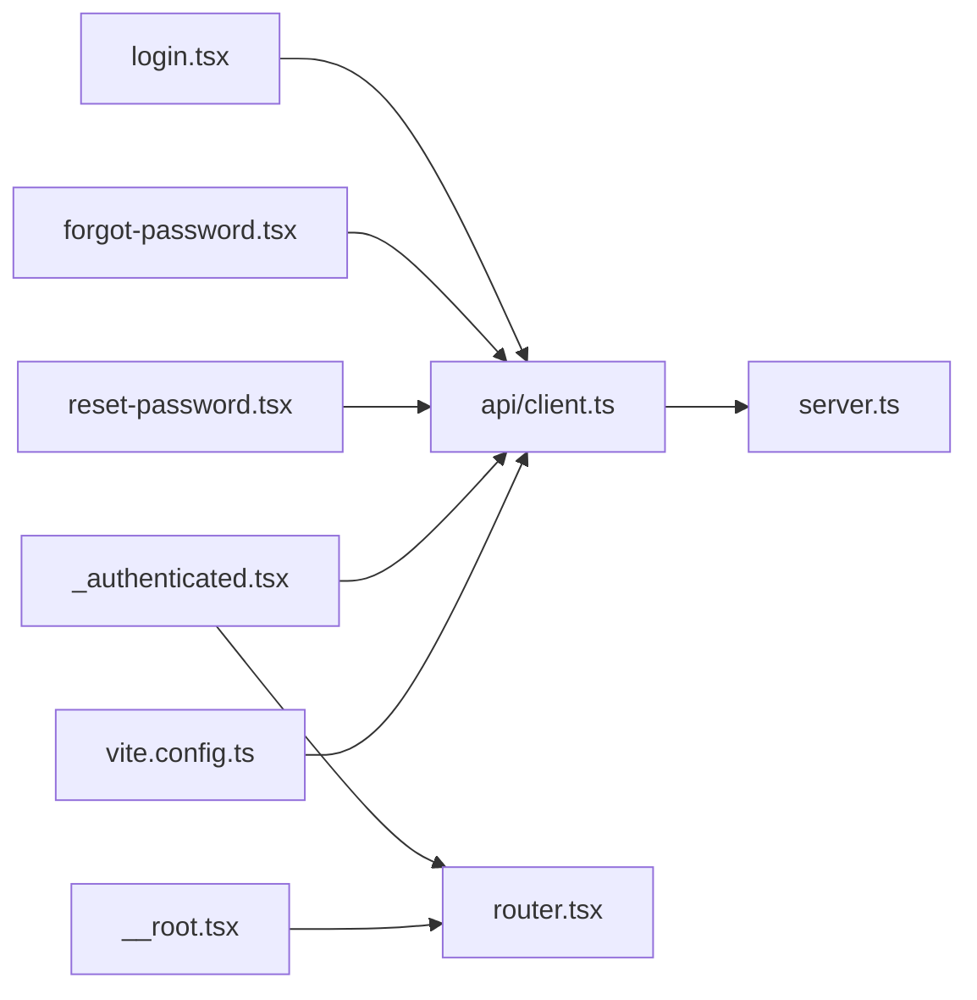

# Authentication & Security

<cite>
**Referenced Files in This Document**
- [src/routes/login.tsx](file://src/routes/login.tsx)
- [src/routes/forgot-password.tsx](file://src/routes/forgot-password.tsx)
- [src/routes/reset-password.tsx](file://src/routes/reset-password.tsx)
- [src/routes/_authenticated.tsx](file://src/routes/_authenticated.tsx)
- [src/routes/__root.tsx](file://src/routes/__root.tsx)
- [src/router.tsx](file://src/router.tsx)
- [src/lib/auth/index.ts](file://src/lib/auth/index.ts)
- [src/api/client.ts](file://src/api/client.ts)
- [src/server.ts](file://src/server.ts)
- [vite.config.ts](file://vite.config.ts)
</cite>

## Table of Contents
1. Introduction
2. Project Structure
3. Core Components
4. Architecture Overview
5. Detailed Component Analysis
6. Dependency Analysis
7. Performance Considerations
8. Troubleshooting Guide
9. Conclusion

## Introduction
This document explains the authentication and security model for TrackDub Portal. It covers login, logout, session management, token handling, route protection, role-based access control patterns, password reset flows, session persistence, secure storage practices, CSRF protection, XSS prevention, and input validation strategies used across the application.

## Project Structure
Authentication-related code is primarily organized under:
- Routes: Login, forgot password, reset password, and an authenticated layout that guards protected routes.
- API client: Centralized HTTP client with request/response interceptors for tokens and error handling.
- Router configuration: Root-level setup and global behaviors.
- Server entry: Backend initialization and integration points.
- Build configuration: Cookie and security headers settings.

**Diagram sources**
- [src/routes/login.tsx](file://src/routes/login.tsx)
- [src/routes/forgot-password.tsx](file://src/routes/forgot-password.tsx)
- [src/routes/reset-password.tsx](file://src/routes/reset-password.tsx)
- [src/routes/_authenticated.tsx](file://src/routes/_authenticated.tsx)
- [src/routes/__root.tsx](file://src/routes/__root.tsx)
- [src/router.tsx](file://src/router.tsx)
- [src/lib/auth/index.ts](file://src/lib/auth/index.ts)
- [src/api/client.ts](file://src/api/client.ts)
- [src/server.ts](file://src/server.ts)
- [vite.config.ts](file://vite.config.ts)

**Section sources**
- [src/routes/login.tsx](file://src/routes/login.tsx)
- [src/routes/forgot-password.tsx](file://src/routes/forgot-password.tsx)
- [src/routes/reset-password.tsx](file://src/routes/reset-password.tsx)
- [src/routes/_authenticated.tsx](file://src/routes/_authenticated.tsx)
- [src/routes/__root.tsx](file://src/routes/__root.tsx)
- [src/router.tsx](file://src/router.tsx)
- [src/lib/auth/index.ts](file://src/lib/auth/index.ts)
- [src/api/client.ts](file://src/api/client.ts)
- [src/server.ts](file://src/server.ts)
- [vite.config.ts](file://vite.config.ts)

## Core Components
- Authentication routes: Provide UI and flow for login, forgot password, and reset password.
- Authenticated layout: Guards access to protected routes and manages redirect logic.
- API client: Attaches tokens to requests, handles 401/403 responses, and centralizes error behavior.
- Router configuration: Defines route hierarchy and root-level behaviors.
- Server entry: Initializes backend services and integrates with frontend routing.
- Build configuration: Sets cookie flags and security headers for secure transport.

Key responsibilities:
- Enforce authentication before rendering protected routes.
- Persist and refresh sessions securely.
- Normalize API errors and guide user feedback.
- Ensure safe defaults for cookies and headers.

**Section sources**
- [src/routes/_authenticated.tsx](file://src/routes/_authenticated.tsx)
- [src/api/client.ts](file://src/api/client.ts)
- [src/router.tsx](file://src/router.tsx)
- [src/server.ts](file://src/server.ts)
- [vite.config.ts](file://vite.config.ts)

## Architecture Overview
The authentication architecture follows a client-side-first pattern with server-backed validation:
- The API client attaches credentials/tokens to every request.
- Route guards enforce authentication at navigation time.
- Password reset flows are handled via dedicated routes calling the API.
- Cookies and headers are configured for secure transmission.

**Diagram sources**
- [src/routes/login.tsx](file://src/routes/login.tsx)
- [src/routes/_authenticated.tsx](file://src/routes/_authenticated.tsx)
- [src/api/client.ts](file://src/api/client.ts)
- [src/server.ts](file://src/server.ts)

## Detailed Component Analysis

### Login Flow
- User submits credentials through the login route.
- The API client sends a POST request to the authentication endpoint.
- On success, the client stores the session/token according to configured policies.
- Navigation proceeds to the authenticated layout, which validates the session before rendering protected pages.

**Diagram sources**
- [src/routes/login.tsx](file://src/routes/login.tsx)
- [src/api/client.ts](file://src/api/client.ts)

**Section sources**
- [src/routes/login.tsx](file://src/routes/login.tsx)
- [src/api/client.ts](file://src/api/client.ts)

### Logout Flow
- The logout action clears local session state and invalidates server-side sessions if applicable.
- The API client may call a logout endpoint to revoke tokens or clear cookies.
- After logout, users are redirected to the login page.

**Diagram sources**
- [src/api/client.ts](file://src/api/client.ts)
- [src/server.ts](file://src/server.ts)

**Section sources**
- [src/api/client.ts](file://src/api/client.ts)
- [src/server.ts](file://src/server.ts)

### Session Management and Token Handling
- The API client centralizes token attachment to outgoing requests.
- On 401/403 responses, the client can trigger re-authentication or redirect to login.
- Session persistence uses secure cookies or memory storage depending on environment and configuration.
- Token refresh logic should be implemented to maintain long-lived sessions without exposing secrets.

**Diagram sources**
- [src/api/client.ts](file://src/api/client.ts)
- [src/lib/auth/index.ts](file://src/lib/auth/index.ts)

**Section sources**
- [src/api/client.ts](file://src/api/client.ts)
- [src/lib/auth/index.ts](file://src/lib/auth/index.ts)

### Route Protection and Role-Based Access Control
- The authenticated layout acts as a guard for protected routes.
- Before rendering child routes, it verifies the current session and redirects unauthenticated users.
- Role checks can be enforced by inspecting user roles from the session and conditionally rendering or blocking access.

**Diagram sources**
- [src/routes/_authenticated.tsx](file://src/routes/_authenticated.tsx)

**Section sources**
- [src/routes/_authenticated.tsx](file://src/routes/_authenticated.tsx)

### Password Reset Flows
- Forgot password route initiates a reset request via the API client.
- Reset password route submits a new password along with a token or code provided by the server.
- Both flows rely on the API client for network calls and error handling.

**Diagram sources**
- [src/routes/forgot-password.tsx](file://src/routes/forgot-password.tsx)
- [src/routes/reset-password.tsx](file://src/routes/reset-password.tsx)
- [src/api/client.ts](file://src/api/client.ts)

**Section sources**
- [src/routes/forgot-password.tsx](file://src/routes/forgot-password.tsx)
- [src/routes/reset-password.tsx](file://src/routes/reset-password.tsx)
- [src/api/client.ts](file://src/api/client.ts)

### Secure Storage Patterns
- Prefer HttpOnly cookies for sensitive tokens when supported by the server.
- If using localStorage/sessionStorage, avoid storing secrets; store minimal identifiers and use short-lived tokens.
- Sanitize and validate all inputs before sending to the server.
- Clear sensitive data on logout and after inactivity timeouts.

[No sources needed since this section provides general guidance]

### CSRF Protection
- Use SameSite cookie attributes to mitigate CSRF risks.
- Employ anti-CSRF tokens for state-changing requests when cookies are not sufficient.
- Ensure cross-origin requests are explicitly allowed and validated.

[No sources needed since this section provides general guidance]

### XSS Prevention
- Avoid injecting unsanitized HTML into the DOM.
- Use framework-safe rendering practices and escape user-supplied data.
- Set Content-Security-Policy headers to restrict unsafe scripts and inline styles.

[No sources needed since this section provides general guidance]

### Input Validation Strategies
- Validate all form inputs on the client side with strict schemas.
- Re-validate on the server side before processing.
- Reject unexpected types and lengths; normalize strings safely.

[No sources needed since this section provides general guidance]

## Dependency Analysis
The authentication system depends on the API client for all network operations and on the router for navigation and guards.

**Diagram sources**
- [src/routes/login.tsx](file://src/routes/login.tsx)
- [src/routes/forgot-password.tsx](file://src/routes/forgot-password.tsx)
- [src/routes/reset-password.tsx](file://src/routes/reset-password.tsx)
- [src/routes/_authenticated.tsx](file://src/routes/_authenticated.tsx)
- [src/routes/__root.tsx](file://src/routes/__root.tsx)
- [src/router.tsx](file://src/router.tsx)
- [src/api/client.ts](file://src/api/client.ts)
- [src/server.ts](file://src/server.ts)
- [vite.config.ts](file://vite.config.ts)

**Section sources**
- [src/routes/login.tsx](file://src/routes/login.tsx)
- [src/routes/forgot-password.tsx](file://src/routes/forgot-password.tsx)
- [src/routes/reset-password.tsx](file://src/routes/reset-password.tsx)
- [src/routes/_authenticated.tsx](file://src/routes/_authenticated.tsx)
- [src/routes/__root.tsx](file://src/routes/__root.tsx)
- [src/router.tsx](file://src/router.tsx)
- [src/api/client.ts](file://src/api/client.ts)
- [src/server.ts](file://src/server.ts)
- [vite.config.ts](file://vite.config.ts)

## Performance Considerations
- Minimize round trips by batching auth checks where possible.
- Cache non-sensitive user metadata locally to reduce repeated calls.
- Implement token refresh to avoid frequent re-authentication.
- Debounce rapid navigation to prevent redundant auth checks.

[No sources needed since this section provides general guidance]

## Troubleshooting Guide
Common issues and resolutions:
- 401 Unauthorized: Ensure the session/token is present and valid; consider refreshing or re-login.
- 403 Forbidden: Verify user roles and permissions; check route guards and server-side authorization.
- CORS errors: Confirm allowed origins and methods in server configuration.
- Cookie not sent: Check SameSite and Secure flags; ensure correct domain/path settings.
- Redirect loops: Inspect route guards and session validation logic.

[No sources needed since this section provides general guidance]

## Conclusion
TrackDub Portal implements a robust authentication and security model centered around a centralized API client, guarded routes, and secure session handling. By following the documented flows and best practices—secure storage, CSRF/XSS mitigation, and thorough input validation—the application maintains strong security posture while providing a smooth user experience.