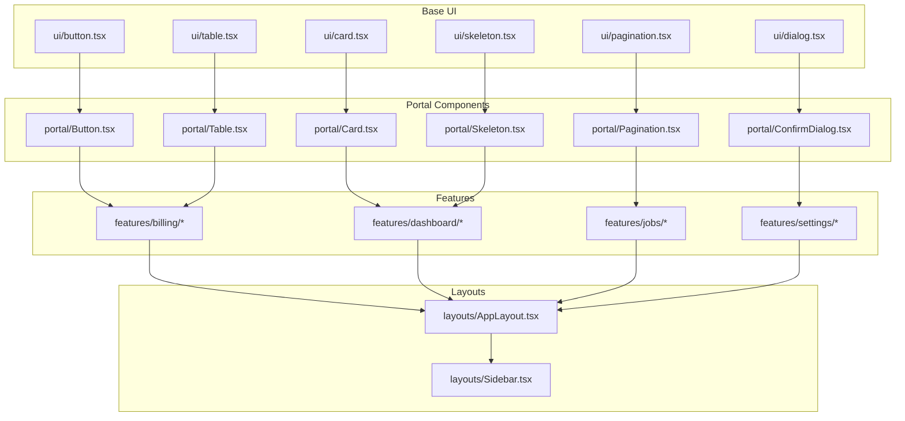
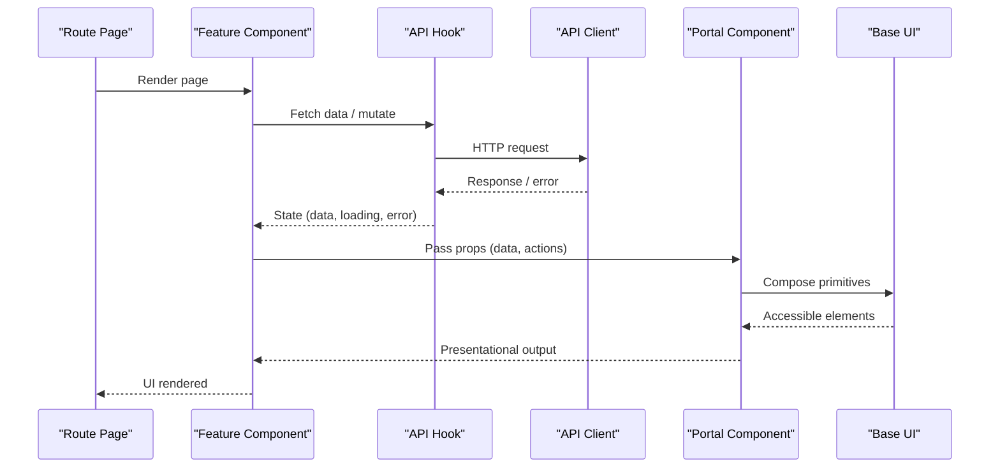
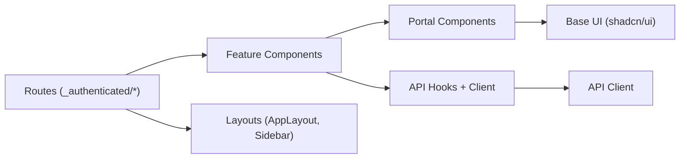

# Component Architecture

<cite>
**Referenced Files in This Document**
- [Button.tsx](file://src/components/portal/Button.tsx)
- [Card.tsx](file://src/components/portal/Card.tsx)
- [ConfirmDialog.tsx](file://src/components/portal/ConfirmDialog.tsx)
- [ErrorState.tsx](file://src/components/portal/ErrorState.tsx)
- [LoadingSpinner.tsx](file://src/components/portal/LoadingSpinner.tsx)
- [Pagination.tsx](file://src/components/portal/Pagination.tsx)
- [Skeleton.tsx](file://src/components/portal/Skeleton.tsx)
- [Table.tsx](file://src/components/portal/Table.tsx)
- [index.ts](file://src/components/portal/index.ts)
- [button.tsx](file://src/components/ui/button.tsx)
- [card.tsx](file://src/components/ui/card.tsx)
- [dialog.tsx](file://src/components/ui/dialog.tsx)
- [table.tsx](file://src/components/ui/table.tsx)
- [pagination.tsx](file://src/components/ui/pagination.tsx)
- [skeleton.tsx](file://src/components/ui/skeleton.tsx)
- [BillingPage.tsx](file://src/features/billing/BillingPage.tsx)
- [InvoiceTable.tsx](file://src/features/billing/InvoiceTable.tsx)
- [TierBadge.tsx](file://src/features/billing/TierBadge.tsx)
- [UsageChart.tsx](file://src/features/billing/UsageChart.tsx)
- [DashboardPage.tsx](file://src/features/dashboard/DashboardPage.tsx)
- [ActiveJobsCard.tsx](file://src/features/dashboard/ActiveJobsCard.tsx)
- [RecentJobsList.tsx](file://src/features/dashboard/RecentJobsList.tsx)
- [UsageGauge.tsx](file://src/features/dashboard/UsageGauge.tsx)
- [CreateJobPage.tsx](file://src/features/jobs/CreateJobPage.tsx)
- [FileDropZone.tsx](file://src/features/jobs/FileDropZone.tsx)
- [JobDetailPage.tsx](file://src/features/jobs/JobDetailPage.tsx)
- [JobStatusBadge.tsx](file://src/features/jobs/JobStatusBadge.tsx)
- [JobsListPage.tsx](file://src/features/jobs/JobsListPage.tsx)
- [ApiKeysSection.tsx](file://src/features/settings/ApiKeysSection.tsx)
- [DeliveryLogViewer.tsx](file://src/features/settings/DeliveryLogViewer.tsx)
- [SettingsPage.tsx](file://src/features/settings/SettingsPage.tsx)
- [WebhookForm.tsx](file://src/features/settings/WebhookForm.tsx)
- [WebhooksSection.tsx](file://src/features/settings/WebhooksSection.tsx)
- [AppLayout.tsx](file://src/layouts/AppLayout.tsx)
- [Sidebar.tsx](file://src/layouts/Sidebar.tsx)
- [use-mobile.tsx](file://src/hooks/use-mobile.tsx)
- [useLastUpdated.ts](file://src/hooks/useLastUpdated.ts)
- [client.ts](file://src/api/client.ts)
- [useApiKeys.ts](file://src/api/hooks/useApiKeys.ts)
- [useBilling.ts](file://src/api/hooks/useBilling.ts)
- [useJobs.ts](file://src/api/hooks/useJobs.ts)
- [useLanguages.ts](file://src/api/hooks/useLanguages.ts)
- [useWebhooks.ts](file://src/api/hooks/useWebhooks.ts)
- [router.tsx](file://src/router.tsx)
- [_authenticated.tsx](file://src/routes/_authenticated.tsx)
- [dashboard.tsx](file://src/routes/_authenticated/dashboard.tsx)
- [jobs.index.tsx](file://src/routes/_authenticated/jobs.index.tsx)
- [jobs.new.tsx](file://src/routes/_authenticated/jobs.new.tsx)
- [jobs.$jobId.tsx](file://src/routes/_authenticated/jobs.$jobId.tsx)
- [billing.tsx](file://src/routes/_authenticated/billing.tsx)
- [settings.tsx](file://src/routes/_authenticated/settings.tsx)
</cite>

## Table of Contents
1. [Introduction](#introduction)
2. [Project Structure](#project-structure)
3. [Core Components](#core-components)
4. [Architecture Overview](#architecture-overview)
5. [Detailed Component Analysis](#detailed-component-analysis)
6. [Dependency Analysis](#dependency-analysis)
7. [Performance Considerations](#performance-considerations)
8. [Troubleshooting Guide](#troubleshooting-guide)
9. [Conclusion](#conclusion)
10. [Appendices](#appendices)

## Introduction
This document describes the component architecture of TrackDub Portal with a focus on the three-tier structure:
- Base UI components (shadcn/ui primitives)
- Portal-specific components (shared across features)
- Feature-specific components (domain-driven modules)

It explains composition patterns, prop interfaces, state management approaches, separation between presentational and container components, reusable patterns, customization strategies, and guidelines for creating new components while maintaining consistency.

## Project Structure
TrackDub Portal organizes components into clear layers:
- Base UI layer under src/components/ui provides shadcn/ui primitives.
- Portal layer under src/components/portal composes base UI into consistent, reusable building blocks used across features.
- Feature layer under src/features groups domain-specific components by feature.
- Layouts under src/layouts provide page-level composition and navigation scaffolding.
- Hooks under src/hooks encapsulate shared logic (e.g., responsive behavior, timestamps).
- API hooks under src/api/hooks abstract data fetching and mutations via a typed client.
- Routes under src/routes define pages that compose feature components.

**Diagram sources**
- [button.tsx](file://src/components/ui/button.tsx)
- [card.tsx](file://src/components/ui/card.tsx)
- [dialog.tsx](file://src/components/ui/dialog.tsx)
- [table.tsx](file://src/components/ui/table.tsx)
- [pagination.tsx](file://src/components/ui/pagination.tsx)
- [skeleton.tsx](file://src/components/ui/skeleton.tsx)
- [Button.tsx](file://src/components/portal/Button.tsx)
- [Card.tsx](file://src/components/portal/Card.tsx)
- [ConfirmDialog.tsx](file://src/components/portal/ConfirmDialog.tsx)
- [Table.tsx](file://src/components/portal/Table.tsx)
- [Pagination.tsx](file://src/components/portal/Pagination.tsx)
- [Skeleton.tsx](file://src/components/portal/Skeleton.tsx)
- [BillingPage.tsx](file://src/features/billing/BillingPage.tsx)
- [DashboardPage.tsx](file://src/features/dashboard/DashboardPage.tsx)
- [CreateJobPage.tsx](file://src/features/jobs/CreateJobPage.tsx)
- [SettingsPage.tsx](file://src/features/settings/SettingsPage.tsx)
- [AppLayout.tsx](file://src/layouts/AppLayout.tsx)
- [Sidebar.tsx](file://src/layouts/Sidebar.tsx)

**Section sources**
- [Button.tsx](file://src/components/portal/Button.tsx)
- [Card.tsx](file://src/components/portal/Card.tsx)
- [ConfirmDialog.tsx](file://src/components/portal/ConfirmDialog.tsx)
- [ErrorState.tsx](file://src/components/portal/ErrorState.tsx)
- [LoadingSpinner.tsx](file://src/components/portal/LoadingSpinner.tsx)
- [Pagination.tsx](file://src/components/portal/Pagination.tsx)
- [Skeleton.tsx](file://src/components/portal/Skeleton.tsx)
- [Table.tsx](file://src/components/portal/Table.tsx)
- [index.ts](file://src/components/portal/index.ts)
- [button.tsx](file://src/components/ui/button.tsx)
- [card.tsx](file://src/components/ui/card.tsx)
- [dialog.tsx](file://src/components/ui/dialog.tsx)
- [table.tsx](file://src/components/ui/table.tsx)
- [pagination.tsx](file://src/components/ui/pagination.tsx)
- [skeleton.tsx](file://src/components/ui/skeleton.tsx)
- [BillingPage.tsx](file://src/features/billing/BillingPage.tsx)
- [DashboardPage.tsx](file://src/features/dashboard/DashboardPage.tsx)
- [CreateJobPage.tsx](file://src/features/jobs/CreateJobPage.tsx)
- [SettingsPage.tsx](file://src/features/settings/SettingsPage.tsx)
- [AppLayout.tsx](file://src/layouts/AppLayout.tsx)
- [Sidebar.tsx](file://src/layouts/Sidebar.tsx)

## Core Components
The portal’s core components are organized into three tiers:

- Base UI (shadcn/ui): Primitive components such as Button, Card, Dialog, Table, Pagination, Skeleton. These are unstyled or lightly styled primitives focused on accessibility and semantics.
- Portal Components: Composed from base UI to provide consistent UX across the app. Examples include portal Button, Card, ConfirmDialog, ErrorState, LoadingSpinner, Pagination, Skeleton, and Table. They encapsulate default styles, behaviors, and common props.
- Feature Components: Domain-specific components grouped by feature (billing, dashboard, jobs, settings). They orchestrate data flow using API hooks and compose portal components for presentation.

Key responsibilities:
- Base UI: Accessibility, semantics, minimal styling, and flexible APIs.
- Portal: Consistent design tokens, default behaviors, and cross-feature reuse.
- Features: Business logic integration, data binding, and user flows.

**Section sources**
- [Button.tsx](file://src/components/portal/Button.tsx)
- [Card.tsx](file://src/components/portal/Card.tsx)
- [ConfirmDialog.tsx](file://src/components/portal/ConfirmDialog.tsx)
- [ErrorState.tsx](file://src/components/portal/ErrorState.tsx)
- [LoadingSpinner.tsx](file://src/components/portal/LoadingSpinner.tsx)
- [Pagination.tsx](file://src/components/portal/Pagination.tsx)
- [Skeleton.tsx](file://src/components/portal/Skeleton.tsx)
- [Table.tsx](file://src/components/portal/Table.tsx)
- [index.ts](file://src/components/portal/index.ts)
- [BillingPage.tsx](file://src/features/billing/BillingPage.tsx)
- [DashboardPage.tsx](file://src/features/dashboard/DashboardPage.tsx)
- [CreateJobPage.tsx](file://src/features/jobs/CreateJobPage.tsx)
- [SettingsPage.tsx](file://src/features/settings/SettingsPage.tsx)

## Architecture Overview
The application follows a layered architecture where routes render pages composed of feature components. Feature components consume API hooks to manage data and use portal components for presentation. Layouts wrap authenticated routes and provide global navigation.

**Diagram sources**
- [router.tsx](file://src/router.tsx)
- [_authenticated.tsx](file://src/routes/_authenticated.tsx)
- [dashboard.tsx](file://src/routes/_authenticated/dashboard.tsx)
- [jobs.index.tsx](file://src/routes/_authenticated/jobs.index.tsx)
- [jobs.new.tsx](file://src/routes/_authenticated/jobs.new.tsx)
- [jobs.$jobId.tsx](file://src/routes/_authenticated/jobs.$jobId.tsx)
- [billing.tsx](file://src/routes/_authenticated/billing.tsx)
- [settings.tsx](file://src/routes/_authenticated/settings.tsx)
- [client.ts](file://src/api/client.ts)
- [useJobs.ts](file://src/api/hooks/useJobs.ts)
- [useBilling.ts](file://src/api/hooks/useBilling.ts)
- [useApiKeys.ts](file://src/api/hooks/useApiKeys.ts)
- [useWebhooks.ts](file://src/api/hooks/useWebhooks.ts)
- [Button.tsx](file://src/components/portal/Button.tsx)
- [Card.tsx](file://src/components/portal/Card.tsx)
- [ConfirmDialog.tsx](file://src/components/portal/ConfirmDialog.tsx)
- [Table.tsx](file://src/components/portal/Table.tsx)
- [button.tsx](file://src/components/ui/button.tsx)
- [card.tsx](file://src/components/ui/card.tsx)
- [dialog.tsx](file://src/components/ui/dialog.tsx)
- [table.tsx](file://src/components/ui/table.tsx)

## Detailed Component Analysis

### Base UI Layer (shadcn/ui)
- Purpose: Provide accessible, semantic primitives with minimal styling.
- Examples: button, card, dialog, table, pagination, skeleton.
- Composition: Used directly by portal components; rarely consumed by features.
- Customization: Theme tokens and class names can be extended at build time.

Guidelines:
- Keep base UI components generic and theme-agnostic.
- Favor props over inline styles for flexibility.
- Ensure keyboard and screen reader accessibility.

**Section sources**
- [button.tsx](file://src/components/ui/button.tsx)
- [card.tsx](file://src/components/ui/card.tsx)
- [dialog.tsx](file://src/components/ui/dialog.tsx)
- [table.tsx](file://src/components/ui/table.tsx)
- [pagination.tsx](file://src/components/ui/pagination.tsx)
- [skeleton.tsx](file://src/components/ui/skeleton.tsx)

### Portal Components
- Purpose: Consistent, reusable building blocks across features.
- Examples: Button, Card, ConfirmDialog, ErrorState, LoadingSpinner, Pagination, Skeleton, Table.
- Composition: Built from base UI; add portal-specific defaults, behaviors, and props.
- Prop Interfaces: Expose stable, ergonomic props; prefer explicit boolean flags and enums over complex objects.

Patterns:
- Presentational: Focus on rendering and user interactions without data fetching.
- Container-like: Encapsulate small state (e.g., open/close dialogs), but avoid heavy business logic.
- Reusability: Default props should reflect common usage; allow overrides.

Customization:
- Use className and variant props to adapt appearance.
- Compose multiple portal components to create higher-level widgets.

**Section sources**
- [Button.tsx](file://src/components/portal/Button.tsx)
- [Card.tsx](file://src/components/portal/Card.tsx)
- [ConfirmDialog.tsx](file://src/components/portal/ConfirmDialog.tsx)
- [ErrorState.tsx](file://src/components/portal/ErrorState.tsx)
- [LoadingSpinner.tsx](file://src/components/portal/LoadingSpinner.tsx)
- [Pagination.tsx](file://src/components/portal/Pagination.tsx)
- [Skeleton.tsx](file://src/components/portal/Skeleton.tsx)
- [Table.tsx](file://src/components/portal/Table.tsx)
- [index.ts](file://src/components/portal/index.ts)

### Feature Components
- Purpose: Implement domain-specific UI and workflows.
- Examples: BillingPage, InvoiceTable, TierBadge, UsageChart, DashboardPage, ActiveJobsCard, RecentJobsList, UsageGauge, CreateJobPage, FileDropZone, JobDetailPage, JobStatusBadge, JobsListPage, ApiKeysSection, DeliveryLogViewer, SettingsPage, WebhookForm, WebhooksSection.
- Data Flow: Consume API hooks for state; pass data and callbacks to portal components.
- State Management: Local component state for ephemeral UI; API hooks for server state.

Patterns:
- Container components: Orchestrate data fetching, mutations, and side effects.
- Presentational components: Receive props and render UI; no direct API calls.
- Composition: Combine portal components to assemble feature screens.

**Section sources**
- [BillingPage.tsx](file://src/features/billing/BillingPage.tsx)
- [InvoiceTable.tsx](file://src/features/billing/InvoiceTable.tsx)
- [TierBadge.tsx](file://src/features/billing/TierBadge.tsx)
- [UsageChart.tsx](file://src/features/billing/UsageChart.tsx)
- [DashboardPage.tsx](file://src/features/dashboard/DashboardPage.tsx)
- [ActiveJobsCard.tsx](file://src/features/dashboard/ActiveJobsCard.tsx)
- [RecentJobsList.tsx](file://src/features/dashboard/RecentJobsList.tsx)
- [UsageGauge.tsx](file://src/features/dashboard/UsageGauge.tsx)
- [CreateJobPage.tsx](file://src/features/jobs/CreateJobPage.tsx)
- [FileDropZone.tsx](file://src/features/jobs/FileDropZone.tsx)
- [JobDetailPage.tsx](file://src/features/jobs/JobDetailPage.tsx)
- [JobStatusBadge.tsx](file://src/features/jobs/JobStatusBadge.tsx)
- [JobsListPage.tsx](file://src/features/jobs/JobsListPage.tsx)
- [ApiKeysSection.tsx](file://src/features/settings/ApiKeysSection.tsx)
- [DeliveryLogViewer.tsx](file://src/features/settings/DeliveryLogViewer.tsx)
- [SettingsPage.tsx](file://src/features/settings/SettingsPage.tsx)
- [WebhookForm.tsx](file://src/features/settings/WebhookForm.tsx)
- [WebhooksSection.tsx](file://src/features/settings/WebhooksSection.tsx)

### Layouts
- Purpose: Provide global structure, navigation, and authenticated route wrapping.
- Examples: AppLayout, Sidebar.
- Composition: Wrap feature pages; handle responsive behavior and menu state.

**Section sources**
- [AppLayout.tsx](file://src/layouts/AppLayout.tsx)
- [Sidebar.tsx](file://src/layouts/Sidebar.tsx)

### Hooks and Utilities
- Shared hooks: Responsive detection and timestamp utilities.
- API hooks: Typed data fetching and mutations via the API client.

Examples:
- use-mobile.tsx: Detects mobile viewport to adjust UI.
- useLastUpdated.ts: Tracks last updated timestamps.
- useJobs.ts, useBilling.ts, useApiKeys.ts, useWebhooks.ts, useLanguages.ts: Manage server state for respective domains.

**Section sources**
- [use-mobile.tsx](file://src/hooks/use-mobile.tsx)
- [useLastUpdated.ts](file://src/hooks/useLastUpdated.ts)
- [client.ts](file://src/api/client.ts)
- [useJobs.ts](file://src/api/hooks/useJobs.ts)
- [useBilling.ts](file://src/api/hooks/useBilling.ts)
- [useApiKeys.ts](file://src/api/hooks/useApiKeys.ts)
- [useWebhooks.ts](file://src/api/hooks/useWebhooks.ts)
- [useLanguages.ts](file://src/api/hooks/useLanguages.ts)

## Dependency Analysis
Component dependencies follow a strict bottom-up pattern:
- Features depend on portal components.
- Portal components depend on base UI.
- Routes render feature pages.
- Layouts wrap authenticated routes.

**Diagram sources**
- [dashboard.tsx](file://src/routes/_authenticated/dashboard.tsx)
- [jobs.index.tsx](file://src/routes/_authenticated/jobs.index.tsx)
- [jobs.new.tsx](file://src/routes/_authenticated/jobs.new.tsx)
- [jobs.$jobId.tsx](file://src/routes/_authenticated/jobs.$jobId.tsx)
- [billing.tsx](file://src/routes/_authenticated/billing.tsx)
- [settings.tsx](file://src/routes/_authenticated/settings.tsx)
- [BillingPage.tsx](file://src/features/billing/BillingPage.tsx)
- [DashboardPage.tsx](file://src/features/dashboard/DashboardPage.tsx)
- [CreateJobPage.tsx](file://src/features/jobs/CreateJobPage.tsx)
- [SettingsPage.tsx](file://src/features/settings/SettingsPage.tsx)
- [Button.tsx](file://src/components/portal/Button.tsx)
- [Card.tsx](file://src/components/portal/Card.tsx)
- [ConfirmDialog.tsx](file://src/components/portal/ConfirmDialog.tsx)
- [Table.tsx](file://src/components/portal/Table.tsx)
- [button.tsx](file://src/components/ui/button.tsx)
- [card.tsx](file://src/components/ui/card.tsx)
- [dialog.tsx](file://src/components/ui/dialog.tsx)
- [table.tsx](file://src/components/ui/table.tsx)
- [client.ts](file://src/api/client.ts)
- [useJobs.ts](file://src/api/hooks/useJobs.ts)
- [useBilling.ts](file://src/api/hooks/useBilling.ts)
- [useApiKeys.ts](file://src/api/hooks/useApiKeys.ts)
- [useWebhooks.ts](file://src/api/hooks/useWebhooks.ts)
- [AppLayout.tsx](file://src/layouts/AppLayout.tsx)
- [Sidebar.tsx](file://src/layouts/Sidebar.tsx)

**Section sources**
- [router.tsx](file://src/router.tsx)
- [_authenticated.tsx](file://src/routes/_authenticated.tsx)
- [client.ts](file://src/api/client.ts)
- [useJobs.ts](file://src/api/hooks/useJobs.ts)
- [useBilling.ts](file://src/api/hooks/useBilling.ts)
- [useApiKeys.ts](file://src/api/hooks/useApiKeys.ts)
- [useWebhooks.ts](file://src/api/hooks/useWebhooks.ts)
- [useLanguages.ts](file://src/api/hooks/useLanguages.ts)

## Performance Considerations
- Prefer memoization for expensive computations within feature components.
- Avoid unnecessary re-renders by keeping portal components pure and passing stable props.
- Use skeleton components during loading states to improve perceived performance.
- Defer heavy operations (charts, large tables) until data is available.
- Leverage lazy loading for routes and feature modules when appropriate.

[No sources needed since this section provides general guidance]

## Troubleshooting Guide
Common issues and resolutions:
- Missing props or incorrect types: Ensure portal components receive required props; validate with TypeScript.
- Dialog not opening/closing: Check controlled state and event handlers; verify aria attributes.
- Table rendering errors: Validate data shape and column definitions; handle empty states.
- API hook errors: Inspect error states returned by hooks; display user-friendly messages via ErrorState.
- Mobile responsiveness: Verify use-mobile hook usage and conditional rendering.

Best practices:
- Centralize error handling in API hooks and propagate to UI via ErrorState.
- Use LoadingSpinner consistently during async operations.
- Log errors with error-capture utilities if available.

**Section sources**
- [ErrorState.tsx](file://src/components/portal/ErrorState.tsx)
- [LoadingSpinner.tsx](file://src/components/portal/LoadingSpinner.tsx)
- [ConfirmDialog.tsx](file://src/components/portal/ConfirmDialog.tsx)
- [Table.tsx](file://src/components/portal/Table.tsx)
- [useJobs.ts](file://src/api/hooks/useJobs.ts)
- [useBilling.ts](file://src/api/hooks/useBilling.ts)
- [useApiKeys.ts](file://src/api/hooks/useApiKeys.ts)
- [useWebhooks.ts](file://src/api/hooks/useWebhooks.ts)
- [use-mobile.tsx](file://src/hooks/use-mobile.tsx)

## Conclusion
TrackDub Portal’s component architecture enforces a clear separation of concerns:
- Base UI provides accessible primitives.
- Portal components deliver consistent, reusable building blocks.
- Feature components implement domain logic and compose portal components.
- Layouts and routes orchestrate navigation and page composition.

Following these patterns ensures maintainability, scalability, and a cohesive user experience.

[No sources needed since this section summarizes without analyzing specific files]

## Appendices

### Guidelines for Creating New Components
- Choose the correct tier:
  - Base UI: Only if it’s a generic primitive needed across multiple portals.
  - Portal: If it’s reused across features with consistent behavior.
  - Feature: If it’s domain-specific and unlikely to be reused elsewhere.
- Define a stable prop interface:
  - Use explicit types and enums.
  - Provide sensible defaults.
  - Avoid overly complex nested objects.
- Separate presentational and container concerns:
  - Keep data fetching in API hooks or container components.
  - Keep rendering logic in presentational components.
- Follow composition patterns:
  - Compose portal components to build higher-level widgets.
  - Avoid duplicating logic across features.
- Maintain consistency:
  - Use existing design tokens and styles.
  - Follow naming conventions and file organization.
- Test accessibility:
  - Ensure keyboard navigation and screen reader support.
  - Validate ARIA attributes and roles.

[No sources needed since this section provides general guidance]