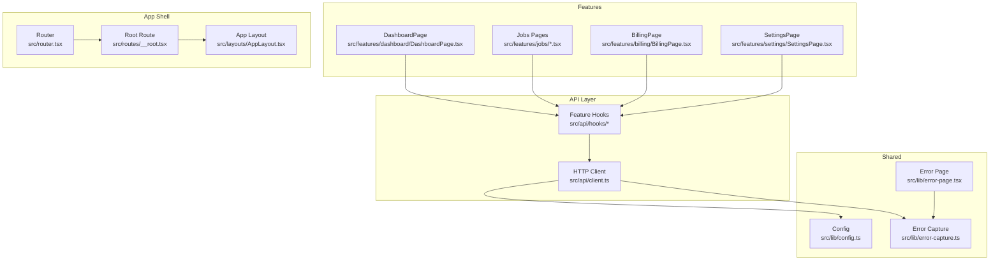
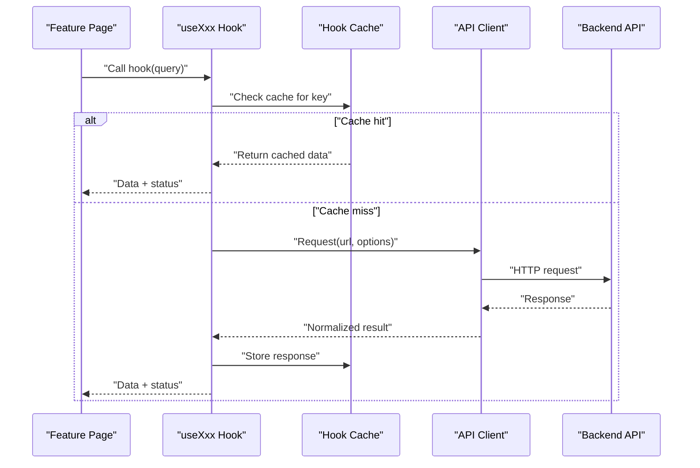
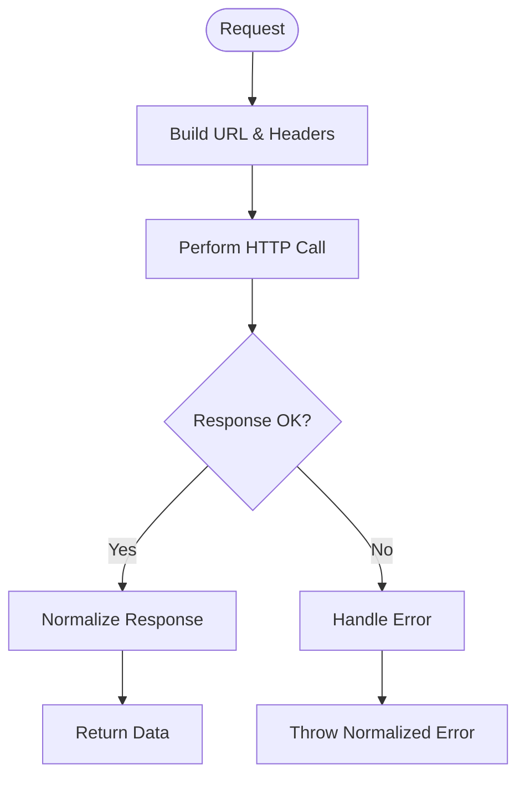
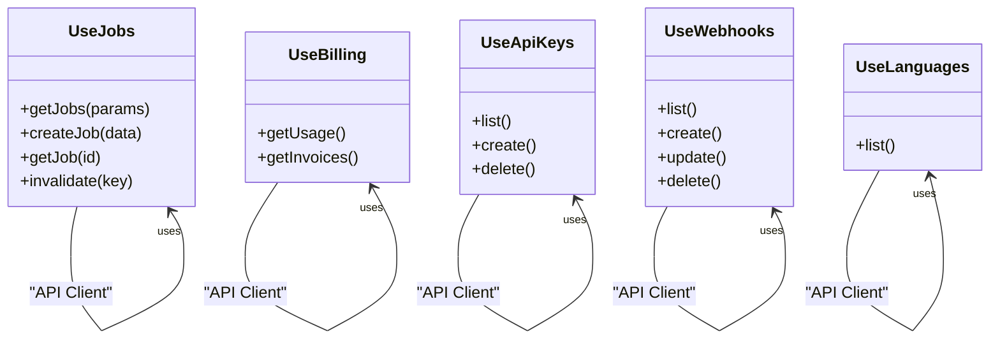
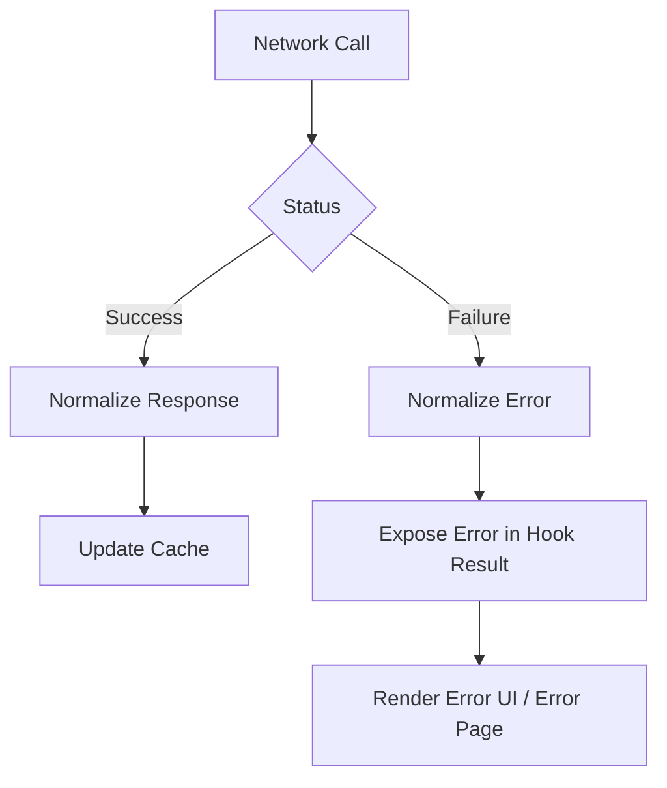
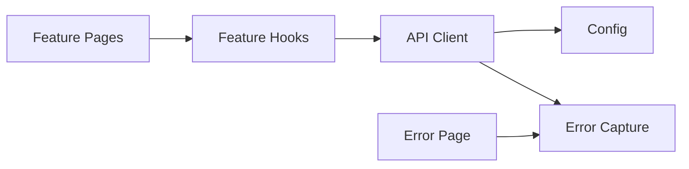

# Data Flow & State Management

<cite>
**Referenced Files in This Document**
- [client.ts](file://src/api/client.ts)
- [useApiKeys.ts](file://src/api/hooks/useApiKeys.ts)
- [useBilling.ts](file://src/api/hooks/useBilling.ts)
- [useJobs.ts](file://src/api/hooks/useJobs.ts)
- [useLanguages.ts](file://src/api/hooks/useLanguages.ts)
- [useWebhooks.ts](file://src/api/hooks/useWebhooks.ts)
- [config.ts](file://src/lib/config.ts)
- [error-capture.ts](file://src/lib/error-capture.ts)
- [error-page.tsx](file://src/lib/error-page.tsx)
- [DashboardPage.tsx](file://src/features/dashboard/DashboardPage.tsx)
- [JobsListPage.tsx](file://src/features/jobs/JobsListPage.tsx)
- [CreateJobPage.tsx](file://src/features/jobs/CreateJobPage.tsx)
- [JobDetailPage.tsx](file://src/features/jobs/JobDetailPage.tsx)
- [BillingPage.tsx](file://src/features/billing/BillingPage.tsx)
- [SettingsPage.tsx](file://src/features/settings/SettingsPage.tsx)
- [AppLayout.tsx](file://src/layouts/AppLayout.tsx)
- [router.tsx](file://src/router.tsx)
- [__root.tsx](file://src/routes/__root.tsx)
</cite>

## Table of Contents
1. [Introduction](#introduction)
2. [Project Structure](#project-structure)
3. [Core Components](#core-components)
4. [Architecture Overview](#architecture-overview)
5. [Detailed Component Analysis](#detailed-component-analysis)
6. [Dependency Analysis](#dependency-analysis)
7. [Performance Considerations](#performance-considerations)
8. [Troubleshooting Guide](#troubleshooting-guide)
9. [Conclusion](#conclusion)

## Introduction
This document explains the data flow and state management architecture of TrackDub Portal. It focuses on:
- API client architecture and request lifecycle
- Custom hooks pattern for data fetching, caching, and mutations
- Separation between server state (API data) and client state (UI state)
- Caching strategies and cache invalidation
- Error handling patterns and user feedback
- Async data loading, optimistic updates, and real-time synchronization approaches
- Configuration management and environment-specific settings

## Project Structure
The application organizes data-related logic under src/api with a dedicated HTTP client and feature-scoped hooks. UI features consume these hooks to render pages and components. Shared configuration and error utilities live under src/lib.

**Diagram sources**
- [client.ts](file://src/api/client.ts)
- [useJobs.ts](file://src/api/hooks/useJobs.ts)
- [DashboardPage.tsx](file://src/features/dashboard/DashboardPage.tsx)
- [JobsListPage.tsx](file://src/features/jobs/JobsListPage.tsx)
- [CreateJobPage.tsx](file://src/features/jobs/CreateJobPage.tsx)
- [JobDetailPage.tsx](file://src/features/jobs/JobDetailPage.tsx)
- [BillingPage.tsx](file://src/features/billing/BillingPage.tsx)
- [SettingsPage.tsx](file://src/features/settings/SettingsPage.tsx)
- [config.ts](file://src/lib/config.ts)
- [error-capture.ts](file://src/lib/error-capture.ts)
- [error-page.tsx](file://src/lib/error-page.tsx)
- [router.tsx](file://src/router.tsx)
- [__root.tsx](file://src/routes/__root.tsx)
- [AppLayout.tsx](file://src/layouts/AppLayout.tsx)

**Section sources**
- [client.ts](file://src/api/client.ts)
- [useJobs.ts](file://src/api/hooks/useJobs.ts)
- [config.ts](file://src/lib/config.ts)
- [error-capture.ts](file://src/lib/error-capture.ts)
- [error-page.tsx](file://src/lib/error-page.tsx)
- [router.tsx](file://src/router.tsx)
- [__root.tsx](file://src/routes/__root.tsx)
- [AppLayout.tsx](file://src/layouts/AppLayout.tsx)

## Core Components
- API Client: Centralized HTTP client responsible for base URL resolution, headers, retries, and error normalization.
- Feature Hooks: Encapsulate data fetching, caching, mutations, and error states per domain (jobs, billing, api keys, webhooks, languages).
- Feature Pages: Consume hooks to render server state and handle UI interactions.
- Configuration: Environment-aware settings loaded at startup.
- Error Handling: Global capture and user-facing error pages.

Key responsibilities:
- Server state: fetched via hooks; cached and invalidated as needed.
- Client state: local UI state managed within components or lightweight hooks.
- Mutations: trigger network requests and update caches optimistically when appropriate.
- Real-time sync: optional polling or event-driven updates integrated through hooks.

**Section sources**
- [client.ts](file://src/api/client.ts)
- [useJobs.ts](file://src/api/hooks/useJobs.ts)
- [useBilling.ts](file://src/api/hooks/useBilling.ts)
- [useApiKeys.ts](file://src/api/hooks/useApiKeys.ts)
- [useWebhooks.ts](file://src/api/hooks/useWebhooks.ts)
- [useLanguages.ts](file://src/api/hooks/useLanguages.ts)
- [config.ts](file://src/lib/config.ts)
- [error-capture.ts](file://src/lib/error-capture.ts)
- [error-page.tsx](file://src/lib/error-page.tsx)

## Architecture Overview
The data flow follows a clear separation:
- UI components call feature hooks.
- Hooks coordinate with the API client to fetch or mutate data.
- The client normalizes responses and errors.
- Hooks maintain normalized caches keyed by query identifiers.
- Pages subscribe to hook state and render accordingly.

**Diagram sources**
- [client.ts](file://src/api/client.ts)
- [useJobs.ts](file://src/api/hooks/useJobs.ts)
- [useBilling.ts](file://src/api/hooks/useBilling.ts)
- [useApiKeys.ts](file://src/api/hooks/useApiKeys.ts)
- [useWebhooks.ts](file://src/api/hooks/useWebhooks.ts)
- [useLanguages.ts](file://src/api/hooks/useLanguages.ts)

## Detailed Component Analysis

### API Client
Responsibilities:
- Base URL and header configuration from environment.
- Request/response transformation and error normalization.
- Retry and timeout policies.
- Consistent error shapes consumed by hooks and error pages.

Usage:
- Imported by all feature hooks to perform GET/POST/PUT/DELETE operations.
- Exposes typed methods aligned with backend schemas.

**Diagram sources**
- [client.ts](file://src/api/client.ts)

**Section sources**
- [client.ts](file://src/api/client.ts)

### Feature Hooks Pattern
Common patterns across hooks:
- Query hooks: provide data, loading, and error states; implement caching and refetch triggers.
- Mutation hooks: encapsulate create/update/delete flows; support optimistic updates and rollback on failure.
- Key-based caching: stable query keys derived from parameters to enable automatic invalidation.
- Error propagation: normalized errors surfaced to UI via hook results.

Examples:
- useJobs: jobs listing, creation, detail retrieval, and status polling.
- useBilling: usage and invoice queries.
- useApiKeys: CRUD for API keys.
- useWebhooks: webhook registration and delivery logs.
- useLanguages: language metadata.

**Diagram sources**
- [useJobs.ts](file://src/api/hooks/useJobs.ts)
- [useBilling.ts](file://src/api/hooks/useBilling.ts)
- [useApiKeys.ts](file://src/api/hooks/useApiKeys.ts)
- [useWebhooks.ts](file://src/api/hooks/useWebhooks.ts)
- [useLanguages.ts](file://src/api/hooks/useLanguages.ts)

**Section sources**
- [useJobs.ts](file://src/api/hooks/useJobs.ts)
- [useBilling.ts](file://src/api/hooks/useBilling.ts)
- [useApiKeys.ts](file://src/api/hooks/useApiKeys.ts)
- [useWebhooks.ts](file://src/api/hooks/useWebhooks.ts)
- [useLanguages.ts](file://src/api/hooks/useLanguages.ts)

### Server State vs Client State
- Server state: owned by hooks; persisted in memory cache; updated via network calls; invalidated by explicit keys or side effects.
- Client state: owned by components; includes form inputs, modal visibility, pagination offsets, sorting preferences.
- Synchronization strategy:
  - Read paths: hooks return server state; components derive UI state from it.
  - Write paths: mutations update server state; components may temporarily adjust UI state for responsiveness.

Best practices:
- Keep UI state minimal and local; avoid duplicating server state locally unless necessary for performance.
- Use optimistic updates for fast perceived performance; revert on error.

[No sources needed since this section provides general guidance]

### Caching Mechanisms
- In-memory cache keyed by query identifiers.
- Stale-while-revalidate behavior: serve cached data immediately while refreshing in background.
- Automatic invalidation on mutations using related keys.
- Manual refetch APIs exposed by hooks for user-triggered refreshes.

Benefits:
- Reduced network load.
- Improved UX with instant responses.
- Predictable consistency boundaries.

[No sources needed since this section provides general guidance]

### Error Handling Patterns
- Centralized error normalization in the client.
- Hooks expose structured error objects alongside data and loading flags.
- Global error capture aggregates runtime errors for diagnostics.
- User-facing error page renders actionable messages and recovery actions.

Flow:
- Network failures and validation errors are normalized into consistent shapes.
- Hooks propagate errors to consumers.
- UI surfaces errors via inline feedback or error pages.

**Diagram sources**
- [client.ts](file://src/api/client.ts)
- [error-capture.ts](file://src/lib/error-capture.ts)
- [error-page.tsx](file://src/lib/error-page.tsx)

**Section sources**
- [client.ts](file://src/api/client.ts)
- [error-capture.ts](file://src/lib/error-capture.ts)
- [error-page.tsx](file://src/lib/error-page.tsx)

### Async Data Loading
Patterns:
- Lazy loading on route entry or component mount.
- Prefetching critical data based on navigation hints.
- Pagination and infinite lists handled via incremental fetches.

Examples:
- Jobs list loads on page entry; detail view fetches job specifics.
- Billing page loads usage and invoices concurrently.

[No sources needed since this section provides general guidance]

### Optimistic Updates
Approach:
- Immediately reflect mutation intent in UI state.
- Send network request; if successful, finalize state.
- On failure, revert UI state and show error notification.

Use cases:
- Creating or deleting API keys.
- Toggling webhook status.
- Updating job metadata where immediate feedback is valuable.

[No sources needed since this section provides general guidance]

### Real-Time Data Synchronization
Options:
- Polling: periodic refetch of job statuses or webhook deliveries.
- Event-driven: integrate WebSocket/SSE events to push updates into the cache.
- Cache updates: invalidate or patch relevant keys upon receiving events.

Recommendations:
- Prefer event-driven updates when available; fallback to polling otherwise.
- Debounce frequent updates to avoid excessive re-renders.

[No sources needed since this section provides general guidance]

### Configuration Management
- Centralized config module exposes environment variables and defaults.
- API client reads base URL and headers from config.
- Feature toggles and feature-specific settings can be added to config.

Environment handling:
- Development vs production differences via environment variables.
- Safe defaults ensure robustness when variables are missing.

**Section sources**
- [config.ts](file://src/lib/config.ts)
- [client.ts](file://src/api/client.ts)

## Dependency Analysis
High-level dependencies:
- Feature pages depend on feature hooks.
- Feature hooks depend on the API client.
- API client depends on configuration and error utilities.
- Error page depends on error capture utilities.

**Diagram sources**
- [DashboardPage.tsx](file://src/features/dashboard/DashboardPage.tsx)
- [JobsListPage.tsx](file://src/features/jobs/JobsListPage.tsx)
- [CreateJobPage.tsx](file://src/features/jobs/CreateJobPage.tsx)
- [JobDetailPage.tsx](file://src/features/jobs/JobDetailPage.tsx)
- [BillingPage.tsx](file://src/features/billing/BillingPage.tsx)
- [SettingsPage.tsx](file://src/features/settings/SettingsPage.tsx)
- [useJobs.ts](file://src/api/hooks/useJobs.ts)
- [useBilling.ts](file://src/api/hooks/useBilling.ts)
- [useApiKeys.ts](file://src/api/hooks/useApiKeys.ts)
- [useWebhooks.ts](file://src/api/hooks/useWebhooks.ts)
- [useLanguages.ts](file://src/api/hooks/useLanguages.ts)
- [client.ts](file://src/api/client.ts)
- [config.ts](file://src/lib/config.ts)
- [error-capture.ts](file://src/lib/error-capture.ts)
- [error-page.tsx](file://src/lib/error-page.tsx)

**Section sources**
- [client.ts](file://src/api/client.ts)
- [config.ts](file://src/lib/config.ts)
- [error-capture.ts](file://src/lib/error-capture.ts)
- [error-page.tsx](file://src/lib/error-page.tsx)
- [useJobs.ts](file://src/api/hooks/useJobs.ts)
- [useBilling.ts](file://src/api/hooks/useBilling.ts)
- [useApiKeys.ts](file://src/api/hooks/useApiKeys.ts)
- [useWebhooks.ts](file://src/api/hooks/useWebhooks.ts)
- [useLanguages.ts](file://src/api/hooks/useLanguages.ts)

## Performance Considerations
- Minimize re-renders by deriving UI state from hook results efficiently.
- Use pagination and virtualization for large lists.
- Implement debounced search inputs to reduce network churn.
- Leverage cache invalidation strategically to balance freshness and performance.
- Avoid unnecessary refetches by coalescing requests and using stable query keys.

[No sources needed since this section provides general guidance]

## Troubleshooting Guide
Common issues and resolutions:
- Network errors: check base URL and headers from configuration; inspect normalized error payloads.
- Stale data: verify cache invalidation keys after mutations; trigger manual refetch if needed.
- Infinite loops: ensure effect dependencies are correct and avoid triggering refetches inside render.
- Error pages: confirm error capture is initialized and error page routes are configured.

Diagnostic steps:
- Inspect hook results for loading, data, and error fields.
- Validate configuration values for environment-specific settings.
- Review error capture logs for stack traces and context.

**Section sources**
- [error-capture.ts](file://src/lib/error-capture.ts)
- [error-page.tsx](file://src/lib/error-page.tsx)
- [client.ts](file://src/api/client.ts)
- [config.ts](file://src/lib/config.ts)

## Conclusion
TrackDub Portal employs a clean separation between server and client state, centralized API client, and feature-scoped hooks that encapsulate data fetching, caching, and mutations. This architecture enables predictable data flow, resilient error handling, and responsive UI experiences. By following the patterns outlined here—stable query keys, optimistic updates, and robust error normalization—the application maintains high performance and usability across environments.