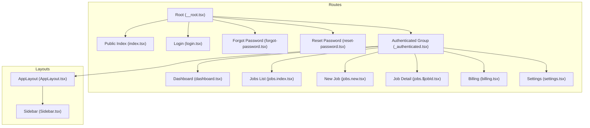
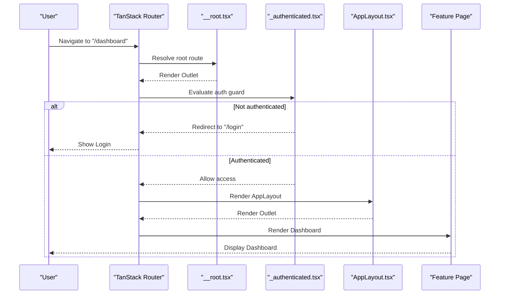
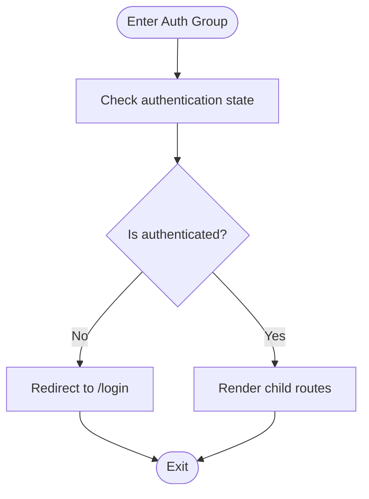
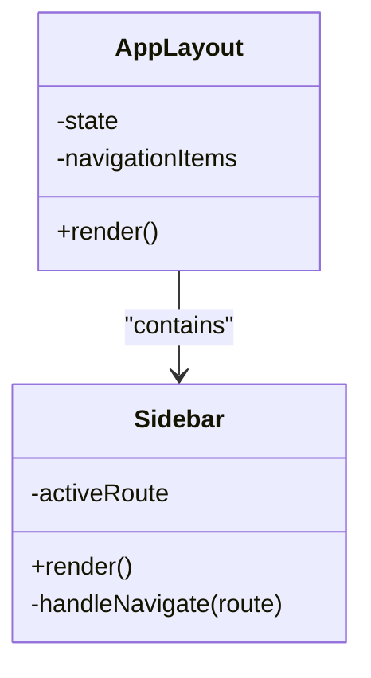
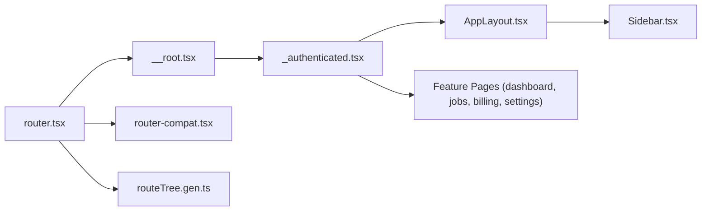

# Routing & Navigation Architecture

<cite>
**Referenced Files in This Document**
- [router.tsx](file://src/router.tsx)
- [__root.tsx](file://src/routes/__root.tsx)
- [_authenticated.tsx](file://src/routes/_authenticated.tsx)
- [index.tsx](file://src/routes/index.tsx)
- [login.tsx](file://src/routes/login.tsx)
- [forgot-password.tsx](file://src/routes/forgot-password.tsx)
- [reset-password.tsx](file://src/routes/reset-password.tsx)
- [dashboard.tsx](file://src/routes/_authenticated/dashboard.tsx)
- [jobs.index.tsx](file://src/routes/_authenticated/jobs.index.tsx)
- [jobs.new.tsx](file://src/routes/_authenticated/jobs.new.tsx)
- [jobs.$jobId.tsx](file://src/routes/_authenticated/jobs.$jobId.tsx)
- [billing.tsx](file://src/routes/_authenticated/billing.tsx)
- [settings.tsx](file://src/routes/_authenticated/settings.tsx)
- [AppLayout.tsx](file://src/layouts/AppLayout.tsx)
- [Sidebar.tsx](file://src/layouts/Sidebar.tsx)
- [routeTree.gen.ts](file://src/routeTree.gen.ts)
- [router-compat.tsx](file://src/lib/router-compat.tsx)
</cite>

## Table of Contents
1. [Introduction](#introduction)
2. [Project Structure](#project-structure)
3. [Core Components](#core-components)
4. [Architecture Overview](#architecture-overview)
5. [Detailed Component Analysis](#detailed-component-analysis)
6. [Dependency Analysis](#dependency-analysis)
7. [Performance Considerations](#performance-considerations)
8. [Troubleshooting Guide](#troubleshooting-guide)
9. [Conclusion](#conclusion)

## Introduction
This document explains the routing and navigation architecture for TrackDub Portal using TanStack Router. It covers route definitions, nested routing patterns, authentication guards, layout hierarchy (AppLayout and Sidebar), route protection, navigation state management, protected routes, dynamic parameters, programmatic navigation, and how authenticated versus unauthenticated routes are separated and integrated with the authentication flow.

## Project Structure
The routing is organized by file-based conventions:
- Root route and global setup live under src/routes/__root.tsx.
- Unauthenticated routes include login, forgot-password, reset-password, and a public index page.
- Authenticated routes are grouped under src/routes/_authenticated/ and share a common layout guard.
- Feature pages (Dashboard, Jobs, Billing, Settings) are defined as sibling or nested routes within the authenticated group.
- Layouts AppLayout and Sidebar provide shared UI chrome for authenticated sections.
- The router instance is configured in src/router.tsx and the generated route tree is maintained at src/routeTree.gen.ts.

**Diagram sources**
- [__root.tsx](file://src/routes/__root.tsx)
- [index.tsx](file://src/routes/index.tsx)
- [login.tsx](file://src/routes/login.tsx)
- [forgot-password.tsx](file://src/routes/forgot-password.tsx)
- [reset-password.tsx](file://src/routes/reset-password.tsx)
- [_authenticated.tsx](file://src/routes/_authenticated.tsx)
- [dashboard.tsx](file://src/routes/_authenticated/dashboard.tsx)
- [jobs.index.tsx](file://src/routes/_authenticated/jobs.index.tsx)
- [jobs.new.tsx](file://src/routes/_authenticated/jobs.new.tsx)
- [jobs.$jobId.tsx](file://src/routes/_authenticated/jobs.$jobId.tsx)
- [billing.tsx](file://src/routes/_authenticated/billing.tsx)
- [settings.tsx](file://src/routes/_authenticated/settings.tsx)
- [AppLayout.tsx](file://src/layouts/AppLayout.tsx)
- [Sidebar.tsx](file://src/layouts/Sidebar.tsx)

**Section sources**
- [router.tsx](file://src/router.tsx)
- [routeTree.gen.ts](file://src/routeTree.gen.ts)

## Core Components
- Router configuration: The router instance is created and configured in src/router.tsx, including history mode, base path, and any global providers or compatibility layers.
- Root route: src/routes/__root.tsx defines the root outlet and global error boundary behavior.
- Authentication group: src/routes/_authenticated.tsx acts as a layout and guard that ensures only authenticated users can access nested routes.
- Layouts: src/layouts/AppLayout.tsx provides the main shell for authenticated pages; src/layouts/Sidebar.tsx renders navigation links and active states.

Key responsibilities:
- Route registration and nesting via file-based conventions.
- Guarding authenticated routes to enforce login state.
- Rendering shared layouts and navigation chrome.
- Integrating with TanStack Router’s data loading and search params where needed.

**Section sources**
- [router.tsx](file://src/router.tsx)
- [__root.tsx](file://src/routes/__root.tsx)
- [_authenticated.tsx](file://src/routes/_authenticated.tsx)
- [AppLayout.tsx](file://src/layouts/AppLayout.tsx)
- [Sidebar.tsx](file://src/layouts/Sidebar.tsx)

## Architecture Overview
TanStack Router uses a file-based route tree. The root route renders an Outlet for child routes. Authenticated routes are grouped under _authenticated, which enforces authentication before rendering its children. Public routes (login, forgot-password, reset-password, index) are siblings of the authenticated group.

**Diagram sources**
- [__root.tsx](file://src/routes/__root.tsx)
- [_authenticated.tsx](file://src/routes/_authenticated.tsx)
- [AppLayout.tsx](file://src/layouts/AppLayout.tsx)
- [dashboard.tsx](file://src/routes/_authenticated/dashboard.tsx)

## Detailed Component Analysis

### Root Route and Global Setup
- Purpose: Establishes the root outlet and global error handling.
- Behavior: Renders child routes via Outlet; may wrap content with global providers or loaders.

**Section sources**
- [__root.tsx](file://src/routes/__root.tsx)

### Authentication Guard (_authenticated)
- Purpose: Protects all nested routes under this group.
- Behavior: Checks authentication state; redirects to login if not authenticated; otherwise renders children within AppLayout.

**Diagram sources**
- [_authenticated.tsx](file://src/routes/_authenticated.tsx)

**Section sources**
- [_authenticated.tsx](file://src/routes/_authenticated.tsx)

### Layout Hierarchy: AppLayout and Sidebar
- AppLayout: Provides the authenticated shell, typically containing header, main content area, and integration with Sidebar.
- Sidebar: Renders navigation items, highlights active routes, and supports responsive behaviors.

**Diagram sources**
- [AppLayout.tsx](file://src/layouts/AppLayout.tsx)
- [Sidebar.tsx](file://src/layouts/Sidebar.tsx)

**Section sources**
- [AppLayout.tsx](file://src/layouts/AppLayout.tsx)
- [Sidebar.tsx](file://src/layouts/Sidebar.tsx)

### Protected Routes (Authenticated Group)
- Dashboard: Main landing after login.
- Jobs: Includes list, create, and detail pages with dynamic parameter jobId.
- Billing and Settings: Additional feature pages under authenticated scope.

Protected route examples:
- Access to /dashboard, /jobs/*, /billing, /settings requires authentication enforced by _authenticated.

Dynamic routing example:
- /jobs/:jobId resolves to jobs.$jobId.tsx with jobId available from route params.

Programmatic navigation:
- Use TanStack Router’s navigate function or Link components to move between routes without full reloads.

**Section sources**
- [dashboard.tsx](file://src/routes/_authenticated/dashboard.tsx)
- [jobs.index.tsx](file://src/routes/_authenticated/jobs.index.tsx)
- [jobs.new.tsx](file://src/routes/_authenticated/jobs.new.tsx)
- [jobs.$jobId.tsx](file://src/routes/_authenticated/jobs.$jobId.tsx)
- [billing.tsx](file://src/routes/_authenticated/billing.tsx)
- [settings.tsx](file://src/routes/_authenticated/settings.tsx)

### Unauthenticated Routes
- Public index: Landing page accessible without login.
- Login: Entry point for authentication.
- Forgot password and Reset password: Account recovery flows.

These routes are siblings of the authenticated group and do not require authentication.

**Section sources**
- [index.tsx](file://src/routes/index.tsx)
- [login.tsx](file://src/routes/login.tsx)
- [forgot-password.tsx](file://src/routes/forgot-password.tsx)
- [reset-password.tsx](file://src/routes/reset-password.tsx)

### Router Configuration and Compatibility
- Router instance: Configured in src/router.tsx with history, base, and optional providers.
- Compatibility layer: src/lib/router-compat.tsx may bridge legacy navigation patterns or integrate with TanStack Router features.
- Generated route tree: src/routeTree.gen.ts reflects the current file-based route structure and types.

**Section sources**
- [router.tsx](file://src/router.tsx)
- [router-compat.tsx](file://src/lib/router-compat.tsx)
- [routeTree.gen.ts](file://src/routeTree.gen.ts)

## Dependency Analysis
The routing system depends on TanStack Router for navigation, route resolution, and data loading. File-based conventions map directly to route modules. The authentication guard depends on the application’s auth state provider (not shown here). Layouts depend on UI components for consistent presentation.

**Diagram sources**
- [router.tsx](file://src/router.tsx)
- [__root.tsx](file://src/routes/__root.tsx)
- [_authenticated.tsx](file://src/routes/_authenticated.tsx)
- [AppLayout.tsx](file://src/layouts/AppLayout.tsx)
- [Sidebar.tsx](file://src/layouts/Sidebar.tsx)
- [routeTree.gen.ts](file://src/routeTree.gen.ts)
- [router-compat.tsx](file://src/lib/router-compat.tsx)

**Section sources**
- [router.tsx](file://src/router.tsx)
- [routeTree.gen.ts](file://src/routeTree.gen.ts)

## Performance Considerations
- Code splitting: TanStack Router automatically splits routes by file; ensure feature pages remain small and lazy-load heavy dependencies.
- Data loading: Prefer route-level loaders to prefetch data and reduce waterfall requests.
- Navigation state: Avoid excessive re-renders by memoizing navigation-dependent computations and keeping Sidebar state minimal.
- History mode: Use appropriate history strategy (browser vs memory) based on deployment environment.

[No sources needed since this section provides general guidance]

## Troubleshooting Guide
Common issues and resolutions:
- Redirect loops: Ensure the authentication guard does not redirect already-authenticated users back to login. Verify the redirect target and conditions.
- Missing Outlet: Confirm that __root.tsx and layout routes render Outlet to display nested content.
- Dynamic params undefined: Validate that the URL segment matches the file name convention (e.g., $jobId) and that the route is correctly registered.
- Navigation not updating: Check that navigate calls use correct paths and that the router instance is properly configured.

**Section sources**
- [__root.tsx](file://src/routes/__root.tsx)
- [_authenticated.tsx](file://src/routes/_authenticated.tsx)
- [jobs.$jobId.tsx](file://src/routes/_authenticated/jobs.$jobId.tsx)

## Conclusion
TrackDub Portal’s routing architecture leverages TanStack Router’s file-based conventions to define clear, maintainable routes. The _authenticated group centralizes authentication enforcement, while AppLayout and Sidebar provide a consistent UI shell. Protected routes, dynamic parameters, and programmatic navigation are implemented following best practices for performance and usability. This structure scales well as new features are added and simplifies maintenance through predictable patterns.

[No sources needed since this section summarizes without analyzing specific files]