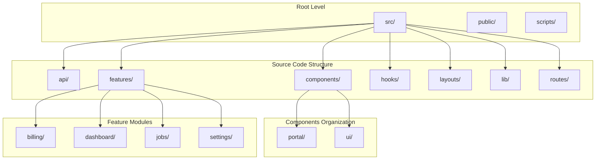
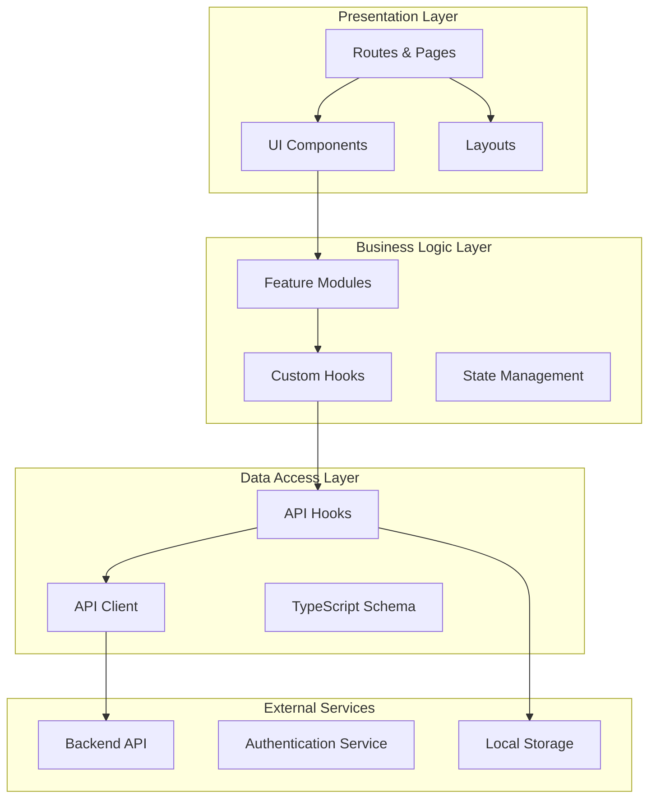
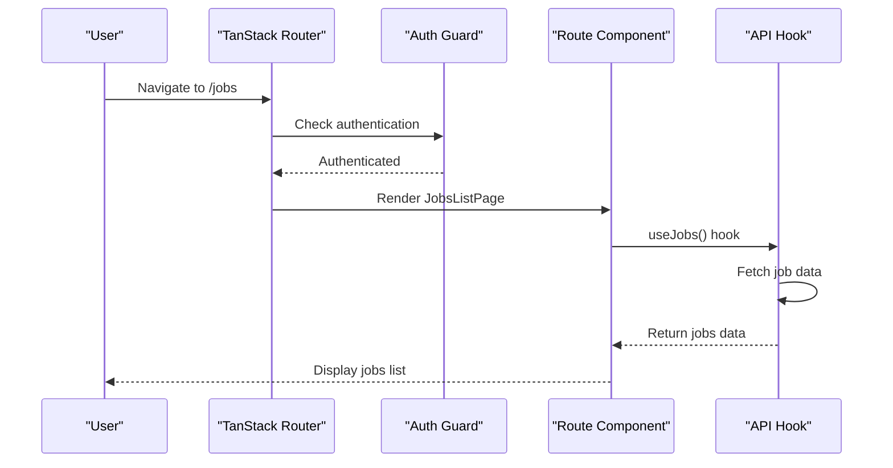
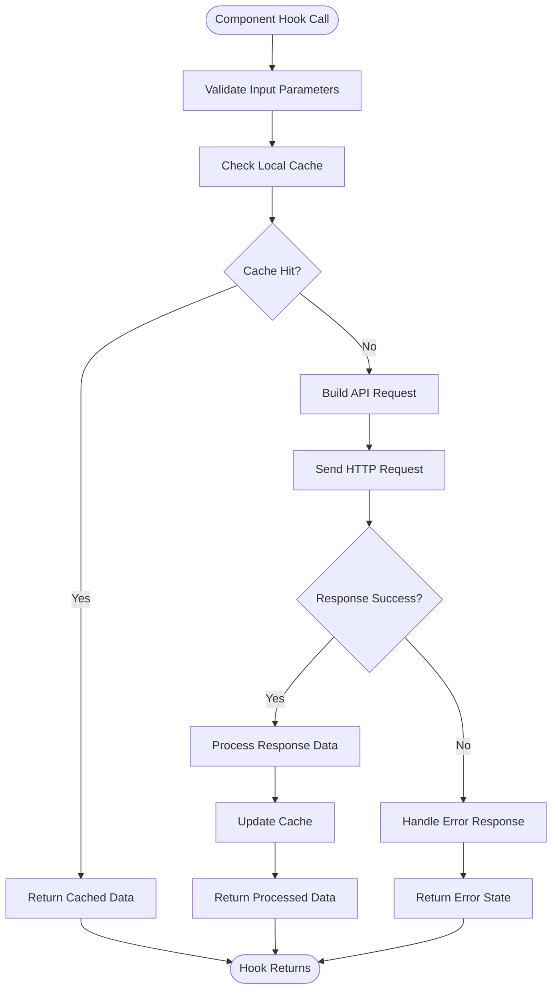
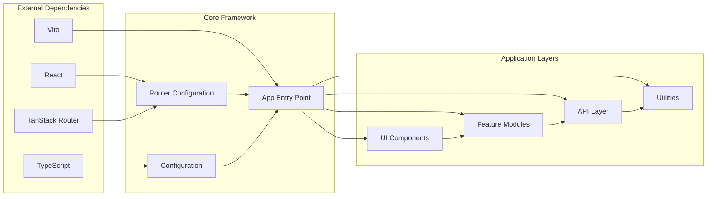

# System Overview

<cite>
**Referenced Files in This Document**
- [package.json](file://package.json)
- [vite.config.ts](file://vite.config.ts)
- [src/router.tsx](file://src/router.tsx)
- [src/routes/__root.tsx](file://src/routes/__root.tsx)
- [README.md](file://README.md)
- [bunfig.toml](file://bunfig.toml)
- [tsconfig.json](file://tsconfig.json)
- [components.json](file://components.json)
- [eslint.config.js](file://eslint.config.js)
- [index.html](file://index.html)
</cite>

## Table of Contents
1. [Introduction](#introduction)
2. [Project Structure](#project-structure)
3. [Core Components](#core-components)
4. [Architecture Overview](#architecture-overview)
5. [Detailed Component Analysis](#detailed-component-analysis)
6. [Dependency Analysis](#dependency-analysis)
7. [Performance Considerations](#performance-considerations)
8. [Troubleshooting Guide](#troubleshooting-guide)
9. [Conclusion](#conclusion)

## Introduction

TrackDub Portal is a modern React-based web application built with TanStack Router and Vite as its core technologies. The portal serves as a comprehensive platform for managing dubbing jobs, billing, user settings, and dashboard analytics. The application follows a feature-based modular architecture that promotes code organization, reusability, and maintainability.

The system is designed with a clear separation between UI components, business logic, and API integration layers, making it scalable and easy to extend. The frontend leverages TypeScript for type safety and includes a comprehensive set of reusable UI components built with modern design principles.

## Project Structure

The TrackDub Portal follows a well-organized feature-based architecture that separates concerns into distinct directories:

**Diagram sources**
- [src/api/client.ts](file://src/api/client.ts)
- [src/components/ui/button.tsx](file://src/components/ui/button.tsx)
- [src/features/dashboard/DashboardPage.tsx](file://src/features/dashboard/DashboardPage.tsx)

### Key Directories and Their Responsibilities:

- **`src/api/`**: Contains API client configuration, hooks for data fetching, and TypeScript schema definitions
- **`src/components/`**: Reusable UI components organized into `ui/` (primitive components) and `portal/` (domain-specific components)
- **`src/features/`**: Feature-based modules containing page components and related business logic
- **`src/hooks/`**: Custom React hooks for shared functionality
- **`src/layouts/`**: Layout components including the main application layout and sidebar navigation
- **`src/lib/`**: Utility functions, configuration, and shared libraries
- **`src/routes/`**: Route definitions using TanStack Router's file-based routing

**Section sources**
- [src/router.tsx](file://src/router.tsx)
- [src/routes/__root.tsx](file://src/routes/__root.tsx)

## Core Components

The TrackDub Portal is built around several core component categories that work together to provide a cohesive user experience:

### UI Component Library
The application includes a comprehensive set of primitive UI components under `src/components/ui/` that follow consistent design patterns and accessibility standards. These include buttons, forms, dialogs, tables, and various interactive elements.

### Portal-Specific Components
Domain-specific components under `src/components/portal/` provide higher-level abstractions for common portal interactions like data tables, pagination, loading states, and confirmation dialogs.

### Feature Components
Each feature module (`billing`, `dashboard`, `jobs`, `settings`) contains specialized components that handle the specific business logic and user interactions for that domain.

### Layout Components
The layout system provides the overall application structure, including the main app layout and sidebar navigation that wraps all authenticated routes.

**Section sources**
- [src/components/ui/button.tsx](file://src/components/ui/button.tsx)
- [src/components/portal/Table.tsx](file://src/components/portal/Table.tsx)
- [src/layouts/AppLayout.tsx](file://src/layouts/AppLayout.tsx)

## Architecture Overview

The TrackDub Portal follows a layered architecture pattern that separates concerns across different layers of the application:

**Diagram sources**
- [src/router.tsx](file://src/router.tsx)
- [src/api/hooks/useJobs.ts](file://src/api/hooks/useJobs.ts)
- [src/api/client.ts](file://src/api/client.ts)

### Data Flow Pattern

The application implements a unidirectional data flow pattern:

1. **User Interaction**: User actions trigger component events
2. **Component State**: Components manage local state and user feedback
3. **Feature Logic**: Feature modules handle business rules and data transformations
4. **API Integration**: API hooks manage data fetching and caching
5. **Server Communication**: HTTP requests are sent to backend services
6. **State Update**: Responses update application state and trigger re-renders

**Section sources**
- [src/api/hooks/useJobs.ts](file://src/api/hooks/useJobs.ts)
- [src/api/hooks/useBilling.ts](file://src/api/hooks/useBilling.ts)
- [src/api/client.ts](file://src/api/client.ts)

## Detailed Component Analysis

### Routing Architecture

The application uses TanStack Router for file-based routing with nested route groups. The routing structure supports both public and authenticated routes with proper authentication guards.

**Diagram sources**
- [src/routes/_authenticated/jobs.index.tsx](file://src/routes/_authenticated/jobs.index.tsx)
- [src/api/hooks/useJobs.ts](file://src/api/hooks/useJobs.ts)

### Feature Module Architecture

Each feature module follows a consistent pattern with page components, business logic, and UI components:

#### Jobs Feature
The jobs feature manages the complete job lifecycle from creation to completion, including file uploads, status tracking, and job details.

#### Billing Feature  
The billing feature handles subscription management, usage tracking, and invoice generation with charts and data visualization.

#### Dashboard Feature
The dashboard provides an overview of key metrics, active jobs, and recent activity with real-time updates.

#### Settings Feature
The settings feature manages API keys, webhooks, and delivery logs with form validation and error handling.

**Section sources**
- [src/features/jobs/JobsListPage.tsx](file://src/features/jobs/JobsListPage.tsx)
- [src/features/billing/BillingPage.tsx](file://src/features/billing/BillingPage.tsx)
- [src/features/dashboard/DashboardPage.tsx](file://src/features/dashboard/DashboardPage.tsx)
- [src/features/settings/SettingsPage.tsx](file://src/features/settings/SettingsPage.tsx)

### API Integration Layer

The API layer provides a clean abstraction over HTTP requests with automatic type inference and error handling:

**Diagram sources**
- [src/api/client.ts](file://src/api/client.ts)
- [src/api/hooks/useJobs.ts](file://src/api/hooks/useJobs.ts)

**Section sources**
- [src/api/client.ts](file://src/api/client.ts)
- [src/api/hooks/useApiKeys.ts](file://src/api/hooks/useApiKeys.ts)
- [src/api/hooks/useWebhooks.ts](file://src/api/hooks/useWebhooks.ts)

## Dependency Analysis

The TrackDub Portal has a well-structured dependency hierarchy that promotes modularity and reduces coupling:

**Diagram sources**
- [package.json](file://package.json)
- [vite.config.ts](file://vite.config.ts)
- [src/router.tsx](file://src/router.tsx)

### Build Configuration

The build system is configured with Vite for fast development and optimized production builds. The configuration includes TypeScript support, CSS processing, and asset optimization.

### Development Environment

The development environment is set up with Bun as the package manager and runtime, providing faster performance compared to traditional Node.js setups. The configuration includes linting, formatting, and type checking.

**Section sources**
- [package.json](file://package.json)
- [bunfig.toml](file://bunfig.toml)
- [tsconfig.json](file://tsconfig.json)
- [eslint.config.js](file://eslint.config.js)

## Performance Considerations

The TrackDub Portal implements several performance optimization strategies:

### Code Splitting
The application uses dynamic imports and route-based code splitting to minimize initial bundle size and improve load times.

### Lazy Loading
Components and features are loaded on-demand, reducing memory usage and improving startup performance.

### Caching Strategy
API responses are cached locally to reduce network requests and provide instant data access for frequently used information.

### Bundle Optimization
The build process optimizes JavaScript and CSS bundles, removes unused code, and compresses assets for production deployment.

## Troubleshooting Guide

### Common Development Issues

**Build Errors**: Ensure all TypeScript types are properly defined and dependencies are correctly installed.

**Routing Issues**: Verify route file naming conventions and nested route structure matches TanStack Router requirements.

**API Integration Problems**: Check API endpoint configurations and error handling in custom hooks.

**Component Rendering**: Use React DevTools to inspect component state and props during development.

### Debugging Strategies

- Enable detailed logging in development mode
- Use browser developer tools for network inspection
- Implement error boundaries for graceful error handling
- Add performance profiling for slow components

**Section sources**
- [src/lib/error-capture.ts](file://src/lib/error-capture.ts)
- [src/lib/error-page.tsx](file://src/lib/error-page.tsx)

## Conclusion

The TrackDub Portal demonstrates a modern, scalable React application architecture that effectively separates concerns through feature-based organization and clear component hierarchies. The use of TanStack Router provides robust routing capabilities, while the comprehensive UI component library ensures consistency across the application.

The modular architecture approach makes the codebase maintainable and extensible, allowing teams to work on different features independently while maintaining clear interfaces between modules. The API integration layer provides a clean abstraction over backend services, making it easy to modify or replace external dependencies without affecting the rest of the application.

This system serves as an excellent example of how to structure a complex React application for long-term maintainability and scalability, with clear patterns for adding new features and extending existing functionality.