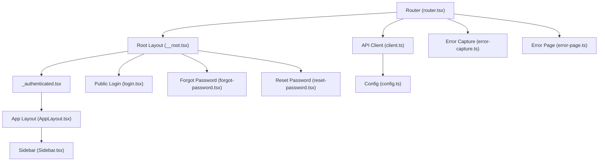
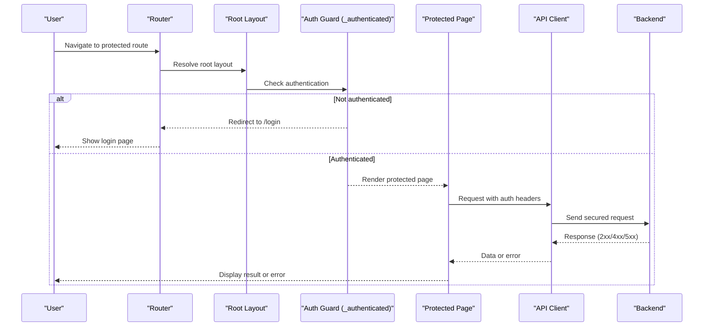
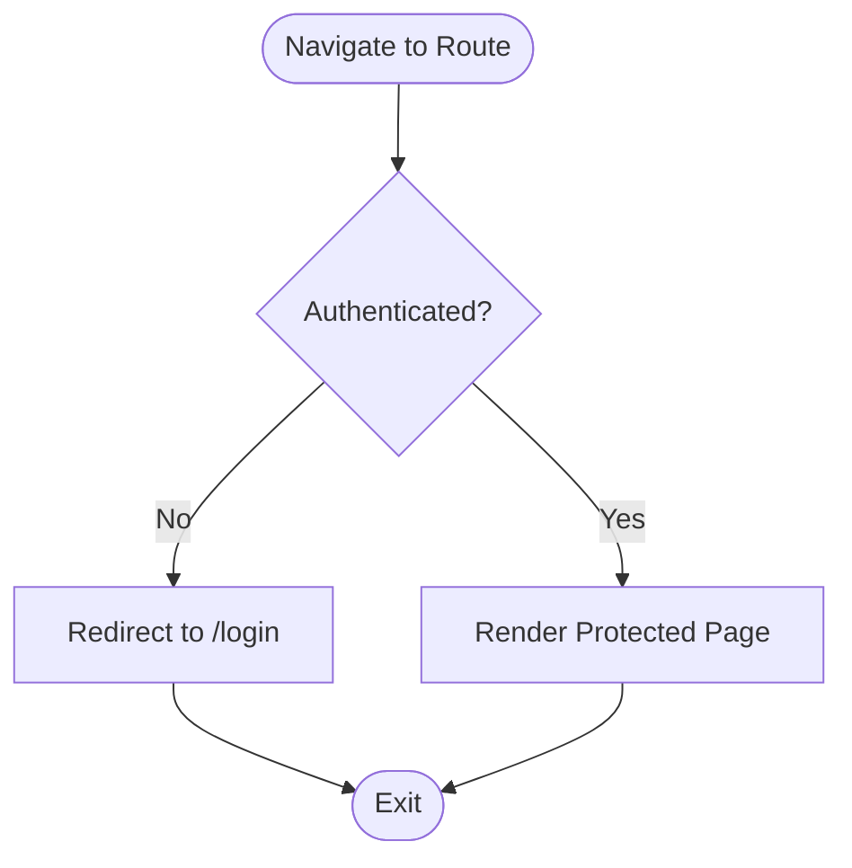
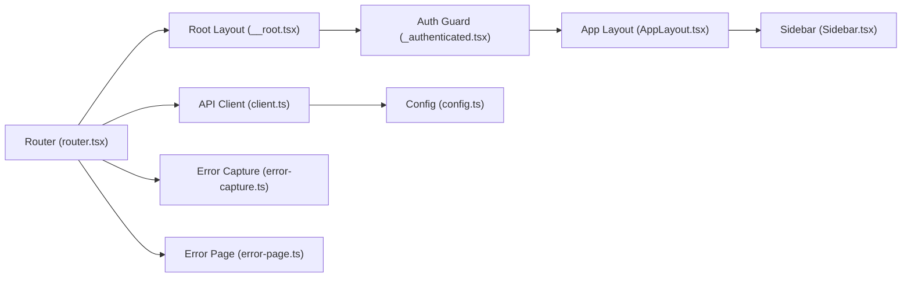

# Authentication & Security

<cite>
**Referenced Files in This Document**
- [router.tsx](file://src/router.tsx)
- [__root.tsx](file://src/routes/__root.tsx)
- [_authenticated.tsx](file://src/routes/_authenticated.tsx)
- [login.tsx](file://src/routes/login.tsx)
- [forgot-password.tsx](file://src/routes/forgot-password.tsx)
- [reset-password.tsx](file://src/routes/reset-password.tsx)
- [client.ts](file://src/api/client.ts)
- [config.ts](file://src/lib/config.ts)
- [error-capture.ts](file://src/lib/error-capture.ts)
- [error-page.ts](file://src/lib/error-page.ts)
- [AppLayout.tsx](file://src/layouts/AppLayout.tsx)
- [Sidebar.tsx](file://src/layouts/Sidebar.tsx)
</cite>

## Table of Contents
1. [Introduction](#introduction)
2. [Project Structure](#project-structure)
3. [Core Components](#core-components)
4. [Architecture Overview](#architecture-overview)
5. [Detailed Component Analysis](#detailed-component-analysis)
6. [Dependency Analysis](#dependency-analysis)
7. [Performance Considerations](#performance-considerations)
8. [Troubleshooting Guide](#troubleshooting-guide)
9. [Conclusion](#conclusion)
10. [Appendices](#appendices)

## Introduction
This document provides comprehensive authentication and security guidance for TrackDub Portal. It covers the authentication flow, protected routes implementation, session management, role-based access control patterns, login/logout functionality, password reset flows, securing API calls, handling sensitive data, error handling for authentication failures, authentication middleware, route guards, and security headers configuration. The content is derived from the repository’s routing, API client, configuration, and layout files to ensure accuracy and traceability.

## Project Structure
TrackDub Portal organizes authentication-related concerns across:
- Route definitions for public and authenticated pages
- A root layout that can enforce global behaviors
- An authenticated layout group for protecting nested routes
- An API client for secure HTTP requests
- Configuration and error utilities

**Diagram sources**
- [router.tsx](file://src/router.tsx)
- [__root.tsx](file://src/routes/__root.tsx)
- [_authenticated.tsx](file://src/routes/_authenticated.tsx)
- [login.tsx](file://src/routes/login.tsx)
- [forgot-password.tsx](file://src/routes/forgot-password.tsx)
- [reset-password.tsx](file://src/routes/reset-password.tsx)
- [AppLayout.tsx](file://src/layouts/AppLayout.tsx)
- [Sidebar.tsx](file://src/layouts/Sidebar.tsx)
- [client.ts](file://src/api/client.ts)
- [config.ts](file://src/lib/config.ts)
- [error-capture.ts](file://src/lib/error-capture.ts)
- [error-page.ts](file://src/lib/error-page.ts)

**Section sources**
- [router.tsx](file://src/router.tsx)
- [__root.tsx](file://src/routes/__root.tsx)
- [_authenticated.tsx](file://src/routes/_authenticated.tsx)
- [login.tsx](file://src/routes/login.tsx)
- [forgot-password.tsx](file://src/routes/forgot-password.tsx)
- [reset-password.tsx](file://src/routes/reset-password.tsx)
- [client.ts](file://src/api/client.ts)
- [config.ts](file://src/lib/config.ts)
- [error-capture.ts](file://src/lib/error-capture.ts)
- [error-page.ts](file://src/lib/error-page.ts)
- [AppLayout.tsx](file://src/layouts/AppLayout.tsx)
- [Sidebar.tsx](file://src/layouts/Sidebar.tsx)

## Core Components
- Router and Root Layout: Central entry point for navigation and global setup; may initialize security headers and error capture.
- Authenticated Group: Protects nested routes by enforcing authentication before rendering.
- Public Pages: Login, forgot password, and reset password are exposed without authentication.
- API Client: Handles HTTP requests with secure defaults and token injection.
- Configuration: Centralizes environment-specific settings such as base URLs and feature flags.
- Error Utilities: Standardize error reporting and user-facing error pages.

Key responsibilities:
- Enforce authentication at route boundaries
- Manage session state and tokens securely
- Provide consistent error handling and user feedback
- Secure API communication with proper headers and timeouts

**Section sources**
- [router.tsx](file://src/router.tsx)
- [__root.tsx](file://src/routes/__root.tsx)
- [_authenticated.tsx](file://src/routes/_authenticated.tsx)
- [client.ts](file://src/api/client.ts)
- [config.ts](file://src/lib/config.ts)
- [error-capture.ts](file://src/lib/error-capture.ts)
- [error-page.ts](file://src/lib/error-page.ts)

## Architecture Overview
The authentication architecture centers around route-level guards and a centralized API client.

**Diagram sources**
- [router.tsx](file://src/router.tsx)
- [__root.tsx](file://src/routes/__root.tsx)
- [_authenticated.tsx](file://src/routes/_authenticated.tsx)
- [client.ts](file://src/api/client.ts)

## Detailed Component Analysis

### Authentication Flow and Protected Routes
- Public routes include login, forgot password, and reset password.
- Protected routes are grouped under an authenticated layout that enforces authentication before rendering.
- Navigation to protected routes without valid session redirects to login.

**Diagram sources**
- [_authenticated.tsx](file://src/routes/_authenticated.tsx)
- [login.tsx](file://src/routes/login.tsx)
- [forgot-password.tsx](file://src/routes/forgot-password.tsx)
- [reset-password.tsx](file://src/routes/reset-password.tsx)

**Section sources**
- [_authenticated.tsx](file://src/routes/_authenticated.tsx)
- [login.tsx](file://src/routes/login.tsx)
- [forgot-password.tsx](file://src/routes/forgot-password.tsx)
- [reset-password.tsx](file://src/routes/reset-password.tsx)

### Session Management
- Session state is managed within the application layer via the router and layouts.
- Tokens or session identifiers should be stored securely and attached to API requests through the client.
- On logout, clear session state and redirect to public routes.

Best practices:
- Avoid storing secrets in localStorage when possible; prefer httpOnly cookies on the server side.
- Use short-lived tokens and refresh mechanisms if applicable.
- Ensure session invalidation on logout and after token expiration.

**Section sources**
- [router.tsx](file://src/router.tsx)
- [__root.tsx](file://src/routes/__root.tsx)
- [client.ts](file://src/api/client.ts)

### Login and Logout Functionality
- Login page handles credential submission and navigates to protected areas upon success.
- Logout clears session state and returns users to public routes.
- Error states are displayed using standardized error components.

Implementation notes:
- Validate inputs on the client before sending requests.
- Handle network errors and server responses consistently.
- Prevent auto-complete on sensitive fields where appropriate.

**Section sources**
- [login.tsx](file://src/routes/login.tsx)
- [error-page.ts](file://src/lib/error-page.ts)

### Password Reset Flows
- Forgot password initiates a recovery process by submitting email or identifier.
- Reset password completes the recovery by validating a token and setting a new password.
- Both flows should provide clear feedback and handle errors gracefully.

Security considerations:
- Enforce rate limiting on the server side.
- Use time-bound tokens and single-use links.
- Do not expose internal error details to users.

**Section sources**
- [forgot-password.tsx](file://src/routes/forgot-password.tsx)
- [reset-password.tsx](file://src/routes/reset-password.tsx)
- [error-page.ts](file://src/lib/error-page.ts)

### Role-Based Access Control Patterns
- Implement role checks within protected routes or components to restrict access based on user roles.
- Centralize role evaluation logic to avoid duplication.
- Combine route guards with component-level permissions for defense-in-depth.

Guidelines:
- Define explicit roles and permissions.
- Fail closed: deny access by default when role information is missing.
- Log unauthorized access attempts for auditing.

**Section sources**
- [_authenticated.tsx](file://src/routes/_authenticated.tsx)
- [AppLayout.tsx](file://src/layouts/AppLayout.tsx)
- [Sidebar.tsx](file://src/layouts/Sidebar.tsx)

### Securing API Calls
- Use the API client to attach authentication headers automatically.
- Configure timeouts, retries, and error handling centrally.
- Sanitize inputs and validate responses on both client and server.

Recommendations:
- Use HTTPS exclusively.
- Set Content-Security-Policy and other security headers at the server level.
- Avoid logging sensitive data in client-side logs.

**Section sources**
- [client.ts](file://src/api/client.ts)
- [config.ts](file://src/lib/config.ts)

### Authentication Middleware and Route Guards
- Route guards enforce authentication at the router level before rendering protected content.
- Middleware-like behavior can be implemented in the root layout to initialize security settings globally.

Implementation tips:
- Keep guard logic minimal and fast to avoid blocking navigation.
- Provide immediate feedback when redirection occurs.
- Centralize error handling to present consistent messages.

**Section sources**
- [router.tsx](file://src/router.tsx)
- [__root.tsx](file://src/routes/__root.tsx)
- [_authenticated.tsx](file://src/routes/_authenticated.tsx)

### Security Headers Configuration
- Configure security headers at the server or build-time configuration.
- Common headers include Strict-Transport-Security, X-Content-Type-Options, X-Frame-Options, and Content-Security-Policy.
- Ensure headers are applied to all responses, including error pages.

Operational guidance:
- Test header enforcement in development and production.
- Monitor CSP violations and adjust policies incrementally.
- Rotate secrets and update configurations securely.

**Section sources**
- [config.ts](file://src/lib/config.ts)
- [error-page.ts](file://src/lib/error-page.ts)

## Dependency Analysis
Authentication and security depend on routing, layouts, and the API client. The following diagram shows key relationships:

**Diagram sources**
- [router.tsx](file://src/router.tsx)
- [__root.tsx](file://src/routes/__root.tsx)
- [_authenticated.tsx](file://src/routes/_authenticated.tsx)
- [AppLayout.tsx](file://src/layouts/AppLayout.tsx)
- [Sidebar.tsx](file://src/layouts/Sidebar.tsx)
- [client.ts](file://src/api/client.ts)
- [config.ts](file://src/lib/config.ts)
- [error-capture.ts](file://src/lib/error-capture.ts)
- [error-page.ts](file://src/lib/error-page.ts)

**Section sources**
- [router.tsx](file://src/router.tsx)
- [__root.tsx](file://src/routes/__root.tsx)
- [_authenticated.tsx](file://src/routes/_authenticated.tsx)
- [AppLayout.tsx](file://src/layouts/AppLayout.tsx)
- [Sidebar.tsx](file://src/layouts/Sidebar.tsx)
- [client.ts](file://src/api/client.ts)
- [config.ts](file://src/lib/config.ts)
- [error-capture.ts](file://src/lib/error-capture.ts)
- [error-page.ts](file://src/lib/error-page.ts)

## Performance Considerations
- Minimize authentication checks to essential points (route guards).
- Cache non-sensitive data to reduce redundant API calls.
- Use efficient error handling to avoid unnecessary re-renders.
- Profile navigation flows to ensure quick redirection on failed authentication.

[No sources needed since this section provides general guidance]

## Troubleshooting Guide
Common issues and resolutions:
- Redirect loops: Verify guard conditions and ensure correct return paths after login.
- Missing auth headers: Confirm the API client attaches tokens and config values.
- Inconsistent error messages: Centralize error handling and standardize user feedback.
- CSP or header misconfiguration: Review server headers and browser console for violations.

Debugging steps:
- Inspect network requests for missing or incorrect headers.
- Check error logs captured by error utilities.
- Validate configuration values for environment-specific settings.

**Section sources**
- [error-capture.ts](file://src/lib/error-capture.ts)
- [error-page.ts](file://src/lib/error-page.ts)
- [client.ts](file://src/api/client.ts)
- [config.ts](file://src/lib/config.ts)

## Conclusion
TrackDub Portal implements authentication through route guards and a centralized API client, ensuring protected routes are enforced and API calls are secured. By following the best practices outlined—secure session management, robust error handling, and proper security headers—you can maintain a strong security posture while delivering a smooth user experience. Continuously review and update authentication flows, permissions, and headers to align with evolving threats and requirements.

[No sources needed since this section summarizes without analyzing specific files]

## Appendices
- Security checklist:
  - Enforce HTTPS everywhere
  - Apply strict security headers
  - Validate and sanitize all inputs
  - Use short-lived tokens and secure storage
  - Implement rate limiting and account lockout on the server
  - Monitor and log authentication events
  - Regularly rotate secrets and audit access

[No sources needed since this section provides general guidance]