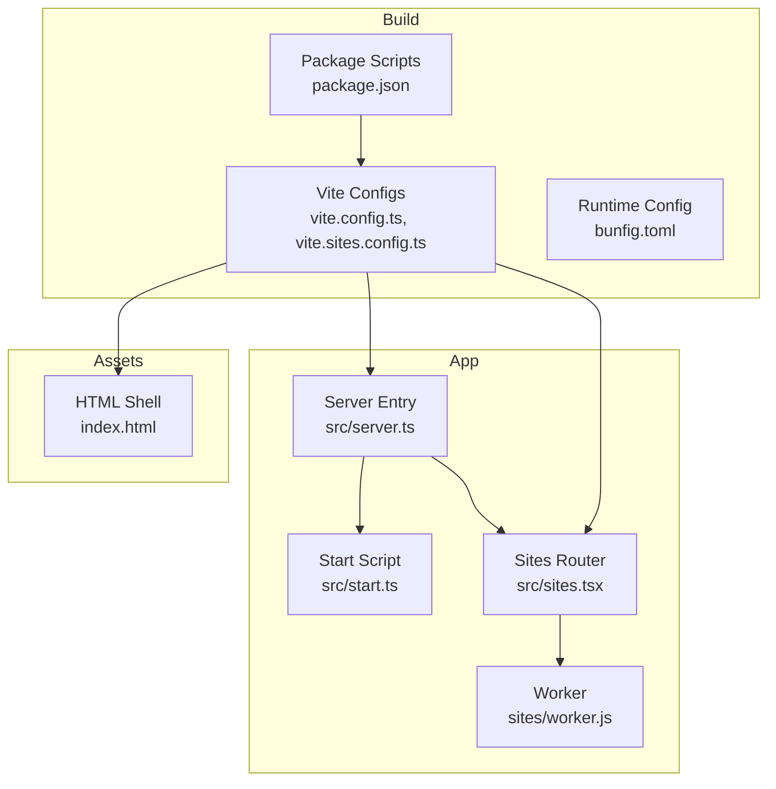
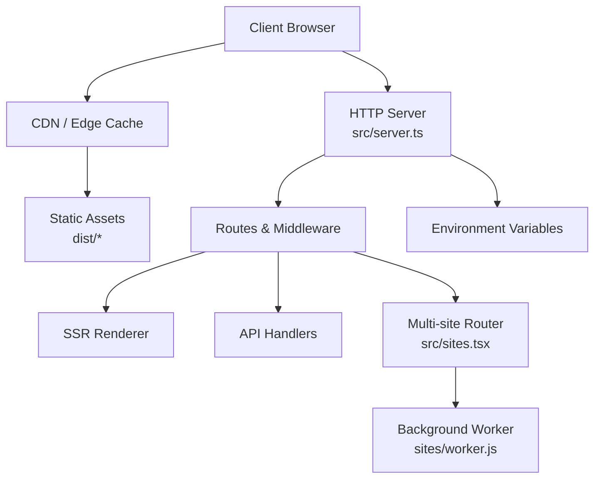
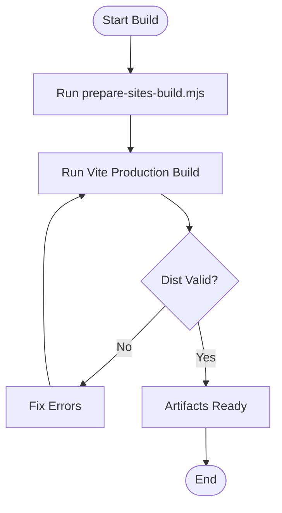
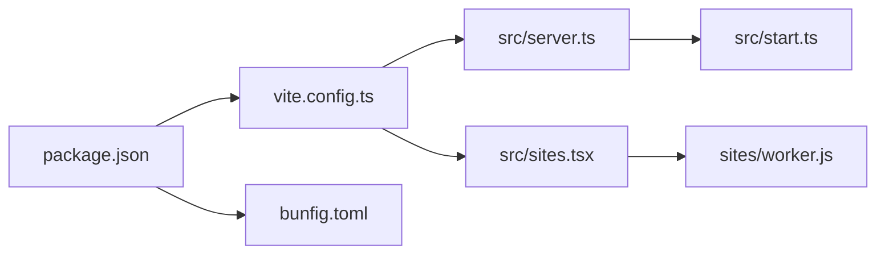

# Deployment & Production

<cite>
**Referenced Files in This Document**
- [package.json](file://package.json)
- [vite.config.ts](file://vite.config.ts)
- [vite.sites.config.ts](file://vite.sites.config.ts)
- [bunfig.toml](file://bunfig.toml)
- [index.html](file://index.html)
- [src/server.ts](file://src/server.ts)
- [src/start.ts](file://src/start.ts)
- [src/sites.tsx](file://src/sites.tsx)
- [sites/worker.js](file://sites/worker.js)
- [scripts/prepare-sites-build.mjs](file://scripts/prepare-sites-build.mjs)
- [.openai/hosting.json](file://.openai/hosting.json)
</cite>

## Table of Contents
1. [Introduction](#introduction)
2. [Project Structure](#project-structure)
3. [Core Components](#core-components)
4. [Architecture Overview](#architecture-overview)
5. [Detailed Component Analysis](#detailed-component-analysis)
6. [Dependency Analysis](#dependency-analysis)
7. [Performance Considerations](#performance-considerations)
8. [Troubleshooting Guide](#troubleshooting-guide)
9. [Conclusion](#conclusion)
10. [Appendices](#appendices)

## Introduction
This document provides comprehensive deployment and production guidance for TrackDub Portal. It covers the production build process, environment configuration, static site generation, server-side rendering setup, asset optimization, CI/CD pipeline recommendations, monitoring and logging, performance tuning, and multi-site deployment architecture with worker configuration. The goal is to enable reliable, scalable, and secure deployments across different hosting platforms.

## Project Structure
TrackDub Portal is a Vite-based application with both client-side and server-side capabilities. It supports:
- Static site generation for multiple sites
- Server-side rendering via a Node/Bun-compatible server entry
- A worker model for background tasks or per-site processing
- Centralized configuration through Vite configs and runtime settings

Key directories and files relevant to deployment:
- Build and bundling: vite.config.ts, vite.sites.config.ts
- Runtime entry points: src/server.ts, src/start.ts
- Multi-site logic: src/sites.tsx, sites/worker.js
- Build scripts: scripts/prepare-sits-build.mjs
- Hosting hints: .openai/hosting.json
- Root assets and HTML: index.html
- Package and runtime config: package.json, bunfig.toml

**Diagram sources**
- [vite.config.ts](file://vite.config.ts)
- [vite.sites.config.ts](file://vite.sites.config.ts)
- [package.json](file://package.json)
- [bunfig.toml](file://bunfig.toml)
- [src/server.ts](file://src/server.ts)
- [src/start.ts](file://src/start.ts)
- [src/sites.tsx](file://src/sites.tsx)
- [sites/worker.js](file://sites/worker.js)
- [index.html](file://index.html)

**Section sources**
- [vite.config.ts](file://vite.config.ts)
- [vite.sites.config.ts](file://vite.sites.config.ts)
- [package.json](file://package.json)
- [bunfig.toml](file://bunfig.toml)
- [src/server.ts](file://src/server.ts)
- [src/start.ts](file://src/start.ts)
- [src/sites.tsx](file://src/sites.tsx)
- [sites/worker.js](file://sites/worker.js)
- [index.html](file://index.html)

## Core Components
- Build system (Vite): Produces optimized static assets and SSR bundles. Separate configurations support multi-site builds.
- Server entry (src/server.ts): Initializes the HTTP server, sets up middleware, and serves both static assets and SSR routes.
- Start script (src/start.ts): Bootstraps the server and worker processes, reads environment variables, and handles graceful shutdown.
- Sites router (src/sites.tsx): Routes requests to per-site handlers and coordinates worker tasks.
- Worker (sites/worker.js): Executes background jobs or per-site processing tasks off the main thread.
- Build script (scripts/prepare-sites-build.mjs): Prepares site-specific assets and configurations before building.
- Hosting configuration (.openai/hosting.json): Provides platform-specific deployment hints.

**Section sources**
- [src/server.ts](file://src/server.ts)
- [src/start.ts](file://src/start.ts)
- [src/sites.tsx](file://src/sites.tsx)
- [sites/worker.js](file://sites/worker.js)
- [scripts/prepare-sites-build.mjs](file://scripts/prepare-sites-build.mjs)
- [.openai/hosting.json](file://.openai/hosting.json)

## Architecture Overview
The deployment architecture separates concerns between build-time and runtime:
- Build-time: Vite generates static assets and SSR bundles; prepare-sites-build.mjs tailors outputs per site.
- Runtime: The server serves static content and renders pages on demand; workers handle long-running tasks.

**Diagram sources**
- [src/server.ts](file://src/server.ts)
- [src/sites.tsx](file://src/sites.tsx)
- [sites/worker.js](file://sites/worker.js)

## Detailed Component Analysis

### Production Build Process
- Use Vite to build the application for production. Separate configurations exist for general app and multi-site builds.
- The prepare-sites-build.mjs script customizes site-specific assets and configurations prior to building.
- Output includes optimized static assets and SSR bundles suitable for deployment.

Recommended steps:
- Install dependencies using your package manager.
- Run the prepare-sites-build script to generate site-specific artifacts.
- Execute the Vite production build command defined in package.json.
- Verify dist output contains static assets and SSR bundles.

**Diagram sources**
- [scripts/prepare-sites-build.mjs](file://scripts/prepare-sites-build.mjs)
- [vite.config.ts](file://vite.config.ts)
- [vite.sites.config.ts](file://vite.sites.config.ts)
- [package.json](file://package.json)

**Section sources**
- [scripts/prepare-sites-build.mjs](file://scripts/prepare-sites-build.mjs)
- [vite.config.ts](file://vite.config.ts)
- [vite.sites.config.ts](file://vite.sites.config.ts)
- [package.json](file://package.json)

### Environment Configuration
- Environment variables are read at runtime by the server and start script to configure behavior such as ports, secrets, feature flags, and third-party integrations.
- Ensure production environments set required variables securely (e.g., secrets, API keys, database URLs).
- Validate that environment values are present and correctly formatted before starting the server.

Best practices:
- Use a centralized configuration loader in the server entry to parse and validate env vars.
- Provide defaults for non-sensitive settings and fail fast on missing critical variables.
- Avoid committing secrets; use secret managers or platform-provided injection mechanisms.

**Section sources**
- [src/server.ts](file://src/server.ts)
- [src/start.ts](file://src/start.ts)

### Static Site Generation
- Vite produces static assets for each site when configured appropriately.
- The prepare-sites-build.mjs script can pre-render or inject site-specific data into the build.
- Static assets should be served via a CDN or edge cache for optimal performance.

Guidelines:
- Configure Vite to emit static files for each site target.
- Preload critical resources and leverage caching headers.
- Validate generated HTML and assets for correctness.

**Section sources**
- [vite.sites.config.ts](file://vite.sites.config.ts)
- [scripts/prepare-sites-build.mjs](file://scripts/prepare-sites-build.mjs)

### Server-Side Rendering Setup
- The server entry initializes an HTTP server, sets up middleware, and serves SSR routes.
- The start script bootstraps the server and manages worker processes.
- Ensure proper error handling, request timeouts, and graceful shutdown.

Operational notes:
- Bind to the correct port from environment variables.
- Enable compression and security headers.
- Log requests and errors consistently.

**Section sources**
- [src/server.ts](file://src/server.ts)
- [src/start.ts](file://src/start.ts)

### Asset Optimization
- Vite’s production mode minifies, tree-shakes, and optimizes assets.
- Configure code splitting and lazy loading for large modules.
- Use appropriate image formats and sizes; leverage CDN caching.

Recommendations:
- Enable Brotli/Gzip compression if supported by your host.
- Set long-term caching for immutable assets.
- Monitor bundle size and remove unused dependencies.

**Section sources**
- [vite.config.ts](file://vite.config.ts)
- [vite.sites.config.ts](file://vite.sites.config.ts)

### Multi-site Deployment Architecture
- The sites router routes requests to per-site handlers, enabling isolated configurations and branding.
- Workers execute background tasks per site or globally, ensuring scalability.

Deployment considerations:
- Scale workers horizontally based on workload.
- Isolate site data and credentials where possible.
- Use health checks and readiness probes for each site.

**Section sources**
- [src/sites.tsx](file://src/sites.tsx)
- [sites/worker.js](file://sites/worker.js)

### Worker Configuration
- The worker script runs background jobs or per-site processing tasks.
- Configure concurrency limits, retry policies, and error reporting.
- Monitor worker queues and logs for bottlenecks.

Scaling tips:
- Use a job queue system for distributed workers.
- Implement backpressure and rate limiting.
- Alert on failed jobs and resource exhaustion.

**Section sources**
- [sites/worker.js](file://sites/worker.js)

### CI/CD Pipeline Recommendations
- Automate dependency installation, linting, tests, and builds.
- Publish artifacts to a registry or deploy directly to hosting platforms.
- Use environment-specific configurations and secrets management.

Suggested stages:
- Lint and type-check
- Unit and integration tests
- Build static assets and SSR bundles
- Deploy to staging, run smoke tests
- Promote to production with rollback capability

[No sources needed since this section provides general guidance]

### Monitoring and Logging in Production
- Centralize logs with structured JSON format for easy parsing.
- Capture request IDs, user context, and error stacks.
- Integrate with observability platforms for metrics, traces, and alerts.

Key areas to monitor:
- Request latency and error rates
- Worker queue depth and job success/failure
- Resource utilization (CPU, memory, disk)

**Section sources**
- [src/server.ts](file://src/server.ts)
- [src/start.ts](file://src/start.ts)

### Performance Optimization Techniques
- Enable HTTP/2 and TLS termination at the edge.
- Use CDN caching and cache invalidation strategies.
- Optimize database queries and connection pooling.
- Profile and reduce JavaScript bundle size.

[No sources needed since this section provides general guidance]

## Dependency Analysis
The build and runtime depend on Vite, the server entry, and the worker module. Understanding these relationships helps avoid circular dependencies and ensures stable deployments.

**Diagram sources**
- [package.json](file://package.json)
- [vite.config.ts](file://vite.config.ts)
- [bunfig.toml](file://bunfig.toml)
- [src/server.ts](file://src/server.ts)
- [src/sites.tsx](file://src/sites.tsx)
- [src/start.ts](file://src/start.ts)
- [sites/worker.js](file://sites/worker.js)

**Section sources**
- [package.json](file://package.json)
- [vite.config.ts](file://vite.config.ts)
- [bunfig.toml](file://bunfig.toml)
- [src/server.ts](file://src/server.ts)
- [src/sites.tsx](file://src/sites.tsx)
- [src/start.ts](file://src/start.ts)
- [sites/worker.js](file://sites/worker.js)

## Performance Considerations
- Prefer static assets over SSR where possible to reduce server load.
- Use streaming SSR for large pages to improve Time to First Byte.
- Implement pagination and lazy loading for heavy datasets.
- Cache frequently accessed data at the edge and application layers.

[No sources needed since this section provides general guidance]

## Troubleshooting Guide
Common issues and resolutions:
- Missing environment variables: Validate all required variables at startup and provide clear error messages.
- Build failures: Check Vite configuration and ensure prepare-sites-build.mjs completes successfully.
- Worker crashes: Inspect worker logs, increase concurrency limits, and implement retries.
- High latency: Profile server endpoints, optimize database queries, and enable caching.

Operational checks:
- Health endpoints for server and workers
- Readiness probes for container orchestration
- Graceful shutdown hooks to drain in-flight requests

**Section sources**
- [src/server.ts](file://src/server.ts)
- [src/start.ts](file://src/start.ts)
- [sites/worker.js](file://sites/worker.js)

## Conclusion
TrackDub Portal’s deployment strategy leverages Vite for efficient builds, a robust server for SSR and routing, and a worker model for scalable background processing. By following the recommended build, configuration, and operational practices, you can achieve reliable, high-performance deployments across various hosting platforms. Continuous improvement through monitoring, profiling, and iterative optimization will further enhance stability and user experience.

## Appendices

### Hosting Platform Notes
- Review .openai/hosting.json for platform-specific deployment hints.
- Adapt environment variable injection and asset serving according to platform capabilities.

**Section sources**
- [.openai/hosting.json](file://.openai/hosting.json)