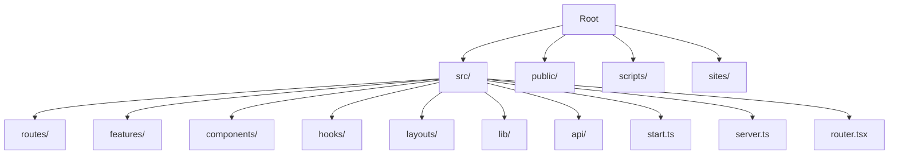
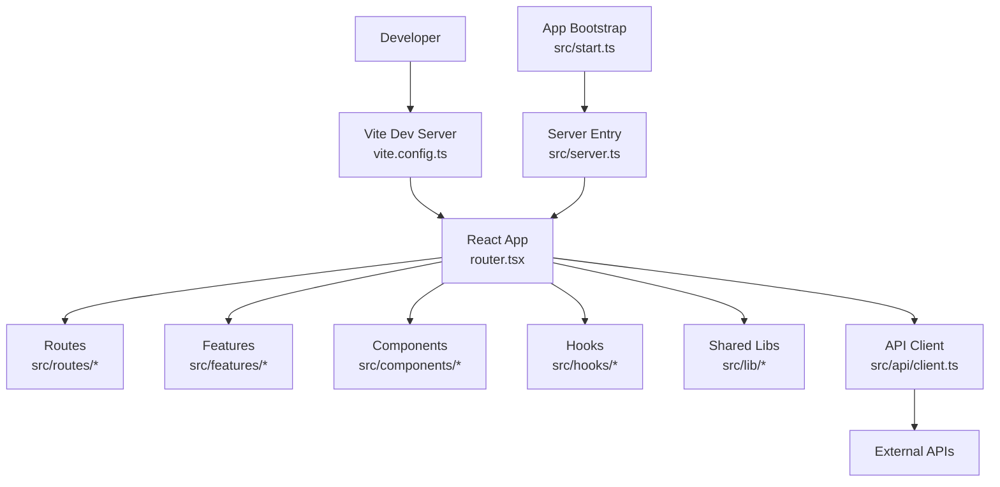
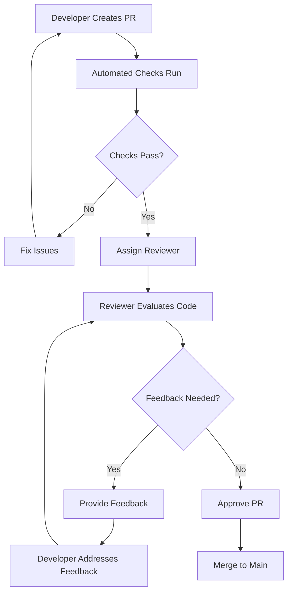
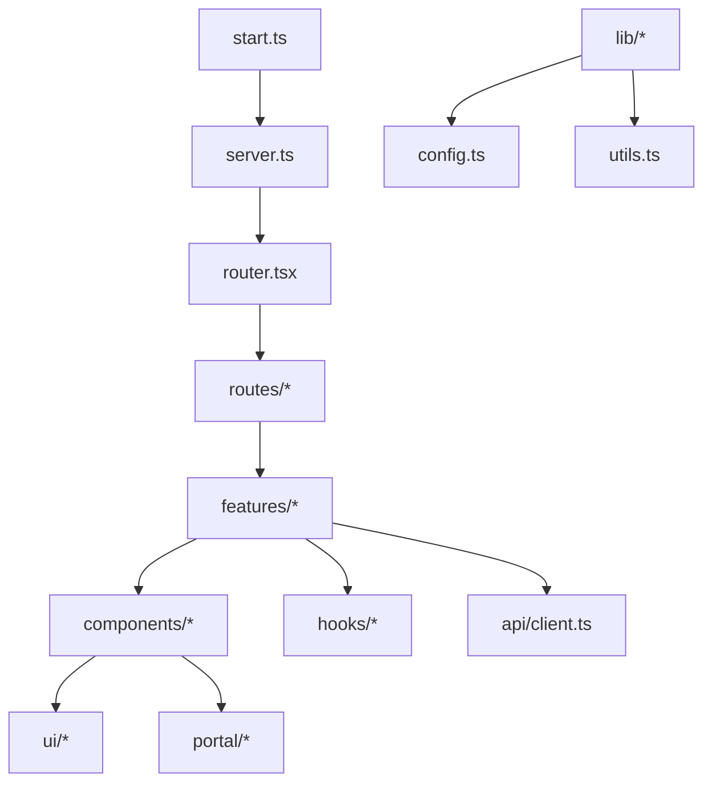

# Development Guide

<cite>
**Referenced Files in This Document**
- [package.json](file://package.json)
- [tsconfig.json](file://tsconfig.json)
- [eslint.config.js](file://eslint.config.js)
- [.prettierrc](file://.prettierrc)
- [vite.config.ts](file://vite.config.ts)
- [vite.sites.config.ts](file://vite.sites.config.ts)
- [bunfig.toml](file://bunfig.toml)
- [src/start.ts](file://src/start.ts)
- [src/server.ts](file://src/server.ts)
- [src/router.tsx](file://src/router.tsx)
- [src/routes/__root.tsx](file://src/routes/__root.tsx)
- [src/lib/config.ts](file://src/lib/config.ts)
- [src/api/client.ts](file://src/api/client.ts)
- [scripts/prepare-sites-build.mjs](file://scripts/prepare-sites-build.mjs)
- [sites/worker.js](file://sites/worker.js)
- [REVIEW.md](file://REVIEW.md)
</cite>

## Update Summary
**Changes Made**
- Added comprehensive Code Review Guidelines section covering formal review procedures, quality standards, and contribution workflows
- Updated Contribution Process section to include the new review requirements
- Enhanced Quality Standards section with review-based quality gates
- Added review workflow diagrams and checklists

## Table of Contents
1. [Introduction](#introduction)
2. [Project Structure](#project-structure)
3. [Core Components](#core-components)
4. [Architecture Overview](#architecture-overview)
5. [Detailed Component Analysis](#detailed-component-analysis)
6. [Code Review Guidelines](#code-review-guidelines)
7. [Contribution Process](#contribution-process)
8. [Dependency Analysis](#dependency-analysis)
9. [Performance Considerations](#performance-considerations)
10. [Troubleshooting Guide](#troubleshooting-guide)
11. [Conclusion](#conclusion)
12. [Appendices](#appendices)

## Introduction
This development guide explains how to contribute to TrackDub Portal effectively. It covers the development workflow, coding standards enforced by ESLint and Prettier, TypeScript configuration, build processes, testing guidelines, debugging techniques, performance profiling, deployment procedures, project structure conventions, naming patterns, code organization principles, development tools setup, hot reloading configuration, and debugging strategies for both frontend and API layers. The guide also includes comprehensive code review guidelines and formal contribution procedures established through the project's review process.

## Project Structure
TrackDub Portal is a Vite-based application with React Router-based routing, TypeScript, and Bun runtime support. The key directories are:
- src/: Application source code including routes, features, components, hooks, layouts, and shared libraries
- public/: Static assets served at runtime
- scripts/: Build and utility scripts
- sites/: Site-specific runtime worker
- Configuration files at root level define tooling and build behavior



**Section sources**
- [package.json](file://package.json)
- [vite.config.ts](file://vite.config.ts)
- [vite.sites.config.ts](file://vite.sites.config.ts)

## Core Components
Key entry points and runtime configuration:
- Application bootstrap and server initialization
- Routing configuration
- Environment and feature configuration
- API client setup

**Section sources**
- [src/start.ts](file://src/start.ts)
- [src/server.ts](file://src/server.ts)
- [src/router.tsx](file://src/router.tsx)
- [src/lib/config.ts](file://src/lib/config.ts)
- [src/api/client.ts](file://src/api/client.ts)

## Architecture Overview
The portal uses a modern web stack with Vite for building and dev server, React Router for navigation, and an optional server entry for SSR or API endpoints. The API layer is abstracted via a typed client.



**Diagram sources**
- [vite.config.ts](file://vite.config.ts)
- [src/router.tsx](file://src/router.tsx)
- [src/server.ts](file://src/server.ts)
- [src/start.ts](file://src/start.ts)
- [src/api/client.ts](file://src/api/client.ts)

## Detailed Component Analysis

### Development Workflow
- Install dependencies using the package manager defined in the project
- Start the development server with hot reloading enabled
- Run linting and formatting checks before committing changes
- Build production artifacts when ready for deployment

Recommended commands (refer to package scripts):
- Install dependencies
- Start dev server
- Lint code
- Format code
- Build production bundle

Hot reloading is configured through the Vite dev server. Ensure your editor integrates with ESLint and Prettier for real-time feedback.

**Section sources**
- [package.json](file://package.json)
- [vite.config.ts](file://vite.config.ts)

### Coding Standards: ESLint and Prettier
ESLint enforces consistent code quality rules, while Prettier ensures uniform formatting across the codebase.

- ESLint configuration defines parser, plugins, and rule sets
- Prettier configuration standardizes indentation, quotes, semicolons, and line lengths
- Pre-commit hooks can be used to enforce checks automatically

Guidelines:
- Always run linter and formatter before committing
- Resolve all ESLint warnings and errors
- Keep imports organized and avoid unused variables
- Follow consistent naming patterns (camelCase for functions/variables, PascalCase for components/types)

**Section sources**
- [eslint.config.js](file://eslint.config.js)
- [.prettierrc](file://.prettierrc)

### TypeScript Configuration
TypeScript provides type safety and better developer experience.

- tsconfig.json defines compiler options, module resolution, and path aliases
- Strict mode is recommended for catching potential issues early
- Path aliases simplify imports and improve readability

Best practices:
- Use strict null checks
- Define explicit types for function parameters and return values
- Leverage generics where appropriate
- Avoid any type unless absolutely necessary

**Section sources**
- [tsconfig.json](file://tsconfig.json)

### Build Processes
The project uses Vite for fast builds and development.

- Development build includes hot module replacement and optimized logging
- Production build minifies, bundles, and optimizes assets
- Custom scripts may prepare site-specific configurations

Build steps:
- Configure Vite for development and production modes
- Optimize dependencies and external libraries
- Generate static assets and service workers if needed

**Section sources**
- [vite.config.ts](file://vite.config.ts)
- [vite.sites.config.ts](file://vite.sites.config.ts)
- [scripts/prepare-sites-build.mjs](file://scripts/prepare-sites-build.mjs)

### Testing Guidelines
While specific test frameworks aren't visible in the provided structure, follow these general practices:

- Write unit tests for utility functions and hooks
- Create integration tests for API interactions
- Use component testing for UI elements
- Mock external dependencies and API calls
- Maintain high test coverage for critical paths

Testing recommendations:
- Use Jest or Vitest for unit testing
- Implement React Testing Library for component tests
- Set up end-to-end tests with Playwright or Cypress
- Automate test execution in CI/CD pipeline

[No sources needed since this section provides general guidance]

### Debugging Techniques
Effective debugging strategies for both frontend and backend:

Frontend debugging:
- Use browser developer tools for JavaScript debugging
- Enable source maps for better error tracking
- Log important state changes and API responses
- Use React DevTools for component inspection

Backend debugging:
- Enable detailed logging in development mode
- Use structured logging for API requests and responses
- Monitor error rates and performance metrics
- Implement health check endpoints

**Section sources**
- [src/server.ts](file://src/server.ts)
- [src/lib/error-capture.ts](file://src/lib/error-capture.ts)

### Performance Profiling
Optimize application performance through systematic profiling:

- Use browser performance profiler to identify bottlenecks
- Monitor bundle size and lazy load heavy components
- Profile API response times and database queries
- Implement caching strategies for frequently accessed data

Profiling tools:
- Chrome DevTools Performance tab
- React Profiler for component rendering
- Network panel for API call analysis
- Memory profiler for leak detection

[No sources needed since this section provides general guidance]

### Deployment Procedures
Deploy the application to production environments:

- Build optimized production artifacts
- Configure environment variables for different deployments
- Set up CI/CD pipelines for automated deployments
- Monitor application health and performance post-deployment

Deployment checklist:
- Run full test suite before deployment
- Verify build artifacts are generated correctly
- Configure proper environment variables
- Set up monitoring and alerting systems

**Section sources**
- [package.json](file://package.json)
- [vite.config.ts](file://vite.config.ts)

### Project Structure Conventions
Follow established patterns for code organization:

- Feature-based organization for business logic
- Shared components in dedicated directories
- Reusable hooks in separate modules
- Consistent file naming conventions
- Clear separation between UI and business logic

Naming patterns:
- Components: PascalCase with descriptive names
- Functions: camelCase for actions and operations
- Types: PascalCase with clear domain meaning
- Files: Match their primary export purpose

**Section sources**
- [src/features/](file://src/features/)
- [src/components/](file://src/components/)
- [src/hooks/](file://src/hooks/)

### Development Tools Setup
Configure your development environment for optimal productivity:

- Install required Node.js version as specified in package.json
- Set up IDE extensions for TypeScript, ESLint, and Prettier
- Configure automatic formatting on save
- Enable live reload during development

Essential tools:
- VS Code with recommended extensions
- Git for version control
- Package manager (npm/yarn/pnpm)
- Docker for containerized development

**Section sources**
- [package.json](file://package.json)
- [bunfig.toml](file://bunfig.toml)

### Hot Reloading Configuration
Vite provides excellent hot module replacement capabilities:

- Configure HMR for React components and styles
- Set up proxy for API requests during development
- Optimize dependency pre-bundling
- Customize reload behavior for different file types

Development server features:
- Fast refresh for component updates
- CSS hot reloading without page refresh
- API proxy configuration for local development
- Environment variable hot reloading

**Section sources**
- [vite.config.ts](file://vite.config.ts)

### Debugging Strategies for Frontend and API Layers
Comprehensive debugging approach for full-stack development:

Frontend debugging:
- Use React DevTools for component tree inspection
- Monitor network requests and responses
- Debug state management and data flow
- Profile component rendering performance

API layer debugging:
- Log request/response cycles
- Validate input/output schemas
- Handle and log errors appropriately
- Monitor performance metrics

**Section sources**
- [src/api/client.ts](file://src/api/client.ts)
- [src/server.ts](file://src/server.ts)

## Code Review Guidelines

### Review Process Overview
All code changes must undergo a formal review process to ensure code quality, maintainability, and adherence to project standards. The review process is designed to catch issues early, share knowledge across the team, and maintain consistent code quality.

### Review Requirements
Every pull request must meet the following requirements before merging:

- **Automated Checks**: All CI/CD checks must pass including linting, formatting, and tests
- **Minimum Reviews**: At least one approved review from a qualified reviewer
- **Documentation Updates**: Related documentation must be updated if applicable
- **Test Coverage**: New features must include appropriate test coverage
- **Security Review**: Security-sensitive changes require additional security review

### Review Checklist
Reviewers should evaluate the following aspects:

#### Code Quality
- [ ] Code follows established patterns and conventions
- [ ] Variable and function names are descriptive and consistent
- [ ] Error handling is appropriate and comprehensive
- [ ] No hardcoded secrets or sensitive information
- [ ] Code is properly commented where necessary

#### Functionality
- [ ] Implementation meets the requirements
- [ ] Edge cases are handled appropriately
- [ ] Performance considerations are addressed
- [ ] Memory usage is optimized
- [ ] No breaking changes introduced

#### Testing
- [ ] Unit tests cover critical functionality
- [ ] Integration tests validate API interactions
- [ ] Test cases cover edge scenarios
- [ ] Tests are maintainable and readable

#### Documentation
- [ ] Code comments explain complex logic
- [ ] API documentation is updated
- [ ] README or relevant docs reflect changes
- [ ] Migration guides included for breaking changes

### Review Workflow


**Diagram sources**
- [REVIEW.md](file://REVIEW.md)

### Reviewer Responsibilities
Reviewers are responsible for:

- Providing constructive and timely feedback
- Ensuring code quality standards are met
- Identifying potential security vulnerabilities
- Suggesting improvements and best practices
- Validating test coverage and quality
- Checking for performance implications

### Author Responsibilities
Authors must:

- Respond to review feedback promptly
- Address all requested changes
- Provide clear explanations for design decisions
- Update documentation as needed
- Ensure tests pass before requesting review

**Section sources**
- [REVIEW.md](file://REVIEW.md)

## Contribution Process

### Getting Started
1. Fork the repository and create a feature branch
2. Make your changes following the coding standards
3. Add appropriate tests for new functionality
4. Update documentation as needed
5. Submit a pull request with a clear description

### Pull Request Guidelines
Pull requests should include:

- **Clear Title**: Descriptive title summarizing the change
- **Description**: Detailed explanation of what was changed and why
- **Testing Evidence**: Screenshots or logs showing the change works
- **Impact Assessment**: Description of potential impacts on existing functionality
- **Migration Notes**: Steps for users if breaking changes are introduced

### Review Timeline
- **Initial Review**: Within 24 hours for regular contributions
- **Urgent Fixes**: Priority review within 4 hours
- **Complex Changes**: Additional time may be needed for architectural changes

### Merging Criteria
Pull requests can be merged when:

- All automated checks pass
- Required reviews are completed and approved
- Documentation is updated
- Tests are passing with adequate coverage
- No outstanding conflicts exist

### Post-Merge Responsibilities
After merging:

- Monitor for any immediate issues
- Update release notes if applicable
- Communicate changes to stakeholders
- Plan follow-up tasks if needed

**Section sources**
- [REVIEW.md](file://REVIEW.md)

## Dependency Analysis
Understanding the relationship between core modules helps maintain code quality and prevent circular dependencies.



**Diagram sources**
- [src/start.ts](file://src/start.ts)
- [src/server.ts](file://src/server.ts)
- [src/router.tsx](file://src/router.tsx)
- [src/api/client.ts](file://src/api/client.ts)
- [src/lib/config.ts](file://src/lib/config.ts)

**Section sources**
- [src/start.ts](file://src/start.ts)
- [src/server.ts](file://src/server.ts)
- [src/router.tsx](file://src/router.tsx)
- [src/api/client.ts](file://src/api/client.ts)

## Performance Considerations
Optimize application performance through strategic implementation:

- Implement code splitting and lazy loading
- Optimize images and static assets
- Use efficient data fetching patterns
- Cache API responses appropriately
- Monitor memory usage and prevent leaks

Performance best practices:
- Bundle analysis to identify large dependencies
- Implement virtual scrolling for large lists
- Use Web Workers for heavy computations
- Optimize database queries and API calls

[No sources needed since this section provides general guidance]

## Troubleshooting Guide
Common issues and their solutions:

Development issues:
- Port conflicts: Change development server port
- Module resolution errors: Check TypeScript configuration
- Hot reload problems: Clear cache and restart server
- Build failures: Verify dependencies and configurations

Runtime issues:
- API connection errors: Check environment variables
- Authentication problems: Verify token handling
- Performance degradation: Profile and optimize bottlenecks
- Memory leaks: Use memory profiler to identify issues

Debugging utilities:
- Enable verbose logging in development
- Use error boundary components for graceful error handling
- Implement health check endpoints
- Set up comprehensive error tracking

**Section sources**
- [src/lib/error-capture.ts](file://src/lib/error-capture.ts)
- [src/lib/error-page.ts](file://src/lib/error-page.ts)

## Conclusion
This development guide provides comprehensive information for contributing to TrackDub Portal. By following the established workflows, coding standards, and best practices outlined here, developers can maintain code quality, ensure consistent development experience, and deliver reliable features efficiently. The addition of formal code review guidelines ensures that all contributions meet the project's quality standards and maintain consistency across the codebase.

Key takeaways:
- Follow established project structure and naming conventions
- Use ESLint and Prettier for code quality and consistency
- Leverage TypeScript for type safety and better developer experience
- Implement comprehensive testing strategies
- Monitor performance and optimize continuously
- Use proper debugging techniques for efficient problem resolution
- Participate actively in the code review process to maintain quality

## Appendices

### Quick Start Commands
Essential commands for daily development:

- Install dependencies: `bun install`
- Start development server: `bun dev`
- Run linter: `bun lint`
- Format code: `bun format`
- Build production: `bun build`
- Run tests: `bun test`

### Environment Variables
Required environment variables for different deployment targets:

- Development: Local API endpoints and debug settings
- Staging: Test environment configurations
- Production: Secure API keys and optimized settings

### File Organization Reference
Standard directory structure for new features:

- Feature folder in src/features/
- Components in src/components/
- Hooks in src/hooks/
- API hooks in src/api/hooks/
- Styles in src/styles.css or component-specific files

### Code Review Templates
Use these templates for consistent reviews:

#### Pull Request Template
```markdown
## Description
<!-- What does this PR do? -->

## Type of Change
- [ ] Bug fix
- [ ] New feature
- [ ] Breaking change
- [ ] Documentation update

## Testing
<!-- How did you test this change? -->

## Impact
<!-- What areas might this affect? -->
```

#### Review Checklist Template
```markdown
## Code Quality
- [ ] Follows coding standards
- [ ] Proper error handling
- [ ] No security vulnerabilities

## Functionality
- [ ] Meets requirements
- [ ] Handles edge cases
- [ ] Performance considerations

## Testing
- [ ] Adequate test coverage
- [ ] Tests are meaningful
- [ ] Edge cases covered

## Documentation
- [ ] Code is well-commented
- [ ] API docs updated
- [ ] README reflects changes
```

**Section sources**
- [package.json](file://package.json)
- [bunfig.toml](file://bunfig.toml)
- [REVIEW.md](file://REVIEW.md)