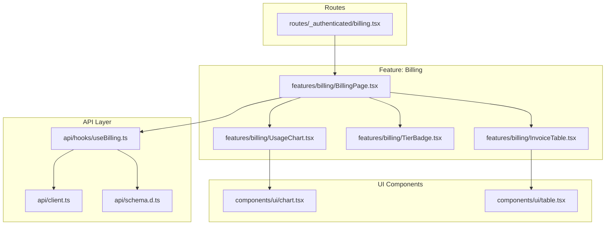
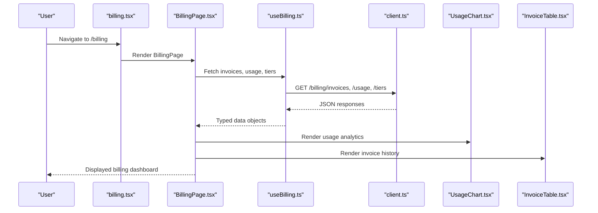
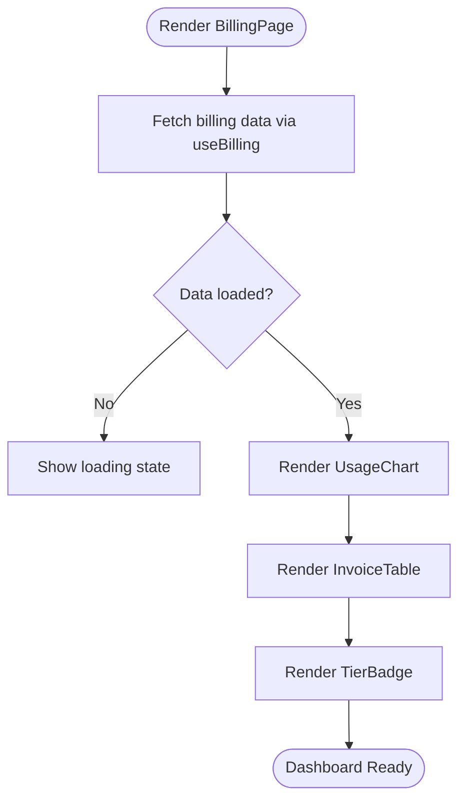
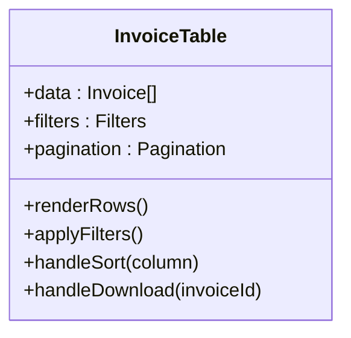
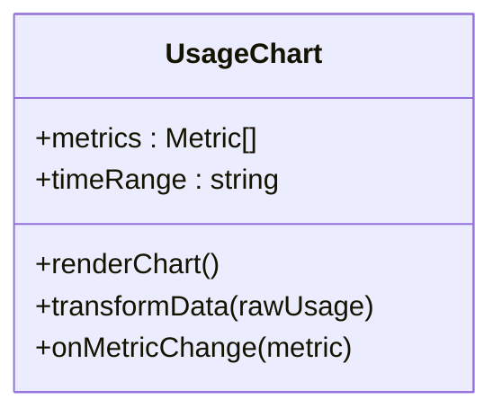
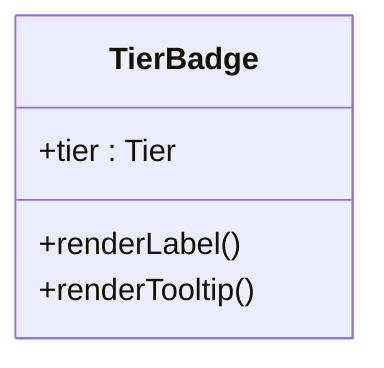
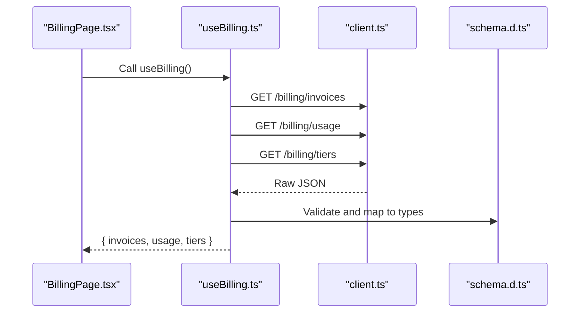
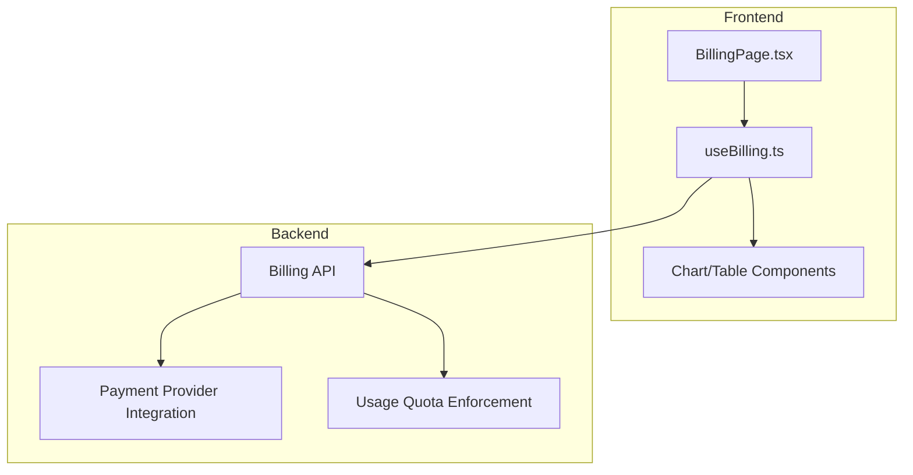
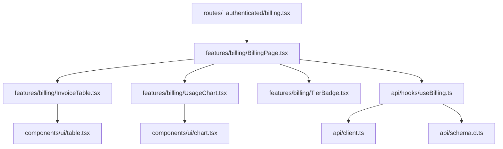

# Billing & Subscription Module

<cite>
**Referenced Files in This Document**
- [BillingPage.tsx](file://src/features/billing/BillingPage.tsx)
- [InvoiceTable.tsx](file://src/features/billing/InvoiceTable.tsx)
- [TierBadge.tsx](file://src/features/billing/TierBadge.tsx)
- [UsageChart.tsx](file://src/features/billing/UsageChart.tsx)
- [useBilling.ts](file://src/api/hooks/useBilling.ts)
- [client.ts](file://src/api/client.ts)
- [schema.d.ts](file://src/api/schema.d.ts)
- [billing.tsx](file://src/routes/_authenticated/billing.tsx)
- [AppLayout.tsx](file://src/layouts/AppLayout.tsx)
- [Sidebar.tsx](file://src/layouts/Sidebar.tsx)
- [chart.tsx](file://src/components/ui/chart.tsx)
- [table.tsx](file://src/components/ui/table.tsx)
</cite>

## Table of Contents
1. [Introduction](#introduction)
2. [Project Structure](#project-structure)
3. [Core Components](#core-components)
4. [Architecture Overview](#architecture-overview)
5. [Detailed Component Analysis](#detailed-component-analysis)
6. [Dependency Analysis](#dependency-analysis)
7. [Performance Considerations](#performance-considerations)
8. [Troubleshooting Guide](#troubleshooting-guide)
9. [Conclusion](#conclusion)

## Introduction
This document provides comprehensive documentation for the Billing & Subscription module. It covers subscription tier management, invoice viewing and history, usage tracking and visualization, and billing tier indicators. It also explains integration with payment providers, subscription lifecycle management, usage quota enforcement, and how billing data is presented to users. Special attention is given to chart rendering for usage analytics, table components for invoice management, and tier-based feature access control.

## Project Structure
The Billing & Subscription module is implemented as a set of React features and API hooks that integrate with the application’s routing and layout system. The key files include:
- Feature components for billing pages, invoices, usage charts, and tier badges
- API hooks for fetching billing data
- Route definitions for authenticated billing access
- Shared UI components for charts and tables

**Diagram sources**
- [billing.tsx](file://src/routes/_authenticated/billing.tsx)
- [BillingPage.tsx](file://src/features/billing/BillingPage.tsx)
- [InvoiceTable.tsx](file://src/features/billing/InvoiceTable.tsx)
- [TierBadge.tsx](file://src/features/billing/TierBadge.tsx)
- [UsageChart.tsx](file://src/features/billing/UsageChart.tsx)
- [useBilling.ts](file://src/api/hooks/useBilling.ts)
- [client.ts](file://src/api/client.ts)
- [schema.d.ts](file://src/api/schema.d.ts)
- [chart.tsx](file://src/components/ui/chart.tsx)
- [table.tsx](file://src/components/ui/table.tsx)

**Section sources**
- [billing.tsx](file://src/routes/_authenticated/billing.tsx)
- [BillingPage.tsx](file://src/features/billing/BillingPage.tsx)
- [InvoiceTable.tsx](file://src/features/billing/InvoiceTable.tsx)
- [TierBadge.tsx](file://src/features/billing/TierBadge.tsx)
- [UsageChart.tsx](file://src/features/billing/UsageChart.tsx)
- [useBilling.ts](file://src/api/hooks/useBilling.ts)
- [client.ts](file://src/api/client.ts)
- [schema.d.ts](file://src/api/schema.d.ts)
- [chart.tsx](file://src/components/ui/chart.tsx)
- [table.tsx](file://src/components/ui/table.tsx)

## Core Components
- BillingPage: Orchestrates the billing dashboard, aggregates usage and invoice data, and renders charts and tables.
- InvoiceTable: Displays invoice history with pagination and filtering capabilities.
- UsageChart: Renders usage analytics over time using chart components.
- TierBadge: Visual indicator for current subscription tier and associated benefits.
- useBilling: Data hook for fetching billing-related endpoints (invoices, usage, tiers).
- client: HTTP client configuration for API calls.
- schema: TypeScript types for billing data structures.

Key responsibilities:
- Fetching and caching billing data via useBilling
- Rendering usage trends and totals through UsageChart
- Presenting invoice history and details via InvoiceTable
- Indicating subscription tier status with TierBadge

**Section sources**
- [BillingPage.tsx](file://src/features/billing/BillingPage.tsx)
- [InvoiceTable.tsx](file://src/features/billing/InvoiceTable.tsx)
- [UsageChart.tsx](file://src/features/billing/UsageChart.tsx)
- [TierBadge.tsx](file://src/features/billing/TierBadge.tsx)
- [useBilling.ts](file://src/api/hooks/useBilling.ts)
- [client.ts](file://src/api/client.ts)
- [schema.d.ts](file://src/api/schema.d.ts)

## Architecture Overview
The Billing & Subscription module follows a layered architecture:
- Routes define authenticated access to the billing page
- Feature components encapsulate UI logic and state
- API hooks abstract network requests and data shaping
- UI components provide reusable chart and table primitives

**Diagram sources**
- [billing.tsx](file://src/routes/_authenticated/billing.tsx)
- [BillingPage.tsx](file://src/features/billing/BillingPage.tsx)
- [useBilling.ts](file://src/api/hooks/useBilling.ts)
- [client.ts](file://src/api/client.ts)
- [UsageChart.tsx](file://src/features/billing/UsageChart.tsx)
- [InvoiceTable.tsx](file://src/features/billing/InvoiceTable.tsx)

## Detailed Component Analysis

### BillingPage
BillingPage serves as the main entry point for the billing dashboard. It coordinates data fetching, manages local state for filters and pagination, and composes child components for usage charts and invoice tables. It integrates with useBilling to retrieve structured billing data and passes it down to child components for rendering.

Responsibilities:
- Aggregate usage metrics and invoice lists
- Manage query parameters for filtering and pagination
- Compose UI sections for usage analytics and invoice history
- Handle loading and error states consistently

**Diagram sources**
- [BillingPage.tsx](file://src/features/billing/BillingPage.tsx)
- [useBilling.ts](file://src/api/hooks/useBilling.ts)

**Section sources**
- [BillingPage.tsx](file://src/features/billing/BillingPage.tsx)
- [useBilling.ts](file://src/api/hooks/useBilling.ts)

### InvoiceTable
InvoiceTable presents a paginated list of invoices with columns such as date, amount, status, and download links. It supports sorting, filtering by status or date range, and row actions like viewing details or downloading PDFs.

Key behaviors:
- Pagination controls for large datasets
- Filtering by invoice status and date
- Sorting by columns like date and amount
- Row actions for invoice details and downloads

**Diagram sources**
- [InvoiceTable.tsx](file://src/features/billing/InvoiceTable.tsx)
- [table.tsx](file://src/components/ui/table.tsx)

**Section sources**
- [InvoiceTable.tsx](file://src/features/billing/InvoiceTable.tsx)
- [table.tsx](file://src/components/ui/table.tsx)

### UsageChart
UsageChart visualizes usage metrics over time, supporting line, bar, or area charts depending on the selected metric. It consumes usage data from useBilling and maps it to chart-friendly formats.

Features:
- Time-series aggregation for daily/weekly/monthly views
- Metric selection (e.g., API calls, storage, compute hours)
- Responsive chart rendering with tooltips and legends
- Integration with chart component primitives

**Diagram sources**
- [UsageChart.tsx](file://src/features/billing/UsageChart.tsx)
- [chart.tsx](file://src/components/ui/chart.tsx)

**Section sources**
- [UsageChart.tsx](file://src/features/billing/UsageChart.tsx)
- [chart.tsx](file://src/components/ui/chart.tsx)

### TierBadge
TierBadge displays the current subscription tier and highlights available features based on the user’s plan. It can show tier-specific colors, icons, and labels.

Capabilities:
- Dynamic label rendering based on tier type
- Visual differentiation for free, pro, and enterprise tiers
- Tooltip descriptions of included features

**Diagram sources**
- [TierBadge.tsx](file://src/features/billing/TierBadge.tsx)

**Section sources**
- [TierBadge.tsx](file://src/features/billing/TierBadge.tsx)

### useBilling Hook
useBilling centralizes API interactions for billing data, including invoices, usage metrics, and subscription tiers. It handles request lifecycle, caching, and error propagation.

Responsibilities:
- Fetching invoices, usage, and tier information
- Normalizing response data into typed structures
- Managing loading and error states for consumers
- Providing memoized results for performance

**Diagram sources**
- [useBilling.ts](file://src/api/hooks/useBilling.ts)
- [client.ts](file://src/api/client.ts)
- [schema.d.ts](file://src/api/schema.d.ts)

**Section sources**
- [useBilling.ts](file://src/api/hooks/useBilling.ts)
- [client.ts](file://src/api/client.ts)
- [schema.d.ts](file://src/api/schema.d.ts)

### Conceptual Overview
The Billing & Subscription module integrates with external payment providers through backend APIs exposed via client.ts. Subscription lifecycle events (creation, renewal, cancellation) are managed server-side; the frontend reflects these states through tier indicators and invoice statuses. Usage quotas are enforced by the backend and surfaced to the UI via usage metrics and tier badges.

[No sources needed since this diagram shows conceptual workflow, not actual code structure]

## Dependency Analysis
The module exhibits clear separation between routes, features, API layer, and UI components. Dependencies flow downward from routes to features, then to API hooks and shared UI primitives.

**Diagram sources**
- [billing.tsx](file://src/routes/_authenticated/billing.tsx)
- [BillingPage.tsx](file://src/features/billing/BillingPage.tsx)
- [InvoiceTable.tsx](file://src/features/billing/InvoiceTable.tsx)
- [UsageChart.tsx](file://src/features/billing/UsageChart.tsx)
- [TierBadge.tsx](file://src/features/billing/TierBadge.tsx)
- [useBilling.ts](file://src/api/hooks/useBilling.ts)
- [client.ts](file://src/api/client.ts)
- [schema.d.ts](file://src/api/schema.d.ts)
- [chart.tsx](file://src/components/ui/chart.tsx)
- [table.tsx](file://src/components/ui/table.tsx)

**Section sources**
- [billing.tsx](file://src/routes/_authenticated/billing.tsx)
- [BillingPage.tsx](file://src/features/billing/BillingPage.tsx)
- [InvoiceTable.tsx](file://src/features/billing/InvoiceTable.tsx)
- [UsageChart.tsx](file://src/features/billing/UsageChart.tsx)
- [TierBadge.tsx](file://src/features/billing/TierBadge.tsx)
- [useBilling.ts](file://src/api/hooks/useBilling.ts)
- [client.ts](file://src/api/client.ts)
- [schema.d.ts](file://src/api/schema.d.ts)
- [chart.tsx](file://src/components/ui/chart.tsx)
- [table.tsx](file://src/components/ui/table.tsx)

## Performance Considerations
- Memoization: UseMemo and useCallback in BillingPage and hooks to prevent unnecessary re-renders when props or data do not change.
- Pagination: Implement server-side pagination for invoices to reduce payload size and improve initial load times.
- Chart Optimization: Debounce metric changes and aggregate usage data on the backend to minimize client-side computation.
- Caching: Leverage client-level caching in useBilling to avoid redundant API calls during navigation.
- Lazy Loading: Consider lazy-loading heavy chart libraries if not already bundled efficiently.

[No sources needed since this section provides general guidance]

## Troubleshooting Guide
Common issues and resolutions:
- Empty invoice list: Verify API connectivity and ensure billing endpoints return valid data; check useBilling error handling.
- Chart not rendering: Confirm usage data shape matches expected format; validate chart component props and data transformation.
- Tier badge incorrect: Ensure tier metadata is up-to-date and correctly mapped from backend responses.
- Pagination errors: Inspect pagination parameters and backend response structure; verify offset and limit calculations.

**Section sources**
- [useBilling.ts](file://src/api/hooks/useBilling.ts)
- [InvoiceTable.tsx](file://src/features/billing/InvoiceTable.tsx)
- [UsageChart.tsx](file://src/features/billing/UsageChart.tsx)
- [TierBadge.tsx](file://src/features/billing/TierBadge.tsx)

## Conclusion
The Billing & Subscription module provides a robust foundation for managing subscriptions, invoices, and usage analytics within the application. Its modular design separates concerns across routes, features, API hooks, and UI components, enabling scalability and maintainability. By leveraging chart and table primitives, the module delivers an intuitive user experience for monitoring billing and subscription status. Future enhancements may include advanced filtering, export capabilities, and deeper integration with payment provider dashboards.