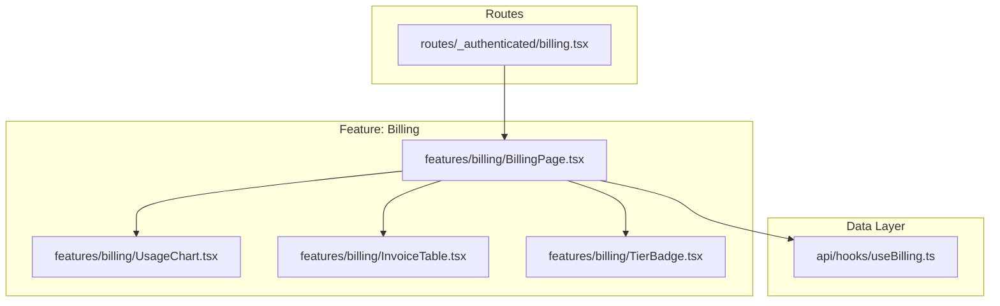
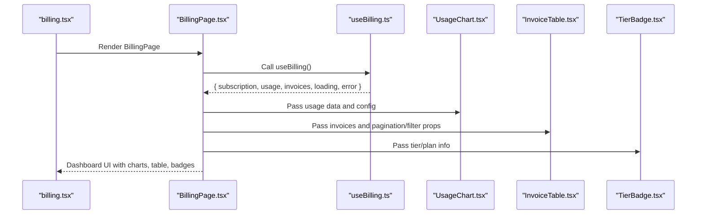
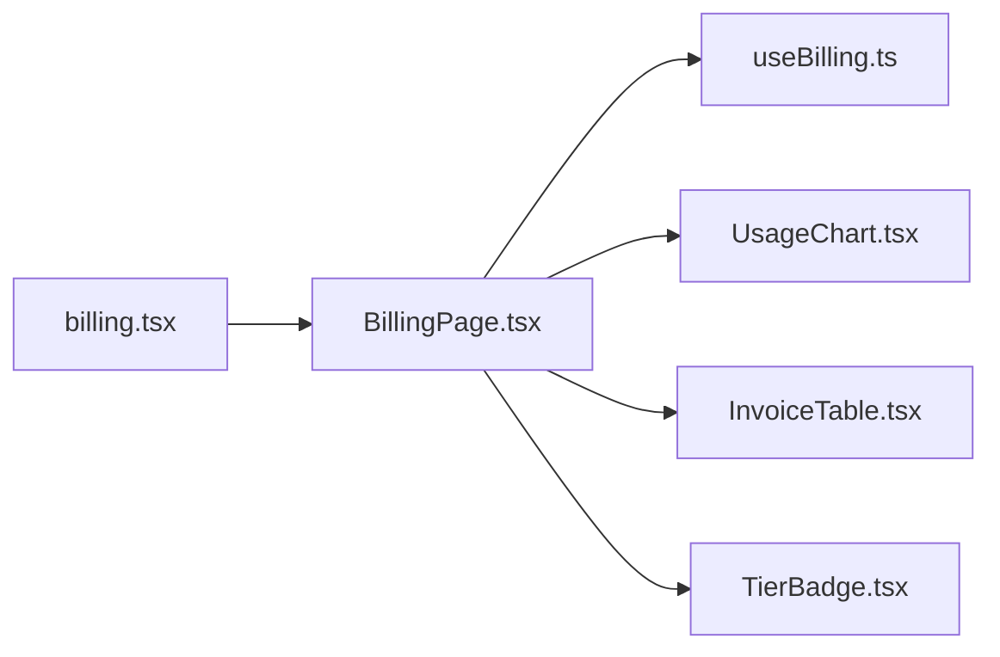

# Billing Page Component

<cite>
**Referenced Files in This Document**
- [BillingPage.tsx](file://src/features/billing/BillingPage.tsx)
- [InvoiceTable.tsx](file://src/features/billing/InvoiceTable.tsx)
- [TierBadge.tsx](file://src/features/billing/TierBadge.tsx)
- [UsageChart.tsx](file://src/features/billing/UsageChart.tsx)
- [useBilling.ts](file://src/api/hooks/useBilling.ts)
- [billing.tsx](file://src/routes/_authenticated/billing.tsx)
</cite>

## Table of Contents
1. [Introduction](#introduction)
2. [Project Structure](#project-structure)
3. [Core Components](#core-components)
4. [Architecture Overview](#architecture-overview)
5. [Detailed Component Analysis](#detailed-component-analysis)
6. [Dependency Analysis](#dependency-analysis)
7. [Performance Considerations](#performance-considerations)
8. [Troubleshooting Guide](#troubleshooting-guide)
9. [Conclusion](#conclusion)

## Introduction
This document provides comprehensive documentation for the BillingPage component, which serves as the main billing dashboard within the application. It explains how the page orchestrates subscription overview, usage visualization, and invoice listing while integrating with the billing data hooks. The guide covers layout structure, data fetching patterns, error handling, user interactions, and how it composes other billing components such as UsageChart, InvoiceTable, and TierBadge.

## Project Structure
The billing feature is organized under a dedicated feature directory and integrates into the authenticated routes. The key files involved are:
- Feature components: BillingPage, InvoiceTable, TierBadge, UsageChart
- Data layer hook: useBilling
- Route integration: _authenticated/billing route that renders BillingPage

**Diagram sources**
- [billing.tsx](file://src/routes/_authenticated/billing.tsx)
- [BillingPage.tsx](file://src/features/billing/BillingPage.tsx)
- [UsageChart.tsx](file://src/features/billing/UsageChart.tsx)
- [InvoiceTable.tsx](file://src/features/billing/InvoiceTable.tsx)
- [TierBadge.tsx](file://src/features/billing/TierBadge.tsx)
- [useBilling.ts](file://src/api/hooks/useBilling.ts)

**Section sources**
- [billing.tsx](file://src/routes/_authenticated/billing.tsx)
- [BillingPage.tsx](file://src/features/billing/BillingPage.tsx)

## Core Components
- BillingPage: Orchestrates the billing dashboard by composing UI sections (subscription overview, usage chart, invoices), managing local state for filters or pagination, and consuming the useBilling hook to fetch and display data.
- UsageChart: Visualizes consumption metrics over time; receives data from the billing hook and exposes minimal configuration props for rendering.
- InvoiceTable: Displays paginated or filtered invoice records; interacts with table controls and may trigger actions like downloading invoices.
- TierBadge: Renders a compact badge representing the current subscription tier; typically derives its appearance from the plan/tier value provided by the billing data.

Key responsibilities:
- Data orchestration via useBilling
- Layout composition of billing sections
- Error and loading states presentation
- User interactions (filters, pagination, actions)

**Section sources**
- [BillingPage.tsx](file://src/features/billing/BillingPage.tsx)
- [UsageChart.tsx](file://src/features/billing/UsageChart.tsx)
- [InvoiceTable.tsx](file://src/features/billing/InvoiceTable.tsx)
- [TierBadge.tsx](file://src/features/billing/TierBadge.tsx)

## Architecture Overview
BillingPage acts as the central controller for the billing dashboard. It consumes the useBilling hook to retrieve subscription and usage data, then passes derived values to child components. The route file mounts BillingPage within the authenticated context.

**Diagram sources**
- [billing.tsx](file://src/routes/_authenticated/billing.tsx)
- [BillingPage.tsx](file://src/features/billing/BillingPage.tsx)
- [useBilling.ts](file://src/api/hooks/useBilling.ts)
- [UsageChart.tsx](file://src/features/billing/UsageChart.tsx)
- [InvoiceTable.tsx](file://src/features/billing/InvoiceTable.tsx)
- [TierBadge.tsx](file://src/features/billing/TierBadge.tsx)

## Detailed Component Analysis

### BillingPage
Responsibilities:
- Compose the billing dashboard layout
- Fetch and manage billing data through useBilling
- Handle loading and error states
- Coordinate child components (UsageChart, InvoiceTable, TierBadge)
- Manage local state for filters, pagination, and user interactions

Data flow:
- useBilling returns subscription details, usage metrics, and invoice lists
- BillingPage maps these to props for child components
- Local state drives UI behaviors like filtering invoices or toggling chart ranges

Error handling:
- Display user-friendly messages when data fails to load
- Provide retry mechanisms or fallbacks where appropriate

User interactions:
- Filters for invoices (date range, status)
- Pagination controls
- Actions like viewing or downloading invoices

Props and state patterns:
- Props passed to child components are derived from hook results and local state
- State updates trigger re-renders and refetches if needed

**Section sources**
- [BillingPage.tsx](file://src/features/billing/BillingPage.tsx)
- [useBilling.ts](file://src/api/hooks/useBilling.ts)

### UsageChart
Responsibilities:
- Render usage metrics visually
- Accept data arrays and configuration options
- Respond to interactive features (tooltips, zoom, date selection)

Data integration:
- Receives usage data from BillingPage
- May expose callbacks for user selections that update parent state

**Section sources**
- [UsageChart.tsx](file://src/features/billing/UsageChart.tsx)

### InvoiceTable
Responsibilities:
- Display invoice records in a tabular format
- Support pagination, sorting, and filtering
- Enable actions like viewing details or downloading PDFs

Data integration:
- Receives invoice list and metadata (total count, page size)
- Emits events for filter changes and pagination updates

**Section sources**
- [InvoiceTable.tsx](file://src/features/billing/InvoiceTable.tsx)

### TierBadge
Responsibilities:
- Render a concise visual indicator of the current subscription tier
- Adapt styling based on tier value

Data integration:
- Receives tier/plan information from BillingPage

**Section sources**
- [TierBadge.tsx](file://src/features/billing/TierBadge.tsx)

### Route Integration
The authenticated billing route mounts BillingPage and ensures authentication context is available before rendering the dashboard.

**Section sources**
- [billing.tsx](file://src/routes/_authenticated/billing.tsx)

## Dependency Analysis
BillingPage depends on:
- useBilling hook for data access
- Child components for rendering specific sections
- Route context for authentication and navigation

**Diagram sources**
- [BillingPage.tsx](file://src/features/billing/BillingPage.tsx)
- [useBilling.ts](file://src/api/hooks/useBilling.ts)
- [UsageChart.tsx](file://src/features/billing/UsageChart.tsx)
- [InvoiceTable.tsx](file://src/features/billing/InvoiceTable.tsx)
- [TierBadge.tsx](file://src/features/billing/TierBadge.tsx)
- [billing.tsx](file://src/routes/_authenticated/billing.tsx)

**Section sources**
- [BillingPage.tsx](file://src/features/billing/BillingPage.tsx)
- [useBilling.ts](file://src/api/hooks/useBilling.ts)
- [billing.tsx](file://src/routes/_authenticated/billing.tsx)

## Performance Considerations
- Memoize expensive computations in BillingPage to avoid unnecessary re-renders
- Use pagination and virtualization in InvoiceTable for large datasets
- Debounce filter inputs to reduce frequent refetches
- Ensure UsageChart handles large datasets efficiently (e.g., sampling or aggregation)

[No sources needed since this section provides general guidance]

## Troubleshooting Guide
Common issues and resolutions:
- Data not loading: Verify useBilling hook returns expected fields and network requests succeed
- Empty charts: Confirm usage data shape matches expected format
- Invoice table empty: Check pagination parameters and API response structure
- Tier badge incorrect: Validate tier value mapping and ensure correct prop passing

Error handling strategies:
- Display clear error messages to users
- Provide retry buttons where applicable
- Log errors for debugging without exposing sensitive details

**Section sources**
- [BillingPage.tsx](file://src/features/billing/BillingPage.tsx)
- [useBilling.ts](file://src/api/hooks/useBilling.ts)

## Conclusion
BillingPage serves as the central hub for the billing dashboard, effectively orchestrating data retrieval, state management, and UI composition. By leveraging the useBilling hook and delegating rendering to specialized components, it maintains a clean separation of concerns while providing a cohesive user experience for subscription management, usage monitoring, and invoice handling.

[No sources needed since this section summarizes without analyzing specific files]