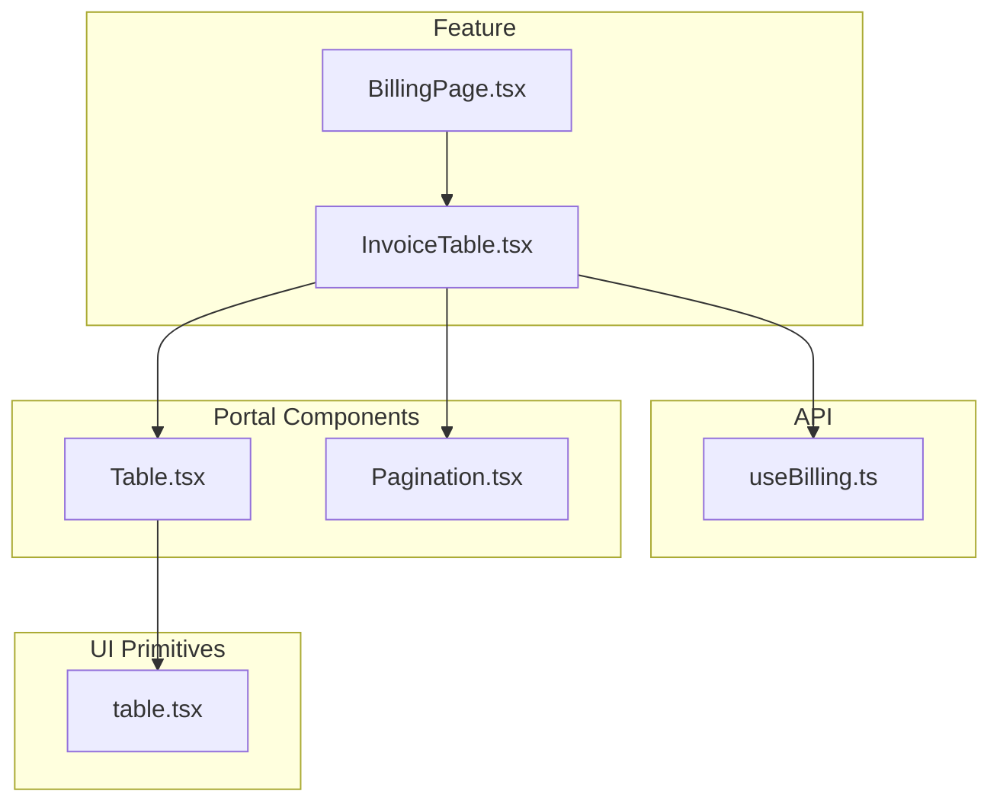
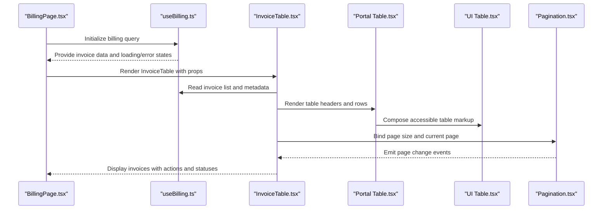
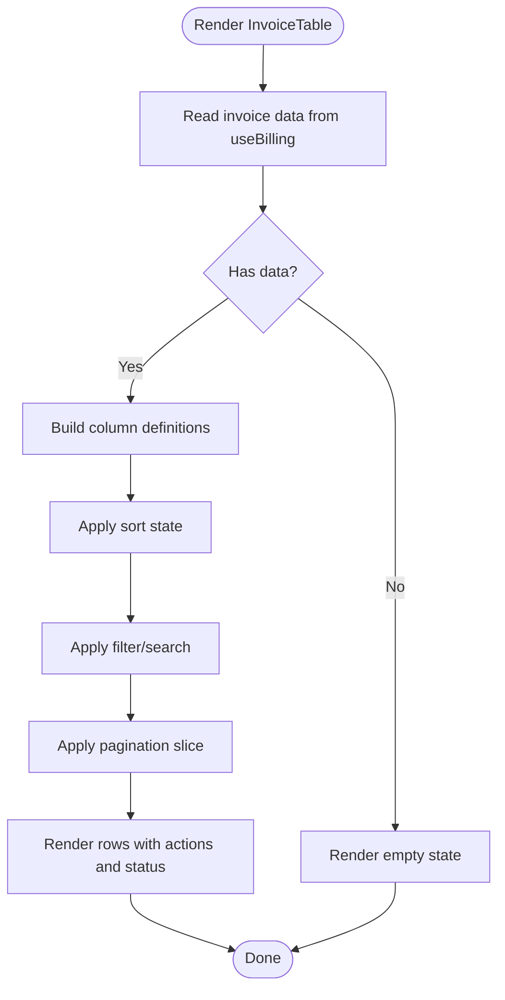
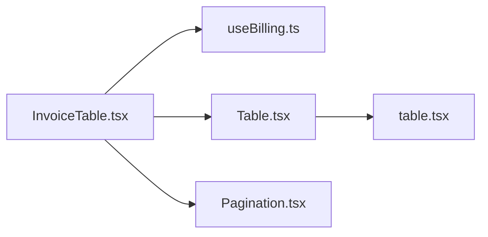

# Invoice Table Component

<cite>
**Referenced Files in This Document**
- [InvoiceTable.tsx](file://src/features/billing/InvoiceTable.tsx)
- [BillingPage.tsx](file://src/features/billing/BillingPage.tsx)
- [useBilling.ts](file://src/api/hooks/useBilling.ts)
- [Table.tsx](file://src/components/portal/Table.tsx)
- [Pagination.tsx](file://src/components/portal/Pagination.tsx)
- [table.tsx](file://src/components/ui/table.tsx)
- [billing.tsx](file://src/routes/_authenticated/billing.tsx)
</cite>

## Table of Contents
1. [Introduction](#introduction)
2. [Project Structure](#project-structure)
3. [Core Components](#core-components)
4. [Architecture Overview](#architecture-overview)
5. [Detailed Component Analysis](#detailed-component-analysis)
6. [Dependency Analysis](#dependency-analysis)
7. [Performance Considerations](#performance-considerations)
8. [Troubleshooting Guide](#troubleshooting-guide)
9. [Conclusion](#conclusion)
10. [Appendices](#appendices)

## Introduction
This document provides comprehensive documentation for the InvoiceTable component used to display billing invoices. It covers table structure, columns, sorting, filtering, pagination, data binding with billing API hooks, row actions (viewing and downloading invoices), status indicators, styling patterns, responsive behavior, accessibility features, and customization examples such as column configuration, empty states, and search functionality.

## Project Structure
The InvoiceTable component resides within the billing feature module and integrates with shared portal components and UI primitives. The relevant files include:
- Feature-level invoice table implementation
- Billing page that hosts the invoice table
- API hook for fetching billing data
- Shared portal table and pagination components
- UI table primitive for accessible markup

**Diagram sources**
- [InvoiceTable.tsx](file://src/features/billing/InvoiceTable.tsx)
- [BillingPage.tsx](file://src/features/billing/BillingPage.tsx)
- [useBilling.ts](file://src/api/hooks/useBilling.ts)
- [Table.tsx](file://src/components/portal/Table.tsx)
- [Pagination.tsx](file://src/components/portal/Pagination.tsx)
- [table.tsx](file://src/components/ui/table.tsx)

**Section sources**
- [InvoiceTable.tsx](file://src/features/billing/InvoiceTable.tsx)
- [BillingPage.tsx](file://src/features/billing/BillingPage.tsx)
- [useBilling.ts](file://src/api/hooks/useBilling.ts)
- [Table.tsx](file://src/components/portal/Table.tsx)
- [Pagination.tsx](file://src/components/portal/Pagination.tsx)
- [table.tsx](file://src/components/ui/table.tsx)

## Core Components
- InvoiceTable: Renders a sortable, filterable, paginated list of invoices with row actions and status indicators.
- useBilling: Provides data fetching and state management for billing-related queries, including invoice lists.
- Portal Table: Generic table wrapper providing layout, header/footer slots, and integration with UI primitives.
- Pagination: Handles page size selection and navigation controls.
- UI Table: Accessible HTML table elements and utilities.

Key responsibilities:
- Data binding between useBilling and the table view
- Column definitions and rendering logic
- Sorting and filtering interactions
- Pagination control and state synchronization
- Row actions for viewing and downloading invoices
- Status badges and visual indicators

**Section sources**
- [InvoiceTable.tsx](file://src/features/billing/InvoiceTable.tsx)
- [useBilling.ts](file://src/api/hooks/useBilling.ts)
- [Table.tsx](file://src/components/portal/Table.tsx)
- [Pagination.tsx](file://src/components/portal/Pagination.tsx)
- [table.tsx](file://src/components/ui/table.tsx)

## Architecture Overview
The InvoiceTable component composes data from useBilling and renders it via the portal Table and UI table primitives. Pagination is handled by a dedicated component, while row actions trigger side effects like opening a viewer or initiating downloads.

**Diagram sources**
- [BillingPage.tsx](file://src/features/billing/BillingPage.tsx)
- [useBilling.ts](file://src/api/hooks/useBilling.ts)
- [InvoiceTable.tsx](file://src/features/billing/InvoiceTable.tsx)
- [Table.tsx](file://src/components/portal/Table.tsx)
- [table.tsx](file://src/components/ui/table.tsx)
- [Pagination.tsx](file://src/components/portal/Pagination.tsx)

## Detailed Component Analysis

### InvoiceTable Component
Responsibilities:
- Displays a list of invoices with columns such as invoice ID, date, amount, status, and actions.
- Supports sorting by selectable columns.
- Supports filtering by text search across key fields.
- Integrates pagination for large datasets.
- Provides row actions: view invoice details and download PDF.
- Shows status indicators using badges.

Data binding:
- Uses useBilling to fetch and manage invoice data.
- Subscribes to loading and error states to render appropriate UI feedback.

Sorting:
- Clicking column headers toggles sort direction.
- Sort state is managed locally or integrated with server-side parameters depending on implementation.

Filtering:
- Search input filters invoices by invoice number, customer name, or other searchable fields.
- Debounced search can be applied to reduce API calls.

Pagination:
- Controlled by Pagination component.
- Updates current page and/or page size, which may trigger refetch if server-side pagination is used.

Row actions:
- View action opens an invoice detail view or modal.
- Download action triggers file download workflow.

Status indicators:
- Badges reflect invoice status (e.g., paid, pending, overdue).
- Color-coded for quick recognition.

Accessibility:
- Semantic table markup with proper headers and scope attributes.
- Keyboard navigable controls for sorting and actions.
- ARIA labels for interactive elements.

Styling patterns:
- Consistent spacing and typography aligned with design tokens.
- Responsive layout adjustments for mobile screens.

Customization:
- Columns can be configured via props or internal definition.
- Empty state handling displays helpful messaging when no invoices are found.

Examples:
- Customizing columns: Adjust column definitions to show/hide fields and set formatters.
- Handling empty states: Render a friendly message and call-to-action when data is empty.
- Implementing search: Add a search input bound to filter state; optionally debounce to optimize performance.

**Diagram sources**
- [InvoiceTable.tsx](file://src/features/billing/InvoiceTable.tsx)
- [useBilling.ts](file://src/api/hooks/useBilling.ts)

**Section sources**
- [InvoiceTable.tsx](file://src/features/billing/InvoiceTable.tsx)

### Billing Integration
- BillingPage hosts InvoiceTable and wires up useBilling.
- Routes define the billing page path and authentication context.

Data flow:
- BillingPage initializes useBilling and passes invoice data to InvoiceTable.
- InvoiceTable consumes data and exposes user interactions (sort, filter, paginate, actions).

**Section sources**
- [BillingPage.tsx](file://src/features/billing/BillingPage.tsx)
- [billing.tsx](file://src/routes/_authenticated/billing.tsx)

### API Hooks: useBilling
- Encapsulates fetching invoice lists and related metadata.
- Exposes data, loading, and error states.
- May support query parameters for sorting, filtering, and pagination.

Usage:
- InvoiceTable subscribes to useBilling results.
- Actions like changing page or sort trigger updates to query parameters and refetches.

**Section sources**
- [useBilling.ts](file://src/api/hooks/useBilling.ts)

### Portal Table and UI Table
- Portal Table provides a reusable table shell with header/footer slots and consistent styling.
- UI Table supplies accessible table elements and utilities.

Integration:
- InvoiceTable composes these components to render structured, accessible tables.

**Section sources**
- [Table.tsx](file://src/components/portal/Table.tsx)
- [table.tsx](file://src/components/ui/table.tsx)

### Pagination
- Manages page size and current page state.
- Emits events to update InvoiceTable’s pagination state.

Behavior:
- On page change, InvoiceTable updates its view accordingly.
- If server-side pagination is used, this triggers a new data fetch.

**Section sources**
- [Pagination.tsx](file://src/components/portal/Pagination.tsx)

## Dependency Analysis
InvoiceTable depends on:
- useBilling for data and state
- Portal Table for layout and rendering
- UI Table for accessible markup
- Pagination for navigation controls

**Diagram sources**
- [InvoiceTable.tsx](file://src/features/billing/InvoiceTable.tsx)
- [useBilling.ts](file://src/api/hooks/useBilling.ts)
- [Table.tsx](file://src/components/portal/Table.tsx)
- [table.tsx](file://src/components/ui/table.tsx)
- [Pagination.tsx](file://src/components/portal/Pagination.tsx)

**Section sources**
- [InvoiceTable.tsx](file://src/features/billing/InvoiceTable.tsx)
- [useBilling.ts](file://src/api/hooks/useBilling.ts)
- [Table.tsx](file://src/components/portal/Table.tsx)
- [table.tsx](file://src/components/ui/table.tsx)
- [Pagination.tsx](file://src/components/portal/Pagination.tsx)

## Performance Considerations
- Debounce search input to minimize unnecessary re-renders and API calls.
- Use virtualization for very large invoice lists if needed.
- Prefer server-side sorting/filtering/pagination to reduce client-side processing.
- Memoize column definitions and row renderers where appropriate.
- Avoid heavy computations inside render loops; offload to useMemo or worker threads if necessary.

[No sources needed since this section provides general guidance]

## Troubleshooting Guide
Common issues and resolutions:
- No invoices displayed: Verify useBilling returns data and check loading/error states. Ensure filters are not overly restrictive.
- Sorting not working: Confirm sort handlers are wired to column headers and state updates propagate correctly.
- Pagination mismatch: Ensure page size and current page values align with server expectations.
- Row actions failing: Check permissions and network requests for view/download endpoints.
- Accessibility warnings: Validate semantic table structure and ensure keyboard navigation works.

**Section sources**
- [InvoiceTable.tsx](file://src/features/billing/InvoiceTable.tsx)
- [useBilling.ts](file://src/api/hooks/useBilling.ts)

## Conclusion
The InvoiceTable component offers a robust, accessible, and customizable solution for displaying billing invoices. It integrates seamlessly with useBilling for data management, supports sorting, filtering, and pagination, and provides essential row actions. By following the customization guidelines and performance recommendations, developers can tailor the table to meet specific business needs while maintaining usability and accessibility.

[No sources needed since this section summarizes without analyzing specific files]

## Appendices

### Column Configuration Example
- Define columns with label, accessor, and formatter.
- Toggle visibility via settings or props.
- Format currency and dates consistently.

**Section sources**
- [InvoiceTable.tsx](file://src/features/billing/InvoiceTable.tsx)

### Empty State Handling
- Display a clear message when no invoices match filters.
- Provide actions like clearing filters or refreshing data.

**Section sources**
- [InvoiceTable.tsx](file://src/features/billing/InvoiceTable.tsx)

### Search Implementation
- Add a search input bound to filter state.
- Debounce input changes to optimize performance.
- Filter across invoice number, customer name, and status.

**Section sources**
- [InvoiceTable.tsx](file://src/features/billing/InvoiceTable.tsx)
- [useBilling.ts](file://src/api/hooks/useBilling.ts)