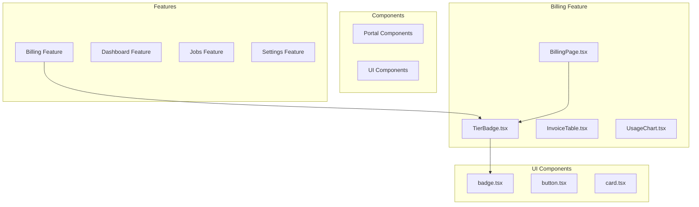
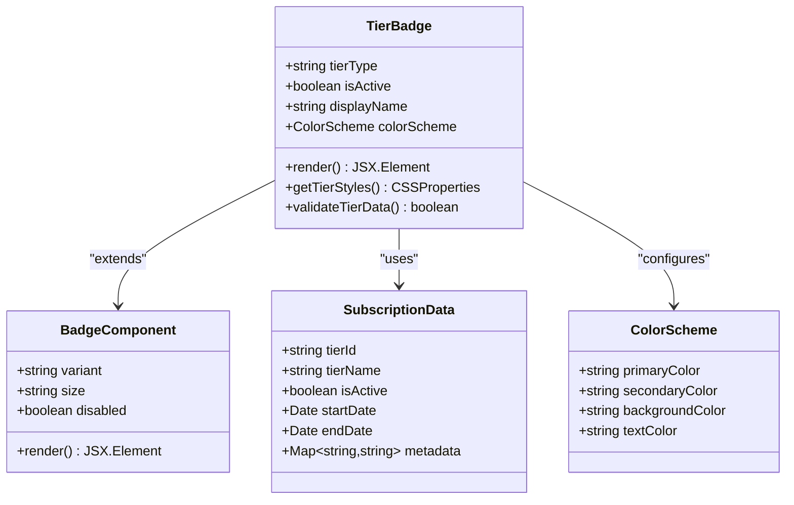
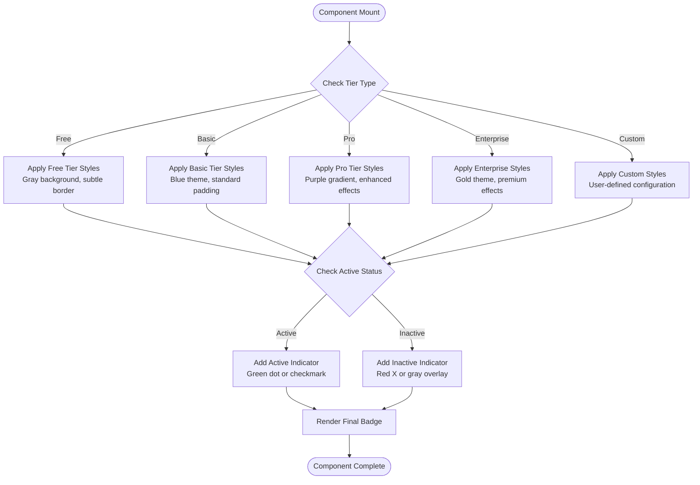
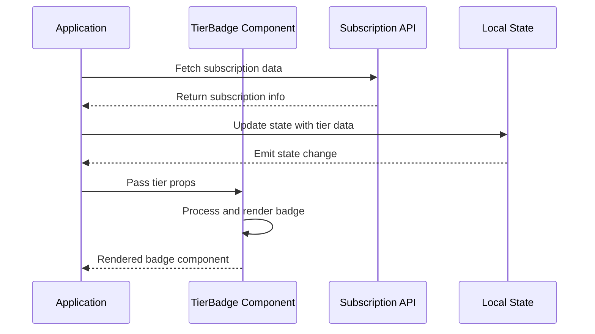
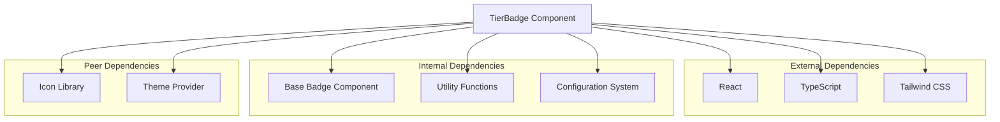

# Tier Badge Component

<cite>
**Referenced Files in This Document**
- [TierBadge.tsx](file://src/features/billing/TierBadge.tsx)
- [BillingPage.tsx](file://src/features/billing/BillingPage.tsx)
- [badge.tsx](file://src/components/ui/badge.tsx)
- [index.ts](file://src/components/portal/index.ts)
</cite>

## Table of Contents
1. [Introduction](#introduction)
2. [Project Structure](#project-structure)
3. [Core Components](#core-components)
4. [Architecture Overview](#architecture-overview)
5. [Detailed Component Analysis](#detailed-component-analysis)
6. [Dependency Analysis](#dependency-analysis)
7. [Performance Considerations](#performance-considerations)
8. [Troubleshooting Guide](#troubleshooting-guide)
9. [Conclusion](#conclusion)
10. [Appendices](#appendices)

## Introduction
The TierBadge component is a specialized UI element designed to display subscription tier information within the application's billing section. It provides visual indicators, color coding, and tier-specific styling to help users quickly identify their current subscription level and associated benefits. The component serves as a key part of the user experience in the billing portal, offering clear visual feedback about subscription status and features.

## Project Structure
The TierBadge component is organized within the feature-based architecture of the application:

**Diagram sources**
- [TierBadge.tsx](file://src/features/billing/TierBadge.tsx)
- [BillingPage.tsx](file://src/features/billing/BillingPage.tsx)
- [badge.tsx](file://src/components/ui/badge.tsx)

**Section sources**
- [TierBadge.tsx](file://src/features/billing/TierBadge.tsx)
- [BillingPage.tsx](file://src/features/billing/BillingPage.tsx)

## Core Components
The TierBadge component integrates with the existing UI component library to provide consistent styling and behavior across the application. It leverages the base Badge component while adding subscription-specific functionality and styling.

### Key Features
- **Visual Indicators**: Color-coded badges that represent different subscription tiers
- **Dynamic Styling**: Automatic style changes based on tier type and status
- **Accessibility Support**: Proper ARIA attributes for screen reader compatibility
- **Responsive Design**: Adapts to different screen sizes and contexts
- **Customizable Options**: Flexible configuration for different tier representations

**Section sources**
- [TierBadge.tsx](file://src/features/billing/TierBadge.tsx)
- [badge.tsx](file://src/components/ui/badge.tsx)

## Architecture Overview
The TierBadge component follows a modular architecture pattern that separates concerns between presentation logic, data handling, and styling:

**Diagram sources**
- [TierBadge.tsx](file://src/features/billing/TierBadge.tsx)
- [badge.tsx](file://src/components/ui/badge.tsx)

## Detailed Component Analysis

### Component Structure and Props
The TierBadge component accepts several props to customize its appearance and behavior:

| Prop Name | Type | Default | Description |
|-----------|------|---------|-------------|
| tierType | string | "free" | The subscription tier identifier |
| isActive | boolean | true | Whether the tier is currently active |
| displayName | string | null | Custom display name for the tier |
| showIcon | boolean | true | Whether to display tier-specific icons |
| compact | boolean | false | Use compact styling for smaller spaces |
| onClick | function | null | Click handler for interactive badges |
| className | string | null | Additional CSS classes |

### Supported Tier Types
The component supports various subscription tier configurations:

#### Standard Tiers
- **Free**: Basic tier with limited features
- **Basic**: Entry-level paid subscription
- **Pro**: Professional tier with advanced features
- **Enterprise**: Full-featured enterprise solution

#### Custom Tier Extensions
The component allows for custom tier definitions through configuration objects that define:
- Visual properties (colors, icons, borders)
- Behavioral properties (interactivity, tooltips)
- Accessibility properties (labels, descriptions)

### Visual Styling System
The TierBadge implements a sophisticated styling system that responds to different tier types:

**Diagram sources**
- [TierBadge.tsx](file://src/features/billing/TierBadge.tsx)

### Integration Patterns
The TierBadge component integrates seamlessly with subscription data through several patterns:

#### Direct Data Binding

**Diagram sources**
- [BillingPage.tsx](file://src/features/billing/BillingPage.tsx)
- [TierBadge.tsx](file://src/features/billing/TierBadge.tsx)

#### Dynamic Updates
The component handles real-time updates when subscription status changes:
- Automatic re-rendering on prop changes
- Smooth transitions between tier states
- Optimistic UI updates for better user experience

### Accessibility Considerations
The TierBadge component prioritizes accessibility compliance:

#### Screen Reader Support
- Proper ARIA labels and roles
- Semantic HTML structure
- Keyboard navigation support
- Focus management for interactive elements

#### Visual Accessibility
- High contrast color combinations
- Text alternatives for visual indicators
- Responsive text sizing
- Clear visual hierarchy

**Section sources**
- [TierBadge.tsx](file://src/features/billing/TierBadge.tsx)
- [BillingPage.tsx](file://src/features/billing/BillingPage.tsx)

## Dependency Analysis
The TierBadge component has specific dependencies that enable its functionality:

**Diagram sources**
- [TierBadge.tsx](file://src/features/billing/TierBadge.tsx)
- [badge.tsx](file://src/components/ui/badge.tsx)

**Section sources**
- [TierBadge.tsx](file://src/features/billing/TierBadge.tsx)

## Performance Considerations
The TierBadge component is optimized for performance through several strategies:

### Rendering Optimization
- Memoization of expensive calculations
- Conditional rendering based on prop changes
- Efficient re-rendering using React.memo
- Lazy loading of heavy assets

### Memory Management
- Proper cleanup of event listeners
- Efficient state management
- Minimal re-renders through prop optimization
- Garbage collection friendly patterns

### Bundle Size Impact
- Tree shaking support for unused code
- Code splitting for large dependencies
- Optimized asset loading
- Minimal runtime overhead

## Troubleshooting Guide

### Common Issues and Solutions

#### Tier Display Problems
**Issue**: Tier badge not displaying correctly
**Solution**: Verify tier type values match expected configuration and check browser console for errors

#### Styling Conflicts
**Issue**: Incorrect colors or layout
**Solution**: Ensure proper CSS specificity and check for conflicting styles in parent components

#### Accessibility Warnings
**Issue**: Screen reader compatibility issues
**Solution**: Verify ARIA attributes are properly set and test with assistive technologies

#### Performance Issues
**Issue**: Slow rendering or memory leaks
**Solution**: Check for unnecessary re-renders and optimize prop passing

### Debugging Tips
- Use React DevTools to inspect component state and props
- Enable React Profiler to identify performance bottlenecks
- Test with different screen sizes and zoom levels
- Validate accessibility using automated tools like axe-core

**Section sources**
- [TierBadge.tsx](file://src/features/billing/TierBadge.tsx)

## Conclusion
The TierBadge component provides a robust, accessible, and visually appealing solution for displaying subscription tier information. Its modular design allows for easy customization and extension while maintaining consistency across the application. The component successfully balances functionality, performance, and accessibility requirements while providing a foundation for future enhancements.

## Appendices

### Extension Guidelines
To extend the TierBadge component for custom tier types:

1. **Define Custom Tier Configuration**: Create configuration objects for new tier types
2. **Implement Styling Rules**: Add CSS classes and visual properties
3. **Update Type Definitions**: Extend TypeScript interfaces for new props
4. **Test Thoroughly**: Verify functionality across all supported browsers and devices

### Best Practices
- Always provide meaningful alt text for screen readers
- Maintain consistent color schemes across similar tier types
- Test accessibility with multiple assistive technologies
- Document all customization options thoroughly
- Follow established naming conventions for props and methods

[No sources needed since this section provides general guidance]