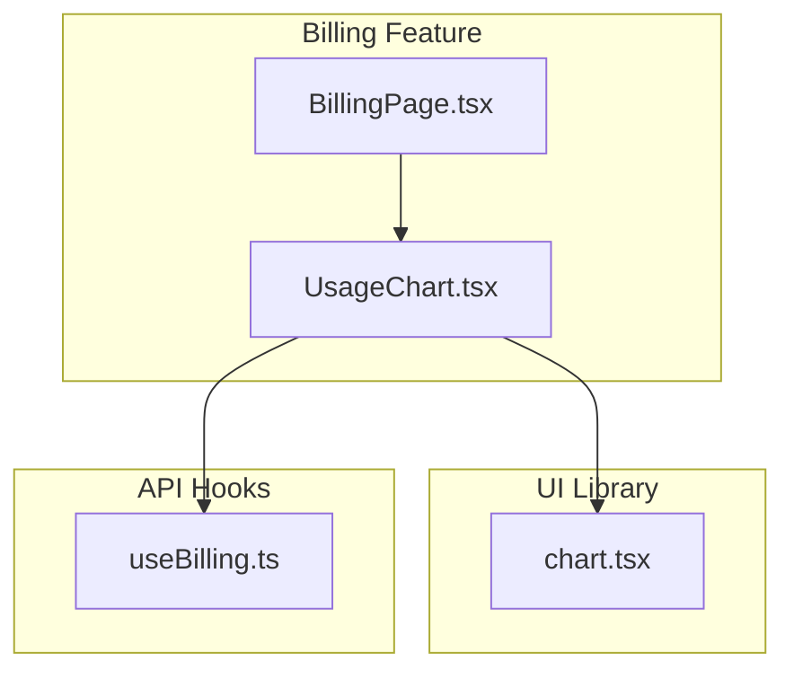
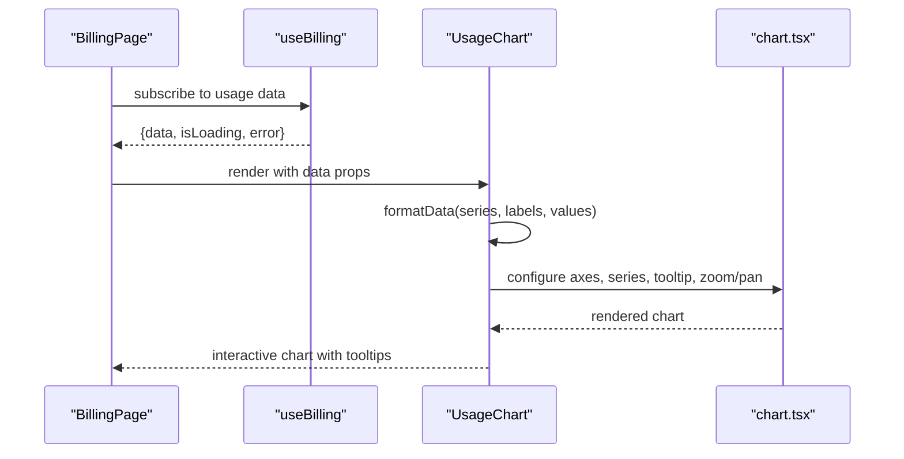
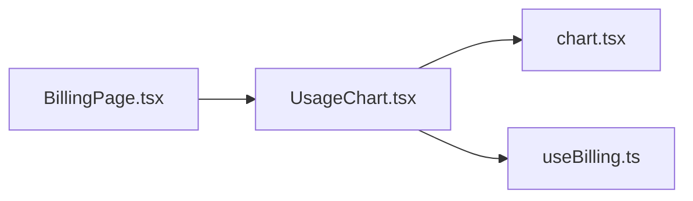

# Usage Chart Component

<cite>
**Referenced Files in This Document**
- [UsageChart.tsx](file://src/features/billing/UsageChart.tsx)
- [chart.tsx](file://src/components/ui/chart.tsx)
- [useBilling.ts](file://src/api/hooks/useBilling.ts)
- [BillingPage.tsx](file://src/features/billing/BillingPage.tsx)
</cite>

## Table of Contents
1. [Introduction](#introduction)
2. [Project Structure](#project-structure)
3. [Core Components](#core-components)
4. [Architecture Overview](#architecture-overview)
5. [Detailed Component Analysis](#detailed-component-analysis)
6. [Dependency Analysis](#dependency-analysis)
7. [Performance Considerations](#performance-considerations)
8. [Troubleshooting Guide](#troubleshooting-guide)
9. [Conclusion](#conclusion)
10. [Appendices](#appendices)

## Introduction
This document provides comprehensive documentation for the UsageChart component used to visualize usage analytics within the billing section. It explains how the chart renders data, integrates with billing hooks for real-time updates, handles loading and error states, and responds across screen sizes. It also covers configuration options, data formatting requirements, and guidance for customization such as tooltips and zoom/pan interactions.

## Project Structure
The UsageChart is part of the billing feature and relies on shared UI chart primitives and API hooks:
- Billing feature: contains the UsageChart component and its page integration.
- UI library: provides a reusable chart primitive that UsageChart composes.
- API hooks: supply usage metrics via an asynchronous data source.

**Diagram sources**
- [BillingPage.tsx](file://src/features/billing/BillingPage.tsx)
- [UsageChart.tsx](file://src/features/billing/UsageChart.tsx)
- [chart.tsx](file://src/components/ui/chart.tsx)
- [useBilling.ts](file://src/api/hooks/useBilling.ts)

**Section sources**
- [UsageChart.tsx](file://src/features/billing/UsageChart.tsx)
- [chart.tsx](file://src/components/ui/chart.tsx)
- [useBilling.ts](file://src/api/hooks/useBilling.ts)
- [BillingPage.tsx](file://src/features/billing/BillingPage.tsx)

## Core Components
- UsageChart: Renders usage analytics over time, manages local state (loading, error), and formats data for the chart primitive. It subscribes to billing data through useBilling and reacts to changes.
- chart.tsx: Provides the underlying charting primitives (axes, series, legends, tooltips, and responsive sizing). UsageChart composes these primitives to build the final visualization.
- useBilling: Supplies usage metrics asynchronously, exposing properties like data availability, loading status, and errors.

Key responsibilities:
- Data binding: Map billing hook results to chart-compatible structures.
- Rendering: Configure axes, series, colors, and labels using chart.tsx primitives.
- Interactivity: Enable tooltips and optional zoom/pan via chart configuration.
- Responsiveness: Adapt to container size changes and mobile layouts.
- State management: Surface loading and error states to consumers.

**Section sources**
- [UsageChart.tsx](file://src/features/billing/UsageChart.tsx)
- [chart.tsx](file://src/components/ui/chart.tsx)
- [useBilling.ts](file://src/api/hooks/useBilling.ts)

## Architecture Overview
UsageChart integrates three layers:
- Data layer: useBilling fetches and caches usage metrics.
- Presentation layer: UsageChart transforms raw data into chart-ready series and configures rendering.
- UI primitives: chart.tsx renders axes, series, legends, tooltips, and responsive behavior.

**Diagram sources**
- [BillingPage.tsx](file://src/features/billing/BillingPage.tsx)
- [useBilling.ts](file://src/api/hooks/useBilling.ts)
- [UsageChart.tsx](file://src/features/billing/UsageChart.tsx)
- [chart.tsx](file://src/components/ui/chart.tsx)

## Detailed Component Analysis

### UsageChart Component
Responsibilities:
- Consumes useBilling to obtain usage metrics and lifecycle states.
- Formats data into chart-compatible arrays for x-axis (time periods) and y-axis (usage values).
- Configures chart series, colors, and labels.
- Enables tooltips and optional zoom/pan based on configuration.
- Handles empty datasets gracefully and surfaces loading/error states.

Data flow:
- On mount or dependency change, UsageChart requests usage data from useBilling.
- When data arrives, it maps fields to chart series and labels.
- The chart primitive renders the visualization; user interactions update local state for pan/zoom if enabled.

Responsive behavior:
- Uses chart.tsx’s responsive container to adapt to width changes.
- Adjusts axis label density and legend placement for smaller screens.

Interactivity:
- Tooltips display detailed values per data point.
- Optional zoom/pan allows users to inspect dense time ranges.

Error handling:
- Displays a friendly error state when useBilling returns an error.
- Retries or shows fallback content based on configuration.

Loading states:
- Shows a skeleton or spinner while data is being fetched.
- Disables interactions until data is ready.

Customization examples:
- Appearance: adjust series colors, line thickness, and grid visibility via chart configuration.
- Tooltips: customize formatter to show units, currency, or percentages.
- Zoom/Pan: enable brush selection or scroll-to-zoom for detailed analysis.

**Section sources**
- [UsageChart.tsx](file://src/features/billing/UsageChart.tsx)
- [chart.tsx](file://src/components/ui/chart.tsx)
- [useBilling.ts](file://src/api/hooks/useBilling.ts)

### Chart Primitives (chart.tsx)
Provides:
- Axes configuration (time-based x-axis, numeric y-axis).
- Series definitions (line, area, bar) with color palettes.
- Legend and crosshair support.
- Tooltip customization hooks.
- Responsive sizing and accessibility features.

Integration points:
- UsageChart passes formatted series and labels to chart.tsx.
- chart.tsx exposes callbacks for interaction events (e.g., onZoomChange, onTooltipShow).

**Section sources**
- [chart.tsx](file://src/components/ui/chart.tsx)

### Billing Hook Integration (useBilling.ts)
Exposes:
- Usage metrics array with timestamps and values.
- Loading flag indicating pending requests.
- Error object for failed requests.

Usage pattern:
- Consume in UsageChart to drive rendering and state.
- Handle retries and caching at the hook level to minimize network calls.

**Section sources**
- [useBilling.ts](file://src/api/hooks/useBilling.ts)

### Page Integration (BillingPage.tsx)
- Renders UsageChart within the billing dashboard.
- Passes filters (e.g., date range) to control data granularity.
- Manages layout and spacing around the chart.

**Section sources**
- [BillingPage.tsx](file://src/features/billing/BillingPage.tsx)

## Dependency Analysis
UsageChart depends on:
- chart.tsx for rendering primitives.
- useBilling.ts for data and lifecycle states.
- BillingPage.tsx for context and layout.

**Diagram sources**
- [UsageChart.tsx](file://src/features/billing/UsageChart.tsx)
- [chart.tsx](file://src/components/ui/chart.tsx)
- [useBilling.ts](file://src/api/hooks/useBilling.ts)
- [BillingPage.tsx](file://src/features/billing/BillingPage.tsx)

**Section sources**
- [UsageChart.tsx](file://src/features/billing/UsageChart.tsx)
- [chart.tsx](file://src/components/ui/chart.tsx)
- [useBilling.ts](file://src/api/hooks/useBilling.ts)
- [BillingPage.tsx](file://src/features/billing/BillingPage.tsx)

## Performance Considerations
- Data batching: Aggregate usage metrics by day/week/month to reduce series length.
- Memoization: Cache formatted series to avoid recomputation on re-renders.
- Virtualization: For very large datasets, consider virtualizing visible segments.
- Debounce interactions: Throttle zoom/pan updates to prevent excessive re-renders.
- Lazy load chart: Defer chart initialization until the component is in viewport.

[No sources needed since this section provides general guidance]

## Troubleshooting Guide
Common issues and resolutions:
- No data displayed:
  - Verify useBilling returns non-empty data and correct field names.
  - Ensure chart series mapping aligns with data structure.
- Loading stuck:
  - Check network requests and error responses from useBilling.
  - Add retry logic or fallback UI.
- Tooltips not showing:
  - Confirm tooltip formatter receives expected data shape.
  - Ensure chart tooltip is enabled in configuration.
- Poor performance on mobile:
  - Reduce series count and simplify grid lines.
  - Disable heavy interactions like zoom/pan on small screens.

**Section sources**
- [UsageChart.tsx](file://src/features/billing/UsageChart.tsx)
- [chart.tsx](file://src/components/ui/chart.tsx)
- [useBilling.ts](file://src/api/hooks/useBilling.ts)

## Conclusion
UsageChart delivers a robust, responsive usage analytics visualization by composing chart.tsx primitives with billing data from useBilling. It supports rich interactivity, clear state management, and flexible customization. By following the data formatting guidelines and leveraging the provided configuration options, developers can tailor the chart to meet diverse analytical needs.

[No sources needed since this section summarizes without analyzing specific files]

## Appendices

### Data Formatting Requirements
- X-axis: Array of time labels (e.g., dates or periods).
- Y-axis: Array of numeric values corresponding to each time label.
- Series: One or more named series with consistent lengths matching labels.
- Units: Include metadata for units (e.g., requests, bytes) to enhance tooltips.

[No sources needed since this section provides general guidance]

### Configuration Options
- Series colors and styles: Define palette and stroke widths.
- Axis labels: Customize formatting and density.
- Legends: Position and visibility toggles.
- Tooltips: Formatter functions for value presentation.
- Zoom/Pan: Enable brush selection or scroll-to-zoom.

[No sources needed since this section provides general guidance]

### Interactive Features Examples
- Tooltips: Show detailed values with units and contextual info.
- Zoom/Pan: Allow users to focus on specific time ranges for deeper insights.
- Crosshairs: Align vertical/horizontal guides to highlight selected points.

[No sources needed since this section provides general guidance]