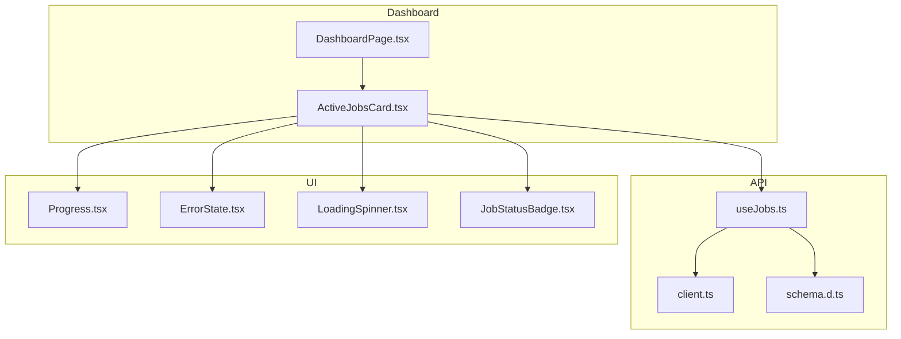
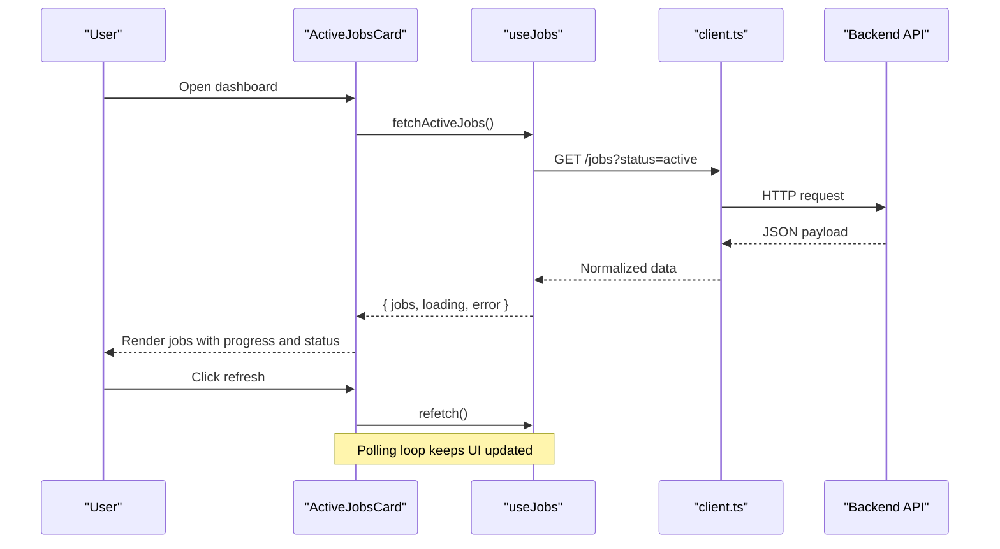
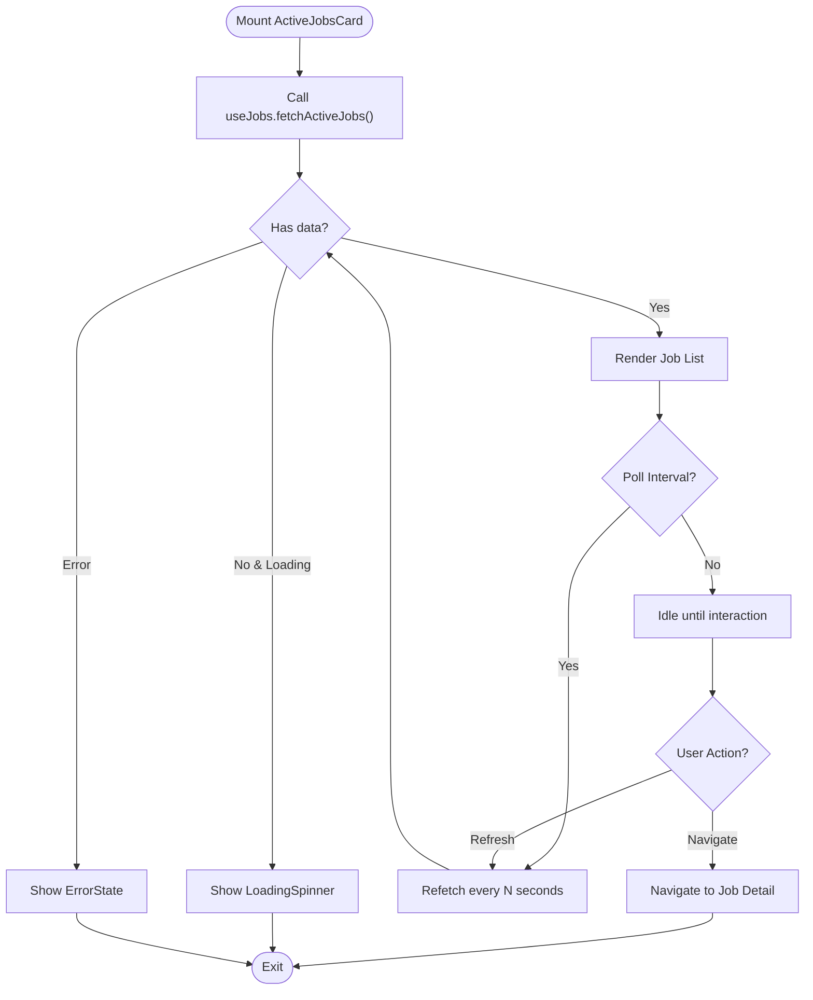
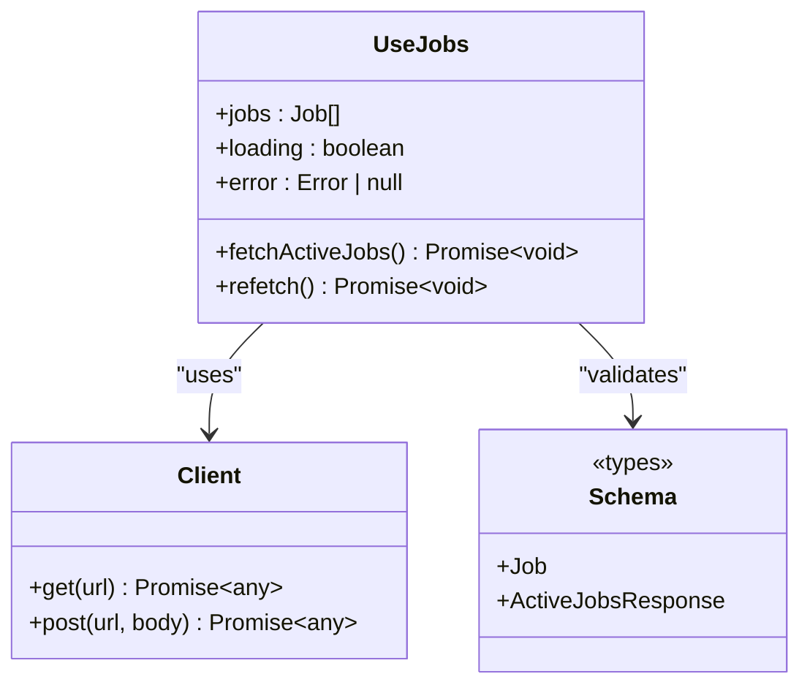
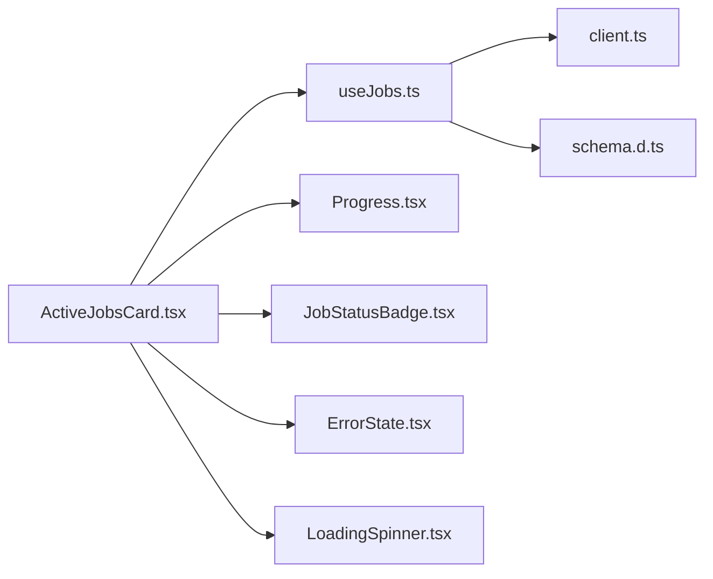

# Active Jobs Card Component

<cite>
**Referenced Files in This Document**
- [ActiveJobsCard.tsx](file://src/features/dashboard/ActiveJobsCard.tsx)
- [DashboardPage.tsx](file://src/features/dashboard/DashboardPage.tsx)
- [useJobs.ts](file://src/api/hooks/useJobs.ts)
- [client.ts](file://src/api/client.ts)
- [schema.d.ts](file://src/api/schema.d.ts)
- [JobStatusBadge.tsx](file://src/components/jobs/JobStatusBadge.tsx)
- [Progress.tsx](file://src/components/ui/progress.tsx)
- [ErrorState.tsx](file://src/components/portal/ErrorState.tsx)
- [LoadingSpinner.tsx](file://src/components/portal/LoadingSpinner.tsx)
</cite>

## Table of Contents
1. [Introduction](#introduction)
2. [Project Structure](#project-structure)
3. [Core Components](#core-components)
4. [Architecture Overview](#architecture-overview)
5. [Detailed Component Analysis](#detailed-component-analysis)
6. [Dependency Analysis](#dependency-analysis)
7. [Performance Considerations](#performance-considerations)
8. [Troubleshooting Guide](#troubleshooting-guide)
9. [Conclusion](#conclusion)
10. [Appendices](#appendices)

## Introduction
The ActiveJobsCard component provides a real-time dashboard view of currently running jobs. It displays job metadata, progress indicators, and status updates fetched from the backend via API hooks. The component integrates with polling mechanisms to keep the UI synchronized with server state, handles errors gracefully, and supports user interactions such as refreshing or navigating to detailed views.

## Project Structure
The ActiveJobsCard is part of the dashboard feature and consumes shared UI components and API hooks:
- Feature layer: Dashboard page and ActiveJobsCard
- API layer: useJobs hook for fetching job data and client configuration
- UI layer: Progress indicator, error states, loading spinners, and status badges

**Diagram sources**
- [DashboardPage.tsx](file://src/features/dashboard/DashboardPage.tsx)
- [ActiveJobsCard.tsx](file://src/features/dashboard/ActiveJobsCard.tsx)
- [useJobs.ts](file://src/api/hooks/useJobs.ts)
- [client.ts](file://src/api/client.ts)
- [schema.d.ts](file://src/api/schema.d.ts)
- [Progress.tsx](file://src/components/ui/progress.tsx)
- [ErrorState.tsx](file://src/components/portal/ErrorState.tsx)
- [LoadingSpinner.tsx](file://src/components/portal/LoadingSpinner.tsx)
- [JobStatusBadge.tsx](file://src/components/jobs/JobStatusBadge.tsx)

**Section sources**
- [ActiveJobsCard.tsx](file://src/features/dashboard/ActiveJobsCard.tsx)
- [DashboardPage.tsx](file://src/features/dashboard/DashboardPage.tsx)
- [useJobs.ts](file://src/api/hooks/useJobs.ts)
- [client.ts](file://src/api/client.ts)
- [schema.d.ts](file://src/api/schema.d.ts)
- [Progress.tsx](file://src/components/ui/progress.tsx)
- [ErrorState.tsx](file://src/components/portal/ErrorState.tsx)
- [LoadingSpinner.tsx](file://src/components/portal/LoadingSpinner.tsx)
- [JobStatusBadge.tsx](file://src/components/jobs/JobStatusBadge.tsx)

## Core Components
- ActiveJobsCard: Renders the active jobs list, manages polling, and composes UI elements for progress and status.
- useJobs: Encapsulates API calls for listing active jobs and handling response shapes defined by schema types.
- Shared UI: Progress bar, error state display, loading spinner, and job status badge.

Key responsibilities:
- Fetching and caching active jobs
- Polling at configurable intervals
- Rendering per-job progress and metadata
- Handling network and business errors
- Exposing actions (refresh, navigate)

**Section sources**
- [ActiveJobsCard.tsx](file://src/features/dashboard/ActiveJobsCard.tsx)
- [useJobs.ts](file://src/api/hooks/useJobs.ts)
- [Progress.tsx](file://src/components/ui/progress.tsx)
- [ErrorState.tsx](file://src/components/portal/ErrorState.tsx)
- [LoadingSpinner.tsx](file://src/components/portal/LoadingSpinner.tsx)
- [JobStatusBadge.tsx](file://src/components/jobs/JobStatusBadge.tsx)

## Architecture Overview
The component follows a unidirectional data flow:
- Data source: Backend API accessed through client.ts
- Hook layer: useJobs performs requests and returns normalized data/state
- UI layer: ActiveJobsCard renders based on hook state and triggers refetches

**Diagram sources**
- [ActiveJobsCard.tsx](file://src/features/dashboard/ActiveJobsCard.tsx)
- [useJobs.ts](file://src/api/hooks/useJobs.ts)
- [client.ts](file://src/api/client.ts)

## Detailed Component Analysis

### ActiveJobsCard Component
Responsibilities:
- Display currently running jobs with metadata (e.g., id, name, type, timestamps)
- Show progress bars reflecting completion percentage
- Indicate job status using a badge component
- Handle loading and error states
- Provide user actions (refresh, navigate to details)

Data binding:
- Consumes useJobs hook for active jobs list
- Maps job fields to UI elements
- Updates on poll interval or manual refresh

Rendering logic:
- Conditional rendering for loading, error, and success states
- Per-job row/card with progress and status
- Optional expandable details for additional metadata

**Diagram sources**
- [ActiveJobsCard.tsx](file://src/features/dashboard/ActiveJobsCard.tsx)
- [useJobs.ts](file://src/api/hooks/useJobs.ts)
- [LoadingSpinner.tsx](file://src/components/portal/LoadingSpinner.tsx)
- [ErrorState.tsx](file://src/components/portal/ErrorState.tsx)

**Section sources**
- [ActiveJobsCard.tsx](file://src/features/dashboard/ActiveJobsCard.tsx)

### useJobs Hook
Responsibilities:
- Define API endpoints for active jobs
- Perform HTTP requests via client.ts
- Normalize responses according to schema.d.ts
- Expose state: jobs array, loading flag, error object
- Provide refetch function and optional polling configuration

Integration points:
- Uses client.ts for HTTP transport
- Relies on schema.d.ts for type safety and validation hints
- Returns structured state consumed by ActiveJobsCard

**Diagram sources**
- [useJobs.ts](file://src/api/hooks/useJobs.ts)
- [client.ts](file://src/api/client.ts)
- [schema.d.ts](file://src/api/schema.d.ts)

**Section sources**
- [useJobs.ts](file://src/api/hooks/useJobs.ts)
- [client.ts](file://src/api/client.ts)
- [schema.d.ts](file://src/api/schema.d.ts)

### UI Components Integration
- Progress: Visualizes job completion percentage
- JobStatusBadge: Displays current job status with color-coded labels
- ErrorState: Shows actionable error messages and retry options
- LoadingSpinner: Indicates asynchronous operations

These components are composed within ActiveJobsCard to provide a cohesive user experience.

**Section sources**
- [Progress.tsx](file://src/components/ui/progress.tsx)
- [JobStatusBadge.tsx](file://src/components/jobs/JobStatusBadge.tsx)
- [ErrorState.tsx](file://src/components/portal/ErrorState.tsx)
- [LoadingSpinner.tsx](file://src/components/portal/LoadingSpinner.tsx)

## Dependency Analysis
ActiveJobsCard depends on:
- useJobs for data fetching and state management
- client.ts for HTTP communication
- schema.d.ts for type definitions
- UI primitives for rendering and feedback

**Diagram sources**
- [ActiveJobsCard.tsx](file://src/features/dashboard/ActiveJobsCard.tsx)
- [useJobs.ts](file://src/api/hooks/useJobs.ts)
- [client.ts](file://src/api/client.ts)
- [schema.d.ts](file://src/api/schema.d.ts)
- [Progress.tsx](file://src/components/ui/progress.tsx)
- [JobStatusBadge.tsx](file://src/components/jobs/JobStatusBadge.tsx)
- [ErrorState.tsx](file://src/components/portal/ErrorState.tsx)
- [LoadingSpinner.tsx](file://src/components/portal/LoadingSpinner.tsx)

**Section sources**
- [ActiveJobsCard.tsx](file://src/features/dashboard/ActiveJobsCard.tsx)
- [useJobs.ts](file://src/api/hooks/useJobs.ts)
- [client.ts](file://src/api/client.ts)
- [schema.d.ts](file://src/api/schema.d.ts)
- [Progress.tsx](file://src/components/ui/progress.tsx)
- [JobStatusBadge.tsx](file://src/components/jobs/JobStatusBadge.tsx)
- [ErrorState.tsx](file://src/components/portal/ErrorState.tsx)
- [LoadingSpinner.tsx](file://src/components/portal/LoadingSpinner.tsx)

## Performance Considerations
- Polling interval tuning: Balance freshness vs. network load; avoid excessive refetches
- Debounce rapid user interactions: Prevent redundant refetches on quick clicks
- Memoization: Cache derived lists and computed values to reduce re-renders
- Pagination or virtualization: For large job sets, render only visible items
- Error backoff: Implement exponential backoff for failed requests
- Lightweight payloads: Request only necessary fields to minimize transfer size

[No sources needed since this section provides general guidance]

## Troubleshooting Guide
Common issues and resolutions:
- No jobs displayed:
  - Verify API endpoint availability and authentication
  - Check network tab for failed requests
  - Inspect error state and message
- Stale data:
  - Ensure polling interval is configured
  - Trigger manual refresh if needed
- Progress not updating:
  - Confirm backend emits progress updates
  - Validate field mapping between API and UI
- Retry behavior:
  - Review error handling in useJobs
  - Implement retry logic with backoff if missing

**Section sources**
- [ErrorState.tsx](file://src/components/portal/ErrorState.tsx)
- [useJobs.ts](file://src/api/hooks/useJobs.ts)

## Conclusion
The ActiveJobsCard component delivers a responsive, real-time view of active jobs by integrating with useJobs and shared UI primitives. It balances performance with up-to-date information through controlled polling and robust error handling. Customization can be achieved by extending metadata rendering, adjusting polling intervals, and composing additional UI elements.

[No sources needed since this section summarizes without analyzing specific files]

## Appendices

### Customization Examples
- Add custom metadata fields:
  - Extend the job card layout to include extra attributes from the API response
  - Map new fields to descriptive labels and formatting utilities
- Adjust appearance:
  - Modify colors, spacing, and typography via theme or CSS classes
  - Replace default progress styling with alternative visualizations
- Extend functionality:
  - Integrate webhooks for push updates instead of polling
  - Add export or filtering capabilities for active jobs

[No sources needed since this section provides general guidance]