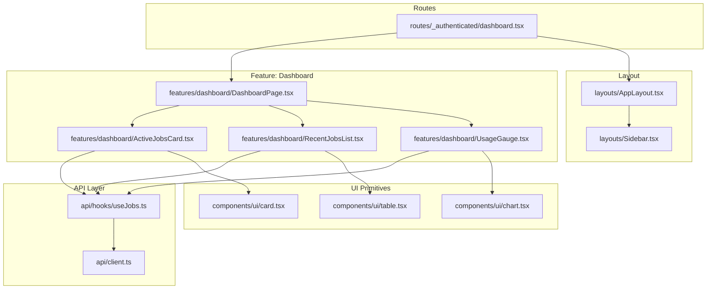
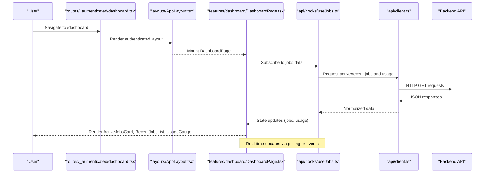
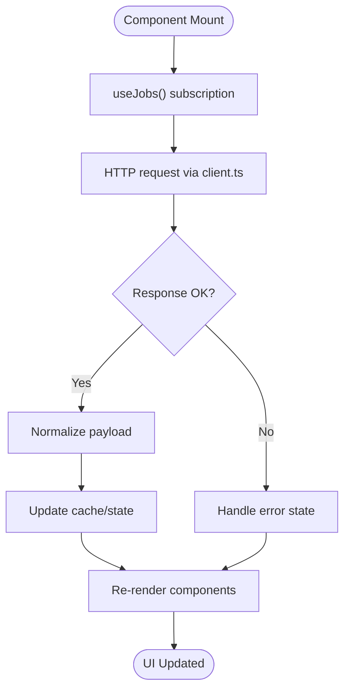
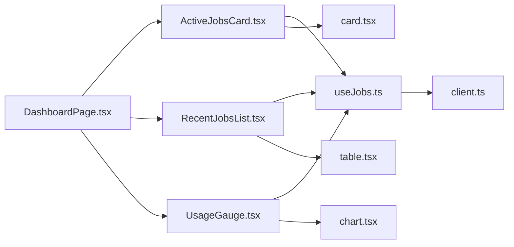

# Dashboard Module

<cite>
**Referenced Files in This Document**
- [DashboardPage.tsx](file://src/features/dashboard/DashboardPage.tsx)
- [ActiveJobsCard.tsx](file://src/features/dashboard/ActiveJobsCard.tsx)
- [RecentJobsList.tsx](file://src/features/dashboard/RecentJobsList.tsx)
- [UsageGauge.tsx](file://src/features/dashboard/UsageGauge.tsx)
- [dashboard.tsx](file://src/routes/_authenticated/dashboard.tsx)
- [useJobs.ts](file://src/api/hooks/useJobs.ts)
- [client.ts](file://src/api/client.ts)
- [AppLayout.tsx](file://src/layouts/AppLayout.tsx)
- [Sidebar.tsx](file://src/layouts/Sidebar.tsx)
- [chart.tsx](file://src/components/ui/chart.tsx)
- [card.tsx](file://src/components/ui/card.tsx)
- [table.tsx](file://src/components/ui/table.tsx)
</cite>

## Table of Contents
1. [Introduction](#introduction)
2. [Project Structure](#project-structure)
3. [Core Components](#core-components)
4. [Architecture Overview](#architecture-overview)
5. [Detailed Component Analysis](#detailed-component-analysis)
6. [Dependency Analysis](#dependency-analysis)
7. [Performance Considerations](#performance-considerations)
8. [Troubleshooting Guide](#troubleshooting-guide)
9. [Conclusion](#conclusion)

## Introduction
The Dashboard module provides the authenticated user’s primary overview, aggregating active job monitoring, recent jobs, and usage metrics into a single responsive interface. It composes multiple UI components and hooks to fetch and render real-time data from the backend API, while maintaining a clean separation between data fetching, state management, and presentation.

## Project Structure
The dashboard feature is organized under src/features/dashboard with dedicated components for each visual section:
- ActiveJobsCard: Displays currently running or pending jobs with live updates.
- RecentJobsList: Shows the most recent jobs with status and metadata.
- UsageGauge: Visualizes current usage against quotas or limits.
- DashboardPage: Orchestrates layout and composition of these sections.

The route entry point mounts the dashboard page within the authenticated layout.

**Diagram sources**
- [dashboard.tsx](file://src/routes/_authenticated/dashboard.tsx)
- [DashboardPage.tsx](file://src/features/dashboard/DashboardPage.tsx)
- [ActiveJobsCard.tsx](file://src/features/dashboard/ActiveJobsCard.tsx)
- [RecentJobsList.tsx](file://src/features/dashboard/RecentJobsList.tsx)
- [UsageGauge.tsx](file://src/features/dashboard/UsageGauge.tsx)
- [useJobs.ts](file://src/api/hooks/useJobs.ts)
- [client.ts](file://src/api/client.ts)
- [AppLayout.tsx](file://src/layouts/AppLayout.tsx)
- [Sidebar.tsx](file://src/layouts/Sidebar.tsx)
- [chart.tsx](file://src/components/ui/chart.tsx)
- [card.tsx](file://src/components/ui/card.tsx)
- [table.tsx](file://src/components/ui/table.tsx)

**Section sources**
- [dashboard.tsx](file://src/routes/_authenticated/dashboard.tsx)
- [DashboardPage.tsx](file://src/features/dashboard/DashboardPage.tsx)
- [AppLayout.tsx](file://src/layouts/AppLayout.tsx)
- [Sidebar.tsx](file://src/layouts/Sidebar.tsx)

## Core Components
- DashboardPage: The main container that composes the three primary sections (active jobs, recent jobs, usage gauge). It coordinates data fetching via useJobs and renders the layout using shared UI primitives.
- ActiveJobsCard: Fetches and displays jobs that are currently active or pending, with automatic refresh intervals to reflect real-time changes.
- RecentJobsList: Renders a paginated or limited list of recent jobs, including status badges and key attributes.
- UsageGauge: Presents a visual gauge indicating current usage versus limits, updating when usage data changes.

Key responsibilities:
- Data acquisition through useJobs hook.
- State synchronization for live updates.
- Responsive rendering across device sizes.
- Error and loading states handled gracefully.

**Section sources**
- [DashboardPage.tsx](file://src/features/dashboard/DashboardPage.tsx)
- [ActiveJobsCard.tsx](file://src/features/dashboard/ActiveJobsCard.tsx)
- [RecentJobsList.tsx](file://src/features/dashboard/RecentJobsList.tsx)
- [UsageGauge.tsx](file://src/features/dashboard/UsageGauge.tsx)

## Architecture Overview
The dashboard follows a unidirectional data flow:
- Route mounts the DashboardPage inside the authenticated AppLayout.
- DashboardPage composes child components and subscribes to useJobs for data.
- useJobs encapsulates API calls via client.ts and manages caching, polling, and error handling.
- UI primitives provide consistent styling and accessibility.

**Diagram sources**
- [dashboard.tsx](file://src/routes/_authenticated/dashboard.tsx)
- [AppLayout.tsx](file://src/layouts/AppLayout.tsx)
- [DashboardPage.tsx](file://src/features/dashboard/DashboardPage.tsx)
- [useJobs.ts](file://src/api/hooks/useJobs.ts)
- [client.ts](file://src/api/client.ts)

## Detailed Component Analysis

### DashboardPage
Responsibilities:
- Compose ActiveJobsCard, RecentJobsList, and UsageGauge.
- Manage overall layout and spacing.
- Provide context for data sharing if needed.

Data flow:
- Subscribes to useJobs for aggregated data.
- Passes relevant slices of data to child components.

Responsive design:
- Uses grid/flex layouts to adapt to screen sizes.
- Delegates chart/table responsiveness to UI primitives.

Performance:
- Avoids unnecessary re-renders by memoizing derived values.
- Leverages component-level subscriptions to minimize updates.

**Section sources**
- [DashboardPage.tsx](file://src/features/dashboard/DashboardPage.tsx)

### ActiveJobsCard
Responsibilities:
- Display jobs currently in progress or pending.
- Refresh at intervals to reflect real-time status changes.

Real-time updates:
- Polling or event-driven updates via useJobs.
- Optimistic UI updates where appropriate.

Error handling:
- Graceful fallbacks on network errors.
- Retry logic with exponential backoff.

**Section sources**
- [ActiveJobsCard.tsx](file://src/features/dashboard/ActiveJobsCard.tsx)
- [useJobs.ts](file://src/api/hooks/useJobs.ts)

### RecentJobsList
Responsibilities:
- Show a concise list of recent jobs with status and metadata.
- Support pagination or limit-based fetching.

Data presentation:
- Uses table/list components for structured display.
- Status badges indicate job state.

Accessibility:
- Semantic markup and keyboard navigation.

**Section sources**
- [RecentJobsList.tsx](file://src/features/dashboard/RecentJobsList.tsx)
- [table.tsx](file://src/components/ui/table.tsx)

### UsageGauge
Responsibilities:
- Visualize current usage against quotas or limits.
- Update dynamically as usage data changes.

Visualization:
- Chart primitive for gauge rendering.
- Color coding for thresholds.

Performance:
- Debounced updates to avoid excessive re-renders.

**Section sources**
- [UsageGauge.tsx](file://src/features/dashboard/UsageGauge.tsx)
- [chart.tsx](file://src/components/ui/chart.tsx)

### Data Flow from API Hooks to UI Components

**Diagram sources**
- [useJobs.ts](file://src/api/hooks/useJobs.ts)
- [client.ts](file://src/api/client.ts)

**Section sources**
- [useJobs.ts](file://src/api/hooks/useJobs.ts)
- [client.ts](file://src/api/client.ts)

## Dependency Analysis
The dashboard depends on:
- API layer for data retrieval and caching.
- UI primitives for consistent styling and behavior.
- Layout components for structure and navigation.

**Diagram sources**
- [DashboardPage.tsx](file://src/features/dashboard/DashboardPage.tsx)
- [ActiveJobsCard.tsx](file://src/features/dashboard/ActiveJobsCard.tsx)
- [RecentJobsList.tsx](file://src/features/dashboard/RecentJobsList.tsx)
- [UsageGauge.tsx](file://src/features/dashboard/UsageGauge.tsx)
- [useJobs.ts](file://src/api/hooks/useJobs.ts)
- [client.ts](file://src/api/client.ts)
- [card.tsx](file://src/components/ui/card.tsx)
- [table.tsx](file://src/components/ui/table.tsx)
- [chart.tsx](file://src/components/ui/chart.tsx)

**Section sources**
- [DashboardPage.tsx](file://src/features/dashboard/DashboardPage.tsx)
- [useJobs.ts](file://src/api/hooks/useJobs.ts)
- [client.ts](file://src/api/client.ts)

## Performance Considerations
- Real-time updates:
  - Use polling intervals tuned to expected update frequency.
  - Implement debouncing/throttling for frequent mutations.
- Rendering optimization:
  - Memoize expensive computations and derived data.
  - Split large lists into virtualized components if needed.
- Network efficiency:
  - Cache responses and deduplicate identical requests.
  - Use conditional refetching based on visibility or focus.
- Memory management:
  - Clean up subscriptions and timers on unmount.
  - Avoid retaining large datasets in memory longer than necessary.

[No sources needed since this section provides general guidance]

## Troubleshooting Guide
Common issues and resolutions:
- No data displayed:
  - Verify API connectivity and authentication tokens.
  - Check error boundaries and error states in components.
- Stale data:
  - Ensure polling intervals are configured correctly.
  - Validate cache invalidation strategies.
- Performance degradation:
  - Profile re-renders and identify unnecessary updates.
  - Optimize list rendering and chart updates.

**Section sources**
- [useJobs.ts](file://src/api/hooks/useJobs.ts)
- [client.ts](file://src/api/client.ts)

## Conclusion
The Dashboard module delivers a cohesive, real-time overview of job activity and usage metrics. Its architecture separates concerns cleanly between data fetching, state management, and presentation, enabling maintainability and scalability. By leveraging responsive UI primitives and performance optimizations, it ensures a smooth user experience across devices and usage patterns.

[No sources needed since this section summarizes without analyzing specific files]