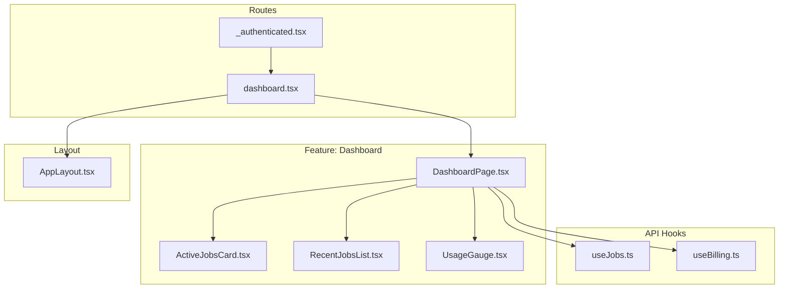
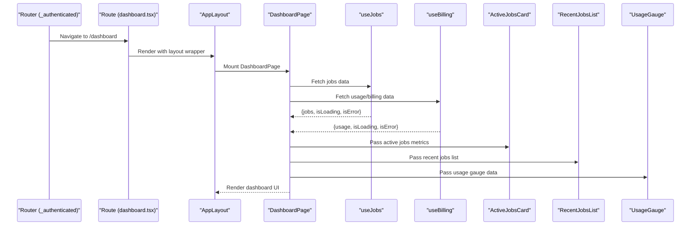
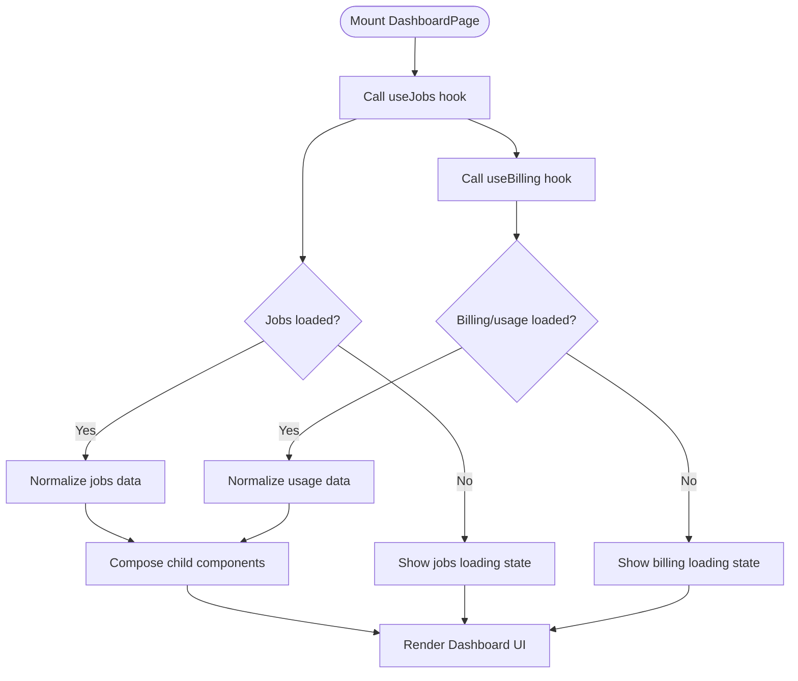
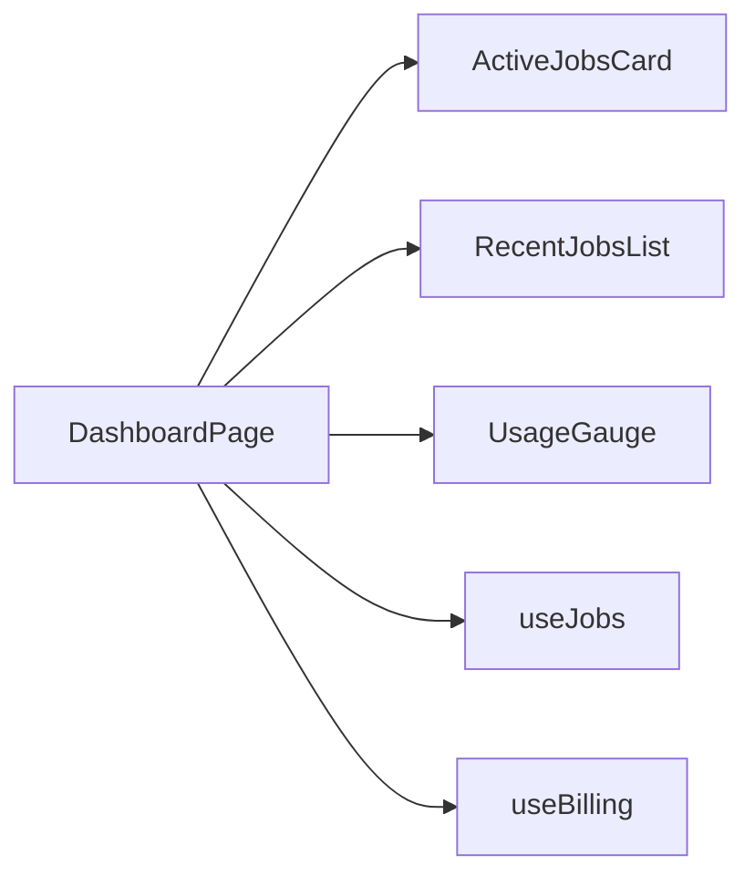
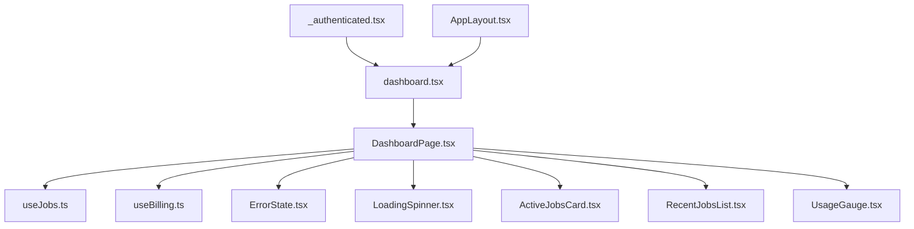

# Dashboard Page Component

<cite>
**Referenced Files in This Document**
- [DashboardPage.tsx](file://src/features/dashboard/DashboardPage.tsx)
- [ActiveJobsCard.tsx](file://src/features/dashboard/ActiveJobsCard.tsx)
- [RecentJobsList.tsx](file://src/features/dashboard/RecentJobsList.tsx)
- [UsageGauge.tsx](file://src/features/dashboard/UsageGauge.tsx)
- [dashboard.tsx](file://src/routes/_authenticated/dashboard.tsx)
- [_authenticated.tsx](file://src/routes/_authenticated.tsx)
- [useJobs.ts](file://src/api/hooks/useJobs.ts)
- [useBilling.ts](file://src/api/hooks/useBilling.ts)
- [AppLayout.tsx](file://src/layouts/AppLayout.tsx)
- [ErrorState.tsx](file://src/components/portal/ErrorState.tsx)
- [LoadingSpinner.tsx](file://src/components/portal/LoadingSpinner.tsx)
</cite>

## Table of Contents
1. [Introduction](#introduction)
2. [Project Structure](#project-structure)
3. [Core Components](#core-components)
4. [Architecture Overview](#architecture-overview)
5. [Detailed Component Analysis](#detailed-component-analysis)
6. [Dependency Analysis](#dependency-analysis)
7. [Performance Considerations](#performance-considerations)
8. [Troubleshooting Guide](#troubleshooting-guide)
9. [Conclusion](#conclusion)

## Introduction
This document provides comprehensive documentation for the DashboardPage component, which serves as the main container orchestrating the dashboard layout and aggregating data from multiple sources. It explains how the component manages overall dashboard state, handles data fetching through API hooks, and coordinates child components such as ActiveJobsCard, RecentJobsList, and UsageGauge. The document also covers error handling strategies, loading states, responsive design patterns, performance optimizations, and integration with routing and authentication systems.

## Project Structure
The dashboard feature is organized under a dedicated feature folder, containing the primary page component and its related UI pieces. The route file wires the page into the authenticated section of the application, ensuring that only authenticated users can access the dashboard.

**Diagram sources**
- [DashboardPage.tsx](file://src/features/dashboard/DashboardPage.tsx)
- [ActiveJobsCard.tsx](file://src/features/dashboard/ActiveJobsCard.tsx)
- [RecentJobsList.tsx](file://src/features/dashboard/RecentJobsList.tsx)
- [UsageGauge.tsx](file://src/features/dashboard/UsageGauge.tsx)
- [dashboard.tsx](file://src/routes/_authenticated/dashboard.tsx)
- [_authenticated.tsx](file://src/routes/_authenticated.tsx)
- [useJobs.ts](file://src/api/hooks/useJobs.ts)
- [useBilling.ts](file://src/api/hooks/useBilling.ts)
- [AppLayout.tsx](file://src/layouts/AppLayout.tsx)

**Section sources**
- [DashboardPage.tsx](file://src/features/dashboard/DashboardPage.tsx)
- [dashboard.tsx](file://src/routes/_authenticated/dashboard.tsx)
- [_authenticated.tsx](file://src/routes/_authenticated.tsx)
- [AppLayout.tsx](file://src/layouts/AppLayout.tsx)

## Core Components
- DashboardPage: Orchestrates the dashboard by composing child components and aggregating data from API hooks. It centralizes state for loading, errors, and data, and renders a responsive layout.
- ActiveJobsCard: Displays active job metrics or counts based on provided data.
- RecentJobsList: Renders a list of recent jobs using data fetched via hooks.
- UsageGauge: Visualizes usage metrics (e.g., quota or consumption) derived from billing or usage endpoints.

These components are composed within DashboardPage to present a cohesive dashboard view.

**Section sources**
- [DashboardPage.tsx](file://src/features/dashboard/DashboardPage.tsx)
- [ActiveJobsCard.tsx](file://src/features/dashboard/ActiveJobsCard.tsx)
- [RecentJobsList.tsx](file://src/features/dashboard/RecentJobsList.tsx)
- [UsageGauge.tsx](file://src/features/dashboard/UsageGauge.tsx)

## Architecture Overview
At runtime, the authenticated route guards access and mounts the dashboard route, which renders DashboardPage inside the application layout. DashboardPage invokes API hooks to fetch jobs and billing/usage data, then passes normalized data to child components. Error and loading states are surfaced consistently across the dashboard.

**Diagram sources**
- [_authenticated.tsx](file://src/routes/_authenticated.tsx)
- [dashboard.tsx](file://src/routes/_authenticated/dashboard.tsx)
- [AppLayout.tsx](file://src/layouts/AppLayout.tsx)
- [DashboardPage.tsx](file://src/features/dashboard/DashboardPage.tsx)
- [useJobs.ts](file://src/api/hooks/useJobs.ts)
- [useBilling.ts](file://src/api/hooks/useBilling.ts)
- [ActiveJobsCard.tsx](file://src/features/dashboard/ActiveJobsCard.tsx)
- [RecentJobsList.tsx](file://src/features/dashboard/RecentJobsList.tsx)
- [UsageGauge.tsx](file://src/features/dashboard/UsageGauge.tsx)

## Detailed Component Analysis

### DashboardPage
Responsibilities:
- Aggregates data from useJobs and useBilling hooks.
- Manages global dashboard state: loading flags, error states, and normalized data.
- Composes child components and passes them required props.
- Handles error and loading states at the container level, delegating specific rendering to children where appropriate.
- Implements responsive layout patterns for consistent UX across devices.

Data flow:
- Invokes API hooks to retrieve jobs and usage data.
- Normalizes results and distributes to child components.
- Surfaces errors and loading indicators consistently.

Integration points:
- Mounted by the authenticated dashboard route.
- Uses shared portal components for consistent error and loading visuals.

**Diagram sources**
- [DashboardPage.tsx](file://src/features/dashboard/DashboardPage.tsx)
- [useJobs.ts](file://src/api/hooks/useJobs.ts)
- [useBilling.ts](file://src/api/hooks/useBilling.ts)

**Section sources**
- [DashboardPage.tsx](file://src/features/dashboard/DashboardPage.tsx)
- [ErrorState.tsx](file://src/components/portal/ErrorState.tsx)
- [LoadingSpinner.tsx](file://src/components/portal/LoadingSpinner.tsx)

### ActiveJobsCard
Purpose:
- Displays active job metrics or summary cards based on aggregated data from DashboardPage.
- Accepts props for labels, values, and optional actions.

Behavior:
- Renders static or dynamic content depending on input data.
- Adapts to different screen sizes via responsive styling.

**Section sources**
- [ActiveJobsCard.tsx](file://src/features/dashboard/ActiveJobsCard.tsx)

### RecentJobsList
Purpose:
- Presents a list of recent jobs with details like status, timestamps, and links to job details.
- Integrates with pagination or filtering if provided by parent.

Behavior:
- Renders rows or cards based on viewport size.
- Handles empty states and loading skeletons when data is not yet available.

**Section sources**
- [RecentJobsList.tsx](file://src/features/dashboard/RecentJobsList.tsx)

### UsageGauge
Purpose:
- Visualizes usage metrics such as quota consumption or plan limits.
- Provides visual feedback for thresholds and warnings.

Behavior:
- Accepts current usage, limit, and label props.
- Updates dynamically as new data arrives from hooks.

**Section sources**
- [UsageGauge.tsx](file://src/features/dashboard/UsageGauge.tsx)

### Conceptual Overview
Conceptually, DashboardPage acts as the orchestrator: it collects data, normalizes it, and delegates presentation to focused child components. This separation ensures clarity, testability, and maintainability.

[No sources needed since this diagram shows conceptual workflow, not actual code structure]

## Dependency Analysis
DashboardPage depends on:
- API hooks for data retrieval (jobs and billing/usage).
- Shared UI components for consistent error and loading visuals.
- Routing and layout infrastructure to render within the authenticated context.

**Diagram sources**
- [DashboardPage.tsx](file://src/features/dashboard/DashboardPage.tsx)
- [useJobs.ts](file://src/api/hooks/useJobs.ts)
- [useBilling.ts](file://src/api/hooks/useBilling.ts)
- [ErrorState.tsx](file://src/components/portal/ErrorState.tsx)
- [LoadingSpinner.tsx](file://src/components/portal/LoadingSpinner.tsx)
- [ActiveJobsCard.tsx](file://src/features/dashboard/ActiveJobsCard.tsx)
- [RecentJobsList.tsx](file://src/features/dashboard/RecentJobsList.tsx)
- [UsageGauge.tsx](file://src/features/dashboard/UsageGauge.tsx)
- [dashboard.tsx](file://src/routes/_authenticated/dashboard.tsx)
- [_authenticated.tsx](file://src/routes/_authenticated.tsx)
- [AppLayout.tsx](file://src/layouts/AppLayout.tsx)

**Section sources**
- [DashboardPage.tsx](file://src/features/dashboard/DashboardPage.tsx)
- [useJobs.ts](file://src/api/hooks/useJobs.ts)
- [useBilling.ts](file://src/api/hooks/useBilling.ts)
- [dashboard.tsx](file://src/routes/_authenticated/dashboard.tsx)
- [_authenticated.tsx](file://src/routes/_authenticated.tsx)
- [AppLayout.tsx](file://src/layouts/AppLayout.tsx)

## Performance Considerations
- Memoization: Use memoization for expensive computations or derived data to avoid unnecessary re-renders.
- Data normalization: Keep data shapes stable to minimize downstream recalculations.
- Conditional rendering: Avoid rendering heavy components until data is ready; leverage loading placeholders.
- Responsive optimization: Prefer CSS-based responsive patterns to reduce JavaScript-driven layout recalculations.
- Error boundaries: Wrap critical sections to prevent cascading failures and preserve partial UI.

[No sources needed since this section provides general guidance]

## Troubleshooting Guide
Common issues and resolutions:
- Missing data: Verify that API hooks return expected structures and handle undefined states gracefully.
- Loading loops: Ensure loading flags are correctly toggled and do not trigger infinite refetches.
- Error propagation: Centralize error handling in DashboardPage and propagate meaningful messages to child components.
- Authentication gating: Confirm that the route guard allows access after successful authentication.

Relevant components for diagnostics:
- ErrorState: Displays user-friendly error messages.
- LoadingSpinner: Indicates asynchronous operations in progress.

**Section sources**
- [ErrorState.tsx](file://src/components/portal/ErrorState.tsx)
- [LoadingSpinner.tsx](file://src/components/portal/LoadingSpinner.tsx)

## Conclusion
DashboardPage is the central orchestrator for the dashboard experience, combining data from API hooks and coordinating child components to deliver a cohesive, responsive interface. By centralizing state management, error handling, and loading states, it ensures a robust and maintainable dashboard. Integration with routing and authentication guarantees secure access, while performance-oriented practices keep the UI smooth and efficient.