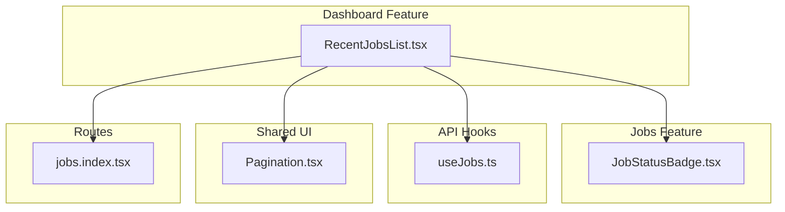
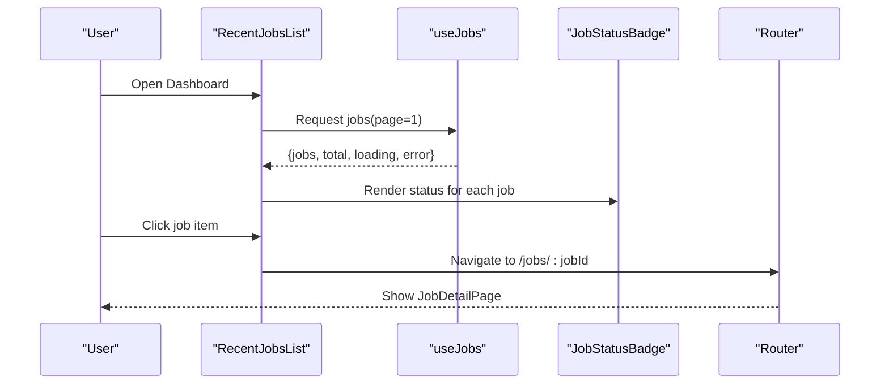
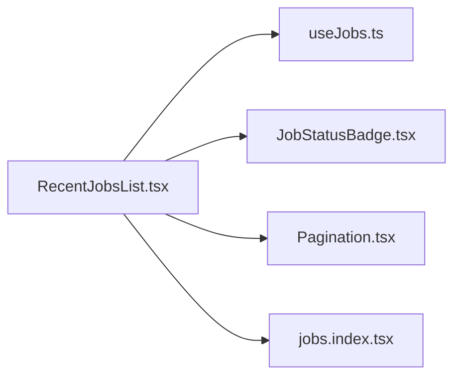

# Recent Jobs List Component

<cite>
**Referenced Files in This Document**
- [RecentJobsList.tsx](file://src/features/dashboard/RecentJobsList.tsx)
- [JobStatusBadge.tsx](file://src/features/jobs/JobStatusBadge.tsx)
- [useJobs.ts](file://src/api/hooks/useJobs.ts)
- [Pagination.tsx](file://src/components/portal/Pagination.tsx)
- [jobs.index.tsx](file://src/routes/_authenticated/jobs.index.tsx)
</cite>

## Table of Contents
1. [Introduction](#introduction)
2. [Project Structure](#project-structure)
3. [Core Components](#core-components)
4. [Architecture Overview](#architecture-overview)
5. [Detailed Component Analysis](#detailed-component-analysis)
6. [Dependency Analysis](#dependency-analysis)
7. [Performance Considerations](#performance-considerations)
8. [Troubleshooting Guide](#troubleshooting-guide)
9. [Conclusion](#conclusion)

## Introduction
The RecentJobsList component renders a scrollable list of recent job completions on the dashboard. Each item shows a status badge, timestamp, and summary information. Users can navigate to a job’s details by clicking an item. The component integrates with data hooks for fetching jobs and uses shared UI primitives for pagination and status badges.

## Project Structure
The component lives under the dashboard feature and composes:
- A data hook for jobs retrieval
- A reusable status badge component
- Pagination controls for navigating through pages
- Navigation integration to open job detail routes

**Diagram sources**
- [RecentJobsList.tsx](file://src/features/dashboard/RecentJobsList.tsx)
- [JobStatusBadge.tsx](file://src/features/jobs/JobStatusBadge.tsx)
- [useJobs.ts](file://src/api/hooks/useJobs.ts)
- [Pagination.tsx](file://src/components/portal/Pagination.tsx)
- [jobs.index.tsx](file://src/routes/_authenticated/jobs.index.tsx)

**Section sources**
- [RecentJobsList.tsx](file://src/features/dashboard/RecentJobsList.tsx)
- [JobStatusBadge.tsx](file://src/features/jobs/JobStatusBadge.tsx)
- [useJobs.ts](file://src/api/hooks/useJobs.ts)
- [Pagination.tsx](file://src/components/portal/Pagination.tsx)
- [jobs.index.tsx](file://src/routes/_authenticated/jobs.index.tsx)

## Core Components
- RecentJobsList: Renders the list, handles page state, fetches data via useJobs, maps items to UI, and navigates to job details.
- JobStatusBadge: Displays a colored badge representing job status (e.g., completed, failed).
- useJobs: Data hook that provides paginated job data and loading/error states.
- Pagination: Shared control for changing the current page and page size.

Key responsibilities:
- Fetching and presenting recent jobs
- Rendering status badges per job
- Showing timestamps and summaries
- Navigating to job detail on click
- Supporting pagination

**Section sources**
- [RecentJobsList.tsx](file://src/features/dashboard/RecentJobsList.tsx)
- [JobStatusBadge.tsx](file://src/features/jobs/JobStatusBadge.tsx)
- [useJobs.ts](file://src/api/hooks/useJobs.ts)
- [Pagination.tsx](file://src/components/portal/Pagination.tsx)

## Architecture Overview
The component follows a clear separation of concerns:
- Data layer: useJobs hook manages API calls and cache state.
- Presentation layer: RecentJobsList composes UI elements and user interactions.
- Navigation: Click actions route to the job detail page.

**Diagram sources**
- [RecentJobsList.tsx](file://src/features/dashboard/RecentJobsList.tsx)
- [useJobs.ts](file://src/api/hooks/useJobs.ts)
- [JobStatusBadge.tsx](file://src/features/jobs/JobStatusBadge.tsx)
- [jobs.index.tsx](file://src/routes/_authenticated/jobs.index.tsx)

## Detailed Component Analysis

### RecentJobsList
Responsibilities:
- Initializes page state and triggers data fetch via useJobs.
- Maps job records to list items showing:
  - Status badge using JobStatusBadge
  - Timestamp formatted for readability
  - Summary text (e.g., title or description snippet)
- Handles click-to-navigate to job details.
- Integrates Pagination for moving between pages.

Behavioral notes:
- Pagination is controlled by the component’s local page state and passed to useJobs.
- Loading and error states from useJobs are surfaced to the UI.
- Click handlers construct the correct route to the job detail page.

Customization guidance:
- To adjust item appearance, override styles around the list row container and typography.
- To add filtering or sorting, introduce local state for filters/sort keys and pass them into the data request if supported by useJobs; otherwise, perform client-side filtering on the fetched array before rendering.

Integration points:
- External search libraries can be integrated by adding a search input that updates a query parameter and refetches jobs via useJobs when available.
- If server-side filtering is not supported, apply client-side filtering after receiving data.

**Section sources**
- [RecentJobsList.tsx](file://src/features/dashboard/RecentJobsList.tsx)
- [useJobs.ts](file://src/api/hooks/useJobs.ts)
- [JobStatusBadge.tsx](file://src/features/jobs/JobStatusBadge.tsx)
- [Pagination.tsx](file://src/components/portal/Pagination.tsx)
- [jobs.index.tsx](file://src/routes/_authenticated/jobs.index.tsx)

### JobStatusBadge
Responsibilities:
- Renders a visual indicator for job status.
- Accepts a status value and maps it to color and label.

Usage:
- Used within each list item to reflect the job’s current state.

Customization:
- Extend status mappings to support additional statuses.
- Adjust colors and labels according to design system tokens.

**Section sources**
- [JobStatusBadge.tsx](file://src/features/jobs/JobStatusBadge.tsx)

### useJobs Hook
Responsibilities:
- Provides paginated job data, including items, total count, and metadata.
- Exposes loading and error states.
- Supports page changes and potentially other query parameters.

Usage:
- RecentJobsList consumes this hook to render up-to-date job lists.

Extensibility:
- If filtering or sorting is needed, extend the hook’s parameters and propagate them to the underlying API call.

**Section sources**
- [useJobs.ts](file://src/api/hooks/useJobs.ts)

### Pagination Control
Responsibilities:
- Renders controls for changing the current page and optionally page size.
- Emits events to update the parent component’s page state.

Usage:
- RecentJobsList binds Pagination to its internal page state.

Customization:
- Adjust visible page size options and button labels.

**Section sources**
- [Pagination.tsx](file://src/components/portal/Pagination.tsx)

### Route Integration
Responsibilities:
- The jobs index route defines the navigation target for job details.
- RecentJobsList navigates to the appropriate job ID path upon item click.

**Section sources**
- [jobs.index.tsx](file://src/routes/_authenticated/jobs.index.tsx)

## Dependency Analysis

**Diagram sources**
- [RecentJobsList.tsx](file://src/features/dashboard/RecentJobsList.tsx)
- [useJobs.ts](file://src/api/hooks/useJobs.ts)
- [JobStatusBadge.tsx](file://src/features/jobs/JobStatusBadge.tsx)
- [Pagination.tsx](file://src/components/portal/Pagination.tsx)
- [jobs.index.tsx](file://src/routes/_authenticated/jobs.index.tsx)

**Section sources**
- [RecentJobsList.tsx](file://src/features/dashboard/RecentJobsList.tsx)
- [useJobs.ts](file://src/api/hooks/useJobs.ts)
- [JobStatusBadge.tsx](file://src/features/jobs/JobStatusBadge.tsx)
- [Pagination.tsx](file://src/components/portal/Pagination.tsx)
- [jobs.index.tsx](file://src/routes/_authenticated/jobs.index.tsx)

## Performance Considerations
- Prefer server-side pagination via useJobs to limit payload size.
- Avoid unnecessary re-renders by memoizing list items where possible.
- Debounce any client-side search inputs if implemented locally.
- Use stable keys for list items based on job IDs to optimize reconciliation.

[No sources needed since this section provides general guidance]

## Troubleshooting Guide
Common issues and resolutions:
- Empty list: Verify useJobs returns data and that the current page has results. Check network requests and error states.
- Incorrect status display: Ensure JobStatusBadge supports all returned status values. Add missing mappings if necessary.
- Navigation not working: Confirm the route pattern matches the job detail URL and that the clicked job ID is valid.
- Pagination not updating: Ensure page state is correctly bound to both the hook and Pagination component.

**Section sources**
- [RecentJobsList.tsx](file://src/features/dashboard/RecentJobsList.tsx)
- [useJobs.ts](file://src/api/hooks/useJobs.ts)
- [JobStatusBadge.tsx](file://src/features/jobs/JobStatusBadge.tsx)
- [Pagination.tsx](file://src/components/portal/Pagination.tsx)
- [jobs.index.tsx](file://src/routes/_authenticated/jobs.index.tsx)

## Conclusion
RecentJobsList delivers a concise, interactive view of recent job completions with status badges, timestamps, and summaries. It leverages useJobs for data, JobStatusBadge for status visualization, and Pagination for navigation. With minimal customization, you can adapt appearance, integrate external search/filtering, and ensure smooth navigation to job details.

[No sources needed since this section summarizes without analyzing specific files]