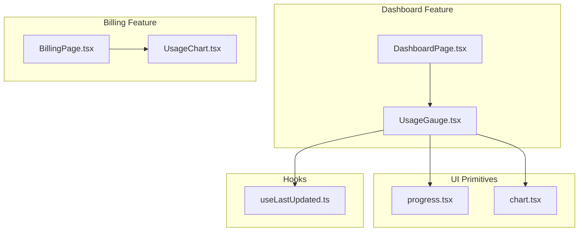
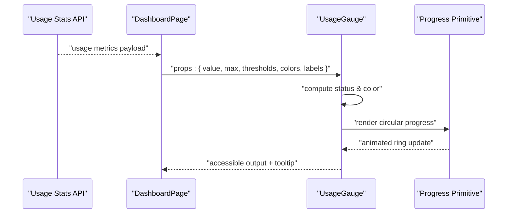
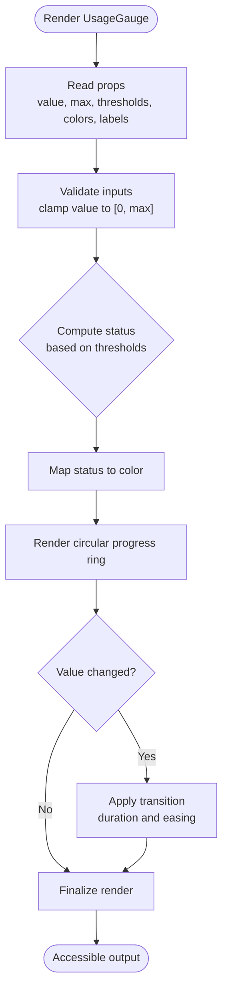
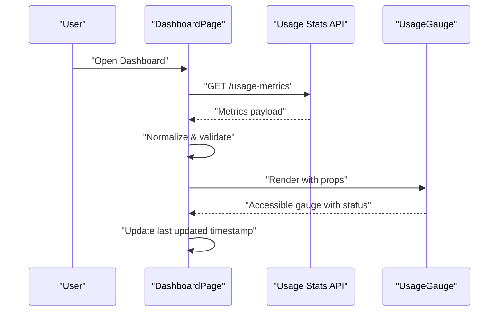
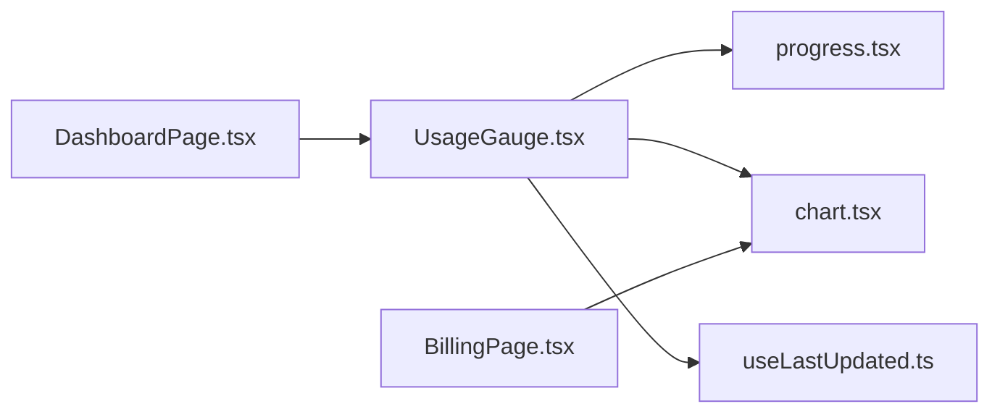

# Usage Gauge Component

<cite>
**Referenced Files in This Document**
- [UsageGauge.tsx](file://src/features/dashboard/UsageGauge.tsx)
- [DashboardPage.tsx](file://src/features/dashboard/DashboardPage.tsx)
- [progress.tsx](file://src/components/ui/progress.tsx)
- [chart.tsx](file://src/components/ui/chart.tsx)
- [useLastUpdated.ts](file://src/hooks/useLastUpdated.ts)
- [BillingPage.tsx](file://src/features/billing/BillingPage.tsx)
- [UsageChart.tsx](file://src/features/billing/UsageChart.tsx)
</cite>

## Table of Contents
1. [Introduction](#introduction)
2. [Project Structure](#project-structure)
3. [Core Components](#core-components)
4. [Architecture Overview](#architecture-overview)
5. [Detailed Component Analysis](#detailed-component-analysis)
6. [Dependency Analysis](#dependency-analysis)
7. [Performance Considerations](#performance-considerations)
8. [Troubleshooting Guide](#troubleshooting-guide)
9. [Conclusion](#conclusion)
10. [Appendices](#appendices)

## Introduction
This document provides comprehensive documentation for the UsageGauge component, which visualizes resource usage metrics using circular progress indicators. It explains how thresholds and color-coded status levels communicate risk, how data binds from usage statistics APIs, and how animations provide smooth updates. It also covers accessibility considerations, configuration options (ranges, colors, labels), integration patterns for multiple gauges, and handling edge cases such as missing data or extreme values.

## Project Structure
The UsageGauge is implemented within the dashboard feature and integrates with shared UI primitives for progress visualization. Related billing features include a usage chart that complements gauge-based dashboards.

**Diagram sources**
- [UsageGauge.tsx](file://src/features/dashboard/UsageGauge.tsx)
- [DashboardPage.tsx](file://src/features/dashboard/DashboardPage.tsx)
- [progress.tsx](file://src/components/ui/progress.tsx)
- [chart.tsx](file://src/components/ui/chart.tsx)
- [useLastUpdated.ts](file://src/hooks/useLastUpdated.ts)
- [BillingPage.tsx](file://src/features/billing/BillingPage.tsx)
- [UsageChart.tsx](file://src/features/billing/UsageChart.tsx)

**Section sources**
- [UsageGauge.tsx](file://src/features/dashboard/UsageGauge.tsx)
- [DashboardPage.tsx](file://src/features/dashboard/DashboardPage.tsx)
- [progress.tsx](file://src/components/ui/progress.tsx)
- [chart.tsx](file://src/components/ui/chart.tsx)
- [useLastUpdated.ts](file://src/hooks/useLastUpdated.ts)
- [BillingPage.tsx](file://src/features/billing/BillingPage.tsx)
- [UsageChart.tsx](file://src/features/billing/UsageChart.tsx)

## Core Components
- UsageGauge: Renders a circular progress indicator representing current usage against a configured maximum. It applies threshold-based coloring and labels to indicate status levels (e.g., normal, warning, critical). It supports animated transitions when values change and exposes props for customization of ranges, colors, and labels.
- DashboardPage: Hosts one or more UsageGauge instances, typically binding them to usage statistics fetched from an API. It may also display contextual information like last updated timestamps.
- Progress primitive: Provides the underlying circular progress rendering used by UsageGauge.
- Chart primitive: Used elsewhere in the app for usage trends; can complement gauges in dashboards.
- useLastUpdated hook: Supplies timestamp updates to reflect freshness of metrics.

**Section sources**
- [UsageGauge.tsx](file://src/features/dashboard/UsageGauge.tsx)
- [DashboardPage.tsx](file://src/features/dashboard/DatewayPage.tsx)
- [progress.tsx](file://src/components/ui/progress.tsx)
- [chart.tsx](file://src/components/ui/chart.tsx)
- [useLastUpdated.ts](file://src/hooks/useLastUpdated.ts)

## Architecture Overview
UsageGauge composes a circular progress ring driven by numeric inputs (current value and max). Threshold rules determine color and label states. Data flows from usage APIs into the dashboard page, then into UsageGauge via props. Animations are applied on value changes to ensure smooth transitions. Accessibility attributes ensure screen readers interpret the gauge correctly.

**Diagram sources**
- [DashboardPage.tsx](file://src/features/dashboard/DashboardPage.tsx)
- [UsageGauge.tsx](file://src/features/dashboard/UsageGauge.tsx)
- [progress.tsx](file://src/components/ui/progress.tsx)

## Detailed Component Analysis

### UsageGauge Component
UsageGauge renders a circular progress indicator with threshold-driven styling and accessible labeling. It accepts configuration for ranges, colors, and labels, and handles animation transitions when values change.

Key responsibilities:
- Compute status level based on thresholds (e.g., low, medium, high).
- Map status to color and label.
- Render a circular progress ring reflecting value/max ratio.
- Apply smooth animations on value changes.
- Provide accessible semantics (aria attributes, roles, and text alternatives).

Configuration options:
- value: Current usage amount.
- max: Maximum allowed usage.
- thresholds: Array defining boundaries and associated statuses.
- colors: Mapping from status to color tokens.
- labels: Mapping from status to human-readable labels.
- showValue: Whether to display the numeric value inside the ring.
- showLabel: Whether to display the status label below or beside the ring.
- animationDuration: Duration for transitions when value changes.
- ariaLabel: Accessible name for the gauge.

Data binding:
- Typically receives value and max from parent components bound to API responses.
- Parent may normalize missing or invalid data before passing to UsageGauge.

Animation transitions:
- Uses CSS transitions or animation utilities to animate the progress ring fill and color changes.
- Animation duration can be configured to balance responsiveness and performance.

Accessibility:
- Role and aria-valuenow, aria-valuemin, aria-valuemax set appropriately.
- ARIA label conveys purpose and current state.
- Color contrast meets WCAG guidelines; status conveyed via both color and text label.

Edge case handling:
- Missing data: Display neutral/default state with placeholder label and disabled animation.
- Zero or negative values: Clamp to valid range and show appropriate status.
- Extreme values: Cap at max to avoid overflow; optionally highlight critical threshold.

**Diagram sources**
- [UsageGauge.tsx](file://src/features/dashboard/UsageGauge.tsx)

**Section sources**
- [UsageGauge.tsx](file://src/features/dashboard/UsageGauge.tsx)

### Dashboard Integration
DashboardPage hosts UsageGauge instances and binds them to usage statistics. It may fetch data from an API, handle loading and error states, and pass normalized values to UsageGauge.

Responsibilities:
- Fetch usage metrics and manage loading/error states.
- Normalize data (handle missing fields, convert units).
- Configure thresholds, colors, and labels per metric type.
- Compose multiple gauges for different resources (CPU, memory, storage, requests).
- Display last updated timestamp using useLastUpdated.

**Diagram sources**
- [DashboardPage.tsx](file://src/features/dashboard/DashboardPage.tsx)
- [UsageGauge.tsx](file://src/features/dashboard/UsageGauge.tsx)
- [useLastUpdated.ts](file://src/hooks/useLastUpdated.ts)

**Section sources**
- [DashboardPage.tsx](file://src/features/dashboard/DashboardPage.tsx)
- [useLastUpdated.ts](file://src/hooks/useLastUpdated.ts)

### Supporting UI Primitives
- Progress primitive: Provides the circular progress rendering used by UsageGauge. It should support animated fills and accessible attributes.
- Chart primitive: Used in billing features to visualize trends over time; complements gauges by showing historical context.

**Section sources**
- [progress.tsx](file://src/components/ui/progress.tsx)
- [chart.tsx](file://src/components/ui/chart.tsx)

### Billing Feature Context
BillingPage and UsageChart demonstrate how usage data is presented alongside billing information. While not directly part of UsageGauge, they inform best practices for integrating gauges with charts and tables.

**Section sources**
- [BillingPage.tsx](file://src/features/billing/BillingPage.tsx)
- [UsageChart.tsx](file://src/features/billing/UsageChart.tsx)

## Dependency Analysis
UsageGauge depends on:
- Progress primitive for rendering.
- Optional chart primitive for complementary trend visualization.
- Hooks for timestamp updates.
- Parent components for data binding and configuration.

**Diagram sources**
- [UsageGauge.tsx](file://src/features/dashboard/UsageGauge.tsx)
- [progress.tsx](file://src/components/ui/progress.tsx)
- [chart.tsx](file://src/components/ui/chart.tsx)
- [useLastUpdated.ts](file://src/hooks/useLastUpdated.ts)
- [DashboardPage.tsx](file://src/features/dashboard/DashboardPage.tsx)
- [BillingPage.tsx](file://src/features/billing/BillingPage.tsx)

**Section sources**
- [UsageGauge.tsx](file://src/features/dashboard/UsageGauge.tsx)
- [progress.tsx](file://src/components/ui/progress.tsx)
- [chart.tsx](file://src/components/ui/chart.tsx)
- [useLastUpdated.ts](file://src/hooks/useLastUpdated.ts)
- [DashboardPage.tsx](file://src/features/dashboard/DashboardPage.tsx)
- [BillingPage.tsx](file://src/features/billing/BillingPage.tsx)

## Performance Considerations
- Prefer lightweight animations: Use CSS transitions with short durations to avoid jank during frequent updates.
- Debounce rapid updates: If usage metrics refresh frequently, debounce value changes to reduce re-renders.
- Memoize computed status: Cache threshold computations to avoid unnecessary recalculations.
- Avoid heavy layouts: Keep gauge components small and avoid expensive child components inside the ring.
- Respect prefers-reduced-motion: Disable or simplify animations for users who prefer reduced motion.

[No sources needed since this section provides general guidance]

## Troubleshooting Guide
Common issues and resolutions:
- Missing data: Ensure parent components normalize null/undefined values before passing to UsageGauge. Display a neutral state with placeholder labels.
- Incorrect thresholds: Verify threshold arrays are sorted and cover the full range from 0 to max. Test boundary conditions.
- Color contrast failures: Confirm color tokens meet WCAG contrast requirements against background. Provide non-color status cues (labels, icons).
- Animation stutter: Reduce animation duration or disable animations on low-power devices. Check for layout thrashing during updates.
- Accessibility errors: Validate aria attributes and labels. Ensure screen readers announce current value and status.

**Section sources**
- [UsageGauge.tsx](file://src/features/dashboard/UsageGauge.tsx)
- [progress.tsx](file://src/components/ui/progress.tsx)

## Conclusion
UsageGauge delivers clear, accessible, and responsive visualization of resource usage through circular progress indicators. With configurable thresholds, colors, and labels, it communicates status effectively while maintaining performance and accessibility. Integrating multiple gauges across dashboards enables comprehensive monitoring, and robust edge-case handling ensures reliability under varying data conditions.

[No sources needed since this section summarizes without analyzing specific files]

## Appendices

### Configuration Examples
- Basic gauge: Set value and max, default thresholds and colors.
- Custom thresholds: Define boundaries and map statuses to colors and labels.
- Multiple gauges: Instantiate UsageGauge per resource, each with tailored thresholds and labels.

[No sources needed since this section provides general guidance]

### Accessibility Checklist
- Provide aria-label describing the gauge purpose.
- Set aria-valuenow, aria-valuemin, aria-valuemax accurately.
- Ensure visible labels convey status beyond color alone.
- Test with screen readers and keyboard navigation.

[No sources needed since this section provides general guidance]