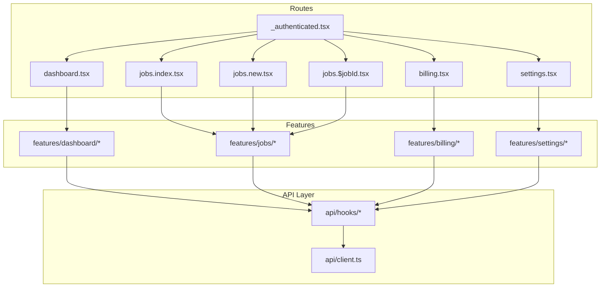
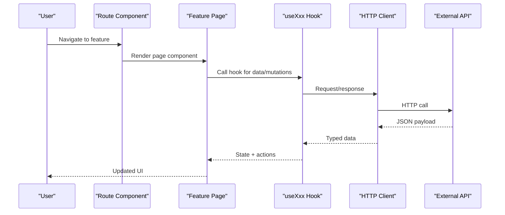
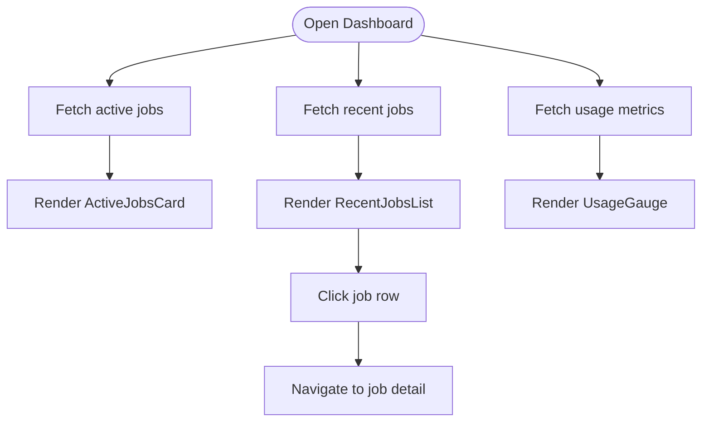
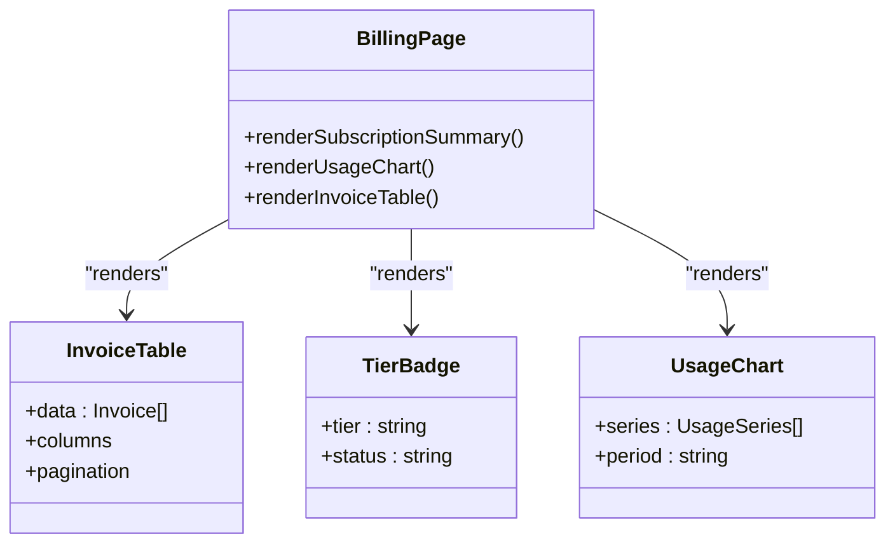
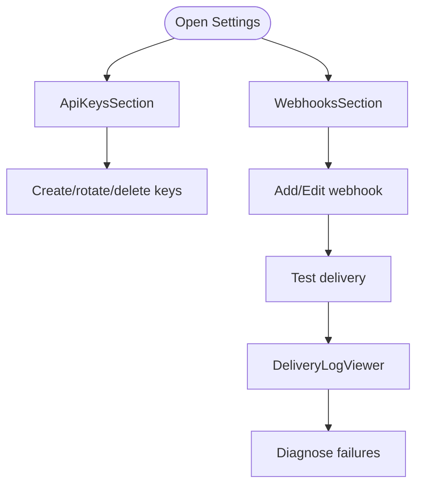
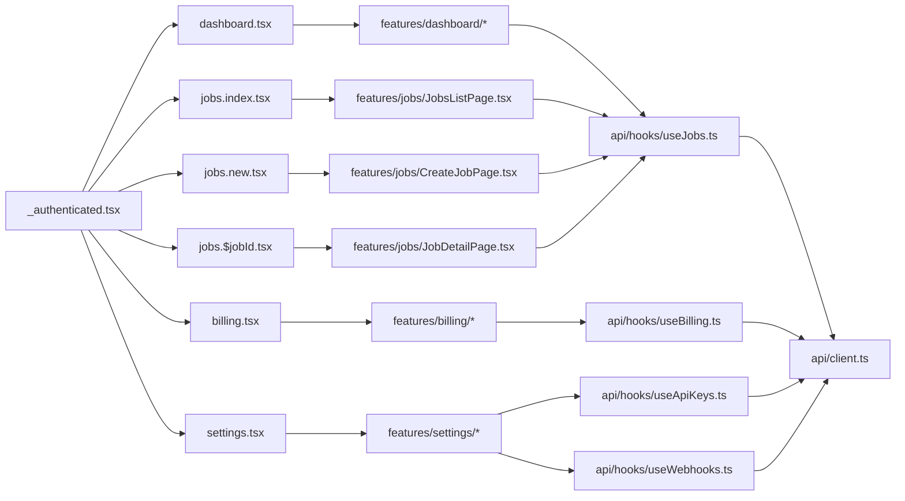

# Features & Modules

<cite>
**Referenced Files in This Document**
- [DashboardPage.tsx](file://src/features/dashboard/DashboardPage.tsx)
- [ActiveJobsCard.tsx](file://src/features/dashboard/ActiveJobsCard.tsx)
- [RecentJobsList.tsx](file://src/features/dashboard/RecentJobsList.tsx)
- [UsageGauge.tsx](file://src/features/dashboard/UsageGauge.tsx)
- [CreateJobPage.tsx](file://src/features/jobs/CreateJobPage.tsx)
- [FileDropZone.tsx](file://src/features/jobs/FileDropZone.tsx)
- [JobDetailPage.tsx](file://src/features/jobs/JobDetailPage.tsx)
- [JobStatusBadge.tsx](file://src/features/jobs/JobStatusBadge.tsx)
- [JobsListPage.tsx](file://src/features/jobs/JobsListPage.tsx)
- [BillingPage.tsx](file://src/features/billing/BillingPage.tsx)
- [InvoiceTable.tsx](file://src/features/billing/InvoiceTable.tsx)
- [TierBadge.tsx](file://src/features/billing/TierBadge.tsx)
- [UsageChart.tsx](file://src/features/billing/UsageChart.tsx)
- [ApiKeysSection.tsx](file://src/features/settings/ApiKeysSection.tsx)
- [DeliveryLogViewer.tsx](file://src/features/settings/DeliveryLogViewer.tsx)
- [SettingsPage.tsx](file://src/features/settings/SettingsPage.tsx)
- [WebhookForm.tsx](file://src/features/settings/WebhookForm.tsx)
- [WebhooksSection.tsx](file://src/features/settings/WebhooksSection.tsx)
- [useJobs.ts](file://src/api/hooks/useJobs.ts)
- [useBilling.ts](file://src/api/hooks/useBilling.ts)
- [useApiKeys.ts](file://src/api/hooks/useApiKeys.ts)
- [useWebhooks.ts](file://src/api/hooks/useWebhooks.ts)
- [client.ts](file://src/api/client.ts)
- [router.tsx](file://src/router.tsx)
- [_authenticated.tsx](file://src/routes/_authenticated.tsx)
- [dashboard.tsx](file://src/routes/_authenticated/dashboard.tsx)
- [jobs.index.tsx](file://src/routes/_authenticated/jobs.index.tsx)
- [jobs.new.tsx](file://src/routes/_authenticated/jobs.new.tsx)
- [jobs.$jobId.tsx](file://src/routes/_authenticated/jobs.$jobId.tsx)
- [billing.tsx](file://src/routes/_authenticated/billing.tsx)
- [settings.tsx](file://src/routes/_authenticated/settings.tsx)
</cite>

## Table of Contents
1. Introduction
2. Project Structure
3. Core Components
4. Architecture Overview
5. Detailed Component Analysis
6. Dependency Analysis
7. Performance Considerations
8. Troubleshooting Guide
9. Conclusion

## Introduction
This document explains TrackDub Portal’s feature modules and how they work together to deliver a complete translation workflow: monitoring activity on the dashboard, creating and tracking jobs, managing billing and usage, and configuring API keys and webhooks for integrations. It covers user workflows, data models, business logic, UI screens, and integration points with external APIs via the client layer and hooks.

## Project Structure
The portal is organized by features under src/features, with shared UI components under src/components/ui and portal-specific primitives under src/components/portal. Data access is centralized in src/api (client and typed hooks), and routes are defined under src/routes. The authenticated shell and routing configuration live in src/router.tsx and src/routes/_authenticated.tsx.



**Diagram sources**
- [router.tsx](file://src/router.tsx)
- [_authenticated.tsx](file://src/routes/_authenticated.tsx)
- [dashboard.tsx](file://src/routes/_authenticated/dashboard.tsx)
- [jobs.index.tsx](file://src/routes/_authenticated/jobs.index.tsx)
- [jobs.new.tsx](file://src/routes/_authenticated/jobs.new.tsx)
- [jobs.$jobId.tsx](file://src/routes/_authenticated/jobs.$jobId.tsx)
- [billing.tsx](file://src/routes/_authenticated/billing.tsx)
- [settings.tsx](file://src/routes/_authenticated/settings.tsx)
- [client.ts](file://src/api/client.ts)
- [useJobs.ts](file://src/api/hooks/useJobs.ts)
- [useBilling.ts](file://src/api/hooks/useBilling.ts)
- [useApiKeys.ts](file://src/api/hooks/useApiKeys.ts)
- [useWebhooks.ts](file://src/api/hooks/useWebhooks.ts)

**Section sources**
- [router.tsx](file://src/router.tsx)
- [_authenticated.tsx](file://src/routes/_authenticated.tsx)

## Core Components
- Dashboard: ActiveJobsCard, RecentJobsList, UsageGauge, and the page container provide an overview of ongoing jobs and consumption metrics.
- Jobs: CreateJobPage, FileDropZone, JobDetailPage, JobStatusBadge, and JobsListPage support job creation, file upload, status tracking, and list navigation.
- Billing: BillingPage, InvoiceTable, TierBadge, and UsageChart display subscription details, invoices, tier info, and usage trends.
- Settings: ApiKeysSection, WebhooksSection, WebhookForm, DeliveryLogViewer, and SettingsPage manage API keys, webhook endpoints, and delivery logs.

These components consume typed data through hooks that wrap the HTTP client.

**Section sources**
- [DashboardPage.tsx](file://src/features/dashboard/DashboardPage.tsx)
- [ActiveJobsCard.tsx](file://src/features/dashboard/ActiveJobsCard.tsx)
- [RecentJobsList.tsx](file://src/features/dashboard/RecentJobsList.tsx)
- [UsageGauge.tsx](file://src/features/dashboard/UsageGauge.tsx)
- [CreateJobPage.tsx](file://src/features/jobs/CreateJobPage.tsx)
- [FileDropZone.tsx](file://src/features/jobs/FileDropZone.tsx)
- [JobDetailPage.tsx](file://src/features/jobs/JobDetailPage.tsx)
- [JobStatusBadge.tsx](file://src/features/jobs/JobStatusBadge.tsx)
- [JobsListPage.tsx](file://src/features/jobs/JobsListPage.tsx)
- [BillingPage.tsx](file://src/features/billing/BillingPage.tsx)
- [InvoiceTable.tsx](file://src/features/billing/InvoiceTable.tsx)
- [TierBadge.tsx](file://src/features/billing/TierBadge.tsx)
- [UsageChart.tsx](file://src/features/billing/UsageChart.tsx)
- [ApiKeysSection.tsx](file://src/features/settings/ApiKeysSection.tsx)
- [WebhooksSection.tsx](file://src/features/settings/WebhooksSection.tsx)
- [WebhookForm.tsx](file://src/features/settings/WebhookForm.tsx)
- [DeliveryLogViewer.tsx](file://src/features/settings/DeliveryLogViewer.tsx)
- [SettingsPage.tsx](file://src/features/settings/SettingsPage.tsx)

## Architecture Overview
The portal follows a feature-based architecture with a thin API layer:
- Routes render feature pages.
- Feature pages compose UI components.
- Components call typed hooks for data operations.
- Hooks use a central HTTP client to communicate with backend services.



**Diagram sources**
- [client.ts](file://src/api/client.ts)
- [useJobs.ts](file://src/api/hooks/useJobs.ts)
- [useBilling.ts](file://src/api/hooks/useBilling.ts)
- [useApiKeys.ts](file://src/api/hooks/useApiKeys.ts)
- [useWebhooks.ts](file://src/api/hooks/useWebhooks.ts)

## Detailed Component Analysis

### Dashboard Module
Purpose: Provide a real-time snapshot of active jobs and usage metrics.

Key components:
- DashboardPage: Aggregates cards and lists for active jobs and recent activity.
- ActiveJobsCard: Displays count and quick actions for active jobs.
- RecentJobsList: Lists recent jobs with status and links to details.
- UsageGauge: Visualizes current usage against limits or quotas.

User workflow:
- Open Dashboard to see active job counts and recent items.
- Click into a job from RecentJobsList to view details.
- Monitor UsageGauge to understand quota consumption.

Data model highlights:
- Active jobs: id, title/source/target languages, status, created time.
- Recent jobs: subset of job records with minimal fields.
- Usage metrics: consumed vs. limit, period boundaries.

Integration points:
- Uses useJobs to fetch active/recent jobs.
- Uses useBilling for usage metrics.



**Diagram sources**
- [DashboardPage.tsx](file://src/features/dashboard/DashboardPage.tsx)
- [ActiveJobsCard.tsx](file://src/features/dashboard/ActiveJobsCard.tsx)
- [RecentJobsList.tsx](file://src/features/dashboard/RecentJobsList.tsx)
- [UsageGauge.tsx](file://src/features/dashboard/UsageGauge.tsx)
- [useJobs.ts](file://src/api/hooks/useJobs.ts)
- [useBilling.ts](file://src/api/hooks/useBilling.ts)

**Section sources**
- [DashboardPage.tsx](file://src/features/dashboard/DashboardPage.tsx)
- [ActiveJobsCard.tsx](file://src/features/dashboard/ActiveJobsCard.tsx)
- [RecentJobsList.tsx](file://src/features/dashboard/RecentJobsList.tsx)
- [UsageGauge.tsx](file://src/features/dashboard/UsageGauge.tsx)

### Jobs Module
Purpose: Create, track, and manage translation jobs end-to-end.

Key components:
- JobsListPage: Paginated list of jobs with filters and search.
- CreateJobPage: Form to create a new job; supports file upload via FileDropZone.
- JobDetailPage: Shows full job metadata, steps, status timeline, and outputs.
- JobStatusBadge: Renders normalized status labels and colors.

User workflow:
- From Jobs list, click “New” to open CreateJobPage.
- Upload files or paste content, select source/target languages, and submit.
- Track progress in JobsListPage and drill into JobDetailPage for specifics.
- Use JobStatusBadge to interpret status at a glance.

Data model highlights:
- Job: id, title, source language, target languages, status, timestamps, file references, output artifacts.
- Status values: queued, processing, completed, failed, cancelled.

Integration points:
- useJobs provides queries and mutations for listing, creating, and fetching details.
- FileDropZone integrates with the job creation mutation to upload files before submission.

```mermaid
sequenceDiagram
participant User as "User"
participant List as "JobsListPage"
participant Create as "CreateJobPage"
participant Drop as "FileDropZone"
participant Hook as "useJobs"
participant Client as "HTTP Client"
participant API as "Translation API"
User->>List : Open Jobs
List->>Hook : getJobs()
Hook->>Client : GET /jobs
Client->>API : Request
API-->>Client : Jobs[]
Client-->>Hook : Jobs[]
Hook-->>List : Render list
User->>Create : New Job
Create->>Drop : Select files
Drop->>Hook : uploadFiles()
Hook->>Client : POST /files
Client->>API : Upload
API-->>Client : fileIds[]
Client-->>Hook : fileIds[]
Hook-->>Create : fileIds[]
Create->>Hook : createJob({title, langs, fileIds})
Hook->>Client : POST /jobs
Client->>API : Create
API-->>Client : jobId
Client-->>Hook : jobId
Hook-->>Create : Redirect to detail
```

**Diagram sources**
- [JobsListPage.tsx](file://src/features/jobs/JobsListPage.tsx)
- [CreateJobPage.tsx](file://src/features/jobs/CreateJobPage.tsx)
- [FileDropZone.tsx](file://src/features/jobs/FileDropZone.tsx)
- [JobDetailPage.tsx](file://src/features/jobs/JobDetailPage.tsx)
- [useJobs.ts](file://src/api/hooks/useJobs.ts)
- [client.ts](file://src/api/client.ts)

**Section sources**
- [JobsListPage.tsx](file://src/features/jobs/JobsListPage.tsx)
- [CreateJobPage.tsx](file://src/features/jobs/CreateJobPage.tsx)
- [FileDropZone.tsx](file://src/features/jobs/FileDropZone.tsx)
- [JobDetailPage.tsx](file://src/features/jobs/JobDetailPage.tsx)
- [JobStatusBadge.tsx](file://src/features/jobs/JobStatusBadge.tsx)
- [useJobs.ts](file://src/api/hooks/useJobs.ts)

### Billing Module
Purpose: Show subscription tier, invoices, and usage trends to help users monitor costs and limits.

Key components:
- BillingPage: Container for subscription summary and charts.
- InvoiceTable: Paginated invoice list with status and amounts.
- TierBadge: Displays current plan tier with visual badge.
- UsageChart: Time-series chart of usage over the billing period.

User workflow:
- Open Billing to review current tier and usage trend.
- Inspect invoices for past charges and download receipts if available.
- Adjust plans or set alerts based on usage patterns.

Data model highlights:
- Subscription: tier, start/end dates, status.
- Invoice: id, date, amount, currency, status, link to PDF.
- Usage: period totals, per-feature breakdowns, thresholds.

Integration points:
- useBilling provides subscription, invoice, and usage queries.



**Diagram sources**
- [BillingPage.tsx](file://src/features/billing/BillingPage.tsx)
- [InvoiceTable.tsx](file://src/features/billing/InvoiceTable.tsx)
- [TierBadge.tsx](file://src/features/billing/TierBadge.tsx)
- [UsageChart.tsx](file://src/features/billing/UsageChart.tsx)
- [useBilling.ts](file://src/api/hooks/useBilling.ts)

**Section sources**
- [BillingPage.tsx](file://src/features/billing/BillingPage.tsx)
- [InvoiceTable.tsx](file://src/features/billing/InvoiceTable.tsx)
- [TierBadge.tsx](file://src/features/billing/TierBadge.tsx)
- [UsageChart.tsx](file://src/features/billing/UsageChart.tsx)
- [useBilling.ts](file://src/api/hooks/useBilling.ts)

### Settings Module
Purpose: Manage API keys and webhook configurations, and inspect delivery logs for troubleshooting.

Key components:
- SettingsPage: Tabbed layout for API keys and webhooks sections.
- ApiKeysSection: List, create, rotate, and delete API keys with permissions.
- WebhooksSection: List configured webhooks and toggle activation.
- WebhookForm: Create/edit webhook endpoint, events, and secret.
- DeliveryLogViewer: View inbound webhook deliveries and payloads.

User workflow:
- Generate API keys for programmatic access and store securely.
- Configure webhooks to receive job completion events; test and verify deliveries.
- Review delivery logs to diagnose failures and retry if needed.

Data model highlights:
- ApiKey: id, name, scopes, createdAt, lastUsedAt, revoked.
- Webhook: id, url, events[], active, secret, lastDeliveryStatus.
- DeliveryLog: eventId, url, method, statusCode, body, timestamp.

Integration points:
- useApiKeys manages key lifecycle mutations and queries.
- useWebhooks manages webhook CRUD and delivery inspection.



**Diagram sources**
- [SettingsPage.tsx](file://src/features/settings/SettingsPage.tsx)
- [ApiKeysSection.tsx](file://src/features/settings/ApiKeysSection.tsx)
- [WebhooksSection.tsx](file://src/features/settings/WebhooksSection.tsx)
- [WebhookForm.tsx](file://src/features/settings/WebhookForm.tsx)
- [DeliveryLogViewer.tsx](file://src/features/settings/DeliveryLogViewer.tsx)
- [useApiKeys.ts](file://src/api/hooks/useApiKeys.ts)
- [useWebhooks.ts](file://src/api/hooks/useWebhooks.ts)

**Section sources**
- [SettingsPage.tsx](file://src/features/settings/SettingsPage.tsx)
- [ApiKeysSection.tsx](file://src/features/settings/ApiKeysSection.tsx)
- [WebhooksSection.tsx](file://src/features/settings/WebhooksSection.tsx)
- [WebhookForm.tsx](file://src/features/settings/WebhookForm.tsx)
- [DeliveryLogViewer.tsx](file://src/features/settings/DeliveryLogViewer.tsx)
- [useApiKeys.ts](file://src/api/hooks/useApiKeys.ts)
- [useWebhooks.ts](file://src/api/hooks/useWebhooks.ts)

## Dependency Analysis
- Routing: _authenticated.tsx wraps protected routes; individual route files map to feature pages.
- Features depend on hooks for data; hooks depend on the HTTP client.
- Shared UI components are reused across features for consistency.



**Diagram sources**
- [_authenticated.tsx](file://src/routes/_authenticated.tsx)
- [dashboard.tsx](file://src/routes/_authenticated/dashboard.tsx)
- [jobs.index.tsx](file://src/routes/_authenticated/jobs.index.tsx)
- [jobs.new.tsx](file://src/routes/_authenticated/jobs.new.tsx)
- [jobs.$jobId.tsx](file://src/routes/_authenticated/jobs.$jobId.tsx)
- [billing.tsx](file://src/routes/_authenticated/billing.tsx)
- [settings.tsx](file://src/routes/_authenticated/settings.tsx)
- [useJobs.ts](file://src/api/hooks/useJobs.ts)
- [useBilling.ts](file://src/api/hooks/useBilling.ts)
- [useApiKeys.ts](file://src/api/hooks/useApiKeys.ts)
- [useWebhooks.ts](file://src/api/hooks/useWebhooks.ts)
- [client.ts](file://src/api/client.ts)

**Section sources**
- [_authenticated.tsx](file://src/routes/_authenticated.tsx)
- [client.ts](file://src/api/client.ts)

## Performance Considerations
- Prefer lazy loading of heavy charts and tables where appropriate to reduce initial bundle size.
- Cache frequently accessed data (e.g., recent jobs, usage summaries) using optimistic updates and stale-while-revalidate strategies in hooks.
- Debounce search inputs in JobsListPage to minimize network calls.
- Paginate large datasets (invoices, delivery logs) to avoid rendering overhead.
- Use skeleton loaders for perceived performance during async operations.

[No sources needed since this section provides general guidance]

## Troubleshooting Guide
Common issues and resolutions:
- API errors: Inspect error responses in the browser console and ensure correct authentication headers when using API keys.
- Webhook failures: Check DeliveryLogViewer for status codes and payloads; verify endpoint availability and secret validation.
- Job stuck in processing: Verify upstream service health and retry via job detail actions if supported.
- Usage discrepancies: Cross-check UsageChart with actual job volumes and billing periods.

Operational tips:
- Rotate compromised API keys immediately via ApiKeysSection.
- Enable only required webhook events to reduce noise.
- Log correlation IDs from requests to trace end-to-end flows.

**Section sources**
- [DeliveryLogViewer.tsx](file://src/features/settings/DeliveryLogViewer.tsx)
- [ApiKeysSection.tsx](file://src/features/settings/ApiKeysSection.tsx)
- [useWebhooks.ts](file://src/api/hooks/useWebhooks.ts)
- [useApiKeys.ts](file://src/api/hooks/useApiKeys.ts)

## Conclusion
TrackDub Portal organizes its functionality into clear feature modules with a consistent data flow through typed hooks and a central HTTP client. The Dashboard provides visibility, Jobs enable creation and tracking, Billing offers cost control, and Settings ensures secure integrations. Together, these modules form a cohesive platform for managing translation workflows at scale.

[No sources needed since this section summarizes without analyzing specific files]