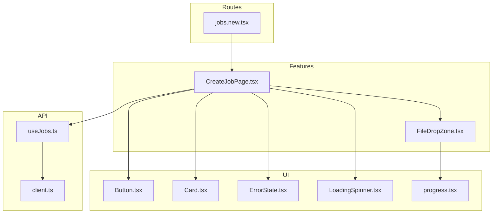
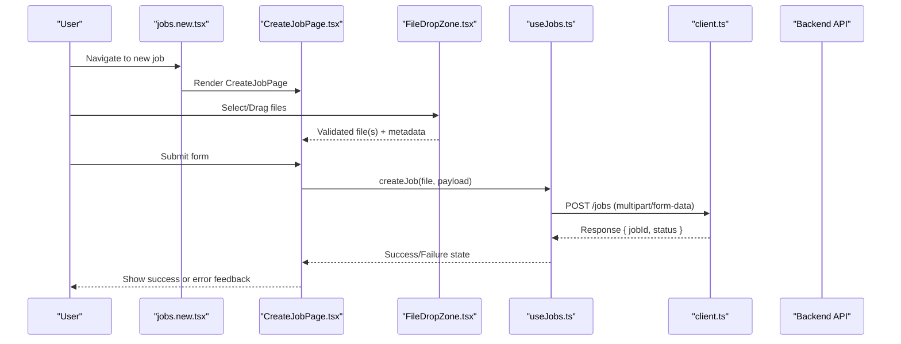
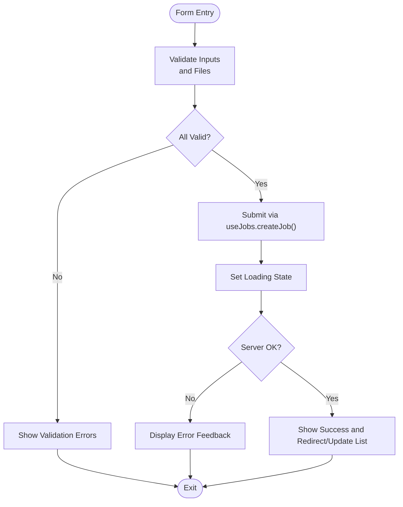
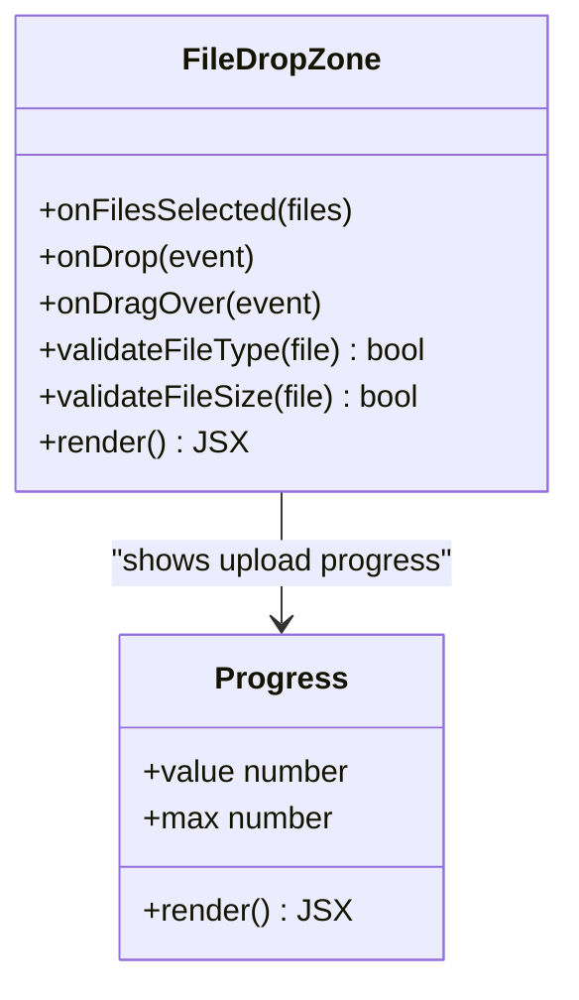
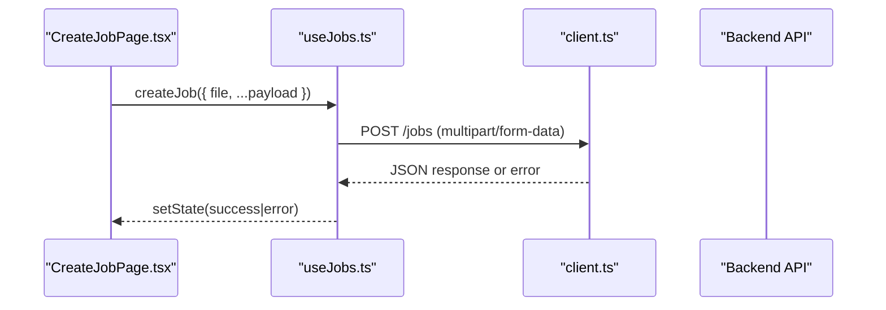
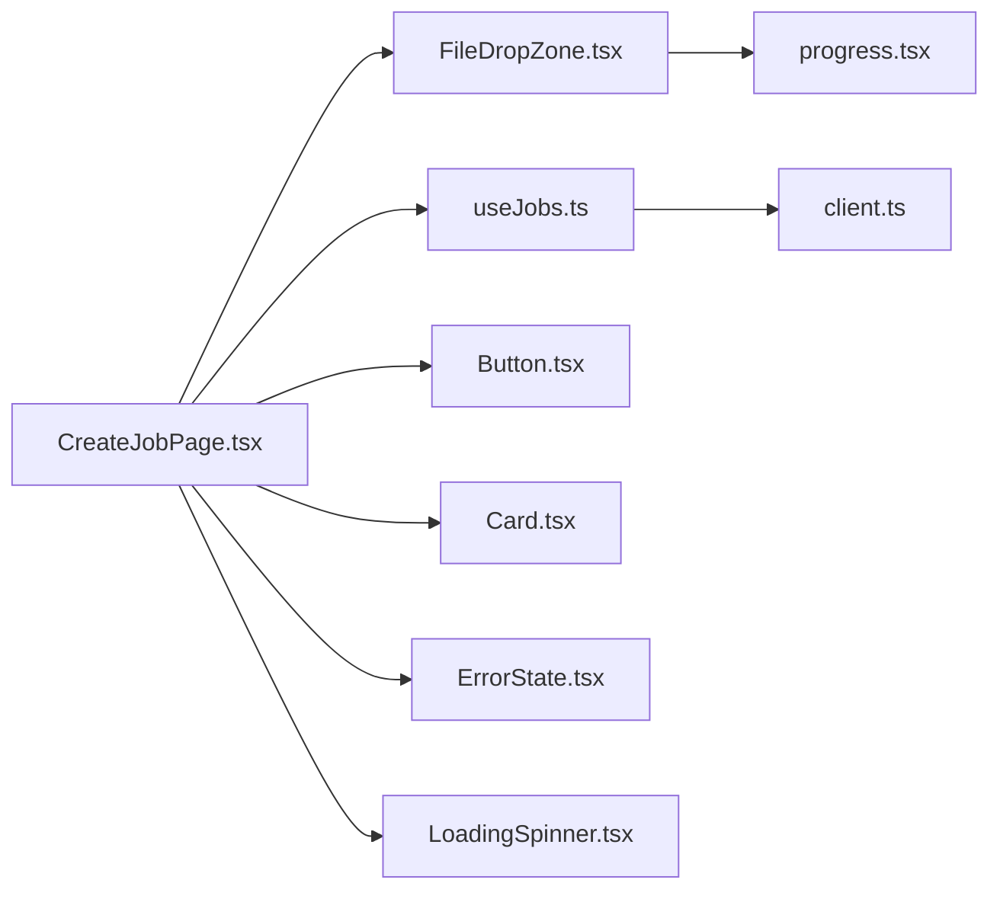

# Job Creation & File Upload

<cite>
**Referenced Files in This Document**
- [CreateJobPage.tsx](file://src/features/jobs/CreateJobPage.tsx)
- [FileDropZone.tsx](file://src/features/jobs/FileDropZone.tsx)
- [useJobs.ts](file://src/api/hooks/useJobs.ts)
- [client.ts](file://src/api/client.ts)
- [jobs.new.tsx](file://src/routes/_authenticated/jobs.new.tsx)
- [Button.tsx](file://src/components/portal/Button.tsx)
- [Card.tsx](file://src/components/portal/Card.tsx)
- [ErrorState.tsx](file://src/components/portal/ErrorState.tsx)
- [LoadingSpinner.tsx](file://src/components/portal/LoadingSpinner.tsx)
- [progress.tsx](file://src/components/ui/progress.tsx)
</cite>

## Table of Contents
1. [Introduction](#introduction)
2. [Project Structure](#project-structure)
3. [Core Components](#core-components)
4. [Architecture Overview](#architecture-overview)
5. [Detailed Component Analysis](#detailed-component-analysis)
6. [Dependency Analysis](#dependency-analysis)
7. [Performance Considerations](#performance-considerations)
8. [Troubleshooting Guide](#troubleshooting-guide)
9. [Conclusion](#conclusion)

## Introduction
This document explains the job creation and file upload functionality, focusing on:
- CreateJobPage component: form handling, validation rules, and submission workflow
- FileDropZone component: drag-and-drop behavior, file type validation, size limits, and progress indicators
- File processing pipeline: how files are validated, uploaded, and used to initialize a job
- Error handling: invalid files, network errors, and user feedback mechanisms
- Backend integration: how the frontend communicates with APIs for file upload and job initialization

## Project Structure
The feature spans UI components, hooks for API interactions, and route wiring:
- Feature components live under src/features/jobs
- API hooks and client live under src/api
- Route entry for creating jobs lives under src/routes/_authenticated

**Diagram sources**
- [jobs.new.tsx](file://src/routes/_authenticated/jobs.new.tsx)
- [CreateJobPage.tsx](file://src/features/jobs/CreateJobPage.tsx)
- [FileDropZone.tsx](file://src/features/jobs/FileDropZone.tsx)
- [useJobs.ts](file://src/api/hooks/useJobs.ts)
- [client.ts](file://src/api/client.ts)
- [Button.tsx](file://src/components/portal/Button.tsx)
- [Card.tsx](file://src/components/portal/Card.tsx)
- [ErrorState.tsx](file://src/components/portal/ErrorState.tsx)
- [LoadingSpinner.tsx](file://src/components/portal/LoadingSpinner.tsx)
- [progress.tsx](file://src/components/ui/progress.tsx)

**Section sources**
- [jobs.new.tsx](file://src/routes/_authenticated/jobs.new.tsx)
- [CreateJobPage.tsx](file://src/features/jobs/CreateJobPage.tsx)
- [FileDropZone.tsx](file://src/features/jobs/FileDropZone.tsx)
- [useJobs.ts](file://src/api/hooks/useJobs.ts)
- [client.ts](file://src/api/client.ts)

## Core Components
- CreateJobPage orchestrates the job creation flow:
  - Manages form state and validation
  - Integrates FileDropZone for file selection and preview
  - Calls useJobs hook to submit data and initiate job creation
  - Displays loading and error states using portal UI components
- FileDropZone provides:
  - Drag-and-drop and click-to-browse file selection
  - File type validation (e.g., supported formats)
  - Size limit enforcement
  - Progress indication during upload
  - User-friendly error messages for invalid or oversized files

**Section sources**
- [CreateJobPage.tsx](file://src/features/jobs/CreateJobPage.tsx)
- [FileDropZone.tsx](file://src/features/jobs/FileDropZone.tsx)
- [useJobs.ts](file://src/api/hooks/useJobs.ts)
- [Button.tsx](file://src/components/portal/Button.tsx)
- [Card.tsx](file://src/components/portal/Card.tsx)
- [ErrorState.tsx](file://src/components/portal/ErrorState.tsx)
- [LoadingSpinner.tsx](file://src/components/portal/LoadingSpinner.tsx)
- [progress.tsx](file://src/components/ui/progress.tsx)

## Architecture Overview
The job creation flow connects the route, page component, file drop zone, and API layer. The sequence below shows the end-to-end process from user action to job initialization.

**Diagram sources**
- [jobs.new.tsx](file://src/routes/_authenticated/jobs.new.tsx)
- [CreateJobPage.tsx](file://src/features/jobs/CreateJobPage.tsx)
- [FileDropZone.tsx](file://src/features/jobs/FileDropZone.tsx)
- [useJobs.ts](file://src/api/hooks/useJobs.ts)
- [client.ts](file://src/api/client.ts)

## Detailed Component Analysis

### CreateJobPage Component
Responsibilities:
- Form state management and validation rules
- Integration with FileDropZone for file selection and validation
- Submission workflow via useJobs hook
- Display of loading, success, and error states

Key behaviors:
- Validates required fields and file constraints before submission
- Prevents duplicate submissions while uploading
- Provides immediate feedback on validation errors and server responses
- Uses portal UI components for consistent UX

Validation rules typically include:
- Required fields presence
- File format restrictions
- File size limits
- Optional business rules (e.g., minimum/maximum number of files)

Submission workflow:
- Collects form values and selected files
- Calls the create job API through useJobs
- Updates UI based on response or error

**Diagram sources**
- [CreateJobPage.tsx](file://src/features/jobs/CreateJobPage.tsx)
- [useJobs.ts](file://src/api/hooks/useJobs.ts)

**Section sources**
- [CreateJobPage.tsx](file://src/features/jobs/CreateJobPage.tsx)
- [useJobs.ts](file://src/api/hooks/useJobs.ts)
- [Button.tsx](file://src/components/portal/Button.tsx)
- [Card.tsx](file://src/components/portal/Card.tsx)
- [ErrorState.tsx](file://src/components/portal/ErrorState.tsx)
- [LoadingSpinner.tsx](file://src/components/portal/LoadingSpinner.tsx)

### FileDropZone Component
Responsibilities:
- Accepts files via drag-and-drop and file input
- Validates file types and sizes
- Shows progress during upload
- Emits validated files and errors to parent

Drag-and-drop behavior:
- Prevents default browser behavior on dragover/drop
- Highlights drop area on hover
- Aggregates multiple files if allowed

File validation:
- Checks MIME types against an allowlist
- Enforces maximum file size
- Rejects unsupported or oversized files with clear messages

Progress indicators:
- Uses a progress component to reflect upload status
- Updates percentage and completion state

**Diagram sources**
- [FileDropZone.tsx](file://src/features/jobs/FileDropZone.tsx)
- [progress.tsx](file://src/components/ui/progress.tsx)

**Section sources**
- [FileDropZone.tsx](file://src/features/jobs/FileDropZone.tsx)
- [progress.tsx](file://src/components/ui/progress.tsx)

### API Integration and Hooks
- useJobs encapsulates job-related API calls, including job creation with file uploads
- client.ts configures HTTP client settings (base URL, headers, interceptors)
- Typical endpoint: POST /jobs with multipart/form-data containing file and metadata

Data flow:
- CreateJobPage collects form data and files
- useJobs.createJob serializes payload and sends request
- client handles authentication and error mapping
- Response updates UI state (success/error)

**Diagram sources**
- [useJobs.ts](file://src/api/hooks/useJobs.ts)
- [client.ts](file://src/api/client.ts)
- [CreateJobPage.tsx](file://src/features/jobs/CreateJobPage.tsx)

**Section sources**
- [useJobs.ts](file://src/api/hooks/useJobs.ts)
- [client.ts](file://src/api/client.ts)
- [CreateJobPage.tsx](file://src/features/jobs/CreateJobPage.tsx)

### Route Integration
- The new job route renders CreateJobPage
- Ensures authenticated access and sets up navigation context

**Section sources**
- [jobs.new.tsx](file://src/routes/_authenticated/jobs.new.tsx)

## Dependency Analysis
Component and module relationships:
- CreateJobPage depends on FileDropZone, useJobs, and portal UI components
- FileDropZone depends on progress indicator and validation utilities
- useJobs depends on client configuration for API communication

**Diagram sources**
- [CreateJobPage.tsx](file://src/features/jobs/CreateJobPage.tsx)
- [FileDropZone.tsx](file://src/features/jobs/FileDropZone.tsx)
- [useJobs.ts](file://src/api/hooks/useJobs.ts)
- [client.ts](file://src/api/client.ts)
- [Button.tsx](file://src/components/portal/Button.tsx)
- [Card.tsx](file://src/components/portal/Card.tsx)
- [ErrorState.tsx](file://src/components/portal/ErrorState.tsx)
- [LoadingSpinner.tsx](file://src/components/portal/LoadingSpinner.tsx)
- [progress.tsx](file://src/components/ui/progress.tsx)

**Section sources**
- [CreateJobPage.tsx](file://src/features/jobs/CreateJobPage.tsx)
- [FileDropZone.tsx](file://src/features/jobs/FileDropZone.tsx)
- [useJobs.ts](file://src/api/hooks/useJobs.ts)
- [client.ts](file://src/api/client.ts)

## Performance Considerations
- Avoid unnecessary re-renders by memoizing file lists and validation results
- Debounce large file validations where appropriate
- Stream uploads when possible to reduce memory usage
- Use progressive loading states to improve perceived performance
- Cache static assets and minimize bundle size for faster initial load

[No sources needed since this section provides general guidance]

## Troubleshooting Guide
Common issues and resolutions:
- Invalid file type: Ensure allowlist includes expected MIME types; provide clear error messages
- Oversized files: Enforce size limits consistently on both client and server; inform users of limits
- Network errors: Retry logic and user-friendly messages; check connectivity and credentials
- Duplicate submissions: Disable submit button during upload; track pending requests
- Progress not updating: Verify upload events and progress callbacks are wired correctly

**Section sources**
- [ErrorState.tsx](file://src/components/portal/ErrorState.tsx)
- [LoadingSpinner.tsx](file://src/components/portal/LoadingSpinner.tsx)
- [progress.tsx](file://src/components/ui/progress.tsx)

## Conclusion
The job creation and file upload feature combines robust form handling, strict file validation, and reliable API integration. CreateJobPage orchestrates the workflow, while FileDropZone ensures safe and user-friendly file selection with clear feedback. Proper error handling and progress indicators enhance usability and reliability.

[No sources needed since this section summarizes without analyzing specific files]