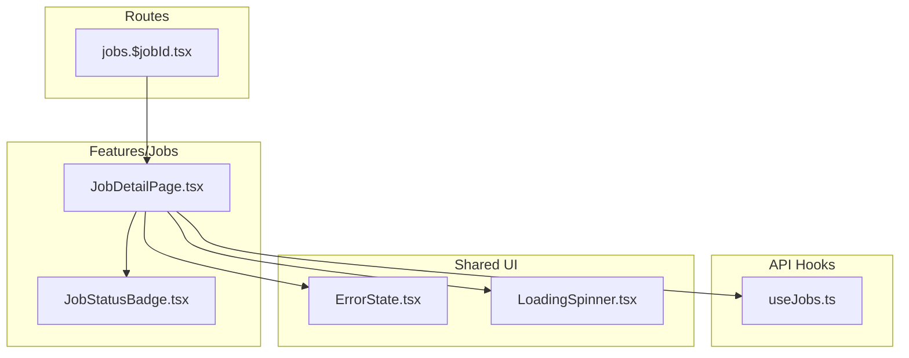
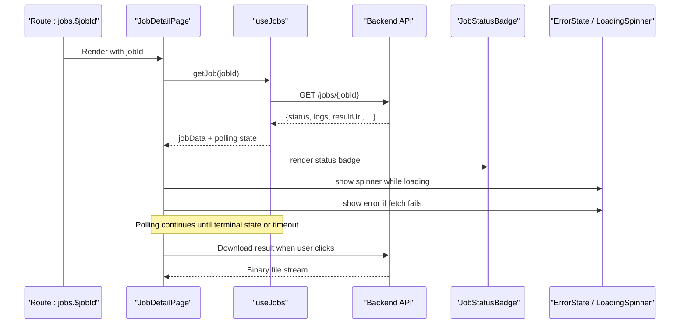
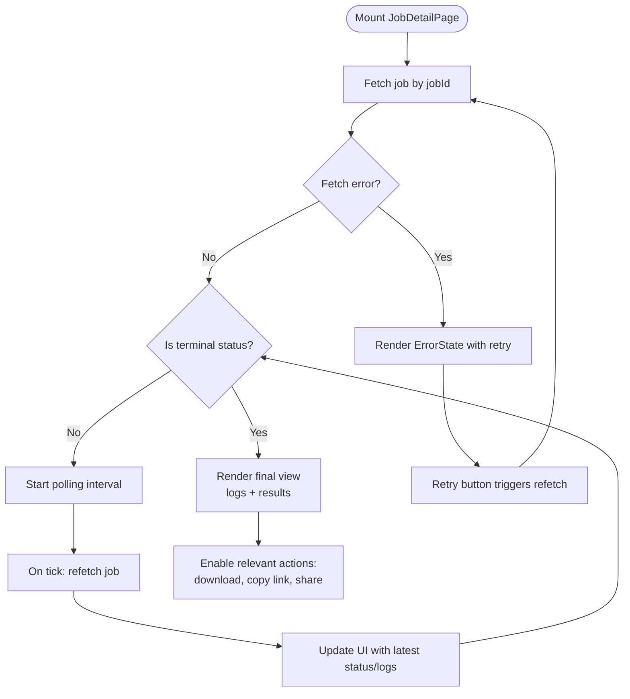
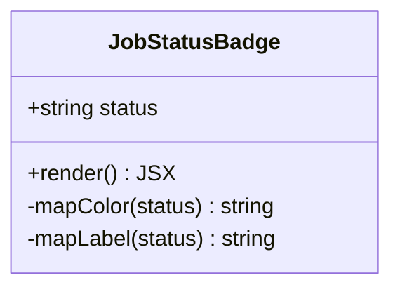
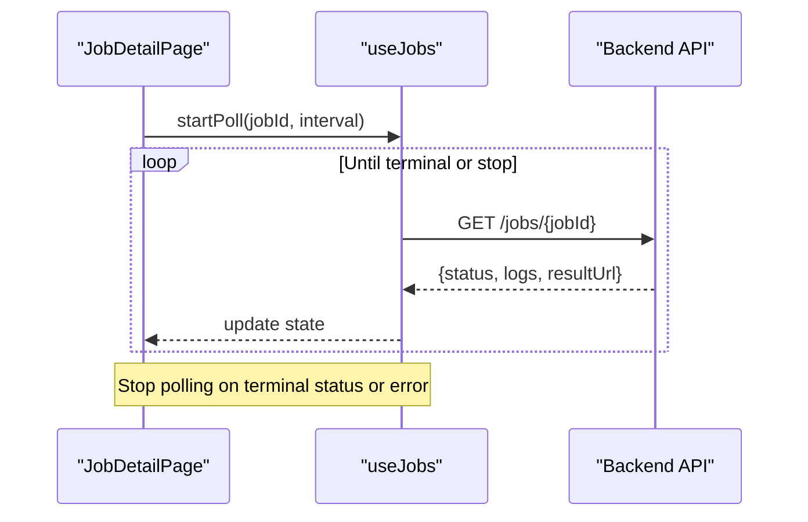
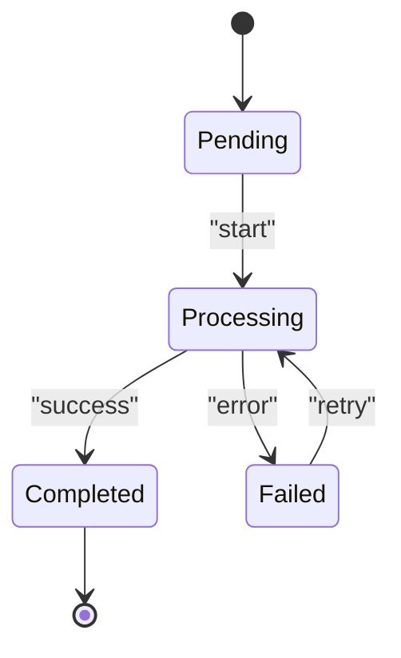
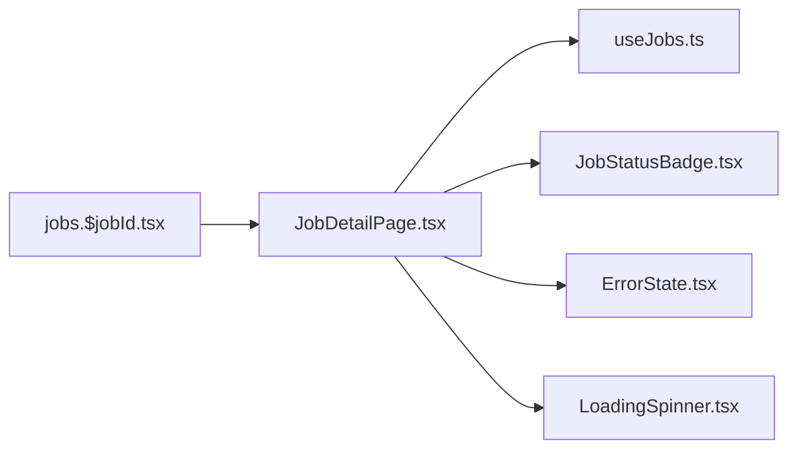

# Job Detail View & Status Tracking

<cite>
**Referenced Files in This Document**
- [JobDetailPage.tsx](file://src/features/jobs/JobDetailPage.tsx)
- [JobStatusBadge.tsx](file://src/features/jobs/JobStatusBadge.tsx)
- [useJobs.ts](file://src/api/hooks/useJobs.ts)
- [jobs.$jobId.tsx](file://src/routes/_authenticated/jobs.$jobId.tsx)
- [ErrorState.tsx](file://src/components/portal/ErrorState.tsx)
- [LoadingSpinner.tsx](file://src/components/portal/LoadingSpinner.tsx)
</cite>

## Table of Contents
1. [Introduction](#introduction)
2. [Project Structure](#project-structure)
3. [Core Components](#core-components)
4. [Architecture Overview](#architecture-overview)
5. [Detailed Component Analysis](#detailed-component-analysis)
6. [Dependency Analysis](#dependency-analysis)
7. [Performance Considerations](#performance-considerations)
8. [Troubleshooting Guide](#troubleshooting-guide)
9. [Conclusion](#conclusion)

## Introduction
This document explains the job detail view and status tracking system, focusing on how users inspect a single job’s metadata, live processing status, logs, and results. It covers the JobDetailPage component that renders comprehensive job information and the JobStatusBadge component that visually communicates job states such as pending, processing, completed, and failed. It also documents real-time updates via polling, error handling patterns, user actions at each stage, and examples of status transitions, log viewing, and result downloads.

## Project Structure
The job detail feature is implemented under the jobs feature module and wired into the application routes:
- Feature components: JobDetailPage and JobStatusBadge
- Data access: useJobs hook for fetching and polling job data
- Route integration: jobs.$jobId route to mount the detail page with a dynamic jobId parameter
- Shared UI: ErrorState and LoadingSpinner for UX consistency

**Diagram sources**
- [jobs.$jobId.tsx](file://src/routes/_authenticated/jobs.$jobId.tsx)
- [JobDetailPage.tsx](file://src/features/jobs/JobDetailPage.tsx)
- [JobStatusBadge.tsx](file://src/features/jobs/JobStatusBadge.tsx)
- [useJobs.ts](file://src/api/hooks/useJobs.ts)
- [ErrorState.tsx](file://src/components/portal/ErrorState.tsx)
- [LoadingSpinner.tsx](file://src/components/portal/LoadingSpinner.tsx)

**Section sources**
- [jobs.$jobId.tsx](file://src/routes/_authenticated/jobs.$jobId.tsx)
- [JobDetailPage.tsx](file://src/features/jobs/JobDetailPage.tsx)
- [JobStatusBadge.tsx](file://src/features/jobs/JobStatusBadge.tsx)
- [useJobs.ts](file://src/api/hooks/useJobs.ts)
- [ErrorState.tsx](file://src/components/portal/ErrorState.tsx)
- [LoadingSpinner.tsx](file://src/components/portal/LoadingSpinner.tsx)

## Core Components
- JobDetailPage: Renders the full job detail view including metadata, status badge, logs viewer, and results download area. It orchestrates data fetching, polling, error display, and user actions (e.g., refresh, retry, download).
- JobStatusBadge: Displays a compact visual indicator of the current job status with distinct colors/icons for pending, processing, completed, and failed states.

Key responsibilities:
- Fetching job details by ID
- Polling for status changes
- Rendering logs and results
- Handling errors and loading states
- Enabling user actions appropriate to the current status

**Section sources**
- [JobDetailPage.tsx](file://src/features/jobs/JobDetailPage.tsx)
- [JobStatusBadge.tsx](file://src/features/jobs/JobStatusBadge.tsx)

## Architecture Overview
The detail view follows a unidirectional data flow:
- The route mounts JobDetailPage with a jobId parameter
- JobDetailPage uses useJobs to fetch and poll job data
- JobStatusBadge reflects the current status from the fetched data
- Logs and results are rendered conditionally based on status and availability
- Errors and loading states are surfaced through shared UI components

**Diagram sources**
- [jobs.$jobId.tsx](file://src/routes/_authenticated/jobs.$jobId.tsx)
- [JobDetailPage.tsx](file://src/features/jobs/JobDetailPage.tsx)
- [useJobs.ts](file://src/api/hooks/useJobs.ts)

## Detailed Component Analysis

### JobDetailPage
Responsibilities:
- Resolve jobId from route parameters
- Fetch job details and maintain local state for loading and errors
- Implement polling for non-terminal statuses
- Render job metadata, status badge, logs, and results
- Provide user actions: refresh, retry, download, and navigate back

Polling behavior:
- Starts after initial successful fetch
- Repeats at a configured interval while status is not terminal
- Stops on terminal status (completed or failed), network error, or component unmount

Error handling:
- Displays ErrorState when fetch fails or backend returns an error
- Offers retry action to reattempt the request
- Gracefully handles partial data (e.g., logs available but result not ready)

User actions by status:
- Pending: Refresh to check progress; optional cancel if supported
- Processing: Auto-refresh; view incremental logs; no download yet
- Completed: Download result; copy links; share if enabled
- Failed: Retry job creation or report issue; view error logs

**Diagram sources**
- [JobDetailPage.tsx](file://src/features/jobs/JobDetailPage.tsx)
- [useJobs.ts](file://src/api/hooks/useJobs.ts)

**Section sources**
- [JobDetailPage.tsx](file://src/features/jobs/JobDetailPage.tsx)
- [useJobs.ts](file://src/api/hooks/useJobs.ts)

### JobStatusBadge
Responsibilities:
- Accept a status value and render a concise visual indicator
- Map statuses to colors and labels: pending, processing, completed, failed
- Optionally include icons or animations to emphasize active states

Visual mapping:
- Pending: neutral color, subtle label
- Processing: accent color, possibly animated indicator
- Completed: success color, confirmation icon
- Failed: danger color, alert icon

Accessibility:
- Use semantic text for screen readers
- Ensure sufficient color contrast
- Provide aria-labels describing the status

**Diagram sources**
- [JobStatusBadge.tsx](file://src/features/jobs/JobStatusBadge.tsx)

**Section sources**
- [JobStatusBadge.tsx](file://src/features/jobs/JobStatusBadge.tsx)

### Real-Time Updates and Polling Mechanism
- useJobs provides a polling utility that repeatedly calls the job endpoint until a terminal state is reached or a maximum attempt limit is hit
- JobDetailPage integrates this hook to keep the UI in sync with server-side progress
- Polling interval can be adaptive (shorter intervals during processing, longer when idle)

**Diagram sources**
- [useJobs.ts](file://src/api/hooks/useJobs.ts)
- [JobDetailPage.tsx](file://src/features/jobs/JobDetailPage.tsx)

**Section sources**
- [useJobs.ts](file://src/api/hooks/useJobs.ts)
- [JobDetailPage.tsx](file://src/features/jobs/JobDetailPage.tsx)

### Log Viewing Capabilities
- Logs are displayed in a scrollable panel with line wrapping and syntax highlighting where applicable
- Users can filter by severity or search within logs
- Auto-scroll to newest entries when new logs arrive during processing
- Export logs as text or JSON for debugging

### Result Download Functionality
- When status is completed, a download button becomes available
- Clicking triggers a binary download using the result URL provided by the API
- Fallback UI shows a direct link if automatic download is blocked by the browser
- Progress indicators may be shown for large files

### Status Transitions Examples
- Pending → Processing: Initial submission accepted; background worker starts
- Processing → Completed: Worker finishes successfully; result available
- Processing → Failed: Worker encountered an error; logs contain failure details
- Failed → Processing: User retries job creation; lifecycle restarts

[No sources needed since this diagram shows conceptual workflow, not actual code structure]

## Dependency Analysis
JobDetailPage depends on:
- useJobs for data fetching and polling
- JobStatusBadge for status visualization
- ErrorState and LoadingSpinner for consistent UX
- Route context for jobId resolution

**Diagram sources**
- [JobDetailPage.tsx](file://src/features/jobs/JobDetailPage.tsx)
- [useJobs.ts](file://src/api/hooks/useJobs.ts)
- [JobStatusBadge.tsx](file://src/features/jobs/JobStatusBadge.tsx)
- [ErrorState.tsx](file://src/components/portal/ErrorState.tsx)
- [LoadingSpinner.tsx](file://src/components/portal/LoadingSpinner.tsx)
- [jobs.$jobId.tsx](file://src/routes/_authenticated/jobs.$jobId.tsx)

**Section sources**
- [JobDetailPage.tsx](file://src/features/jobs/JobDetailPage.tsx)
- [useJobs.ts](file://src/api/hooks/useJobs.ts)
- [JobStatusBadge.tsx](file://src/features/jobs/JobStatusBadge.tsx)
- [ErrorState.tsx](file://src/components/portal/ErrorState.tsx)
- [LoadingSpinner.tsx](file://src/components/portal/LoadingSpinner.tsx)
- [jobs.$jobId.tsx](file://src/routes/_authenticated/jobs.$jobId.tsx)

## Performance Considerations
- Debounce rapid refetches to avoid overwhelming the server
- Limit polling frequency based on status (e.g., faster during processing, slower when idle)
- Virtualize long logs to improve rendering performance
- Cache last successful response briefly to reduce flicker on transient errors
- Use streaming for large result downloads when possible

## Troubleshooting Guide
Common issues and resolutions:
- Network errors: Display ErrorState with retry; verify connectivity and credentials
- Stale status: Clear cache and force refresh; ensure polling is stopped on terminal states
- Missing logs: Confirm backend emits logs; add fallback messages
- Download failures: Validate result URL permissions; provide direct link fallback
- Excessive polling: Adjust interval and max attempts; implement exponential backoff

**Section sources**
- [ErrorState.tsx](file://src/components/portal/ErrorState.tsx)
- [useJobs.ts](file://src/api/hooks/useJobs.ts)

## Conclusion
The job detail view combines robust data fetching, real-time polling, and clear status visualization to deliver a responsive and informative experience. JobStatusBadge provides immediate feedback on job lifecycle, while JobDetailPage orchestrates logs, results, and user actions. Proper error handling, performance optimizations, and accessible UI ensure reliability and usability across all stages of job processing.