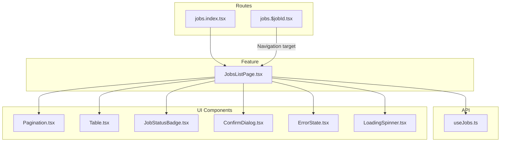
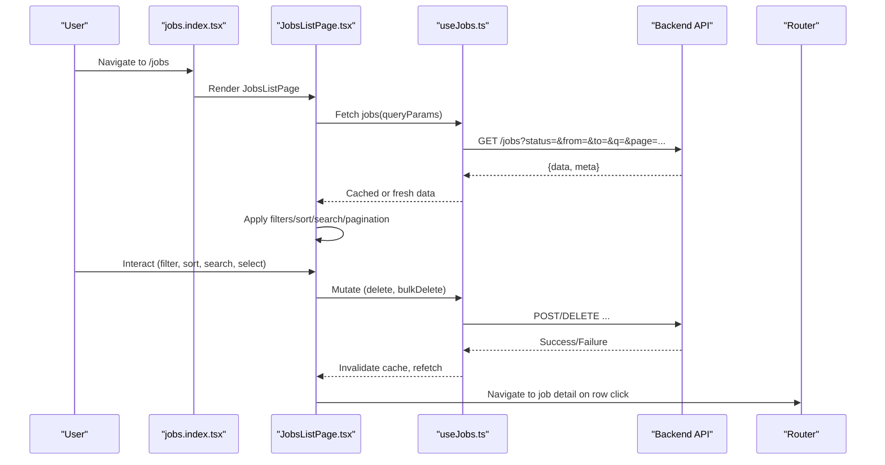
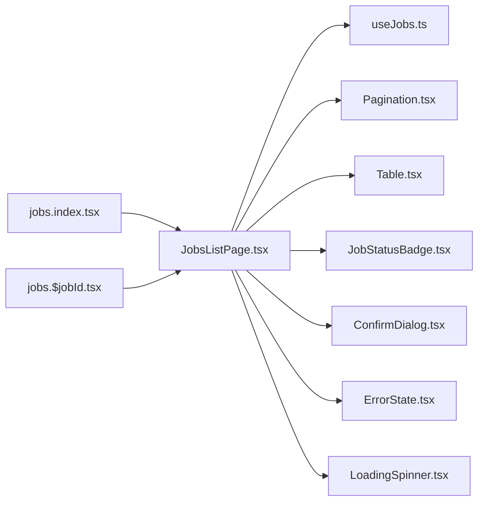

# Job Listing & Management

<cite>
**Referenced Files in This Document**
- [JobsListPage.tsx](file://src/features/jobs/JobsListPage.tsx)
- [useJobs.ts](file://src/api/hooks/useJobs.ts)
- [jobs.index.tsx](file://src/routes/_authenticated/jobs.index.tsx)
- [jobs.$jobId.tsx](file://src/routes/_authenticated/jobs.$jobId.tsx)
- [Pagination.tsx](file://src/components/portal/Pagination.tsx)
- [Table.tsx](file://src/components/portal/Table.tsx)
- [JobStatusBadge.tsx](file://src/features/jobs/JobStatusBadge.tsx)
- [ConfirmDialog.tsx](file://src/components/portal/ConfirmDialog.tsx)
- [ErrorState.tsx](file://src/components/portal/ErrorState.tsx)
- [LoadingSpinner.tsx](file://src/components/portal/LoadingSpinner.tsx)
</cite>

## Table of Contents
1. [Introduction](#introduction)
2. [Project Structure](#project-structure)
3. [Core Components](#core-components)
4. [Architecture Overview](#architecture-overview)
5. [Detailed Component Analysis](#detailed-component-analysis)
6. [Dependency Analysis](#dependency-analysis)
7. [Performance Considerations](#performance-considerations)
8. [Troubleshooting Guide](#troubleshooting-guide)
9. [Conclusion](#conclusion)

## Introduction
This document explains the job listing and management interface, focusing on the JobsListPage component and its surrounding ecosystem. It covers how users can view all their jobs, filter by status or date ranges, sort and search results, paginate through large lists, perform bulk operations, delete jobs, and navigate to individual job details. It also documents data fetching strategies, caching mechanisms, and performance optimizations tailored for large job lists.

## Project Structure
The job listing feature is implemented as a feature module with dedicated UI components, API hooks, and route integration:
- Feature page: src/features/jobs/JobsListPage.tsx
- Data access hook: src/api/hooks/useJobs.ts
- Route entry: src/routes/_authenticated/jobs.index.tsx
- Detail navigation: src/routes/_authenticated/jobs.$jobId.tsx
- Shared UI primitives: Pagination, Table, ConfirmDialog, ErrorState, LoadingSpinner, JobStatusBadge

**Diagram sources**
- [jobs.index.tsx](file://src/routes/_authenticated/jobs.index.tsx)
- [JobsListPage.tsx](file://src/features/jobs/JobsListPage.tsx)
- [useJobs.ts](file://src/api/hooks/useJobs.ts)
- [Pagination.tsx](file://src/components/portal/Pagination.tsx)
- [Table.tsx](file://src/components/portal/Table.tsx)
- [JobStatusBadge.tsx](file://src/features/jobs/JobStatusBadge.tsx)
- [ConfirmDialog.tsx](file://src/components/portal/ConfirmDialog.tsx)
- [ErrorState.tsx](file://src/components/portal/ErrorState.tsx)
- [LoadingSpinner.tsx](file://src/components/portal/LoadingSpinner.tsx)

**Section sources**
- [JobsListPage.tsx](file://src/features/jobs/JobsListPage.tsx)
- [useJobs.ts](file://src/api/hooks/useJobs.ts)
- [jobs.index.tsx](file://src/routes/_authenticated/jobs.index.tsx)
- [jobs.$jobId.tsx](file://src/routes/_authenticated/jobs.$jobId.tsx)

## Core Components
- JobsListPage: Orchestrates filtering, sorting, search, pagination, bulk selection, deletion, and navigation to job details. Integrates with useJobs for data fetching and mutation.
- useJobs: Encapsulates API calls for listing jobs, mutations (e.g., delete), and provides caching via React Query patterns.
- Pagination: Renders page controls and communicates page changes back to JobsListPage.
- Table: Displays paginated job rows with actions and status badges.
- JobStatusBadge: Visual indicator for job status.
- ConfirmDialog: Confirms destructive actions like bulk deletion.
- ErrorState and LoadingSpinner: Handle error and loading states consistently.

Key responsibilities:
- Filtering: By status, date range, and text search.
- Sorting: By columns such as created date or status.
- Search: Debounced text input to refine results.
- Pagination: Server-driven or client-driven pagination based on query parameters.
- Bulk operations: Select multiple jobs and perform actions (e.g., delete).
- Navigation: Clicking a row navigates to the job detail route.

**Section sources**
- [JobsListPage.tsx](file://src/features/jobs/JobsListPage.tsx)
- [useJobs.ts](file://src/api/hooks/useJobs.ts)
- [Pagination.tsx](file://src/components/portal/Pagination.tsx)
- [Table.tsx](file://src/components/portal/Table.tsx)
- [JobStatusBadge.tsx](file://src/features/jobs/JobStatusBadge.tsx)
- [ConfirmDialog.tsx](file://src/components/portal/ConfirmDialog.tsx)
- [ErrorState.tsx](file://src/components/portal/ErrorState.tsx)
- [LoadingSpinner.tsx](file://src/components/portal/LoadingSpinner.tsx)

## Architecture Overview
The job list follows a unidirectional data flow:
- Routes render JobsListPage.
- JobsListPage manages local UI state (filters, sorting, search, selected items, pagination).
- useJobs fetches data and caches results; mutations trigger invalidation and refetch.
- UI components render state and emit events back to JobsListPage.

**Diagram sources**
- [jobs.index.tsx](file://src/routes/_authenticated/jobs.index.tsx)
- [JobsListPage.tsx](file://src/features/jobs/JobsListPage.tsx)
- [useJobs.ts](file://src/api/hooks/useJobs.ts)

## Detailed Component Analysis

### JobsListPage
Responsibilities:
- State management for filters (status, date range), search query, sorting, pagination, and selected job IDs.
- Delegates data fetching and mutations to useJobs.
- Composes UI with Table, Pagination, JobStatusBadge, ConfirmDialog, ErrorState, LoadingSpinner.
- Handles user interactions:
  - Filter change triggers debounced refetch.
  - Sort change updates URL/query params and refetches.
  - Search input debounces to avoid excessive requests.
  - Pagination updates page and size, then refetches.
  - Bulk selection toggles selection state; bulk delete opens confirmation dialog.
  - Row click navigates to job detail route.

Data fetching strategy:
- Uses React Query-style hooks from useJobs to fetch jobs with query parameters.
- Caches results per unique query key; stale-while-revalidate behavior ensures smooth UX.
- Invalidates cache after mutations to keep UI consistent.

Performance considerations:
- Debounce search input to reduce network churn.
- Use server-side pagination and filtering when possible.
- Memoize derived lists (filtered/sorted) to prevent unnecessary re-renders.
- Virtualize table rows if the dataset is very large.

Common filtering scenarios:
- Show only active jobs: set status filter to "active".
- Jobs created within last 7 days: set date range from/to accordingly.
- Search by keyword: type into search input; results update after debounce.

Bulk operations:
- Select multiple jobs using checkboxes.
- Trigger bulk delete via ConfirmDialog; on success, invalidate cache and refetch.

Navigation:
- Clicking a job row navigates to /jobs/:jobId.

**Section sources**
- [JobsListPage.tsx](file://src/features/jobs/JobsListPage.tsx)
- [useJobs.ts](file://src/api/hooks/useJobs.ts)
- [jobs.index.tsx](file://src/routes/_authenticated/jobs.index.tsx)
- [jobs.$jobId.tsx](file://src/routes/_authenticated/jobs.$jobId.tsx)

### useJobs Hook
Responsibilities:
- Provides hooks for listing jobs and performing mutations (e.g., delete, bulk delete).
- Manages query keys that include filters, sorting, pagination, and search.
- Implements caching and background refetching.
- Exposes mutation callbacks that trigger cache invalidation and optimistic updates where applicable.

Caching mechanism:
- Cache keyed by normalized query parameters.
- Stale time configured to balance freshness and performance.
- Refetch on focus or interval as needed.

Mutations:
- Delete single job: removes item from cache and refetches list.
- Bulk delete: deletes selected jobs and refreshes list.

**Section sources**
- [useJobs.ts](file://src/api/hooks/useJobs.ts)

### Pagination
Responsibilities:
- Renders page controls and emits page size and current page changes.
- Integrates with JobsListPage to update query parameters and refetch.

Behavior:
- Supports changing page number and page size.
- Updates URL query string for shareable links and deep linking.

**Section sources**
- [Pagination.tsx](file://src/components/portal/Pagination.tsx)
- [JobsListPage.tsx](file://src/features/jobs/JobsListPage.tsx)

### Table
Responsibilities:
- Renders paginated job rows with columns for status, dates, and actions.
- Supports row selection for bulk operations.
- Displays JobStatusBadge per row.

Interactions:
- Row click navigates to job detail.
- Checkbox toggles selection state.
- Actions menu may include delete.

**Section sources**
- [Table.tsx](file://src/components/portal/Table.tsx)
- [JobStatusBadge.tsx](file://src/features/jobs/JobStatusBadge.tsx)
- [JobsListPage.tsx](file://src/features/jobs/JobsListPage.tsx)

### ConfirmDialog
Responsibilities:
- Presents confirmation prompts for destructive actions like bulk deletion.
- Returns user decision to JobsListPage to proceed or cancel.

**Section sources**
- [ConfirmDialog.tsx](file://src/components/portal/ConfirmDialog.tsx)
- [JobsListPage.tsx](file://src/features/jobs/JobsListPage.tsx)

### ErrorState and LoadingSpinner
Responsibilities:
- Display friendly error messages and retry options on failures.
- Show loading indicators during data fetching and mutations.

**Section sources**
- [ErrorState.tsx](file://src/components/portal/ErrorState.tsx)
- [LoadingSpinner.tsx](file://src/components/portal/LoadingSpinner.tsx)
- [JobsListPage.tsx](file://src/features/jobs/JobsListPage.tsx)

### Route Integration
- jobs.index.tsx renders JobsListPage and handles initial query parsing.
- jobs.$jobId.tsx represents the job detail page navigated to from the list.

**Section sources**
- [jobs.index.tsx](file://src/routes/_authenticated/jobs.index.tsx)
- [jobs.$jobId.tsx](file://src/routes/_authenticated/jobs.$jobId.tsx)

## Dependency Analysis
The following diagram shows how components and hooks depend on each other:

**Diagram sources**
- [jobs.index.tsx](file://src/routes/_authenticated/jobs.index.tsx)
- [jobs.$jobId.tsx](file://src/routes/_authenticated/jobs.$jobId.tsx)
- [JobsListPage.tsx](file://src/features/jobs/JobsListPage.tsx)
- [useJobs.ts](file://src/api/hooks/useJobs.ts)
- [Pagination.tsx](file://src/components/portal/Pagination.tsx)
- [Table.tsx](file://src/components/portal/Table.tsx)
- [JobStatusBadge.tsx](file://src/features/jobs/JobStatusBadge.tsx)
- [ConfirmDialog.tsx](file://src/components/portal/ConfirmDialog.tsx)
- [ErrorState.tsx](file://src/components/portal/ErrorState.tsx)
- [LoadingSpinner.tsx](file://src/components/portal/LoadingSpinner.tsx)

**Section sources**
- [JobsListPage.tsx](file://src/features/jobs/JobsListPage.tsx)
- [useJobs.ts](file://src/api/hooks/useJobs.ts)

## Performance Considerations
- Debounce search input to minimize network requests.
- Prefer server-side pagination and filtering to limit payload sizes.
- Use memoization for filtered/sorted lists to avoid recomputation.
- Enable virtual scrolling for large tables if client-side rendering becomes a bottleneck.
- Configure appropriate stale times and refetch policies in useJobs to balance freshness and performance.
- Avoid unnecessary re-renders by lifting minimal state and using stable references for callbacks.

[No sources needed since this section provides general guidance]

## Troubleshooting Guide
Common issues and resolutions:
- No data displayed: Check network tab for failed requests; ensure query parameters are valid; verify authentication.
- Filters not applied: Confirm filter state updates and that query keys change to trigger refetch.
- Pagination not working: Ensure page and size parameters are passed correctly and that the backend supports them.
- Bulk delete fails: Verify permissions and confirm that selected job IDs are valid; check mutation responses.
- Slow rendering: Consider enabling virtualization or reducing columns; check for heavy computations in render path.

**Section sources**
- [JobsListPage.tsx](file://src/features/jobs/JobsListPage.tsx)
- [useJobs.ts](file://src/api/hooks/useJobs.ts)
- [ErrorState.tsx](file://src/components/portal/ErrorState.tsx)

## Conclusion
The JobsListPage provides a robust, user-friendly interface for managing jobs with powerful filtering, sorting, search, pagination, and bulk operations. Backed by useJobs for efficient data fetching and caching, it delivers a responsive experience even with large datasets. Proper configuration of debouncing, server-side processing, and caching ensures optimal performance and reliability.

[No sources needed since this section summarizes without analyzing specific files]