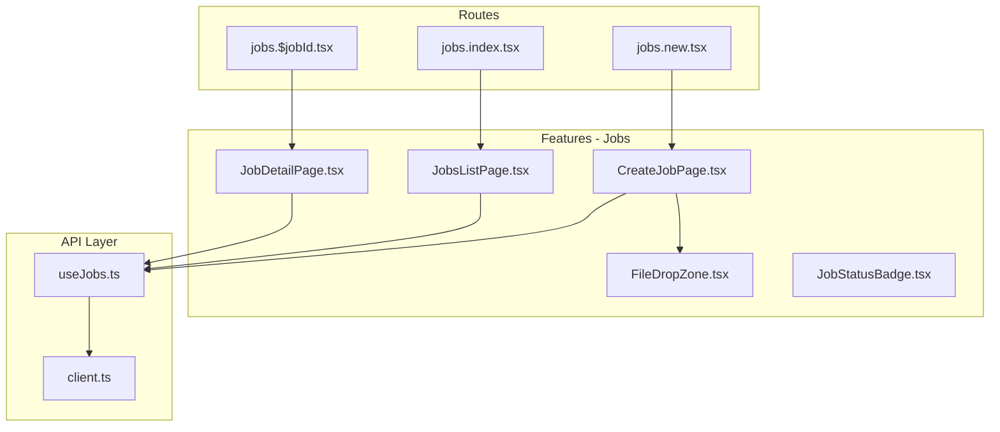
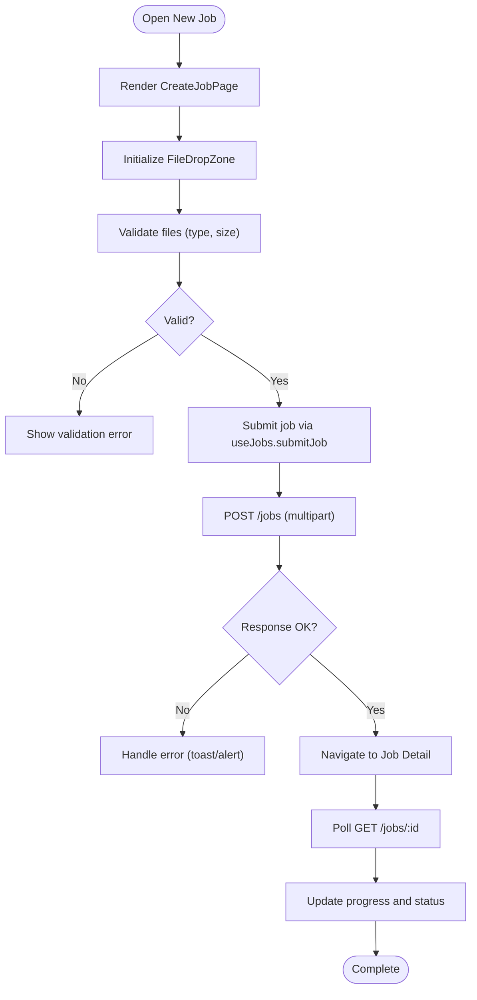
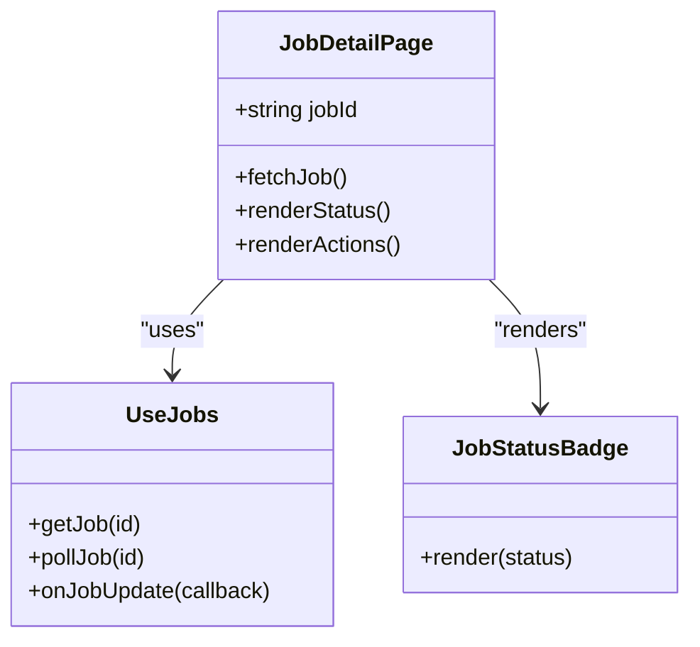
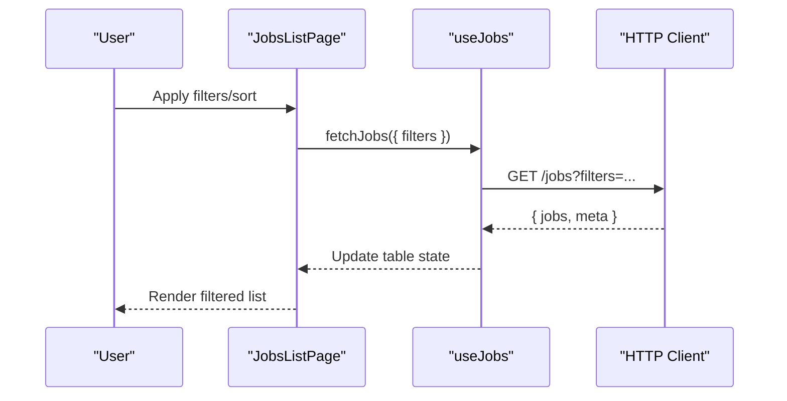
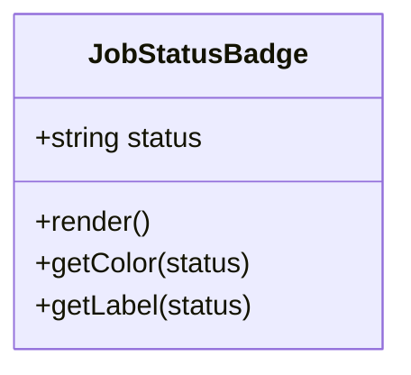
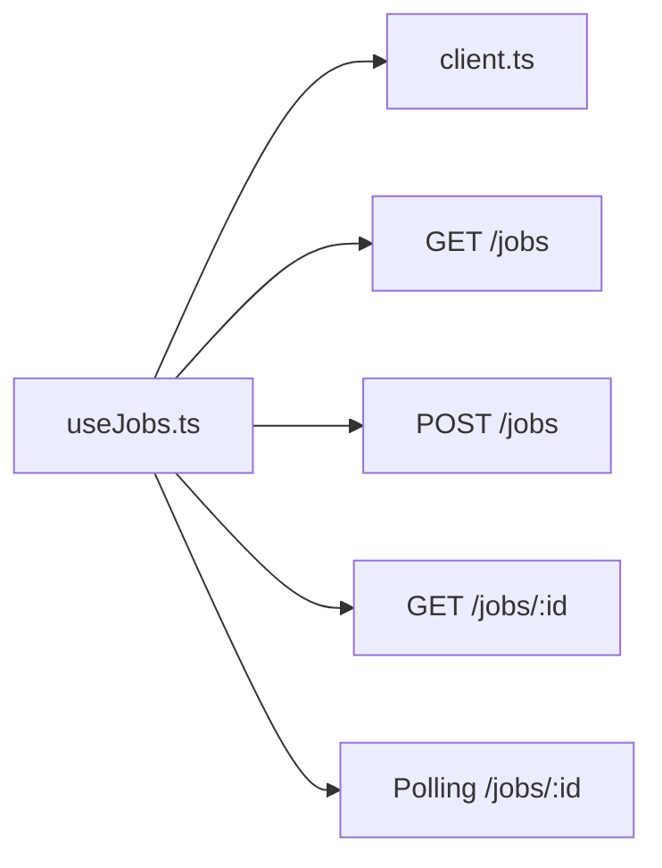
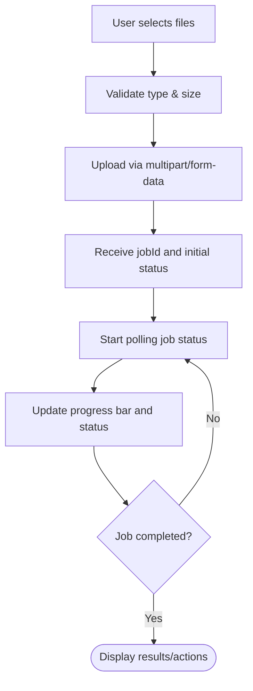
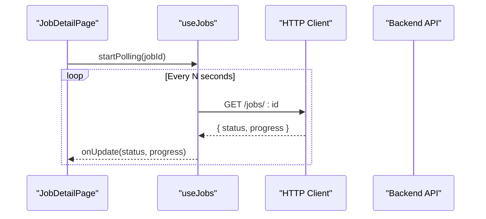
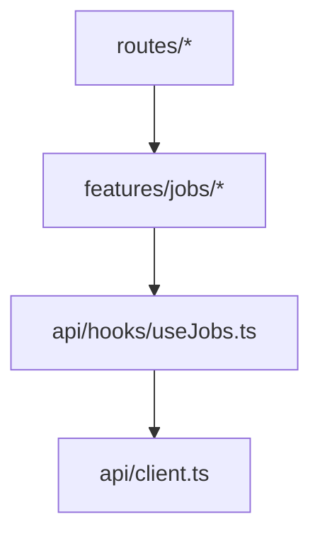

# Job Management Module

<cite>
**Referenced Files in This Document**
- [CreateJobPage.tsx](file://src/features/jobs/CreateJobPage.tsx)
- [FileDropZone.tsx](file://src/features/jobs/FileDropZone.tsx)
- [JobDetailPage.tsx](file://src/features/jobs/JobDetailPage.tsx)
- [JobStatusBadge.tsx](file://src/features/jobs/JobStatusBadge.tsx)
- [JobsListPage.tsx](file://src/features/jobs/JobsListPage.tsx)
- [useJobs.ts](file://src/api/hooks/useJobs.ts)
- [client.ts](file://src/api/client.ts)
- [jobs.index.tsx](file://src/routes/_authenticated/jobs.index.tsx)
- [jobs.new.tsx](file://src/routes/_authenticated/jobs.new.tsx)
- [jobs.$jobId.tsx](file://src/routes/_authenticated/jobs.$jobId.tsx)
- [ActiveJobsCard.tsx](file://src/features/dashboard/ActiveJobsCard.tsx)
- [RecentJobsList.tsx](file://src/features/dashboard/RecentJobsList.tsx)
</cite>

## Table of Contents
1. [Introduction](#introduction)
2. [Project Structure](#project-structure)
3. [Core Components](#core-components)
4. [Architecture Overview](#architecture-overview)
5. [Detailed Component Analysis](#detailed-component-analysis)
6. [Dependency Analysis](#dependency-analysis)
7. [Performance Considerations](#performance-considerations)
8. [Troubleshooting Guide](#troubleshooting-guide)
9. [Conclusion](#conclusion)

## Introduction
This document provides comprehensive documentation for the Job Management module, focusing on job creation with file upload, job detail view with status tracking, job listing and filtering, and the status badge system. It explains the complete job lifecycle from creation to completion, including file validation, progress tracking, error handling, user feedback, backend API integration, file processing workflows, and real-time status updates.

## Project Structure
The Job Management module is implemented across feature components, API hooks, and routes:
- Feature components handle UI and state for creating jobs, uploading files, viewing details, listing jobs, and rendering status badges.
- API hooks encapsulate data fetching and mutations for job operations.
- Routes wire up pages to the corresponding feature components.



**Diagram sources**
- [jobs.new.tsx](file://src/routes/_authenticated/jobs.new.tsx)
- [jobs.index.tsx](file://src/routes/_authenticated/jobs.index.tsx)
- [jobs.$jobId.tsx](file://src/routes/_authenticated/jobs.$jobId.tsx)
- [CreateJobPage.tsx](file://src/features/jobs/CreateJobPage.tsx)
- [FileDropZone.tsx](file://src/features/jobs/FileDropZone.tsx)
- [JobDetailPage.tsx](file://src/features/jobs/JobDetailPage.tsx)
- [JobsListPage.tsx](file://src/features/jobs/JobsListPage.tsx)
- [JobStatusBadge.tsx](file://src/features/jobs/JobStatusBadge.tsx)
- [useJobs.ts](file://src/api/hooks/useJobs.ts)
- [client.ts](file://src/api/client.ts)

**Section sources**
- [CreateJobPage.tsx](file://src/features/jobs/CreateJobPage.tsx)
- [FileDropZone.tsx](file://src/features/jobs/FileDropZone.tsx)
- [JobDetailPage.tsx](file://src/features/jobs/JobDetailPage.tsx)
- [JobsListPage.tsx](file://src/features/jobs/JobsListPage.tsx)
- [JobStatusBadge.tsx](file://src/features/jobs/JobStatusBadge.tsx)
- [useJobs.ts](file://src/api/hooks/useJobs.ts)
- [client.ts](file://src/api/client.ts)
- [jobs.new.tsx](file://src/routes/_authenticated/jobs.new.tsx)
- [jobs.index.tsx](file://src/routes/_authenticated/jobs.index.tsx)
- [jobs.$jobId.tsx](file://src/routes/_authenticated/jobs.$jobId.tsx)

## Core Components
- CreateJobPage: Orchestrates job creation form, integrates file upload via FileDropZone, and triggers job submission through useJobs.
- FileDropZone: Handles drag-and-drop and selection of files, performs client-side validation (type, size), and exposes upload callbacks.
- JobsListPage: Displays paginated job listings with filters and sorting; uses useJobs to fetch and refresh job data.
- JobDetailPage: Shows detailed job information, current status, progress, and actions based on job state; subscribes to updates via useJobs.
- JobStatusBadge: Renders contextual status indicators with color-coded badges for different job states.

Key responsibilities:
- Form state management and validation for job creation.
- File validation and progress reporting during upload.
- Data fetching, caching, and refetching strategies for job lists and details.
- Real-time or periodic polling for status updates.
- User feedback via loading states, errors, and success notifications.

**Section sources**
- [CreateJobPage.tsx](file://src/features/jobs/CreateJobPage.tsx)
- [FileDropZone.tsx](file://src/features/jobs/FileDropZone.tsx)
- [JobsListPage.tsx](file://src/features/jobs/JobsListPage.tsx)
- [JobDetailPage.tsx](file://src/features/jobs/JobDetailPage.tsx)
- [JobStatusBadge.tsx](file://src/features/jobs/JobStatusBadge.tsx)
- [useJobs.ts](file://src/api/hooks/useJobs.ts)

## Architecture Overview
The module follows a layered architecture:
- UI layer: React components for job creation, listing, detail views, and status badges.
- Data layer: useJobs hook abstracts API calls, caching, and mutations.
- Transport layer: HTTP client handles requests and responses.

```mermaid
sequenceDiagram
participant User as "User"
participant Create as "CreateJobPage"
participant Drop as "FileDropZone"
participant Hook as "useJobs"
participant Client as "HTTP Client"
participant Backend as "Backend API"
User->>Create : Open "New Job"
Create->>Drop : Initialize drop zone
User->>Drop : Select/Drag files
Drop-->>Create : Validated files + metadata
Create->>Hook : submitJob(files, options)
Hook->>Client : POST /jobs (multipart/form-data)
Client-->>Hook : { jobId, status }
Hook-->>Create : onSuccess callback
Create->>Hook : poll/getJob(jobId)
Hook->>Client : GET /jobs/ : id
Client-->>Hook : { status, progress, ... }
Hook-->>Create : Update UI state
Create-->>User : Show progress and status
```

**Diagram sources**
- [CreateJobPage.tsx](file://src/features/jobs/CreateJobPage.tsx)
- [FileDropZone.tsx](file://src/features/jobs/FileDropZone.tsx)
- [useJobs.ts](file://src/api/hooks/useJobs.ts)
- [client.ts](file://src/api/client.ts)

## Detailed Component Analysis

### Job Creation Workflow with File Upload
- The create page renders a form and integrates FileDropZone for file selection.
- FileDropZone validates file types and sizes, aggregates selected files, and emits an upload event.
- useJobs.submitJob sends multipart/form-data to the backend, returning a jobId and initial status.
- On success, the UI navigates to the job detail view and begins polling for updates.



**Diagram sources**
- [CreateJobPage.tsx](file://src/features/jobs/CreateJobPage.tsx)
- [FileDropZone.tsx](file://src/features/jobs/FileDropZone.tsx)
- [useJobs.ts](file://src/api/hooks/useJobs.ts)
- [client.ts](file://src/api/client.ts)

**Section sources**
- [CreateJobPage.tsx](file://src/features/jobs/CreateJobPage.tsx)
- [FileDropZone.tsx](file://src/features/jobs/FileDropZone.tsx)
- [useJobs.ts](file://src/api/hooks/useJobs.ts)

### Job Detail View with Status Tracking
- JobDetailPage displays job metadata, current status, and progress indicators.
- It subscribes to job updates using useJobs.getJob or a polling mechanism.
- Actions are conditionally rendered based on job status (e.g., retry failed jobs, download outputs).



**Diagram sources**
- [JobDetailPage.tsx](file://src/features/jobs/JobDetailPage.tsx)
- [useJobs.ts](file://src/api/hooks/useJobs.ts)
- [JobStatusBadge.tsx](file://src/features/jobs/JobStatusBadge.tsx)

**Section sources**
- [JobDetailPage.tsx](file://src/features/jobs/JobDetailPage.tsx)
- [useJobs.ts](file://src/api/hooks/useJobs.ts)
- [JobStatusBadge.tsx](file://src/features/jobs/JobStatusBadge.tsx)

### Job Listing and Filtering
- JobsListPage presents a table of jobs with pagination and filters (status, date range, search).
- useJobs.fetchJobs retrieves filtered results and supports refetching on filter changes.
- Sorting and pagination are handled locally or via query parameters sent to the backend.



**Diagram sources**
- [JobsListPage.tsx](file://src/features/jobs/JobsListPage.tsx)
- [useJobs.ts](file://src/api/hooks/useJobs.ts)
- [client.ts](file://src/api/client.ts)

**Section sources**
- [JobsListPage.tsx](file://src/features/jobs/JobsListPage.tsx)
- [useJobs.ts](file://src/api/hooks/useJobs.ts)

### Status Badge System
- JobStatusBadge maps job statuses to visual indicators (colors, labels).
- Supports common states such as pending, processing, completed, failed, canceled.
- Provides accessibility features like aria-labels and keyboard navigation.



**Diagram sources**
- [JobStatusBadge.tsx](file://src/features/jobs/JobStatusBadge.tsx)

**Section sources**
- [JobStatusBadge.tsx](file://src/features/jobs/JobStatusBadge.tsx)

### Integration with Backend APIs
- useJobs centralizes all job-related API interactions:
  - submitJob: Creates a new job with uploaded files.
  - getJob: Retrieves job details by ID.
  - fetchJobs: Lists jobs with optional filters and pagination.
  - pollJob: Periodically checks job status until completion or failure.
- client.ts configures base URL, headers, and request/response interceptors.



**Diagram sources**
- [useJobs.ts](file://src/api/hooks/useJobs.ts)
- [client.ts](file://src/api/client.ts)

**Section sources**
- [useJobs.ts](file://src/api/hooks/useJobs.ts)
- [client.ts](file://src/api/client.ts)

### File Processing Workflows and Progress Tracking
- FileDropZone validates files before upload and tracks upload progress.
- After successful submission, the frontend polls for job status updates.
- Progress is reflected via progress bars and status messages in JobDetailPage.



**Diagram sources**
- [FileDropZone.tsx](file://src/features/jobs/FileDropZone.tsx)
- [JobDetailPage.tsx](file://src/features/jobs/JobDetailPage.tsx)
- [useJobs.ts](file://src/api/hooks/useJobs.ts)

**Section sources**
- [FileDropZone.tsx](file://src/features/jobs/FileDropZone.tsx)
- [JobDetailPage.tsx](file://src/features/jobs/JobDetailPage.tsx)
- [useJobs.ts](file://src/api/hooks/useJobs.ts)

### Real-Time Status Updates
- useJobs implements polling or WebSocket-based updates depending on backend capabilities.
- JobDetailPage listens for updates and re-renders without manual refresh.
- ActiveJobsCard and RecentJobsList may also subscribe to job updates for dashboard visibility.



**Diagram sources**
- [JobDetailPage.tsx](file://src/features/jobs/JobDetailPage.tsx)
- [useJobs.ts](file://src/api/hooks/useJobs.ts)
- [client.ts](file://src/api/client.ts)
- [ActiveJobsCard.tsx](file://src/features/dashboard/ActiveJobsCard.tsx)
- [RecentJobsList.tsx](file://src/features/dashboard/RecentJobsList.tsx)

**Section sources**
- [JobDetailPage.tsx](file://src/features/jobs/JobDetailPage.tsx)
- [useJobs.ts](file://src/api/hooks/useJobs.ts)
- [client.ts](file://src/api/client.ts)
- [ActiveJobsCard.tsx](file://src/features/dashboard/ActiveJobsCard.tsx)
- [RecentJobsList.tsx](file://src/features/dashboard/RecentJobsList.tsx)

## Dependency Analysis
The module exhibits clear separation between UI, data, and transport layers:
- UI components depend on useJobs for data operations.
- useJobs depends on client for HTTP communication.
- Routes map to feature components, ensuring clean entry points.



**Diagram sources**
- [jobs.new.tsx](file://src/routes/_authenticated/jobs.new.tsx)
- [jobs.index.tsx](file://src/routes/_authenticated/jobs.index.tsx)
- [jobs.$jobId.tsx](file://src/routes/_authenticated/jobs.$jobId.tsx)
- [CreateJobPage.tsx](file://src/features/jobs/CreateJobPage.tsx)
- [JobsListPage.tsx](file://src/features/jobs/JobsListPage.tsx)
- [JobDetailPage.tsx](file://src/features/jobs/JobDetailPage.tsx)
- [useJobs.ts](file://src/api/hooks/useJobs.ts)
- [client.ts](file://src/api/client.ts)

**Section sources**
- [jobs.new.tsx](file://src/routes/_authenticated/jobs.new.tsx)
- [jobs.index.tsx](file://src/routes/_authenticated/jobs.index.tsx)
- [jobs.$jobId.tsx](file://src/routes/_authenticated/jobs.$jobId.tsx)
- [CreateJobPage.tsx](file://src/features/jobs/CreateJobPage.tsx)
- [JobsListPage.tsx](file://src/features/jobs/JobsListPage.tsx)
- [JobDetailPage.tsx](file://src/features/jobs/JobDetailPage.tsx)
- [useJobs.ts](file://src/api/hooks/useJobs.ts)
- [client.ts](file://src/api/client.ts)

## Performance Considerations
- Debounce input filters in JobsListPage to reduce unnecessary API calls.
- Implement pagination and server-side filtering to limit payload sizes.
- Use efficient polling intervals or switch to WebSocket for real-time updates when available.
- Cache job lists and details where appropriate to minimize redundant requests.
- Optimize file uploads with chunked transfers and resume support for large files.

[No sources needed since this section provides general guidance]

## Troubleshooting Guide
Common issues and resolutions:
- File validation errors: Ensure supported types and size limits are enforced in FileDropZone; display clear error messages.
- Network failures: Wrap API calls in try/catch within useJobs; show user-friendly error toasts and allow retries.
- Stale data: Refetch job details after mutations; implement optimistic updates cautiously.
- Polling overhead: Adjust polling frequency based on job state; stop polling upon completion or failure.
- Navigation issues: Verify route parameters for jobs.$jobId.tsx; ensure jobId is correctly passed from create flow.

**Section sources**
- [FileDropZone.tsx](file://src/features/jobs/FileDropZone.tsx)
- [useJobs.ts](file://src/api/hooks/useJobs.ts)
- [jobs.$jobId.tsx](file://src/routes/_authenticated/jobs.$jobId.tsx)

## Conclusion
The Job Management module provides a robust workflow for creating jobs with file uploads, tracking their status in real time, listing and filtering jobs, and presenting contextual status indicators. By separating concerns across UI, data, and transport layers, it ensures maintainability and scalability. Proper validation, error handling, and user feedback mechanisms enhance reliability and usability throughout the job lifecycle.

[No sources needed since this section summarizes without analyzing specific files]