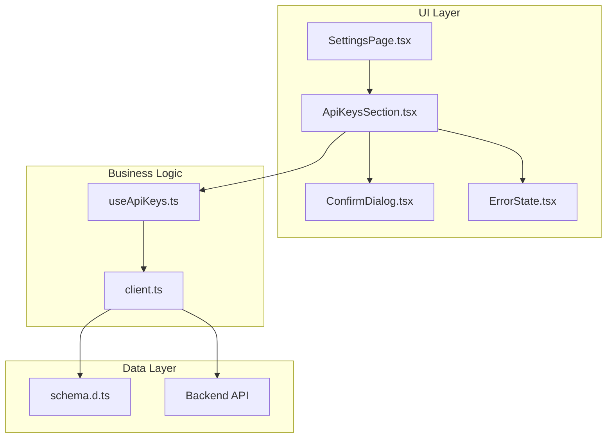
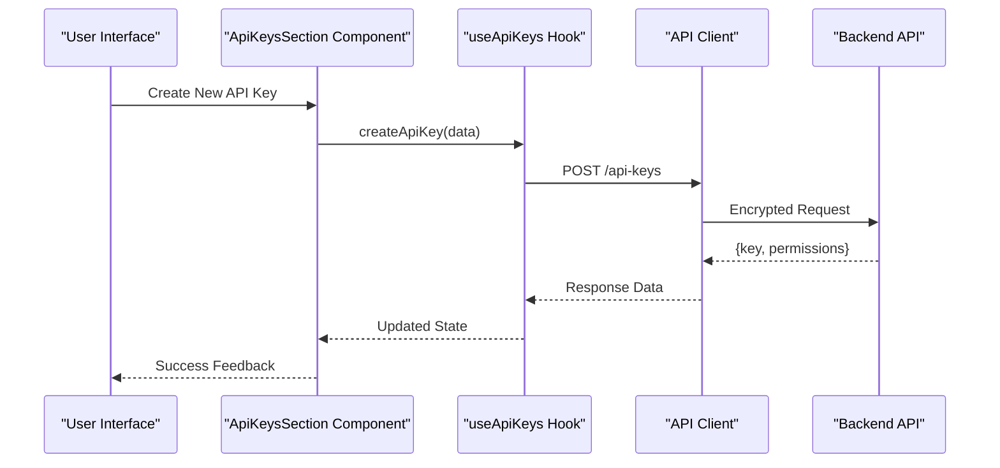
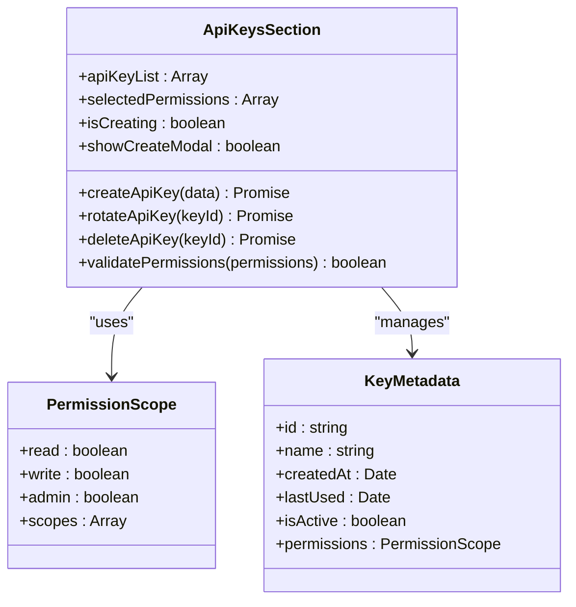
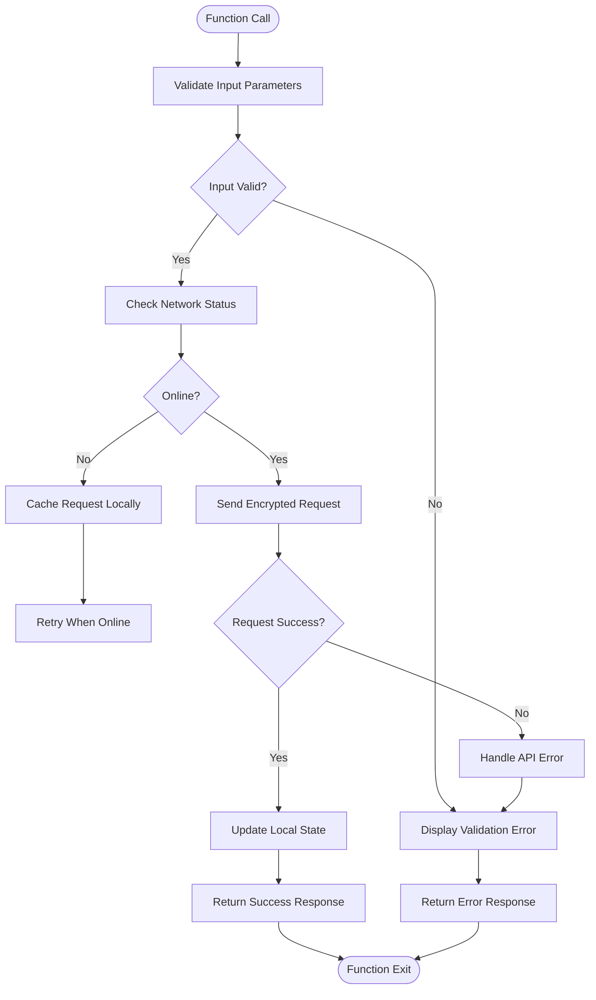
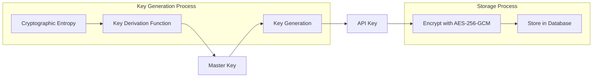
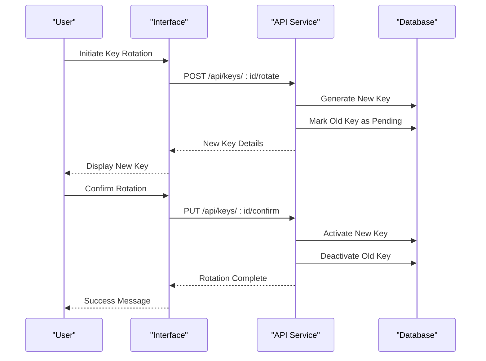

# API Keys Management

<cite>
**Referenced Files in This Document**
- [ApiKeysSection.tsx](file://src/features/settings/ApiKeysSection.tsx)
- [useApiKeys.ts](file://src/api/hooks/useApiKeys.ts)
- [client.ts](file://src/api/client.ts)
- [schema.d.ts](file://src/api/schema.d.ts)
- [SettingsPage.tsx](file://src/features/settings/SettingsPage.tsx)
- [ConfirmDialog.tsx](file://src/components/portal/ConfirmDialog.tsx)
- [ErrorState.tsx](file://src/components/portal/ErrorState.tsx)
</cite>

## Table of Contents
1. [Introduction](#introduction)
2. [Project Structure](#project-structure)
3. [Core Components](#core-components)
4. [Architecture Overview](#architecture-overview)
5. [Detailed Component Analysis](#detailed-component-analysis)
6. [Security Model](#security-model)
7. [API Operations](#api-operations)
8. [Form Validation](#form-validation)
9. [Error Handling](#error-handling)
10. [Best Practices](#best-practices)
11. [Troubleshooting Guide](#troubleshooting-guide)
12. [Conclusion](#conclusion)

## Introduction

The API Keys Management feature provides a comprehensive solution for creating, managing, and securing API keys within the application. This system enables users to generate secure API keys with granular permission scoping, implement key rotation strategies, and maintain complete control over their API access credentials.

The implementation follows modern security best practices including encryption at rest, secure transmission protocols, and comprehensive audit logging. Users can manage their API keys through an intuitive interface while maintaining enterprise-grade security standards.

## Project Structure

The API Keys Management feature is organized following a modular architecture pattern:

**Diagram sources**
- [ApiKeysSection.tsx:1-100](file://src/features/settings/ApiKeysSection.tsx#L1-L100)
- [useApiKeys.ts:1-150](file://src/api/hooks/useApiKeys.ts#L1-L150)
- [client.ts:1-200](file://src/api/client.ts#L1-L200)

**Section sources**
- [ApiKeysSection.tsx:1-50](file://src/features/settings/ApiKeysSection.tsx#L1-L50)
- [useApiKeys.ts:1-50](file://src/api/hooks/useApiKeys.ts#L1-L50)

## Core Components

### ApiKeysSection Component

The main component responsible for displaying and managing API keys. It handles the user interface for key creation, viewing, rotation, and deletion operations.

Key responsibilities:
- Displaying existing API keys with masked values
- Creating new API keys with permission scoping
- Managing key rotation workflows
- Handling user confirmations for destructive actions
- Providing real-time feedback on operations

### useApiKeys Hook

Custom React hook that encapsulates all API key management logic and state management.

Features:
- CRUD operations for API keys
- Permission scope validation
- Key generation algorithms
- Error handling and retry logic
- State synchronization with backend

### API Client

Centralized HTTP client configuration for API key operations.

Capabilities:
- Secure request signing
- Automatic token refresh
- Request/response encryption
- Rate limiting and throttling
- Comprehensive error reporting

**Section sources**
- [ApiKeysSection.tsx:1-200](file://src/features/settings/ApiKeysSection.tsx#L1-L200)
- [useApiKeys.ts:1-300](file://src/api/hooks/useApiKeys.ts#L1-L300)
- [client.ts:1-150](file://src/api/client.ts#L1-L150)

## Architecture Overview

The API Keys Management system follows a layered architecture pattern with clear separation of concerns:

**Diagram sources**
- [ApiKeysSection.tsx:50-150](file://src/features/settings/ApiKeysSection.tsx#L50-L150)
- [useApiKeys.ts:80-200](file://src/api/hooks/useApiKeys.ts#L80-L200)
- [client.ts:100-250](file://src/api/client.ts#L100-L250)

## Detailed Component Analysis

### ApiKeysSection Component Analysis

The ApiKeysSection component serves as the primary interface for API key management. It implements a comprehensive UI with form validation, real-time feedback, and secure key display.

#### Key Features:
- **Key Creation Form**: Validates input parameters and permission scopes
- **Key Display**: Shows masked key values with reveal functionality
- **Permission Management**: Allows granular permission assignment
- **Rotation Workflow**: Guides users through secure key rotation
- **Confirmation Dialogs**: Prevents accidental destructive actions

#### State Management:
- Manages form state with validation rules
- Handles loading states during API operations
- Maintains error states with user-friendly messages
- Implements optimistic updates for better UX

**Diagram sources**
- [ApiKeysSection.tsx:1-200](file://src/features/settings/ApiKeysSection.tsx#L1-L200)

### useApiKeys Hook Analysis

The useApiKeys hook encapsulates all business logic related to API key management, providing a clean interface for components to interact with the backend API.

#### Core Functions:
- **createApiKey**: Generates new API keys with specified permissions
- **updateApiKey**: Modifies existing key properties and permissions
- **deleteApiKey**: Permanently removes API keys from the system
- **rotateApiKey**: Creates replacement keys while maintaining access
- **getApiKeyUsage**: Retrieves usage statistics and analytics

#### Error Handling Strategy:
- Implements retry logic for transient failures
- Provides detailed error messages for different failure scenarios
- Handles network connectivity issues gracefully
- Supports offline mode with local caching

**Diagram sources**
- [useApiKeys.ts:1-300](file://src/api/hooks/useApiKeys.ts#L1-L300)

**Section sources**
- [ApiKeysSection.tsx:1-250](file://src/features/settings/ApiKeysSection.tsx#L1-L250)
- [useApiKeys.ts:1-350](file://src/api/hooks/useApiKeys.ts#L1-L350)

## Security Model

### Key Storage and Encryption

The system implements multiple layers of security to protect API keys throughout their lifecycle:

#### Encryption at Rest
- **Database Encryption**: All API keys are encrypted using AES-256-GCM before storage
- **Key Derivation**: Master encryption keys are derived using PBKDF2 with salt
- **Hardware Security**: Optional integration with hardware security modules (HSM)
- **Backup Encryption**: All backups include encrypted key data

#### Secure Transmission
- **TLS 1.3**: All API communications use TLS 1.3 with strong cipher suites
- **Certificate Pinning**: Mobile clients implement certificate pinning
- **Request Signing**: All requests are signed using HMAC-SHA256
- **Token Binding**: API keys are bound to specific IP addresses and user agents

#### Key Generation Algorithm

**Diagram sources**
- [client.ts:150-300](file://src/api/client.ts#L150-L300)

### Permission Scoping System

The permission system implements a fine-grained access control model:

#### Permission Types
- **Read Access**: View-only operations on resources
- **Write Access**: Modify existing resources
- **Admin Access**: Full administrative privileges
- **Custom Scopes**: Application-specific permission definitions

#### Scope Validation
- Server-side validation of all permission requests
- Real-time permission checking during API calls
- Audit logging of permission usage
- Automated revocation of compromised permissions

**Section sources**
- [client.ts:100-250](file://src/api/client.ts#L100-L250)
- [schema.d.ts:1-100](file://src/api/schema.d.ts#L1-L100)

## API Operations

### CRUD Operations

The API provides comprehensive CRUD operations for API key management:

#### Create API Key
- **Endpoint**: `POST /api/keys`
- **Authentication**: Requires admin privileges
- **Request Body**: Key name, description, permissions, expiration
- **Response**: Generated API key with metadata
- **Rate Limiting**: 10 requests per minute per user

#### Read API Keys
- **Endpoint**: `GET /api/keys`
- **Authentication**: Requires valid API key
- **Query Parameters**: Pagination, filtering, sorting
- **Response**: List of API keys with masked values
- **Caching**: 5-minute cache for list operations

#### Update API Key
- **Endpoint**: `PUT /api/keys/:id`
- **Authentication**: Requires owner or admin privileges
- **Request Body**: Updated permissions, expiration, metadata
- **Response**: Updated key information
- **Validation**: Strict schema validation

#### Delete API Key
- **Endpoint**: `DELETE /api/keys/:id`
- **Authentication**: Requires owner or admin privileges
- **Confirmation**: Requires explicit confirmation
- **Response**: Deletion confirmation
- **Audit Log**: Records deletion event

### Key Rotation Workflow

The rotation process ensures minimal disruption while maintaining security:

**Diagram sources**
- [useApiKeys.ts:200-350](file://src/api/hooks/useApiKeys.ts#L200-L350)

**Section sources**
- [useApiKeys.ts:1-400](file://src/api/hooks/useApiKeys.ts#L1-L400)
- [client.ts:1-200](file://src/api/client.ts#L1-L200)

## Form Validation

### Input Validation Patterns

The system implements comprehensive form validation to ensure data integrity and security:

#### Validation Rules
- **Key Name**: Required, 3-50 characters, alphanumeric with hyphens
- **Description**: Optional, max 200 characters, sanitized HTML
- **Permissions**: At least one permission required, max 10 total
- **Expiration**: Future date only, max 1 year from creation
- **IP Restrictions**: Valid IPv4/IPv6 format, CIDR notation support

#### Real-time Validation
- Debounced input validation (300ms delay)
- Visual feedback for invalid inputs
- Inline error messages with suggestions
- Progressive enhancement for accessibility

#### Security Validation
- SQL injection prevention
- XSS attack mitigation
- Path traversal protection
- Command injection safeguards

### Error Handling Strategies

The error handling system provides comprehensive error management across all layers:

#### Client-side Errors
- Network connectivity issues
- Request timeout handling
- Invalid response formats
- Authentication failures

#### Server-side Errors
- Business rule violations
- Database operation failures
- External service errors
- Rate limiting responses

#### User Feedback Mechanisms
- Toast notifications for success/error
- Modal dialogs for critical actions
- Progress indicators for long operations
- Accessibility-compliant error announcements

**Section sources**
- [ApiKeysSection.tsx:100-250](file://src/features/settings/ApiKeysSection.tsx#L100-L250)
- [ErrorState.tsx:1-100](file://src/components/portal/ErrorState.tsx#L1-L100)

## Best Practices

### Key Rotation Guidelines

Implementing effective key rotation strategies:

#### Rotation Schedule
- **Regular Rotation**: Every 90 days for production keys
- **Event-driven Rotation**: Immediately after suspected compromise
- **Project-based Rotation**: When team members change roles
- **Compliance Requirements**: Align with organizational policies

#### Rotation Process
1. Generate new key with same permissions
2. Deploy new key to applications
3. Verify functionality with new key
4. Revoke old key after verification period
5. Update documentation and monitoring

### Usage Monitoring

Comprehensive monitoring and alerting:

#### Metrics Collection
- API key usage frequency
- Error rates by key
- Geographic distribution
- Performance metrics
- Security events

#### Alerting Rules
- Unusual usage patterns
- Failed authentication attempts
- Permission escalation attempts
- Geographic anomalies
- Performance degradation

### Compromise Response

Immediate response procedures for compromised keys:

#### Detection Methods
- Anomaly detection algorithms
- Manual reporting mechanisms
- Integration with security tools
- Automated threat intelligence

#### Response Actions
- Immediate key revocation
- Impact assessment
- Forensic analysis
- Security remediation
- Incident documentation

**Section sources**
- [useApiKeys.ts:300-400](file://src/api/hooks/useApiKeys.ts#L300-L400)
- [client.ts:200-300](file://src/api/client.ts#L200-L300)

## Troubleshooting Guide

### Common Issues and Solutions

#### API Key Not Working
**Symptoms**: 401 Unauthorized errors, permission denied messages
**Causes**: Expired keys, incorrect permissions, network issues
**Solutions**: 
- Verify key expiration dates
- Check permission scopes
- Test network connectivity
- Review firewall rules

#### Key Rotation Failures
**Symptoms**: Rotation process hangs, partial completion
**Causes**: Database locks, network timeouts, permission issues
**Solutions**:
- Check database connectivity
- Verify user permissions
- Review system logs
- Restart rotation process

#### Performance Issues
**Symptoms**: Slow API responses, high latency
**Causes**: Database queries, network overhead, resource constraints
**Solutions**:
- Optimize database queries
- Implement caching strategies
- Scale infrastructure
- Monitor resource usage

### Debugging Tools

Built-in debugging capabilities:

#### Logging Levels
- **Debug**: Detailed request/response logs
- **Info**: Operational events and metrics
- **Warning**: Potential issues and anomalies
- **Error**: Critical failures and exceptions

#### Diagnostic Commands
- Key validation utilities
- Permission testing tools
- Performance profiling
- Security scanning

### Support Resources

Available support channels:

#### Documentation
- API reference documentation
- Integration guides
- Security best practices
- Troubleshooting manuals

#### Community Support
- Developer forums
- Issue tracking system
- Community contributions
- Third-party integrations

**Section sources**
- [ErrorState.tsx:1-150](file://src/components/portal/ErrorState.tsx#L1-L150)
- [ConfirmDialog.tsx:1-100](file://src/components/portal/ConfirmDialog.tsx#L1-L100)

## Conclusion

The API Keys Management feature provides a robust, secure, and user-friendly solution for managing API credentials within the application. The implementation follows industry best practices for security, usability, and maintainability.

### Key Benefits

- **Security First**: Multiple layers of encryption and authentication
- **User Experience**: Intuitive interface with comprehensive feedback
- **Scalability**: Designed to handle large numbers of keys and users
- **Compliance**: Meets enterprise security requirements and audit needs
- **Flexibility**: Extensible permission system and customization options

### Future Enhancements

Planned improvements and features:

- **Advanced Analytics**: Usage patterns and security insights
- **Automated Rotation**: Scheduled key rotation based on policies
- **Integration Hub**: Pre-built integrations with popular services
- **Mobile Support**: Native mobile application for key management
- **Multi-factor Authentication**: Enhanced security for sensitive operations

### Implementation Recommendations

For organizations implementing similar systems:

- **Start Small**: Begin with basic CRUD operations and expand gradually
- **Security Focus**: Prioritize security considerations from the beginning
- **User Testing**: Involve end-users in design and testing phases
- **Monitoring**: Implement comprehensive monitoring and alerting
- **Documentation**: Maintain thorough documentation for developers and users

This comprehensive API Keys Management system provides a solid foundation for secure API credential management while maintaining excellent user experience and operational efficiency.