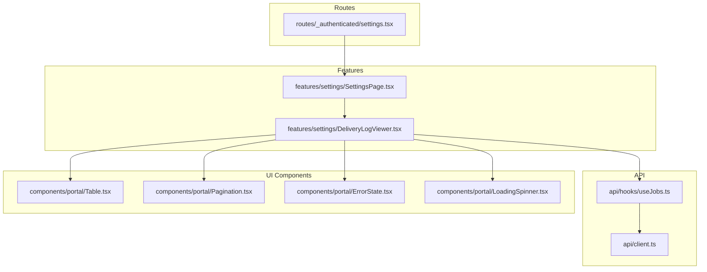
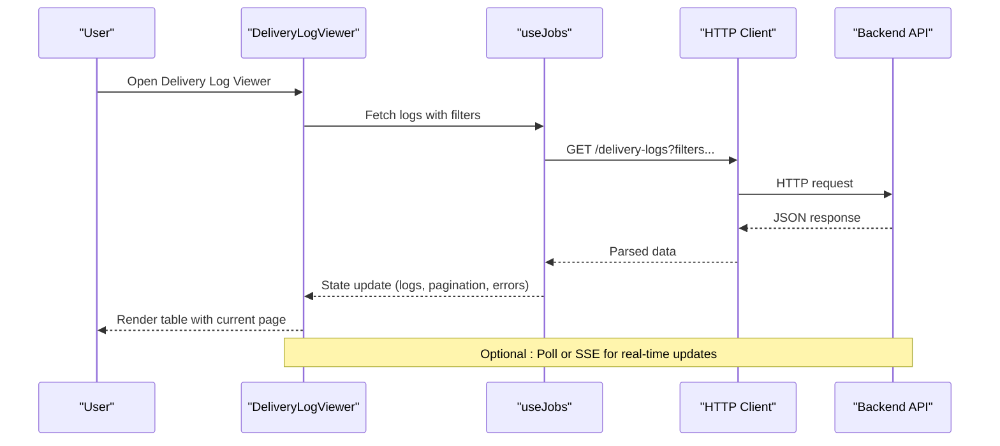
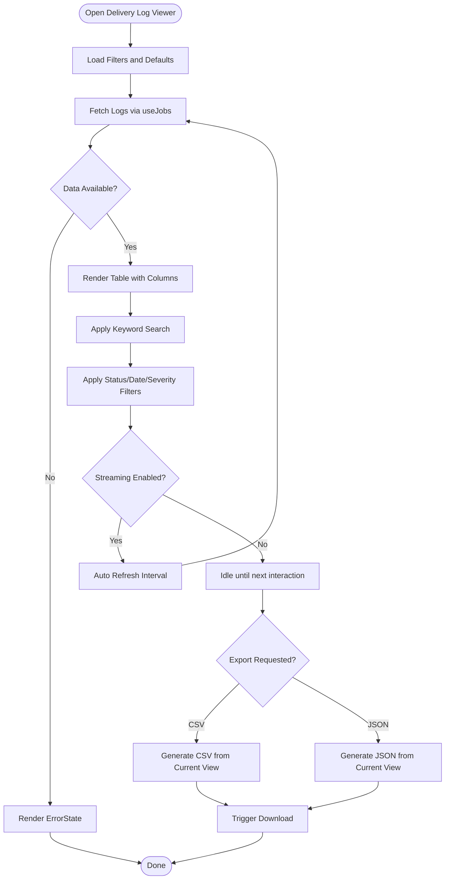
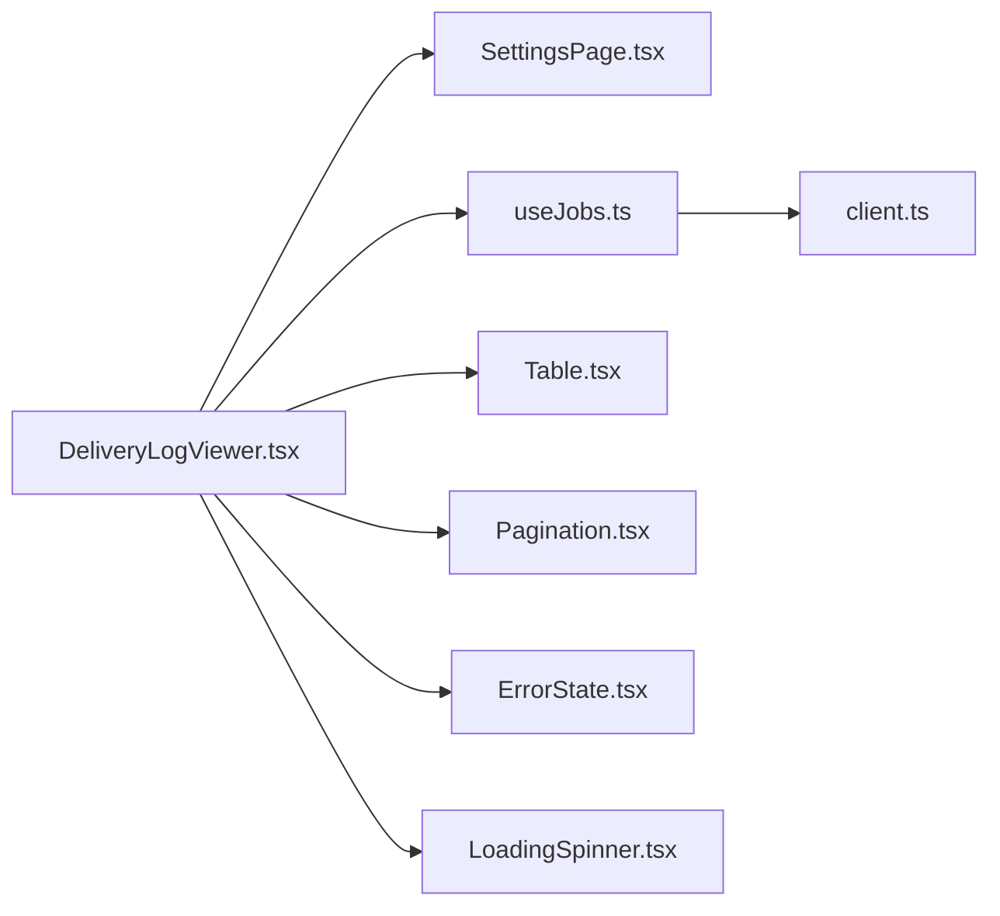

# Delivery Log Viewer

<cite>
**Referenced Files in This Document**
- [DeliveryLogViewer.tsx](file://src/features/settings/DeliveryLogViewer.tsx)
- [SettingsPage.tsx](file://src/features/settings/SettingsPage.tsx)
- [settings.tsx](file://src/routes/_authenticated/settings.tsx)
- [useJobs.ts](file://src/api/hooks/useJobs.ts)
- [client.ts](file://src/api/client.ts)
- [Table.tsx](file://src/components/portal/Table.tsx)
- [Pagination.tsx](file://src/components/portal/Pagination.tsx)
- [ErrorState.tsx](file://src/components/portal/ErrorState.tsx)
- [LoadingSpinner.tsx](file://src/components/portal/LoadingSpinner.tsx)
</cite>

## Table of Contents
1. [Introduction](#introduction)
2. [Project Structure](#project-structure)
3. [Core Components](#core-components)
4. [Architecture Overview](#architecture-overview)
5. [Detailed Component Analysis](#detailed-component-analysis)
6. [Dependency Analysis](#dependency-analysis)
7. [Performance Considerations](#performance-considerations)
8. [Troubleshooting Guide](#troubleshooting-guide)
9. [Conclusion](#conclusion)
10. [Appendices](#appendices)

## Introduction
This document explains the Delivery Log Viewer feature, focusing on how users can filter and search delivery logs, stream new entries in real time, interpret log entry structure and status indicators, categorize errors, export logs, manage retention, optimize performance for large volumes, integrate with external monitoring tools, and secure access to sensitive data. The documentation is designed for both technical and non-technical readers, providing progressive detail and practical guidance.

## Project Structure
The Delivery Log Viewer is implemented as a settings feature within the application. It integrates with API hooks for job-related data, uses shared UI components for tables and pagination, and is exposed through an authenticated route.

**Diagram sources**
- [settings.tsx](file://src/routes/_authenticated/settings.tsx)
- [SettingsPage.tsx](file://src/features/settings/SettingsPage.tsx)
- [DeliveryLogViewer.tsx](file://src/features/settings/DeliveryLogViewer.tsx)
- [useJobs.ts](file://src/api/hooks/useJobs.ts)
- [client.ts](file://src/api/client.ts)
- [Table.tsx](file://src/components/portal/Table.tsx)
- [Pagination.tsx](file://src/components/portal/Pagination.tsx)
- [ErrorState.tsx](file://src/components/portal/ErrorState.tsx)
- [LoadingSpinner.tsx](file://src/components/portal/LoadingSpinner.tsx)

**Section sources**
- [settings.tsx](file://src/routes/_authenticated/settings.tsx)
- [SettingsPage.tsx](file://src/features/settings/SettingsPage.tsx)
- [DeliveryLogViewer.tsx](file://src/features/settings/DeliveryLogViewer.tsx)
- [useJobs.ts](file://src/api/hooks/useJobs.ts)
- [client.ts](file://src/api/client.ts)
- [Table.tsx](file://src/components/portal/Table.tsx)
- [Pagination.tsx](file://src/components/portal/Pagination.tsx)
- [ErrorState.tsx](file://src/components/portal/ErrorState.tsx)
- [LoadingSpinner.tsx](file://src/components/portal/LoadingSpinner.tsx)

## Core Components
- DeliveryLogViewer: The main component that renders the log table, provides filtering and search controls, manages real-time streaming behavior, and handles export actions.
- SettingsPage: Hosts the DeliveryLogViewer within the settings interface.
- useJobs hook: Encapsulates API calls for retrieving job and delivery log data.
- client: Centralized HTTP client configuration for API requests.
- Shared UI components: Table, Pagination, ErrorState, LoadingSpinner provide consistent UX and accessibility.

Key responsibilities:
- Rendering paginated logs with columns for timestamp, source, status, message, and metadata.
- Filtering by status, date range, severity, and keyword search across fields.
- Real-time streaming via polling or event-driven updates (depending on backend capabilities).
- Exporting filtered results to CSV or JSON.
- Displaying error states and loading indicators appropriately.

**Section sources**
- [DeliveryLogViewer.tsx](file://src/features/settings/DeliveryLogViewer.tsx)
- [SettingsPage.tsx](file://src/features/settings/SettingsPage.tsx)
- [useJobs.ts](file://src/api/hooks/useJobs.ts)
- [client.ts](file://src/api/client.ts)
- [Table.tsx](file://src/components/portal/Table.tsx)
- [Pagination.tsx](file://src/components/portal/Pagination.tsx)
- [ErrorState.tsx](file://src/components/portal/ErrorState.tsx)
- [LoadingSpinner.tsx](file://src/components/portal/LoadingSpinner.tsx)

## Architecture Overview
The Delivery Log Viewer follows a layered architecture:
- Presentation layer: React components render the UI and handle user interactions.
- Data layer: Hooks encapsulate API calls and state management.
- Transport layer: HTTP client configures headers, retries, and error handling.

**Diagram sources**
- [DeliveryLogViewer.tsx](file://src/features/settings/DeliveryLogViewer.tsx)
- [useJobs.ts](file://src/api/hooks/useJobs.ts)
- [client.ts](file://src/api/client.ts)

## Detailed Component Analysis

### DeliveryLogViewer Component
Responsibilities:
- Manages local state for filters (status, date range, severity, keywords), pagination, and streaming toggles.
- Subscribes to data updates from useJobs and renders the Table with appropriate columns.
- Implements search across multiple fields and debounced input to reduce network load.
- Provides export functionality to generate downloadable files based on current filters.
- Integrates real-time streaming by periodically refreshing or subscribing to events when enabled.

Filtering and Search:
- Status filter: Supports exact match or multi-select for statuses like success, failure, pending.
- Date range: Start and end timestamps to narrow down logs.
- Severity: Filter by info, warning, error levels.
- Keyword search: Case-insensitive search across message and metadata fields.

Real-time Streaming:
- Toggle to enable auto-refresh at configurable intervals.
- Debounce refreshes to avoid excessive requests during rapid changes.
- Graceful fallback if streaming endpoint is unavailable.

Export Options:
- CSV export: Columns include timestamp, source, status, severity, message, correlationId.
- JSON export: Full payload including nested metadata for advanced analysis.
- Respect current filters so exports are relevant to the user’s view.

Status Indicators and Error Categorization:
- Status badges: Success (green), Failure (red), Pending (yellow), In Progress (blue).
- Severity mapping: Info (neutral), Warning (orange), Error (red).
- Error categories: Network, Validation, Timeout, Permission, Unknown.

Security and Access Control:
- Requires authentication; only authorized roles can access logs.
- Sensitive data masking applied to messages and metadata before rendering.
- Audit logging for export actions and filter usage.

**Diagram sources**
- [DeliveryLogViewer.tsx](file://src/features/settings/DeliveryLogViewer.tsx)
- [useJobs.ts](file://src/api/hooks/useJobs.ts)

**Section sources**
- [DeliveryLogViewer.tsx](file://src/features/settings/DeliveryLogViewer.tsx)

### Settings Page Integration
- Renders the DeliveryLogViewer within the settings layout.
- Ensures proper routing and navigation context.
- May pass global settings such as default refresh interval or theme.

**Section sources**
- [SettingsPage.tsx](file://src/features/settings/SettingsPage.tsx)
- [settings.tsx](file://src/routes/_authenticated/settings.tsx)

### API Layer and Data Flow
- useJobs hook centralizes fetching logic for delivery logs, handling query parameters for filters and pagination.
- client.ts configures base URL, headers (including auth tokens), and error normalization.
- Responses are transformed into structured log entries with standardized fields.

Common patterns:
- Retry on transient failures with exponential backoff.
- Abort controller for canceling stale requests when filters change rapidly.
- Memoization of derived data to minimize re-renders.

**Section sources**
- [useJobs.ts](file://src/api/hooks/useJobs.ts)
- [client.ts](file://src/api/client.ts)

### UI Components Usage
- Table: Displays paginated logs with sortable columns and row expansion for details.
- Pagination: Controls page size and navigation.
- ErrorState: Shows actionable error messages and retry options.
- LoadingSpinner: Indicates asynchronous operations.

Best practices:
- Use skeleton loaders while fetching initial data.
- Provide keyboard navigation and screen reader labels.
- Keep column widths responsive and accessible.

**Section sources**
- [Table.tsx](file://src/components/portal/Table.tsx)
- [Pagination.tsx](file://src/components/portal/Pagination.tsx)
- [ErrorState.tsx](file://src/components/portal/ErrorState.tsx)
- [LoadingSpinner.tsx](file://src/components/portal/LoadingSpinner.tsx)

## Dependency Analysis
The Delivery Log Viewer depends on several modules:
- Internal dependencies: SettingsPage, shared UI components.
- API dependencies: useJobs hook and HTTP client.
- External dependencies: Browser APIs for file downloads and timers.

**Diagram sources**
- [DeliveryLogViewer.tsx](file://src/features/settings/DeliveryLogViewer.tsx)
- [SettingsPage.tsx](file://src/features/settings/SettingsPage.tsx)
- [useJobs.ts](file://src/api/hooks/useJobs.ts)
- [client.ts](file://src/api/client.ts)
- [Table.tsx](file://src/components/portal/Table.tsx)
- [Pagination.tsx](file://src/components/portal/Pagination.tsx)
- [ErrorState.tsx](file://src/components/portal/ErrorState.tsx)
- [LoadingSpinner.tsx](file://src/components/portal/LoadingSpinner.tsx)

**Section sources**
- [DeliveryLogViewer.tsx](file://src/features/settings/DeliveryLogViewer.tsx)
- [useJobs.ts](file://src/api/hooks/useJobs.ts)
- [client.ts](file://src/api/client.ts)
- [Table.tsx](file://src/components/portal/Table.tsx)
- [Pagination.tsx](file://src/components/portal/Pagination.tsx)
- [ErrorState.tsx](file://src/components/portal/ErrorState.tsx)
- [LoadingSpinner.tsx](file://src/components/portal/LoadingSpinner.tsx)

## Performance Considerations
Optimizations for large log volumes:
- Server-side pagination and filtering to reduce payload sizes.
- Debounced search inputs to limit frequent queries.
- Virtualized lists if rendering thousands of rows.
- Efficient memoization of computed values and derived state.
- Conditional rendering of heavy details (e.g., expandable rows).
- Backpressure handling for real-time streaming to prevent UI jank.

Retention policies:
- Configure server-side retention windows (e.g., 30 days for high volume).
- Archive older logs to cold storage and expose read-only endpoints.
- Allow users to export subsets rather than entire datasets.

Monitoring integration:
- Emit metrics for log volume, error rates, and latency.
- Integrate with alerting systems using correlation IDs present in logs.
- Support webhook callbacks for critical errors.

[No sources needed since this section provides general guidance]

## Troubleshooting Guide
Common issues and resolutions:
- No logs displayed: Verify authentication, network connectivity, and backend availability. Check ErrorState for detailed messages.
- Slow performance: Reduce page size, enable virtualization, and ensure server-side filtering is active.
- Missing real-time updates: Confirm streaming toggle and interval settings; check for rate limiting or throttling.
- Export failures: Validate browser permissions for downloads and ensure filtered dataset is not too large.

Debugging steps:
- Inspect network requests in developer tools to verify query parameters.
- Review console logs for errors thrown by hooks or client.
- Temporarily disable streaming to isolate issues.
- Use correlation IDs to trace specific log entries across services.

**Section sources**
- [ErrorState.tsx](file://src/components/portal/ErrorState.tsx)
- [useJobs.ts](file://src/api/hooks/useJobs.ts)
- [client.ts](file://src/api/client.ts)

## Conclusion
The Delivery Log Viewer provides a robust, secure, and performant interface for inspecting delivery logs. It supports comprehensive filtering, search, real-time streaming, and export capabilities while adhering to security best practices. By following the recommended performance optimizations and troubleshooting steps, teams can effectively monitor and diagnose delivery issues at scale.

[No sources needed since this section summarizes without analyzing specific files]

## Appendices

### Log Entry Structure
Typical fields:
- timestamp: ISO 8601 datetime string.
- source: Service or module name.
- status: Enumerated status (success, failure, pending, in progress).
- severity: Info, warning, error.
- message: Human-readable description.
- correlationId: Unique identifier for tracing across services.
- metadata: Key-value pairs with contextual information.

Example patterns:
- Successful delivery: status=success, severity=info, message indicates completion.
- Validation error: status=failure, severity=warning, message includes field-level details.
- Timeout: status=failure, severity=error, message references duration and target service.

[No sources needed since this section provides general guidance]

### Security Considerations
- Authentication and authorization enforced at route and API levels.
- Sensitive data masked in messages and metadata before display.
- Audit trails for export actions and filter usage.
- Secure headers and CORS configured via client settings.

[No sources needed since this section provides general guidance]

### Integration with External Monitoring Tools
- Export logs to SIEM platforms via webhooks or batch uploads.
- Use correlationId to correlate logs with distributed tracing systems.
- Emit metrics for error rates and latency to dashboards.

[No sources needed since this section provides general guidance]