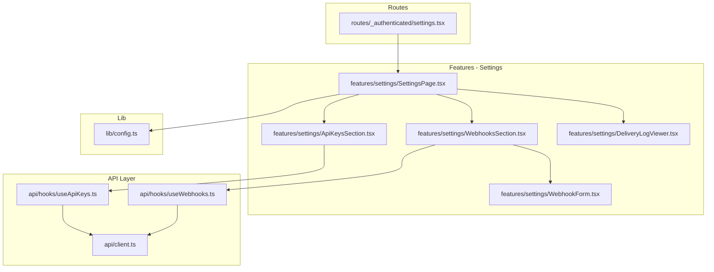
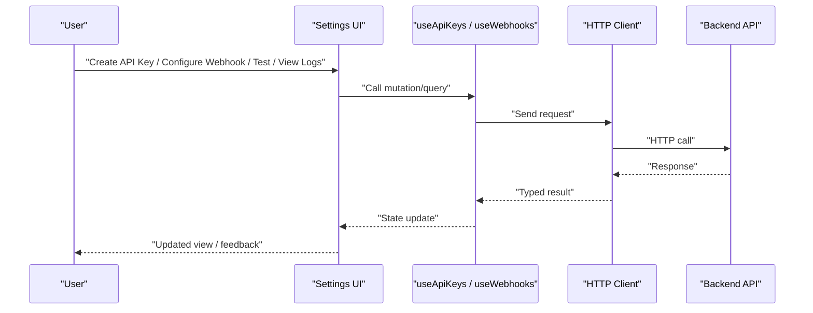
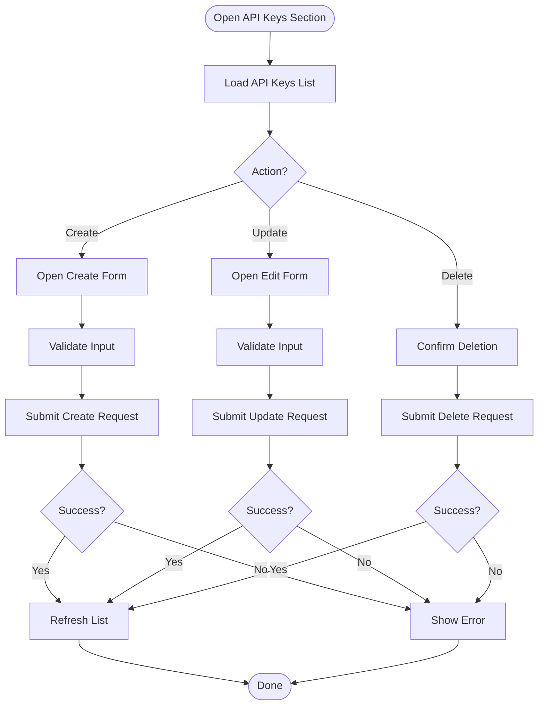
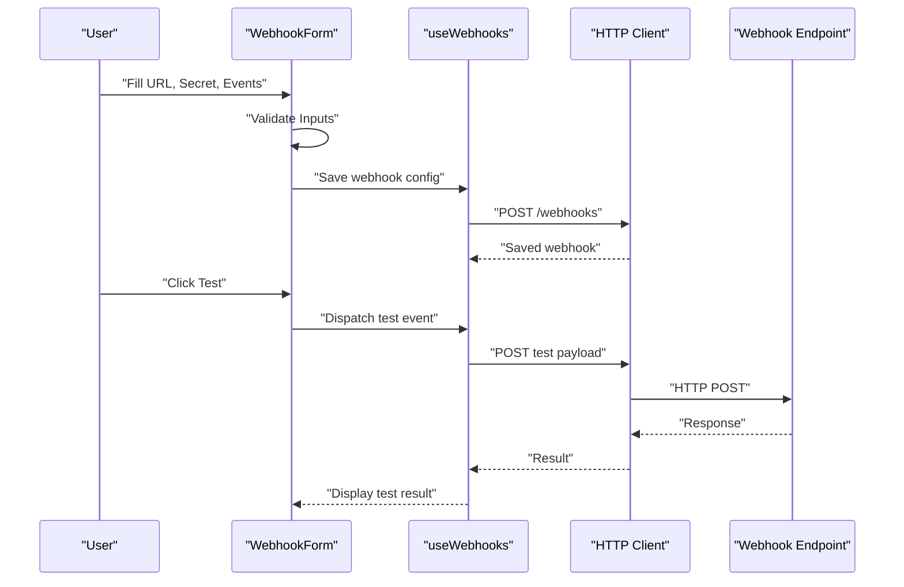
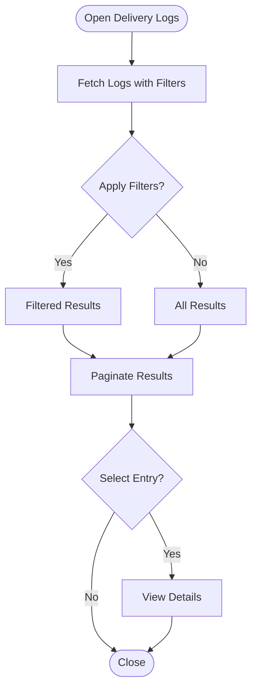
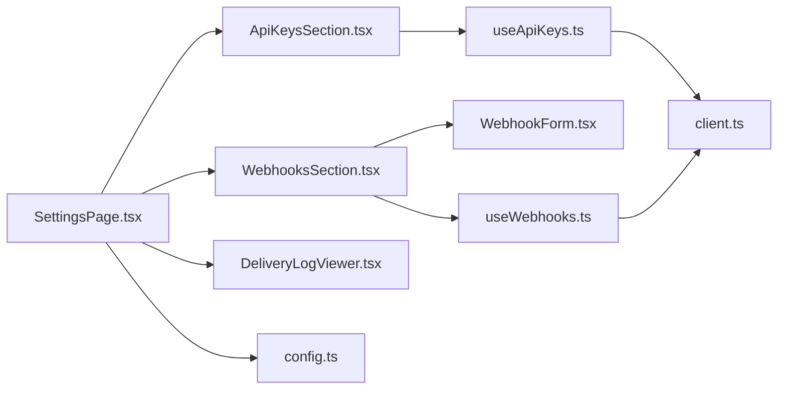

# Settings & Configuration Module

<cite>
**Referenced Files in This Document**
- [SettingsPage.tsx](file://src/features/settings/SettingsPage.tsx)
- [ApiKeysSection.tsx](file://src/features/settings/ApiKeysSection.tsx)
- [WebhooksSection.tsx](file://src/features/settings/WebhooksSection.tsx)
- [WebhookForm.tsx](file://src/features/settings/WebhookForm.tsx)
- [DeliveryLogViewer.tsx](file://src/features/settings/DeliveryLogViewer.tsx)
- [useApiKeys.ts](file://src/api/hooks/useApiKeys.ts)
- [useWebhooks.ts](file://src/api/hooks/useWebhooks.ts)
- [client.ts](file://src/api/client.ts)
- [settings.tsx](file://src/routes/_authenticated/settings.tsx)
- [config.ts](file://src/lib/config.ts)
</cite>

## Table of Contents
1. [Introduction](#introduction)
2. [Project Structure](#project-structure)
3. [Core Components](#core-components)
4. [Architecture Overview](#architecture-overview)
5. [Detailed Component Analysis](#detailed-component-analysis)
6. [Dependency Analysis](#dependency-analysis)
7. [Performance Considerations](#performance-considerations)
8. [Troubleshooting Guide](#troubleshooting-guide)
9. [Conclusion](#conclusion)

## Introduction
This document explains the Settings & Configuration module, focusing on:
- API key management with full CRUD operations
- Webhook configuration and real-time testing
- Delivery log viewing and filtering
- General application settings
It also covers security considerations for API key storage, webhook event handling, log retention policies, and configuration validation. Form handling patterns, real-time webhook testing capabilities, and log analysis features are explained to help both developers and operators understand how to use and secure these features effectively.

## Project Structure
The Settings & Configuration module is implemented as a feature-based set of React components under src/features/settings, with API hooks under src/api/hooks and routing integration under src/routes/_authenticated. Shared UI primitives live under src/components/ui, and the HTTP client is defined in src/api/client.ts. Application-level configuration lives in src/lib/config.ts.

**Diagram sources**
- [settings.tsx](file://src/routes/_authenticated/settings.tsx)
- [SettingsPage.tsx](file://src/features/settings/SettingsPage.tsx)
- [ApiKeysSection.tsx](file://src/features/settings/ApiKeysSection.tsx)
- [WebhooksSection.tsx](file://src/features/settings/WebhooksSection.tsx)
- [WebhookForm.tsx](file://src/features/settings/WebhookForm.tsx)
- [DeliveryLogViewer.tsx](file://src/features/settings/DeliveryLogViewer.tsx)
- [useApiKeys.ts](file://src/api/hooks/useApiKeys.ts)
- [useWebhooks.ts](file://src/api/hooks/useWebhooks.ts)
- [client.ts](file://src/api/client.ts)
- [config.ts](file://src/lib/config.ts)

**Section sources**
- [settings.tsx](file://src/routes/_authenticated/settings.tsx)
- [SettingsPage.tsx](file://src/features/settings/SettingsPage.tsx)
- [useApiKeys.ts](file://src/api/hooks/useApiKeys.ts)
- [useWebhooks.ts](file://src/api/hooks/useWebhooks.ts)
- [client.ts](file://src/api/client.ts)
- [config.ts](file://src/lib/config.ts)

## Core Components
- Settings page orchestrates sections for API keys, webhooks, delivery logs, and general settings. It composes smaller sections and manages tabbed navigation or layout grouping.
- ApiKeysSection provides create, list, update (e.g., rename), and delete operations for API keys. It typically uses optimistic updates and error feedback.
- WebhooksSection lists configured webhooks, supports enabling/disabling, and opens a form to add/edit endpoints.
- WebhookForm handles endpoint URL, secret/token, event selection, retry policy, and test dispatch. It validates inputs and shows real-time test results.
- DeliveryLogViewer displays webhook delivery attempts with filters (status, time range, event type), pagination, and detail views.

Key responsibilities:
- Data fetching and mutation via typed hooks
- Form state management and validation
- Real-time testing for webhooks
- Filtering and pagination for logs
- Security-sensitive UX (masking, confirmation dialogs)

**Section sources**
- [SettingsPage.tsx](file://src/features/settings/SettingsPage.tsx)
- [ApiKeysSection.tsx](file://src/features/settings/ApiKeysSection.tsx)
- [WebhooksSection.tsx](file://src/features/settings/WebhooksSection.tsx)
- [WebhookForm.tsx](file://src/features/settings/WebhookForm.tsx)
- [DeliveryLogViewer.tsx](file://src/features/settings/DeliveryLogViewer.tsx)

## Architecture Overview
The module follows a layered architecture:
- Presentation layer: React components for user interactions
- Hooks layer: Typed data accessors for API keys and webhooks
- Client layer: Centralized HTTP client for requests
- Config layer: Application configuration values

**Diagram sources**
- [useApiKeys.ts](file://src/api/hooks/useApiKeys.ts)
- [useWebhooks.ts](file://src/api/hooks/useWebhooks.ts)
- [client.ts](file://src/api/client.ts)

## Detailed Component Analysis

### API Keys Management
Responsibilities:
- Create new API keys with optional metadata (name, scopes if applicable)
- List existing keys with masked values
- Update key properties (e.g., rename)
- Delete keys with confirmation
- Handle errors and provide user feedback

Security considerations:
- Never log or display full secrets; mask after creation
- Require explicit confirmation for destructive actions
- Enforce least privilege by limiting scopes where possible
- Store only hashed representations server-side; never expose raw secrets

Form handling pattern:
- Controlled inputs with validation
- Optimistic updates with rollback on failure
- Clear success/error notifications

**Diagram sources**
- [ApiKeysSection.tsx](file://src/features/settings/ApiKeysSection.tsx)
- [useApiKeys.ts](file://src/api/hooks/useApiKeys.ts)

**Section sources**
- [ApiKeysSection.tsx](file://src/features/settings/ApiKeysSection.tsx)
- [useApiKeys.ts](file://src/api/hooks/useApiKeys.ts)

### Webhooks Configuration and Testing
Responsibilities:
- Add/edit webhook endpoints with URL, secret/token, event types, and retry settings
- Enable/disable webhooks
- Test webhook delivery in real-time from the UI
- Display last delivery status and basic diagnostics

Real-time testing:
- Trigger a test payload immediately upon “Test” action
- Show response code, body preview, and timing
- Provide guidance for common failures (CORS, TLS, auth)

Validation:
- Enforce HTTPS URLs
- Validate JSON payloads and required fields
- Warn about missing or weak secrets

**Diagram sources**
- [WebhookForm.tsx](file://src/features/settings/WebhookForm.tsx)
- [useWebhooks.ts](file://src/api/hooks/useWebhooks.ts)
- [client.ts](file://src/api/client.ts)

**Section sources**
- [WebhooksSection.tsx](file://src/features/settings/WebhooksSection.tsx)
- [WebhookForm.tsx](file://src/features/settings/WebhookForm.tsx)
- [useWebhooks.ts](file://src/api/hooks/useWebhooks.ts)

### Delivery Log Viewer
Responsibilities:
- List webhook delivery attempts with filters (status, time range, event type)
- Paginate through large datasets
- Inspect individual delivery details (request/response snippets, timestamps)
- Export or share logs when needed

Filtering and analysis:
- Status filter (success, failed, pending)
- Time range picker
- Event type selector
- Search by endpoint URL or correlation ID

Retention policies:
- Define server-side retention windows
- Archive old logs to cold storage
- Ensure compliance with data protection requirements

**Diagram sources**
- [DeliveryLogViewer.tsx](file://src/features/settings/DeliveryLogViewer.tsx)

**Section sources**
- [DeliveryLogViewer.tsx](file://src/features/settings/DeliveryLogViewer.tsx)

### General Application Settings
Responsibilities:
- Manage global toggles and defaults that affect behavior across modules
- Persist settings securely and validate inputs
- Provide clear descriptions and tooltips for each setting

Configuration validation:
- Schema-based validation for all settings
- Immediate feedback on invalid values
- Rollback on save failure

Security considerations:
- Restrict sensitive settings to privileged users
- Avoid logging sensitive configuration values
- Encrypt sensitive values at rest where appropriate

**Section sources**
- [SettingsPage.tsx](file://src/features/settings/SettingsPage.tsx)
- [config.ts](file://src/lib/config.ts)

## Dependency Analysis
The module’s dependencies are organized into layers:
- UI components depend on typed hooks for data access
- Hooks depend on a centralized HTTP client
- The client may rely on environment configuration and authentication context
- Routes mount the settings page and pass necessary props

**Diagram sources**
- [SettingsPage.tsx](file://src/features/settings/SettingsPage.tsx)
- [ApiKeysSection.tsx](file://src/features/settings/ApiKeysSection.tsx)
- [WebhooksSection.tsx](file://src/features/settings/WebhooksSection.tsx)
- [WebhookForm.tsx](file://src/features/settings/WebhookForm.tsx)
- [DeliveryLogViewer.tsx](file://src/features/settings/DeliveryLogViewer.tsx)
- [useApiKeys.ts](file://src/api/hooks/useApiKeys.ts)
- [useWebhooks.ts](file://src/api/hooks/useWebhooks.ts)
- [client.ts](file://src/api/client.ts)
- [config.ts](file://src/lib/config.ts)

**Section sources**
- [settings.tsx](file://src/routes/_authenticated/settings.tsx)
- [SettingsPage.tsx](file://src/features/settings/SettingsPage.tsx)
- [useApiKeys.ts](file://src/api/hooks/useApiKeys.ts)
- [useWebhooks.ts](file://src/api/hooks/useWebhooks.ts)
- [client.ts](file://src/api/client.ts)
- [config.ts](file://src/lib/config.ts)

## Performance Considerations
- Use pagination and virtualization for large log sets
- Debounce search inputs in log filters
- Cache frequently accessed settings to reduce network calls
- Implement optimistic UI updates for better perceived performance
- Minimize re-renders by memoizing derived data and stable references

[No sources needed since this section provides general guidance]

## Troubleshooting Guide
Common issues and resolutions:
- API key operations fail due to permissions: verify user roles and scope restrictions
- Webhook tests return network errors: check endpoint reachability, TLS, CORS, and proxy settings
- Invalid webhook payloads: ensure correct content-type and signature verification
- Log viewer slow: refine filters, enable pagination, and avoid excessive concurrent requests
- Configuration changes not applied: confirm validation rules and environment-specific overrides

Security checks:
- Ensure no secrets are logged or exposed in UI
- Validate HTTPS for webhook endpoints
- Rotate compromised keys promptly and audit usage

**Section sources**
- [ApiKeysSection.tsx](file://src/features/settings/ApiKeysSection.tsx)
- [WebhookForm.tsx](file://src/features/settings/WebhookForm.tsx)
- [DeliveryLogViewer.tsx](file://src/features/settings/DeliveryLogViewer.tsx)
- [config.ts](file://src/lib/config.ts)

## Conclusion
The Settings & Configuration module provides a robust interface for managing API keys, configuring webhooks, and analyzing delivery logs while enforcing strong security practices. Its layered architecture promotes maintainability and scalability. By following the recommended validation, retention, and security guidelines, teams can operate safely and efficiently.

[No sources needed since this section summarizes without analyzing specific files]