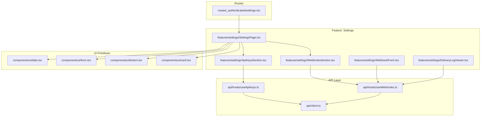
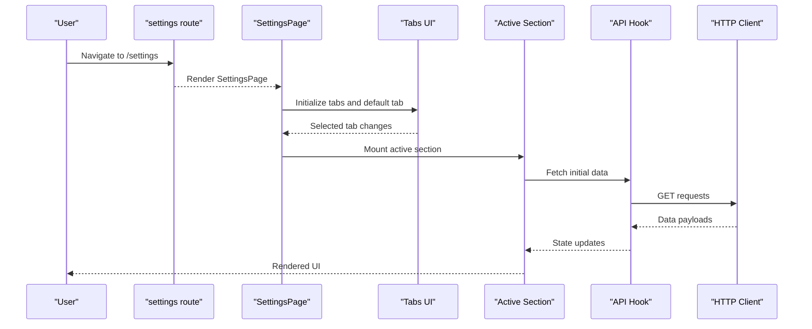
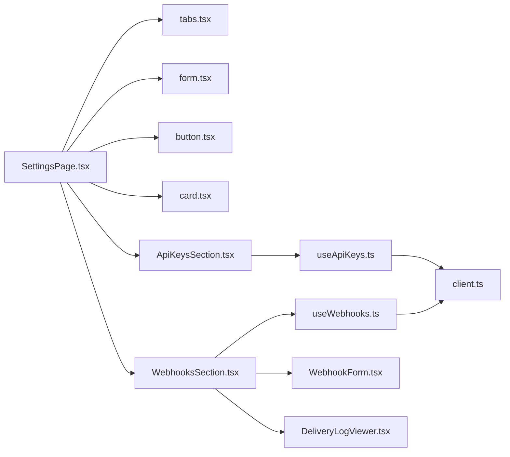

# Settings Page Overview

<cite>
**Referenced Files in This Document**
- [SettingsPage.tsx](file://src/features/settings/SettingsPage.tsx)
- [ApiKeysSection.tsx](file://src/features/settings/ApiKeysSection.tsx)
- [WebhooksSection.tsx](file://src/features/settings/WebhooksSection.tsx)
- [WebhookForm.tsx](file://src/features/settings/WebhookForm.tsx)
- [DeliveryLogViewer.tsx](file://src/features/settings/DeliveryLogViewer.tsx)
- [settings.tsx](file://src/routes/_authenticated/settings.tsx)
- [AppLayout.tsx](file://src/layouts/AppLayout.tsx)
- [Sidebar.tsx](file://src/layouts/Sidebar.tsx)
- [useApiKeys.ts](file://src/api/hooks/useApiKeys.ts)
- [useWebhooks.ts](file://src/api/hooks/useWebhooks.ts)
- [client.ts](file://src/api/client.ts)
- [tabs.tsx](file://src/components/ui/tabs.tsx)
- [form.tsx](file://src/components/ui/form.tsx)
- [button.tsx](file://src/components/ui/button.tsx)
- [card.tsx](file://src/components/ui/card.tsx)
- [index.ts](file://src/routeTree.gen.ts)
</cite>

## Table of Contents
1. [Introduction](#introduction)
2. [Project Structure](#project-structure)
3. [Core Components](#core-components)
4. [Architecture Overview](#architecture-overview)
5. [Detailed Component Analysis](#detailed-component-analysis)
6. [Dependency Analysis](#dependency-analysis)
7. [Performance Considerations](#performance-considerations)
8. [Troubleshooting Guide](#troubleshooting-guide)
9. [Conclusion](#conclusion)
10. [Appendices](#appendices)

## Introduction
This document explains the architecture and navigation of the Settings Page, focusing on layout, tab organization, state management, data flow, validation, persistence, lazy loading, accessibility, responsive design, and internationalization. It also provides guidance for adding new settings sections and extending functionality.

## Project Structure
The Settings feature is organized under a dedicated feature folder with UI components, hooks for API interactions, and route integration. The page is composed of a top-level container that renders tabs for different settings sections. Each section encapsulates its own form logic, data fetching, and UI.

**Diagram sources**
- [settings.tsx](file://src/routes/_authenticated/settings.tsx)
- [SettingsPage.tsx](file://src/features/settings/SettingsPage.tsx)
- [ApiKeysSection.tsx](file://src/features/settings/ApiKeysSection.tsx)
- [WebhooksSection.tsx](file://src/features/settings/WebhooksSection.tsx)
- [WebhookForm.tsx](file://src/features/settings/WebhookForm.tsx)
- [DeliveryLogViewer.tsx](file://src/features/settings/DeliveryLogViewer.tsx)
- [useApiKeys.ts](file://src/api/hooks/useApiKeys.ts)
- [useWebhooks.ts](file://src/api/hooks/useWebhooks.ts)
- [client.ts](file://src/api/client.ts)
- [tabs.tsx](file://src/components/ui/tabs.tsx)
- [form.tsx](file://src/components/ui/form.tsx)
- [button.tsx](file://src/components/ui/button.tsx)
- [card.tsx](file://src/components/ui/card.tsx)

**Section sources**
- [settings.tsx](file://src/routes/_authenticated/settings.tsx)
- [SettingsPage.tsx](file://src/features/settings/SettingsPage.tsx)
- [index.ts](file://src/routeTree.gen.ts)

## Core Components
- SettingsPage: Top-level container that manages tab state and renders the active section. It coordinates UI primitives (tabs, forms, cards, buttons) and delegates domain-specific logic to each section component.
- ApiKeysSection: Manages API key lifecycle (list, create, delete), using a dedicated hook for data access and mutations.
- WebhooksSection: Displays webhook endpoints and their status, delegating creation/editing to WebhookForm and logs viewing to DeliveryLogViewer.
- WebhookForm: Form-driven interface for creating or editing webhooks, handling validation and submission via the webhooks hook.
- DeliveryLogViewer: Presents delivery logs for selected webhooks, supporting filtering and pagination where applicable.

Key responsibilities:
- Tab state management and navigation within the settings area.
- Encapsulated data fetching and mutation per section.
- Consistent form validation and error presentation.
- Reusable UI composition through shared primitives.

**Section sources**
- [SettingsPage.tsx](file://src/features/settings/SettingsPage.tsx)
- [ApiKeysSection.tsx](file://src/features/settings/ApiKeysSection.tsx)
- [WebhooksSection.tsx](file://src/features/settings/WebhooksSection.tsx)
- [WebhookForm.tsx](file://src/features/settings/WebhookForm.tsx)
- [DeliveryLogViewer.tsx](file://src/features/settings/DeliveryLogViewer.tsx)

## Architecture Overview
The Settings Page follows a feature-based architecture with clear separation between routing, UI composition, and data access. Tabs act as navigational anchors within the page, while each section owns its state and side effects. API interactions are abstracted into hooks that encapsulate request/response handling and caching strategies.

**Diagram sources**
- [settings.tsx](file://src/routes/_authenticated/settings.tsx)
- [SettingsPage.tsx](file://src/features/settings/SettingsPage.tsx)
- [tabs.tsx](file://src/components/ui/tabs.tsx)
- [useApiKeys.ts](file://src/api/hooks/useApiKeys.ts)
- [useWebhooks.ts](file://src/api/hooks/useWebhooks.ts)
- [client.ts](file://src/api/client.ts)

## Detailed Component Analysis

### SettingsPage
Responsibilities:
- Manage tab selection state and ensure only one section is mounted at a time.
- Compose UI primitives for consistent look and feel.
- Provide context or props to child sections as needed.

State management patterns:
- Local tab state drives conditional rendering of sections.
- Optional URL sync for deep linking to specific tabs if implemented by the route layer.

Accessibility considerations:
- Ensure tab panels have proper ARIA roles and keyboard navigation.
- Provide descriptive labels for interactive elements.

Responsive behavior:
- Use collapsible or stacked layouts on smaller screens; consider drawer or vertical tabs for mobile.

Internationalization:
- Externalize strings for labels, headings, and messages.

**Section sources**
- [SettingsPage.tsx](file://src/features/settings/SettingsPage.tsx)
- [tabs.tsx](file://src/components/ui/tabs.tsx)
- [form.tsx](file://src/components/ui/form.tsx)
- [button.tsx](file://src/components/ui/button.tsx)
- [card.tsx](file://src/components/ui/card.tsx)

### ApiKeysSection
Responsibilities:
- List existing API keys with status indicators.
- Create new keys and revoke/delete existing ones.
- Display success/error feedback after mutations.

Data flow:
- Uses useApiKeys hook for fetching and mutating keys.
- Mutations trigger optimistic updates where appropriate and refetch on completion.

Validation:
- Enforce naming constraints and permissions scopes at the form level before submission.

Persistence:
- Persist user preferences such as last used scope or sort order locally if needed.

**Section sources**
- [ApiKeysSection.tsx](file://src/features/settings/ApiKeysSection.tsx)
- [useApiKeys.ts](file://src/api/hooks/useApiKeys.ts)
- [client.ts](file://src/api/client.ts)

### WebhooksSection
Responsibilities:
- Show list of configured webhooks with basic metadata and status.
- Provide actions to edit, toggle, or delete webhooks.
- Integrate WebhookForm for creation/editing flows.
- Integrate DeliveryLogViewer for inspecting delivery attempts.

Data flow:
- Uses useWebhooks hook for CRUD operations and log retrieval.
- Debounces search/filter inputs to reduce network calls.

Validation:
- Validates endpoint URLs, payload formats, and retry policies.

**Section sources**
- [WebhooksSection.tsx](file://src/features/settings/WebhooksSection.tsx)
- [useWebhooks.ts](file://src/api/hooks/useWebhooks.ts)
- [client.ts](file://src/api/client.ts)

### WebhookForm
Responsibilities:
- Provide a controlled form for creating or editing webhooks.
- Handle field-level validation and global form errors.
- Submit mutations via useWebhooks hook.

Validation process:
- Schema-based validation for required fields, URL format, and payload templates.
- Real-time feedback with accessible error messages.

Persistence:
- Optionally cache draft values in local storage to prevent data loss on accidental navigation.

**Section sources**
- [WebhookForm.tsx](file://src/features/settings/WebhookForm.tsx)
- [form.tsx](file://src/components/ui/form.tsx)
- [useWebhooks.ts](file://src/api/hooks/useWebhooks.ts)

### DeliveryLogViewer
Responsibilities:
- Display paginated delivery logs for a selected webhook.
- Support filtering by status, date range, and event type.
- Allow exporting logs when available.

Performance:
- Implements virtualized lists for large datasets.
- Uses query parameters for shareable filters and deep links.

**Section sources**
- [DeliveryLogViewer.tsx](file://src/features/settings/DeliveryLogViewer.tsx)
- [useWebhooks.ts](file://src/api/hooks/useWebhooks.ts)

## Dependency Analysis
The Settings Page depends on UI primitives, feature-specific sections, and API hooks. Hooks abstract HTTP client usage, ensuring consistent error handling and caching.

**Diagram sources**
- [SettingsPage.tsx](file://src/features/settings/SettingsPage.tsx)
- [ApiKeysSection.tsx](file://src/features/settings/ApiKeysSection.tsx)
- [WebhooksSection.tsx](file://src/features/settings/WebhooksSection.tsx)
- [WebhookForm.tsx](file://src/features/settings/WebhookForm.tsx)
- [DeliveryLogViewer.tsx](file://src/features/settings/DeliveryLogViewer.tsx)
- [useApiKeys.ts](file://src/api/hooks/useApiKeys.ts)
- [useWebhooks.ts](file://src/api/hooks/useWebhooks.ts)
- [client.ts](file://src/api/client.ts)
- [tabs.tsx](file://src/components/ui/tabs.tsx)
- [form.tsx](file://src/components/ui/form.tsx)
- [button.tsx](file://src/components/ui/button.tsx)
- [card.tsx](file://src/components/ui/card.tsx)

**Section sources**
- [SettingsPage.tsx](file://src/features/settings/SettingsPage.tsx)
- [useApiKeys.ts](file://src/api/hooks/useApiKeys.ts)
- [useWebhooks.ts](file://src/api/hooks/useWebhooks.ts)
- [client.ts](file://src/api/client.ts)

## Performance Considerations
- Lazy loading: Load heavy sections (e.g., DeliveryLogViewer) only when the corresponding tab is active.
- Memoization: Memoize expensive computations and derived state within sections.
- Pagination and virtualization: For large lists like logs, implement server-side pagination and virtual scrolling.
- Request deduplication: Leverage query caches to avoid duplicate network calls.
- Optimistic updates: Apply immediate UI updates for non-critical mutations and roll back on failure.
- Debounce inputs: Throttle search/filter inputs to minimize unnecessary requests.

[No sources needed since this section provides general guidance]

## Troubleshooting Guide
Common issues and resolutions:
- Network errors: Inspect API responses and ensure proper error boundaries around sections.
- Validation failures: Verify schema definitions and ensure error messages are mapped to fields.
- Stale data: Refetch on focus or invalidate caches after mutations.
- Accessibility regressions: Test keyboard navigation across tabs and form controls; confirm ARIA attributes.
- Mobile layout issues: Validate responsive breakpoints and ensure touch-friendly interactions.

**Section sources**
- [form.tsx](file://src/components/ui/form.tsx)
- [tabs.tsx](file://src/components/ui/tabs.tsx)

## Conclusion
The Settings Page is structured around a tabbed interface with isolated sections that manage their own data and UI. By leveraging hooks for API concerns and reusable UI primitives, the implementation remains modular and maintainable. Following the guidelines in this document will help you extend the settings experience with new sections while preserving performance, accessibility, and responsiveness.

[No sources needed since this section summarizes without analyzing specific files]

## Appendices

### Adding a New Settings Section
Steps:
1. Create a new section component under features/settings.
2. Implement data fetching/mutations using a dedicated hook or reuse existing ones.
3. Add a new tab entry in the SettingsPage and wire it to the new component.
4. Include necessary UI primitives and ensure accessibility attributes.
5. Write tests for validation, data flow, and edge cases.

**Section sources**
- [SettingsPage.tsx](file://src/features/settings/SettingsPage.tsx)
- [ApiKeysSection.tsx](file://src/features/settings/ApiKeysSection.tsx)
- [WebhooksSection.tsx](file://src/features/settings/WebhooksSection.tsx)

### Customizing the Interface
Recommendations:
- Use theme tokens from the UI library for consistency.
- Replace or wrap UI primitives to adapt styles globally.
- Maintain semantic HTML and ARIA roles for accessibility.

**Section sources**
- [tabs.tsx](file://src/components/ui/tabs.tsx)
- [form.tsx](file://src/components/ui/form.tsx)
- [button.tsx](file://src/components/ui/button.tsx)
- [card.tsx](file://src/components/ui/card.tsx)

### Extending Functionality
Ideas:
- Add audit trails for settings changes.
- Introduce role-based visibility for sensitive sections.
- Implement export/import for configuration bundles.

[No sources needed since this section provides general guidance]