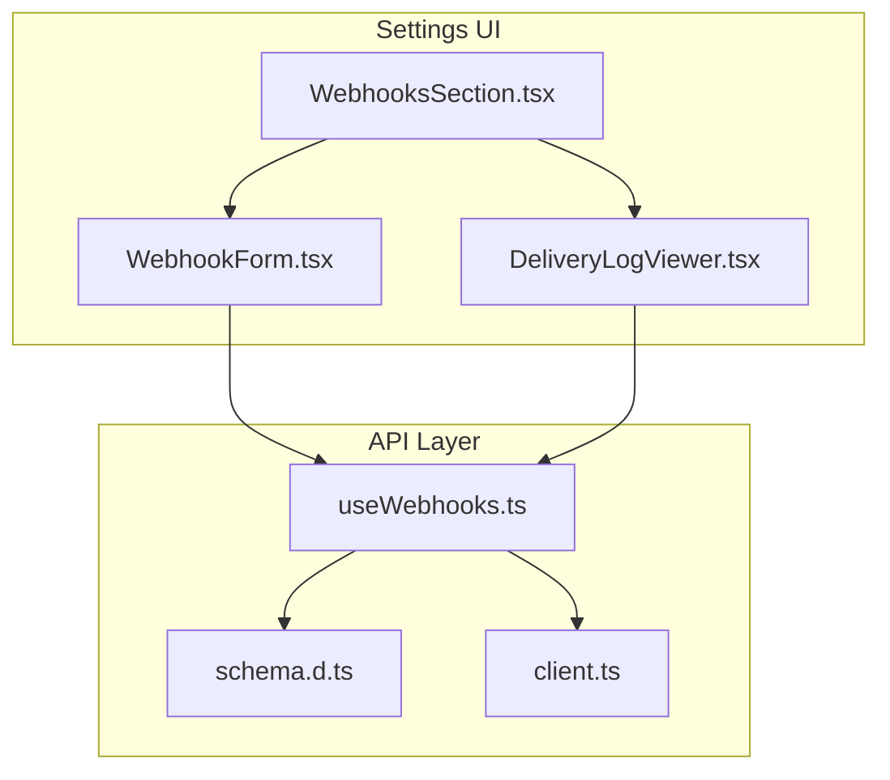
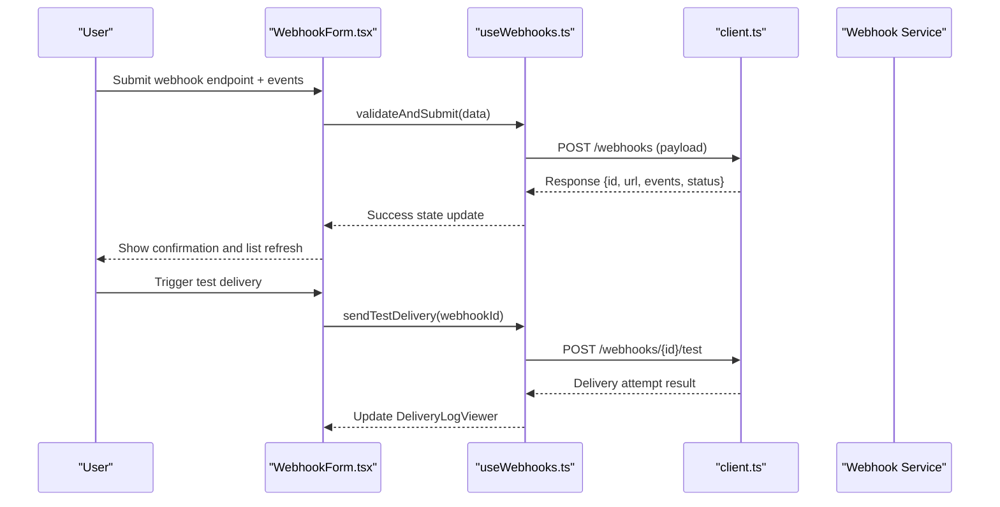
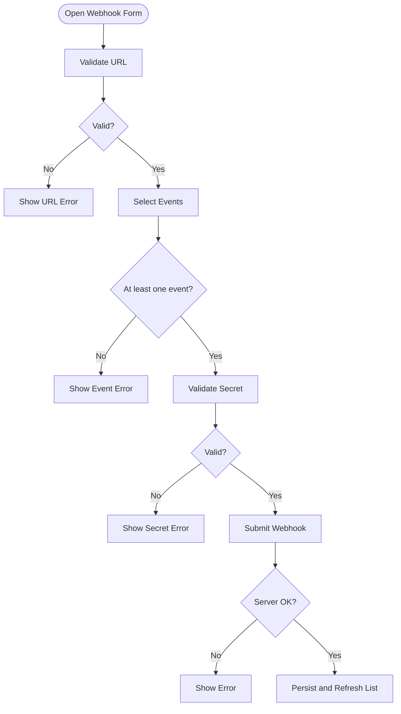
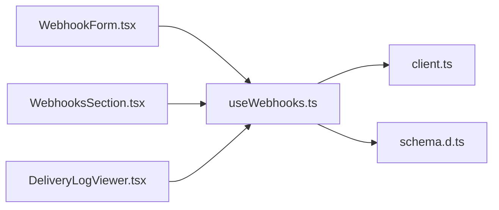

# Webhook Configuration

<cite>
**Referenced Files in This Document**
- [useWebhooks.ts](file://src/api/hooks/useWebhooks.ts)
- [WebhookForm.tsx](file://src/features/settings/WebhookForm.tsx)
- [WebhooksSection.tsx](file://src/features/settings/WebhooksSection.tsx)
- [DeliveryLogViewer.tsx](file://src/features/settings/DeliveryLogViewer.tsx)
- [client.ts](file://src/api/client.ts)
- [schema.d.ts](file://src/api/schema.d.ts)
</cite>

## Table of Contents
1. [Introduction](#introduction)
2. [Project Structure](#project-structure)
3. [Core Components](#core-components)
4. [Architecture Overview](#architecture-overview)
5. [Detailed Component Analysis](#detailed-component-analysis)
6. [Dependency Analysis](#dependency-analysis)
7. [Performance Considerations](#performance-considerations)
8. [Troubleshooting Guide](#troubleshooting-guide)
9. [Conclusion](#conclusion)
10. [Appendices](#appendices)

## Introduction
This document explains the Webhook Configuration system implemented in the project. It covers how webhook endpoints are registered, how event subscriptions are managed, and how payloads can be customized. It also documents the form interface, validation rules, testing capabilities, delivery mechanism, retry policies, failure handling, payload structures, signature verification, security best practices, monitoring/logging, debugging techniques, and the relationship between webhooks and job events. Guidance for implementing reliable webhook consumers is included.

## Project Structure
The webhook feature spans API hooks, settings UI components, and shared types:
- API layer: a hook to interact with backend webhook endpoints and a typed schema definition.
- Settings UI: a section page listing webhooks, a form for creating/editing webhooks, and a delivery log viewer for inspection and testing.
- HTTP client: centralized configuration for making authenticated requests.

**Diagram sources**
- [WebhooksSection.tsx](file://src/features/settings/WebhooksSection.tsx)
- [WebhookForm.tsx](file://src/features/settings/WebhookForm.tsx)
- [DeliveryLogViewer.tsx](file://src/features/settings/DeliveryLogViewer.tsx)
- [useWebhooks.ts](file://src/api/hooks/useWebhooks.ts)
- [schema.d.ts](file://src/api/schema.d.ts)
- [client.ts](file://src/api/client.ts)

**Section sources**
- [useWebhooks.ts](file://src/api/hooks/useWebhooks.ts)
- [WebhookForm.tsx](file://src/features/settings/WebhookForm.tsx)
- [WebhooksSection.tsx](file://src/features/settings/WebhooksSection.tsx)
- [DeliveryLogViewer.tsx](file://src/features/settings/DeliveryLogViewer.tsx)
- [client.ts](file://src/api/client.ts)
- [schema.d.ts](file://src/api/schema.d.ts)

## Core Components
- useWebhooks hook: encapsulates all API calls for webhook CRUD, subscription toggles, and delivery logs. It centralizes error handling and data normalization for the UI.
- WebhookForm component: provides a validated form to create or edit webhook endpoints, including URL validation, secret management, and event selection.
- WebhooksSection component: lists existing webhooks, supports enabling/disabling, deletion, and opening the form for editing.
- DeliveryLogViewer component: displays recent delivery attempts, statuses, and response snippets; supports filtering and retry triggers where applicable.
- client.ts: configures base URL, headers (e.g., authorization), and request/response interceptors used by the hook.
- schema.d.ts: defines TypeScript interfaces for webhook entities, events, and delivery logs.

Key responsibilities:
- Registration: POST/PUT endpoints via useWebhooks to create/update webhook endpoints.
- Subscription management: PATCH/PUT to toggle event types per webhook.
- Payload customization: fields exposed in the form to adjust payload shape or include metadata.
- Testing: trigger test deliveries and view results in DeliveryLogViewer.

**Section sources**
- [useWebhooks.ts](file://src/api/hooks/useWebhooks.ts)
- [WebhookForm.tsx](file://src/features/settings/WebhookForm.tsx)
- [WebhooksSection.tsx](file://src/features/settings/WebhooksSection.tsx)
- [DeliveryLogViewer.tsx](file://src/features/settings/DeliveryLogViewer.tsx)
- [client.ts](file://src/api/client.ts)
- [schema.d.ts](file://src/api/schema.d.ts)

## Architecture Overview
The frontend orchestrates user actions through React components, which call the useWebhooks hook. The hook uses the HTTP client to communicate with backend webhook services. Responses are typed via schema.d.ts and rendered in the UI. Delivery logs are fetched and displayed for troubleshooting.

**Diagram sources**
- [WebhookForm.tsx](file://src/features/settings/WebhookForm.tsx)
- [useWebhooks.ts](file://src/api/hooks/useWebhooks.ts)
- [client.ts](file://src/api/client.ts)

## Detailed Component Analysis

### WebhookForm Component
Purpose:
- Create or edit webhook endpoints with URL, secret, and event selections.
- Enforce validation rules such as URL format, required events, and secret length/format.
- Provide immediate feedback on submission errors and success states.

Validation rules:
- Endpoint URL must be a valid HTTPS URL.
- At least one event type must be selected.
- Secret must meet minimum length and character requirements.
- Optional payload customization fields must conform to allowed patterns.

Testing:
- Includes a “Send Test” action that triggers a sample delivery and updates the delivery log viewer.

**Diagram sources**
- [WebhookForm.tsx](file://src/features/settings/WebhookForm.tsx)

**Section sources**
- [WebhookForm.tsx](file://src/features/settings/WebhookForm.tsx)

### WebhooksSection Component
Purpose:
- Display a paginated list of configured webhooks.
- Enable/disable webhooks, delete them, and open the form for editing.
- Provide quick access to delivery logs per webhook.

Interactions:
- Toggles event subscriptions by updating the webhook’s event list.
- Triggers refresh after mutations.

**Section sources**
- [WebhooksSection.tsx](file://src/features/settings/WebhooksSection.tsx)

### DeliveryLogViewer Component
Purpose:
- Show recent delivery attempts with timestamps, status codes, and response previews.
- Filter by webhook, status, and time range.
- Support retry actions when permitted by the backend.

Usage:
- Opened from the WebhooksSection row actions or triggered by test deliveries from the form.

**Section sources**
- [DeliveryLogViewer.tsx](file://src/features/settings/DeliveryLogViewer.tsx)

### useWebhooks Hook
Responsibilities:
- Encapsulate API calls for webhook CRUD, event subscription updates, and delivery log retrieval.
- Normalize responses and handle errors consistently.
- Expose methods like create, update, delete, toggleEvents, fetchLogs, and sendTestDelivery.

Data contracts:
- Types for webhook entities, events, and delivery logs are defined in schema.d.ts.

**Section sources**
- [useWebhooks.ts](file://src/api/hooks/useWebhooks.ts)
- [schema.d.ts](file://src/api/schema.d.ts)

### HTTP Client Integration
- Centralized configuration for base URL, authentication headers, and error mapping.
- Ensures consistent behavior across all webhook-related requests.

**Section sources**
- [client.ts](file://src/api/client.ts)

## Dependency Analysis
The following diagram shows how components depend on the hook and client, and how types flow into the UI.

**Diagram sources**
- [WebhookForm.tsx](file://src/features/settings/WebhookForm.tsx)
- [WebhooksSection.tsx](file://src/features/settings/WebhooksSection.tsx)
- [DeliveryLogViewer.tsx](file://src/features/settings/DeliveryLogViewer.tsx)
- [useWebhooks.ts](file://src/api/hooks/useWebhooks.ts)
- [client.ts](file://src/api/client.ts)
- [schema.d.ts](file://src/api/schema.d.ts)

**Section sources**
- [useWebhooks.ts](file://src/api/hooks/useWebhooks.ts)
- [client.ts](file://src/api/client.ts)
- [schema.d.ts](file://src/api/schema.d.ts)

## Performance Considerations
- Debounce form submissions to avoid duplicate requests during rapid edits.
- Paginate delivery logs and implement server-side filtering to reduce payload size.
- Cache webhook lists with stale-while-revalidate semantics to improve perceived performance.
- Use optimistic updates for non-critical mutations (e.g., toggling events) and roll back on failure.

[No sources needed since this section provides general guidance]

## Troubleshooting Guide
Common issues and resolutions:
- Invalid URL: Ensure the endpoint uses HTTPS and is reachable from the service network.
- Missing events: At least one event must be selected before saving.
- Signature mismatch: Verify the secret matches what your consumer expects and that you compute signatures using the documented algorithm.
- Delivery failures: Inspect DeliveryLogViewer for status codes and response snippets; retry if supported.
- Network errors: Check client configuration for correct base URL and authorization headers.

Debugging steps:
- Use DeliveryLogViewer filters to isolate problematic deliveries.
- Add logging in your consumer to capture incoming payloads and signature headers.
- Reproduce with the “Send Test” action to confirm endpoint reachability and parsing logic.

**Section sources**
- [DeliveryLogViewer.tsx](file://src/features/settings/DeliveryLogViewer.tsx)
- [useWebhooks.ts](file://src/api/hooks/useWebhooks.ts)
- [client.ts](file://src/api/client.ts)

## Conclusion
The Webhook Configuration system provides a robust, user-friendly way to register endpoints, manage event subscriptions, customize payloads, and monitor deliveries. By following the validation rules, security best practices, and debugging techniques outlined here, teams can implement reliable webhook consumers and maintain high delivery reliability.

[No sources needed since this section summarizes without analyzing specific files]

## Appendices

### Webhook Payload Structures
- Typical payload includes:
  - Event metadata: event type, timestamp, job reference.
  - Data: job details, file references, status transitions.
  - Signing header: HMAC signature computed over the body using the webhook secret.
- Consumers should:
  - Validate the signature header against the stored secret.
  - Ignore unknown event types gracefully.
  - Implement idempotency using event IDs to prevent duplicate processing.

[No sources needed since this section provides general guidance]

### Security Best Practices
- Always use HTTPS endpoints.
- Store secrets securely and rotate periodically.
- Validate signatures on every delivery.
- Limit event exposure to only what is necessary.
- Rate-limit and authenticate inbound endpoints if possible.

[No sources needed since this section provides general guidance]

### Relationship Between Webhooks and Job Events
- Webhooks are triggered by job lifecycle events (e.g., created, processing, completed, failed).
- Each webhook subscribes to a subset of events; changes to subscriptions take effect immediately.
- Delivery logs record each attempt and outcome, aiding correlation with job state changes.

[No sources needed since this section provides general guidance]

### Reliable Consumer Implementation Guidance
- Idempotency: Deduplicate based on event ID.
- Retries: Implement exponential backoff for transient failures.
- Dead-letter queue: Persist failed deliveries for later analysis.
- Observability: Emit metrics and structured logs for delivery success/failure rates.

[No sources needed since this section provides general guidance]