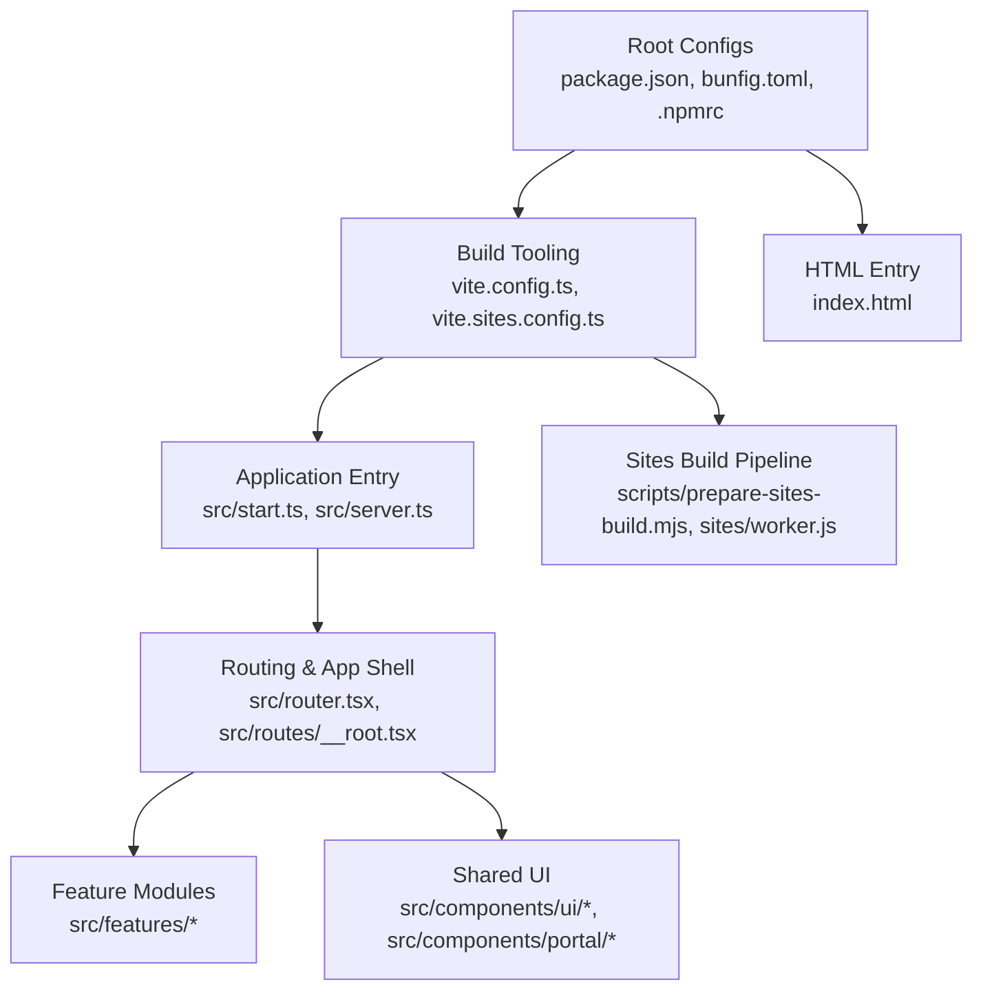
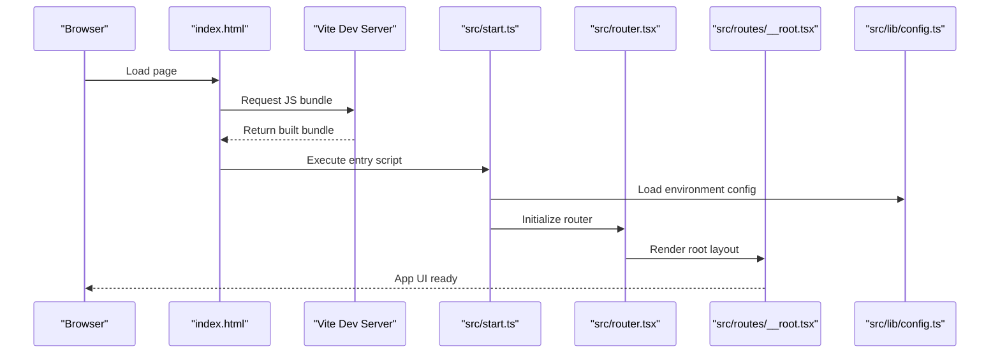
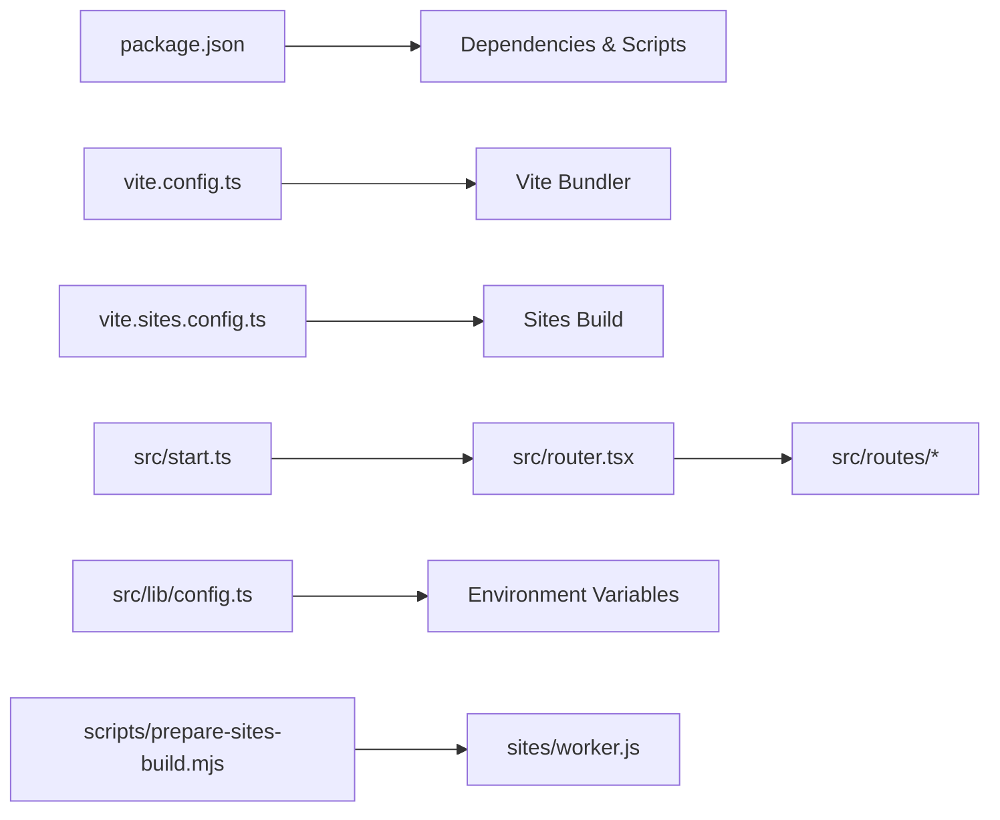

# Getting Started

<cite>
**Referenced Files in This Document**
- [package.json](file://package.json)
- [bunfig.toml](file://bunfig.toml)
- [vite.config.ts](file://vite.config.ts)
- [vite.sites.config.ts](file://vite.sites.config.ts)
- [src/start.ts](file://src/start.ts)
- [src/server.ts](file://src/server.ts)
- [src/router.tsx](file://src/router.tsx)
- [src/routes/__root.tsx](file://src/routes/__root.tsx)
- [src/lib/config.ts](file://src/lib/config.ts)
- [scripts/prepare-sites-build.mjs](file://scripts/prepare-sites-build.mjs)
- [sites/worker.js](file://sites/worker.js)
- [index.html](file://index.html)
- [components.json](file://components.json)
- [.npmrc](file://.npmrc)
</cite>

## Table of Contents
1. [Introduction](#introduction)
2. [Project Structure](#project-structure)
3. [Core Components](#core-components)
4. [Architecture Overview](#architecture-overview)
5. [Detailed Component Analysis](#detailed-component-analysis)
6. [Dependency Analysis](#dependency-analysis)
7. [Performance Considerations](#performance-considerations)
8. [Troubleshooting Guide](#troubleshooting-guide)
9. [Conclusion](#conclusion)
10. [Appendices](#appendices)

## Introduction
This guide helps you set up and run TrackDub Portal locally using Bun or npm. You will learn how to install dependencies, configure environment variables, start the development server, build for production, and verify your installation. The project is a Vite-based application with a React frontend and an optional server entry point. It also includes a sites build pipeline that prepares static assets for deployment.

## Project Structure
TrackDub Portal follows a modern Vite + React structure:
- Configuration files at the root define tooling and runtime behavior (Vite, Bun, components).
- Source code lives under src/, organized by features, routes, components, hooks, and utilities.
- A small server entry exists for local development or Node-based hosting scenarios.
- Scripts and site-related assets are included for building and deploying multi-site content.

**Diagram sources**
- [package.json](file://package.json)
- [bunfig.toml](file://bunfig.toml)
- [vite.config.ts](file://vite.config.ts)
- [vite.sites.config.ts](file://vite.sites.config.ts)
- [src/start.ts](file://src/start.ts)
- [src/server.ts](file://src/server.ts)
- [src/router.tsx](file://src/router.tsx)
- [src/routes/__root.tsx](file://src/routes/__root.tsx)
- [scripts/prepare-sites-build.mjs](file://scripts/prepare-sites-build.mjs)
- [sites/worker.js](file://sites/worker.js)
- [index.html](file://index.html)

**Section sources**
- [package.json](file://package.json)
- [bunfig.toml](file://bunfig.toml)
- [vite.config.ts](file://vite.config.ts)
- [vite.sites.config.ts](file://vite.sites.config.ts)
- [src/start.ts](file://src/start.ts)
- [src/server.ts](file://src/server.ts)
- [src/router.tsx](file://src/router.tsx)
- [src/routes/__root.tsx](file://src/routes/__root.tsx)
- [scripts/prepare-sites-build.mjs](file://scripts/prepare-sites-build.mjs)
- [sites/worker.js](file://sites/worker.js)
- [index.html](file://index.html)

## Core Components
Key parts that drive setup and execution:
- package.json: Defines scripts for development, building, and running the app; lists dependencies and devDependencies.
- bunfig.toml: Configures Bun-specific settings such as aliasing and runtime behavior.
- vite.config.ts and vite.sites.config.ts: Configure Vite builds for the main app and the sites pipeline.
- src/start.ts and src/server.ts: Application bootstrap and optional server logic.
- src/router.tsx and src/routes/__root.tsx: Define routing and the root layout for the app.
- src/lib/config.ts: Centralized configuration loading and environment variable handling.
- scripts/prepare-sites-build.mjs and sites/worker.js: Prepare and process static assets for multi-site deployments.
- index.html: HTML entrypoint for the browser bundle.
- components.json: UI component registry used by tooling.

**Section sources**
- [package.json](file://package.json)
- [bunfig.toml](file://bunfig.toml)
- [vite.config.ts](file://vite.config.ts)
- [vite.sites.config.ts](file://vite.sites.config.ts)
- [src/start.ts](file://src/start.ts)
- [src/server.ts](file://src/server.ts)
- [src/router.tsx](file://src/router.tsx)
- [src/routes/__root.tsx](file://src/routes/__root.tsx)
- [src/lib/config.ts](file://src/lib/config.ts)
- [scripts/prepare-sites-build.mjs](file://scripts/prepare-sites-build.mjs)
- [sites/worker.js](file://sites/worker.js)
- [index.html](file://index.html)
- [components.json](file://components.json)

## Architecture Overview
The runtime flow starts from the HTML entrypoint, loads the Vite-built bundle, initializes the router, and renders feature pages. An optional server can be started for local development or Node hosting. Environment configuration is loaded early to support API endpoints and feature flags.

**Diagram sources**
- [index.html](file://index.html)
- [vite.config.ts](file://vite.config.ts)
- [src/start.ts](file://src/start.ts)
- [src/router.tsx](file://src/router.tsx)
- [src/routes/__root.tsx](file://src/routes/__root.tsx)
- [src/lib/config.ts](file://src/lib/config.ts)

## Detailed Component Analysis

### Installation and Setup
- Install dependencies using either Bun or npm:
  - With Bun: run the dependency installer provided by the package manager.
  - With npm: use the standard install command.
- Verify that Node.js/Bun versions meet the requirements defined in the project configuration.

**Section sources**
- [package.json](file://package.json)
- [.npmrc](file://.npmrc)

### Environment Variables
- Create a local environment file in the project root to hold secrets and configuration values.
- Common variables include API keys, base URLs, and feature toggles.
- The application reads these variables through the centralized configuration module.

**Section sources**
- [src/lib/config.ts](file://src/lib/config.ts)

### Running the Development Server
- Start the Vite development server with hot module replacement enabled.
- Optionally start the Node-based server if required by your workflow.

**Section sources**
- [package.json](file://package.json)
- [vite.config.ts](file://vite.config.ts)
- [src/server.ts](file://src/server.ts)

### Building for Production
- Build the main application bundle optimized for production.
- Run the sites preparation script to generate static assets for deployment.

**Section sources**
- [package.json](file://package.json)
- [vite.config.ts](file://vite.config.ts)
- [vite.sites.config.ts](file://vite.sites.config.ts)
- [scripts/prepare-sites-build.mjs](file://scripts/prepare-sites-build.mjs)

### Initial Configuration Steps
- Ensure environment variables are present and correctly named.
- Validate that Bun or npm configurations are compatible with the project’s toolchain.
- Confirm that the HTML entrypoint references the correct bundle path.

**Section sources**
- [src/lib/config.ts](file://src/lib/config.ts)
- [bunfig.toml](file://bunfig.toml)
- [index.html](file://index.html)

### Development Workflow
- Use the development server for fast iteration with live reload.
- Run linting and type checks as part of your pre-commit workflow.
- Build and preview the production output before pushing changes.

**Section sources**
- [package.json](file://package.json)
- [vite.config.ts](file://vite.config.ts)

### Verifying Installation
- Open the local development URL in your browser and confirm the app shell loads.
- Check the console for any missing environment variables or configuration errors.
- Navigate through core routes to ensure routing and layouts render correctly.

**Section sources**
- [src/router.tsx](file://src/router.tsx)
- [src/routes/__root.tsx](file://src/routes/__root.tsx)
- [src/lib/config.ts](file://src/lib/config.ts)

## Dependency Analysis
TrackDub Portal relies on Vite for bundling, React for the UI framework, and Bun/npm for dependency management. Optional server functionality is available via Node. The sites pipeline uses a dedicated Vite configuration and a worker script to prepare static assets.

**Diagram sources**
- [package.json](file://package.json)
- [vite.config.ts](file://vite.config.ts)
- [vite.sites.config.ts](file://vite.sites.config.ts)
- [src/start.ts](file://src/start.ts)
- [src/router.tsx](file://src/router.tsx)
- [src/lib/config.ts](file://src/lib/config.ts)
- [scripts/prepare-sites-build.mjs](file://scripts/prepare-sites-build.mjs)
- [sites/worker.js](file://sites/worker.js)

**Section sources**
- [package.json](file://package.json)
- [vite.config.ts](file://vite.config.ts)
- [vite.sites.config.ts](file://vite.sites.config.ts)
- [src/start.ts](file://src/start.ts)
- [src/router.tsx](file://src/router.tsx)
- [src/lib/config.ts](file://src/lib/config.ts)
- [scripts/prepare-sites-build.mjs](file://scripts/prepare-sites-build.mjs)
- [sites/worker.js](file://sites/worker.js)

## Performance Considerations
- Use the Vite development server for fast feedback during development.
- Enable production optimizations when building for deployment.
- Keep environment variables minimal and avoid heavy computations at startup.
- Leverage lazy-loading for routes and large modules where possible.

[No sources needed since this section provides general guidance]

## Troubleshooting Guide
Common issues and resolutions:
- Missing environment variables: Ensure all required variables are defined in the local environment file and accessible to the configuration loader.
- Port conflicts: Change the development server port if it is already in use.
- Dependency resolution failures: Clear caches and reinstall dependencies using your chosen package manager.
- Bun compatibility: Verify that your Bun version matches the project’s expectations and that bunfig settings are valid.
- Sites build errors: Inspect the sites preparation script and worker logs for asset processing issues.

**Section sources**
- [src/lib/config.ts](file://src/lib/config.ts)
- [vite.config.ts](file://vite.config.ts)
- [bunfig.toml](file://bunfig.toml)
- [scripts/prepare-sites-build.mjs](file://scripts/prepare-sites-build.mjs)
- [sites/worker.js](file://sites/worker.js)

## Conclusion
You now have the essentials to install, configure, and run TrackDub Portal locally with Bun or npm. Use the development server for rapid iteration, build for production when ready, and validate your setup by navigating core routes and checking environment configuration. Refer to the troubleshooting section if you encounter common setup issues.

[No sources needed since this section summarizes without analyzing specific files]

## Appendices

### Quick Commands Reference
- Install dependencies:
  - With Bun: use the Bun installer command.
  - With npm: use the npm install command.
- Start development server:
  - Use the development script defined in the package configuration.
- Build for production:
  - Use the build script defined in the package configuration.
- Prepare sites assets:
  - Run the sites preparation script.

**Section sources**
- [package.json](file://package.json)
- [scripts/prepare-sites-build.mjs](file://scripts/prepare-sites-build.mjs)