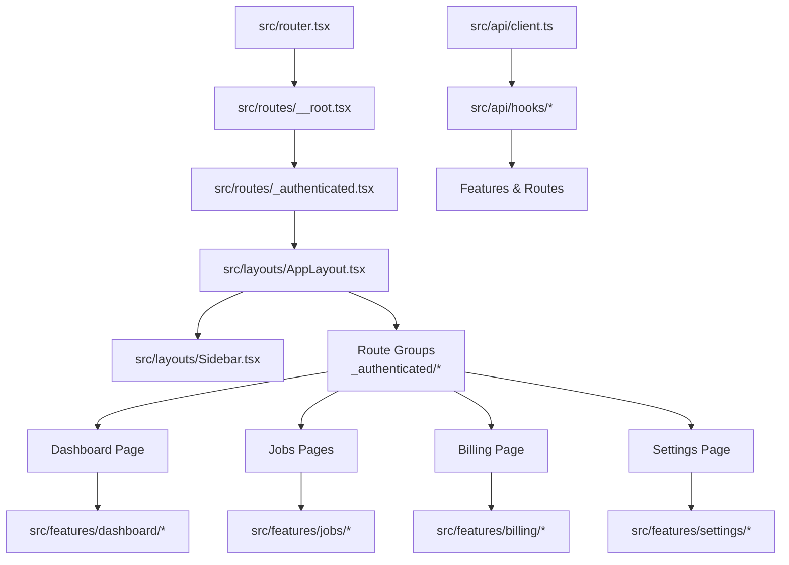
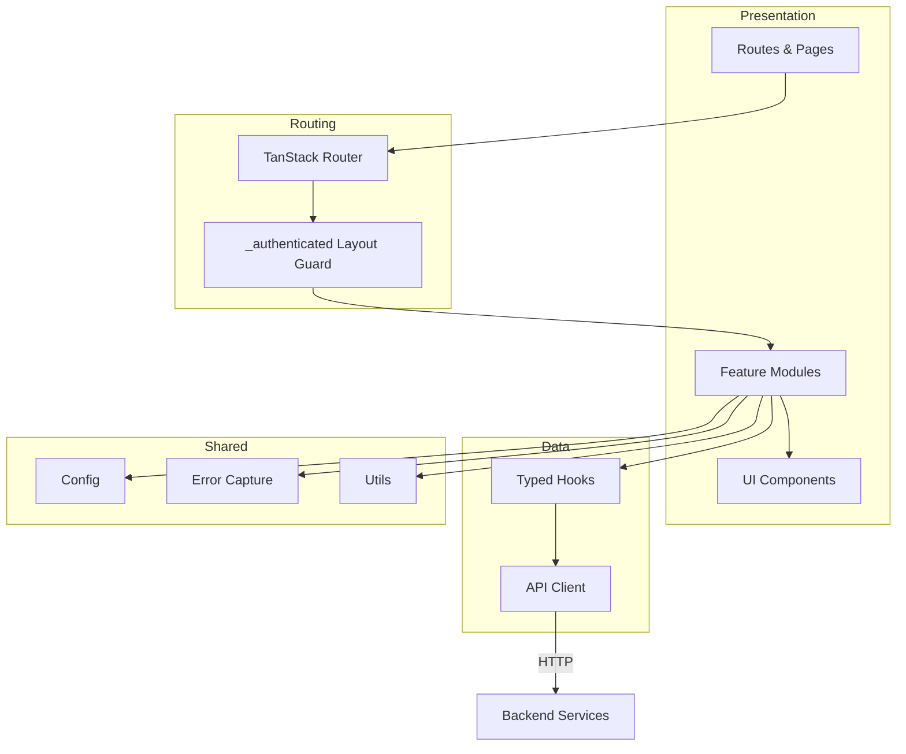
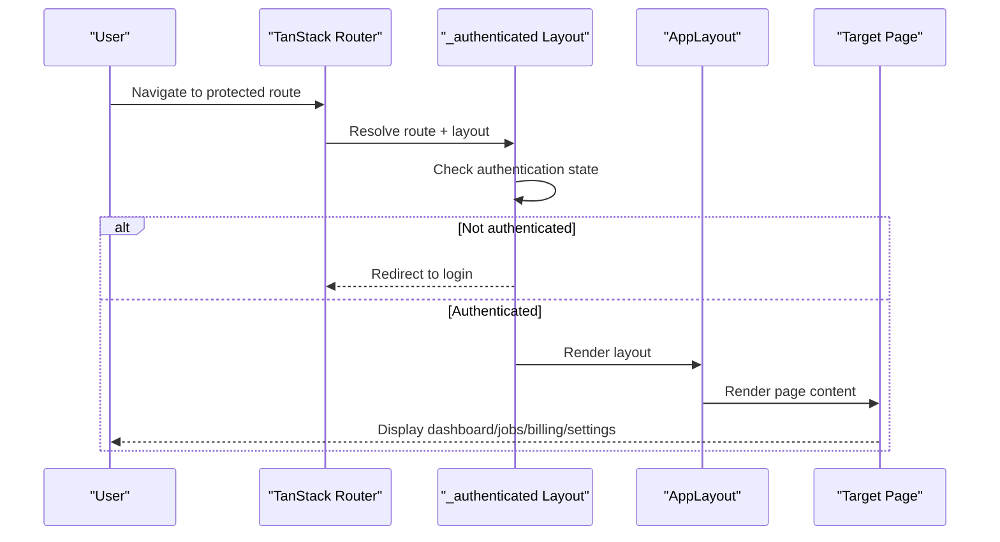
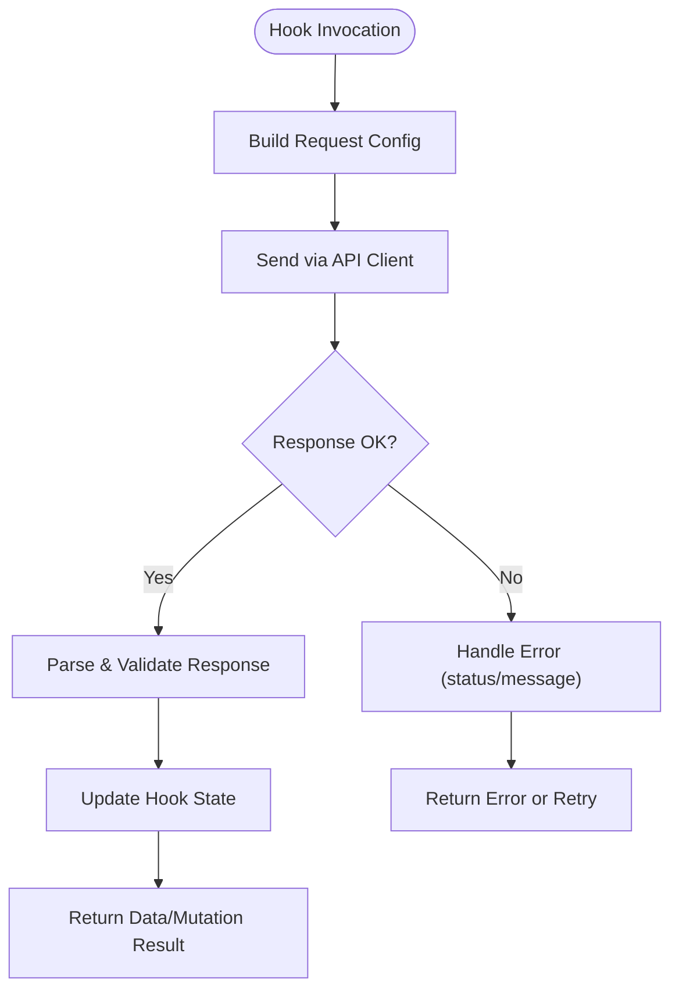
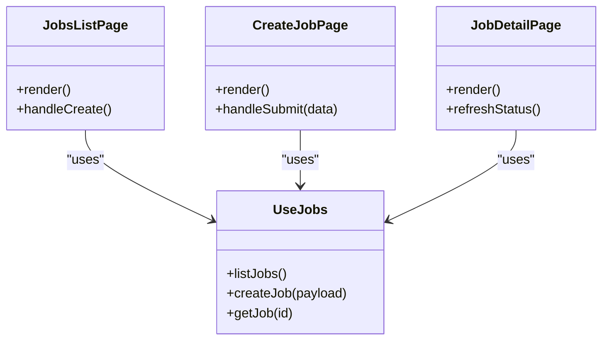
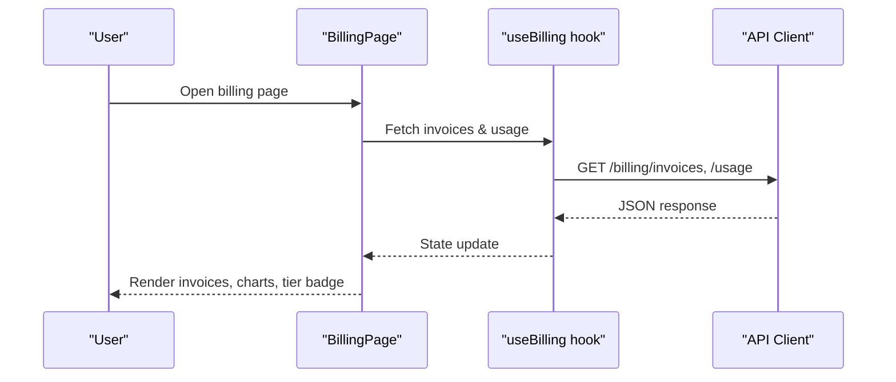
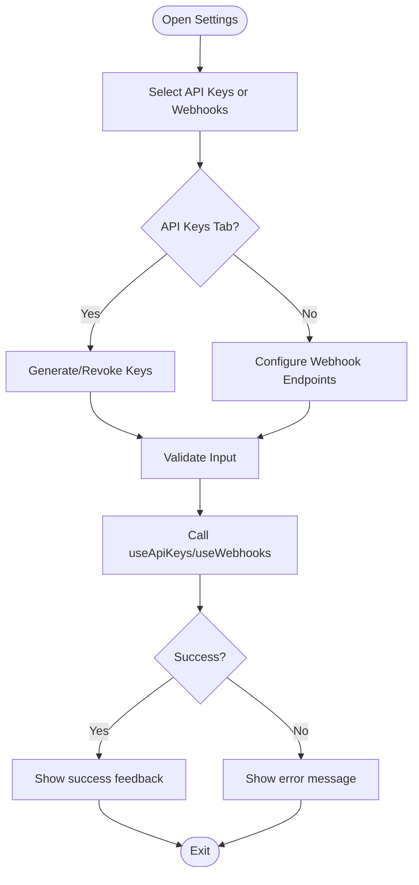
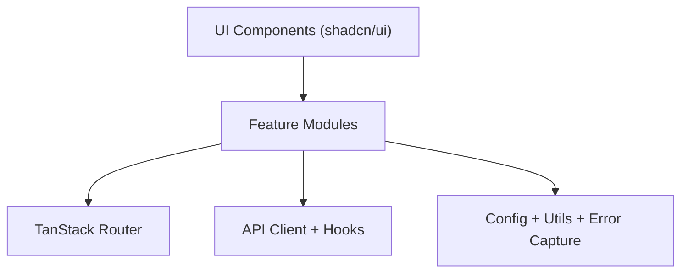
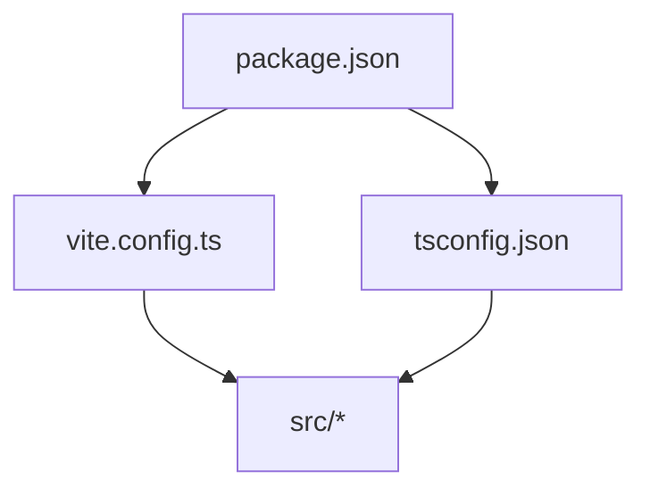

# Project Overview

<cite>
**Referenced Files in This Document**
- [package.json](file://package.json)
- [vite.config.ts](file://vite.config.ts)
- [tsconfig.json](file://tsconfig.json)
- [src/router.tsx](file://src/router.tsx)
- [src/routes/__root.tsx](file://src/routes/__root.tsx)
- [src/routes/_authenticated.tsx](file://src/routes/_authenticated.tsx)
- [src/layouts/AppLayout.tsx](file://src/layouts/AppLayout.tsx)
- [src/layouts/Sidebar.tsx](file://src/layouts/Sidebar.tsx)
- [src/api/client.ts](file://src/api/client.ts)
- [src/api/hooks/useJobs.ts](file://src/api/hooks/useJobs.ts)
- [src/api/hooks/useBilling.ts](file://src/api/hooks/useBilling.ts)
- [src/api/hooks/useApiKeys.ts](file://src/api/hooks/useApiKeys.ts)
- [src/api/hooks/useWebhooks.ts](file://src/api/hooks/useWebhooks.ts)
- [src/features/dashboard/DashboardPage.tsx](file://src/features/dashboard/DashboardPage.tsx)
- [src/features/jobs/JobsListPage.tsx](file://src/features/jobs/JobsListPage.tsx)
- [src/features/jobs/CreateJobPage.tsx](file://src/features/jobs/CreateJobPage.tsx)
- [src/features/billing/BillingPage.tsx](file://src/features/billing/BillingPage.tsx)
- [src/features/settings/SettingsPage.tsx](file://src/features/settings/SettingsPage.tsx)
- [src/features/settings/WebhookForm.tsx](file://src/features/settings/WebhookForm.tsx)
- [src/components/ui/button.tsx](file://src/components/ui/button.tsx)
- [src/components/ui/card.tsx](file://src/components/ui/card.tsx)
- [src/lib/config.ts](file://src/lib/config.ts)
- [src/lib/error-capture.ts](file://src/lib/error-capture.ts)
- [src/lib/utils.ts](file://src/lib/utils.ts)
</cite>

## Table of Contents
1. [Introduction](#introduction)
2. [Project Structure](#project-structure)
3. [Core Components](#core-components)
4. [Architecture Overview](#architecture-overview)
5. [Detailed Component Analysis](#detailed-component-analysis)
6. [Dependency Analysis](#dependency-analysis)
7. [Performance Considerations](#performance-considerations)
8. [Troubleshooting Guide](#troubleshooting-guide)
9. [Conclusion](#conclusion)
10. [Appendices](#appendices)

## Introduction
TrackDub Portal is a modern web application designed to manage translation jobs, billing, API keys, and webhook integrations through a clean, responsive interface. Built with React, TypeScript, and Vite, it leverages TanStack Router for type-safe routing and shadcn/ui for accessible, composable UI components. The portal provides:
- Job management: create, track, and inspect translation jobs
- Billing system: view invoices, usage metrics, and subscription tiers
- API key management: generate, rotate, and revoke keys
- Webhook integration: configure endpoints for delivery notifications

This document explains the architecture, key technologies, project structure, development setup, and module interactions to help both beginners understand the platform and experienced developers navigate the codebase efficiently.

## Project Structure
The repository follows a feature-based organization under src/, separating concerns into routes, features, components, hooks, layouts, and shared utilities. Key directories:
- src/routes: Route definitions using TanStack Router conventions (including _authenticated layout group)
- src/features: Feature modules (dashboard, jobs, billing, settings)
- src/components: Reusable UI primitives (shadcn/ui) and portal-specific components
- src/api: HTTP client and typed data-fetching hooks
- src/layouts: Application shell and navigation
- src/lib: Configuration, error handling, and utilities

**Diagram sources**
- [src/router.tsx](file://src/router.tsx)
- [src/routes/__root.tsx](file://src/routes/__root.tsx)
- [src/routes/_authenticated.tsx](file://src/routes/_authenticated.tsx)
- [src/layouts/AppLayout.tsx](file://src/layouts/AppLayout.tsx)
- [src/layouts/Sidebar.tsx](file://src/layouts/Sidebar.tsx)
- [src/features/dashboard/DashboardPage.tsx](file://src/features/dashboard/DashboardPage.tsx)
- [src/features/jobs/JobsListPage.tsx](file://src/features/jobs/JobsListPage.tsx)
- [src/features/billing/BillingPage.tsx](file://src/features/billing/BillingPage.tsx)
- [src/features/settings/SettingsPage.tsx](file://src/features/settings/SettingsPage.tsx)
- [src/api/client.ts](file://src/api/client.ts)
- [src/api/hooks/useJobs.ts](file://src/api/hooks/useJobs.ts)
- [src/api/hooks/useBilling.ts](file://src/api/hooks/useBilling.ts)
- [src/api/hooks/useApiKeys.ts](file://src/api/hooks/useApiKeys.ts)
- [src/api/hooks/useWebhooks.ts](file://src/api/hooks/useWebhooks.ts)

**Section sources**
- [package.json](file://package.json)
- [vite.config.ts](file://vite.config.ts)
- [tsconfig.json](file://tsconfig.json)
- [src/router.tsx](file://src/router.tsx)
- [src/routes/__root.tsx](file://src/routes/__root.tsx)
- [src/routes/_authenticated.tsx](file://src/routes/_authenticated.tsx)
- [src/layouts/AppLayout.tsx](file://src/layouts/AppLayout.tsx)
- [src/layouts/Sidebar.tsx](file://src/layouts/Sidebar.tsx)

## Core Components
- Routing and Layouts
  - TanStack Router defines the route tree and authentication guard via the _authenticated layout group.
  - AppLayout renders the main shell; Sidebar provides navigation between Dashboard, Jobs, Billing, and Settings.
- API Layer
  - A centralized HTTP client abstracts request configuration, headers, and base URLs.
  - Typed hooks encapsulate data fetching for jobs, billing, API keys, and webhooks, exposing consistent state and mutation APIs.
- Features
  - Dashboard: overview cards, recent jobs, and usage gauges.
  - Jobs: list, detail, and creation flows with file upload support.
  - Billing: invoice table, tier badges, and usage charts.
  - Settings: API key management and webhook configuration forms.
- UI Primitives
  - shadcn/ui components provide accessible, themeable building blocks (buttons, cards, dialogs, tables).

**Section sources**
- [src/router.tsx](file://src/router.tsx)
- [src/routes/_authenticated.tsx](file://src/routes/_authenticated.tsx)
- [src/layouts/AppLayout.tsx](file://src/layouts/AppLayout.tsx)
- [src/layouts/Sidebar.tsx](file://src/layouts/Sidebar.tsx)
- [src/api/client.ts](file://src/api/client.ts)
- [src/api/hooks/useJobs.ts](file://src/api/hooks/useJobs.ts)
- [src/api/hooks/useBilling.ts](file://src/api/hooks/useBilling.ts)
- [src/api/hooks/useApiKeys.ts](file://src/api/hooks/useApiKeys.ts)
- [src/api/hooks/useWebhooks.ts](file://src/api/hooks/useWebhooks.ts)
- [src/features/dashboard/DashboardPage.tsx](file://src/features/dashboard/DashboardPage.tsx)
- [src/features/jobs/JobsListPage.tsx](file://src/features/jobs/JobsListPage.tsx)
- [src/features/jobs/CreateJobPage.tsx](file://src/features/jobs/CreateJobPage.tsx)
- [src/features/billing/BillingPage.tsx](file://src/features/billing/BillingPage.tsx)
- [src/features/settings/SettingsPage.tsx](file://src/features/settings/SettingsPage.tsx)
- [src/components/ui/button.tsx](file://src/components/ui/button.tsx)
- [src/components/ui/card.tsx](file://src/components/ui/card.tsx)

## Architecture Overview
TrackDub Portal follows a layered architecture:
- Presentation Layer: React components organized by feature, composed with shadcn/ui.
- Routing Layer: TanStack Router manages navigation and authentication guards.
- Data Layer: Typed hooks call a centralized HTTP client to interact with backend services.
- Shared Layer: Utilities, configuration, and error capture are reused across features.

**Diagram sources**
- [src/router.tsx](file://src/router.tsx)
- [src/routes/_authenticated.tsx](file://src/routes/_authenticated.tsx)
- [src/features/dashboard/DashboardPage.tsx](file://src/features/dashboard/DashboardPage.tsx)
- [src/features/jobs/JobsListPage.tsx](file://src/features/jobs/JobsListPage.tsx)
- [src/features/billing/BillingPage.tsx](file://src/features/billing/BillingPage.tsx)
- [src/features/settings/SettingsPage.tsx](file://src/features/settings/SettingsPage.tsx)
- [src/api/client.ts](file://src/api/client.ts)
- [src/api/hooks/useJobs.ts](file://src/api/hooks/useJobs.ts)
- [src/api/hooks/useBilling.ts](file://src/api/hooks/useBilling.ts)
- [src/api/hooks/useApiKeys.ts](file://src/api/hooks/useApiKeys.ts)
- [src/api/hooks/useWebhooks.ts](file://src/api/hooks/useWebhooks.ts)
- [src/lib/config.ts](file://src/lib/config.ts)
- [src/lib/error-capture.ts](file://src/lib/error-capture.ts)
- [src/lib/utils.ts](file://src/lib/utils.ts)

## Detailed Component Analysis

### Routing and Authentication Flow
TanStack Router organizes routes with an _authenticated layout that enforces access control. Root and authenticated wrappers compose the app shell and redirect unauthenticated users.

**Diagram sources**
- [src/router.tsx](file://src/router.tsx)
- [src/routes/__root.tsx](file://src/routes/__root.tsx)
- [src/routes/_authenticated.tsx](file://src/routes/_authenticated.tsx)
- [src/layouts/AppLayout.tsx](file://src/layouts/AppLayout.tsx)

**Section sources**
- [src/router.tsx](file://src/router.tsx)
- [src/routes/__root.tsx](file://src/routes/__root.tsx)
- [src/routes/_authenticated.tsx](file://src/routes/_authenticated.tsx)
- [src/layouts/AppLayout.tsx](file://src/layouts/AppLayout.tsx)
- [src/layouts/Sidebar.tsx](file://src/layouts/Sidebar.tsx)

### API Client and Typed Hooks
A single HTTP client configures base URL, headers, and error handling. Typed hooks wrap requests for each domain (jobs, billing, API keys, webhooks), providing consistent state and mutations.

**Diagram sources**
- [src/api/client.ts](file://src/api/client.ts)
- [src/api/hooks/useJobs.ts](file://src/api/hooks/useJobs.ts)
- [src/api/hooks/useBilling.ts](file://src/api/hooks/useBilling.ts)
- [src/api/hooks/useApiKeys.ts](file://src/api/hooks/useApiKeys.ts)
- [src/api/hooks/useWebhooks.ts](file://src/api/hooks/useWebhooks.ts)

**Section sources**
- [src/api/client.ts](file://src/api/client.ts)
- [src/api/hooks/useJobs.ts](file://src/api/hooks/useJobs.ts)
- [src/api/hooks/useBilling.ts](file://src/api/hooks/useBilling.ts)
- [src/api/hooks/useApiKeys.ts](file://src/api/hooks/useApiKeys.ts)
- [src/api/hooks/useWebhooks.ts](file://src/api/hooks/useWebhooks.ts)

### Jobs Module
The Jobs module supports listing, creating, and viewing job details. It integrates with useJobs for data operations and uses UI primitives for forms and status indicators.

**Diagram sources**
- [src/features/jobs/JobsListPage.tsx](file://src/features/jobs/JobsListPage.tsx)
- [src/features/jobs/CreateJobPage.tsx](file://src/features/jobs/CreateJobPage.tsx)
- [src/api/hooks/useJobs.ts](file://src/api/hooks/useJobs.ts)

**Section sources**
- [src/features/jobs/JobsListPage.tsx](file://src/features/jobs/JobsListPage.tsx)
- [src/features/jobs/CreateJobPage.tsx](file://src/features/jobs/CreateJobPage.tsx)
- [src/api/hooks/useJobs.ts](file://src/api/hooks/useJobs.ts)

### Billing Module
The Billing module displays invoices, usage metrics, and subscription tier information. It consumes useBilling for data and renders charts and tables using shadcn/ui.

**Diagram sources**
- [src/features/billing/BillingPage.tsx](file://src/features/billing/BillingPage.tsx)
- [src/api/hooks/useBilling.ts](file://src/api/hooks/useBilling.ts)
- [src/api/client.ts](file://src/api/client.ts)

**Section sources**
- [src/features/billing/BillingPage.tsx](file://src/features/billing/BillingPage.tsx)
- [src/api/hooks/useBilling.ts](file://src/api/hooks/useBilling.ts)

### Settings Module (API Keys and Webhooks)
The Settings module allows managing API keys and configuring webhooks for delivery events. Forms validate inputs and trigger mutations via useApiKeys and useWebhooks.

**Diagram sources**
- [src/features/settings/SettingsPage.tsx](file://src/features/settings/SettingsPage.tsx)
- [src/features/settings/WebhookForm.tsx](file://src/features/settings/WebhookForm.tsx)
- [src/api/hooks/useApiKeys.ts](file://src/api/hooks/useApiKeys.ts)
- [src/api/hooks/useWebhooks.ts](file://src/api/hooks/useWebhooks.ts)

**Section sources**
- [src/features/settings/SettingsPage.tsx](file://src/features/settings/SettingsPage.tsx)
- [src/features/settings/WebhookForm.tsx](file://src/features/settings/WebhookForm.tsx)
- [src/api/hooks/useApiKeys.ts](file://src/api/hooks/useApiKeys.ts)
- [src/api/hooks/useWebhooks.ts](file://src/api/hooks/useWebhooks.ts)

### Conceptual Overview
At a high level, TrackDub Portal separates concerns into:
- UI composition with shadcn/ui
- Type-safe routing with TanStack Router
- Centralized API client and typed hooks
- Feature modules encapsulating business logic
- Shared configuration and error handling utilities

[No sources needed since this diagram shows conceptual workflow, not actual code structure]

## Dependency Analysis
Key dependencies include React, TypeScript, Vite, TanStack Router, and shadcn/ui. The build toolchain is configured via Vite, and TypeScript ensures type safety across the codebase.

**Diagram sources**
- [package.json](file://package.json)
- [vite.config.ts](file://vite.config.ts)
- [tsconfig.json](file://tsconfig.json)

**Section sources**
- [package.json](file://package.json)
- [vite.config.ts](file://vite.config.ts)
- [tsconfig.json](file://tsconfig.json)

## Performance Considerations
- Code splitting and lazy loading: Leverage TanStack Router’s route-level code splitting to reduce initial bundle size.
- Memoization: Use React.memo and useMemo where appropriate to avoid unnecessary re-renders in heavy lists (e.g., jobs, invoices).
- Data caching: Implement optimistic updates and cache invalidation patterns in hooks to improve perceived performance.
- Image and asset optimization: Ensure assets are optimized and served via CDN when possible.
- Network efficiency: Batch requests and debounce user input to minimize API calls.

[No sources needed since this section provides general guidance]

## Troubleshooting Guide
Common issues and resolutions:
- Authentication redirects: Verify the _authenticated layout guard and ensure tokens are present before accessing protected routes.
- API errors: Inspect the API client’s error handling and hook error states; check network tab and server logs for status codes.
- Form validation: Confirm schema validation rules in forms and ensure proper error messages are displayed.
- Webhook delivery failures: Validate endpoint URLs, CORS settings, and payload formats; review delivery logs in Settings.

**Section sources**
- [src/lib/error-capture.ts](file://src/lib/error-capture.ts)
- [src/lib/config.ts](file://src/lib/config.ts)
- [src/lib/utils.ts](file://src/lib/utils.ts)
- [src/api/client.ts](file://src/api/client.ts)

## Conclusion
TrackDub Portal combines a modern tech stack with a clear, modular architecture to deliver a robust job management and billing experience. By leveraging TanStack Router, shadcn/ui, and typed API hooks, the application maintains strong developer ergonomics while offering a scalable foundation for future enhancements.

[No sources needed since this section summarizes without analyzing specific files]

## Appendices
- Development Setup
  - Install dependencies using your package manager.
  - Run the development server with Vite.
  - Configure environment variables for API base URL and authentication.
- Key Technologies
  - React, TypeScript, Vite
  - TanStack Router for routing
  - shadcn/ui for accessible components
  - Centralized API client and typed hooks

[No sources needed since this section provides general guidance]