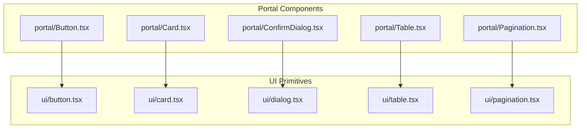
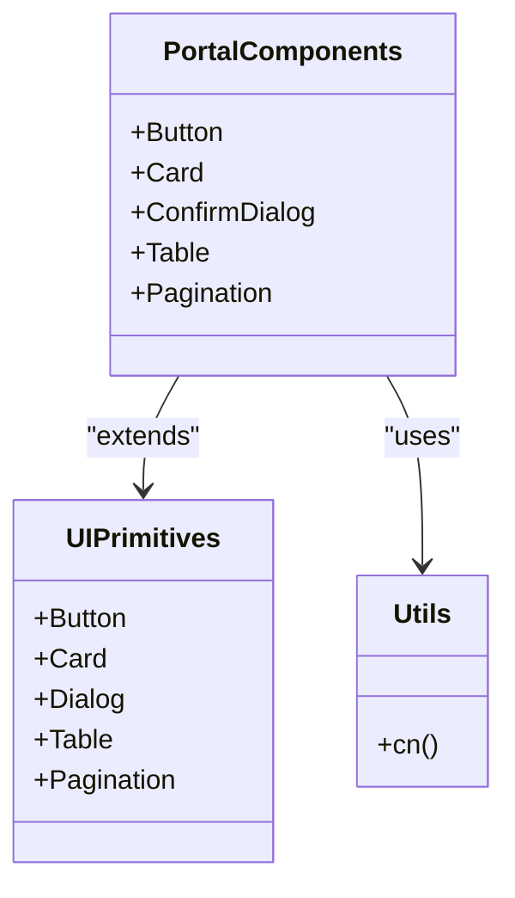
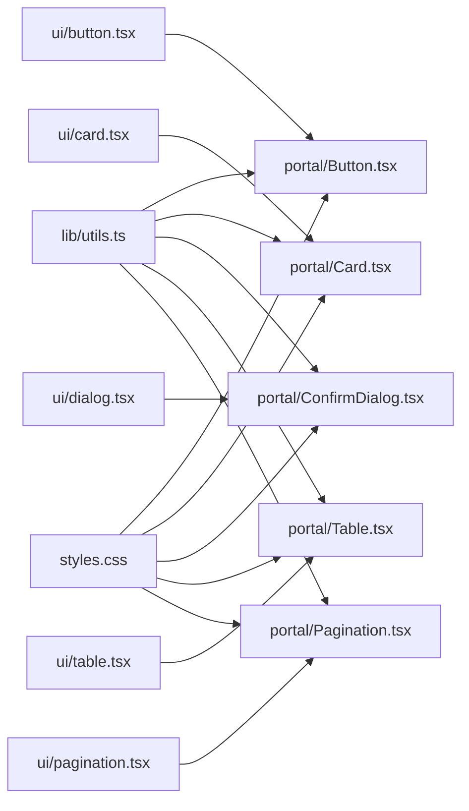

# UI Components

<cite>
**Referenced Files in This Document**
- [Button.tsx](file://src/components/portal/Button.tsx)
- [Card.tsx](file://src/components/portal/Card.tsx)
- [ConfirmDialog.tsx](file://src/components/portal/ConfirmDialog.tsx)
- [Table.tsx](file://src/components/portal/Table.tsx)
- [Pagination.tsx](file://src/components/portal/Pagination.tsx)
- [index.ts](file://src/components/portal/index.ts)
- [button.tsx](file://src/components/ui/button.tsx)
- [card.tsx](file://src/components/ui/card.tsx)
- [dialog.tsx](file://src/components/ui/dialog.tsx)
- [table.tsx](file://src/components/ui/table.tsx)
- [pagination.tsx](file://src/components/ui/pagination.tsx)
- [utils.ts](file://src/lib/utils.ts)
- [styles.css](file://src/styles.css)
</cite>

## Table of Contents
1. [Introduction](#introduction)
2. [Project Structure](#project-structure)
3. [Core Components](#core-components)
4. [Architecture Overview](#architecture-overview)
5. [Detailed Component Analysis](#detailed-component-analysis)
6. [Dependency Analysis](#dependency-analysis)
7. [Performance Considerations](#performance-considerations)
8. [Troubleshooting Guide](#troubleshooting-guide)
9. [Conclusion](#conclusion)
10. [Appendices](#appendices)

## Introduction
This document describes TrackDub Portal’s UI component library, focusing on the reusable portal components and their shadcn/ui foundations. It explains how base components are extended to implement the application’s design system, including customization options, accessibility considerations, composition patterns, theme configuration, and responsive behavior. It also provides guidelines for creating new components that remain consistent with established patterns.

## Project Structure
The UI layer is organized into two primary directories:
- src/components/ui: Base shadcn/ui primitives (e.g., Button, Card, Dialog, Table, Pagination). These are thin wrappers around Radix UI primitives with Tailwind CSS styling.
- src/components/portal: Application-specific components built on top of ui primitives. These encapsulate business logic, layout conventions, and consistent UX patterns used across the portal.

**Diagram sources**
- [button.tsx](file://src/components/ui/button.tsx)
- [card.tsx](file://src/components/ui/card.tsx)
- [dialog.tsx](file://src/components/ui/dialog.tsx)
- [table.tsx](file://src/components/ui/table.tsx)
- [pagination.tsx](file://src/components/ui/pagination.tsx)
- [Button.tsx](file://src/components/portal/Button.tsx)
- [Card.tsx](file://src/components/portal/Card.tsx)
- [ConfirmDialog.tsx](file://src/components/portal/ConfirmDialog.tsx)
- [Table.tsx](file://src/components/portal/Table.tsx)
- [Pagination.tsx](file://src/components/portal/Pagination.tsx)

**Section sources**
- [index.ts](file://src/components/portal/index.ts)

## Core Components
The portal exposes a curated set of components designed for consistency and reusability:
- Button: A styled action button with variants and sizes tailored for portal contexts.
- Card: A content container with consistent spacing, borders, and elevation.
- ConfirmDialog: A confirmation dialog pattern for destructive or important actions.
- Table: A data table wrapper providing structure and accessibility semantics.
- Pagination: A navigation control for paginated datasets.

These components extend shadcn/ui primitives to enforce portal-wide design tokens, accessibility defaults, and interaction patterns.

**Section sources**
- [Button.tsx](file://src/components/portal/Button.tsx)
- [Card.tsx](file://src/components/portal/Card.tsx)
- [ConfirmDialog.tsx](file://src/components/portal/ConfirmDialog.tsx)
- [Table.tsx](file://src/components/portal/Table.tsx)
- [Pagination.tsx](file://src/components/portal/Pagination.tsx)

## Architecture Overview
The architecture follows a layered approach:
- Base Layer: shadcn/ui primitives provide accessible, unstyled-by-default primitives with Tailwind classes.
- Extension Layer: portal components wrap base primitives to add consistent props, behaviors, and styles aligned with the design system.
- Composition Layer: Feature pages and layouts compose portal components to build screens.

**Diagram sources**
- [button.tsx](file://src/components/ui/button.tsx)
- [card.tsx](file://src/components/ui/card.tsx)
- [dialog.tsx](file://src/components/ui/dialog.tsx)
- [table.tsx](file://src/components/ui/table.tsx)
- [pagination.tsx](file://src/components/ui/pagination.tsx)
- [Button.tsx](file://src/components/portal/Button.tsx)
- [Card.tsx](file://src/components/portal/Card.tsx)
- [ConfirmDialog.tsx](file://src/components/portal/ConfirmDialog.tsx)
- [Table.tsx](file://src/components/portal/Table.tsx)
- [Pagination.tsx](file://src/components/portal/Pagination.tsx)
- [utils.ts](file://src/lib/utils.ts)

## Detailed Component Analysis

### Button
Purpose:
- Provides a consistent call-to-action element with variant and size options suitable for portal workflows.

Key aspects:
- Extends ui/button to apply portal-specific variants and sizes.
- Supports common interactions such as disabled state and loading indicators.
- Follows accessibility best practices for focus management and keyboard navigation.

Usage examples:
- Primary action button in forms and dialogs.
- Secondary actions within cards and toolbars.
- Destructive actions using a danger variant.

Prop interface highlights:
- Variant selection (e.g., default, secondary, destructive).
- Size selection (e.g., sm, md, lg).
- Disabled and loading states.
- Accessibility attributes inherited from base button.

Styling guidelines:
- Use consistent color tokens via Tailwind classes.
- Maintain adequate contrast ratios for text and icons.
- Ensure sufficient touch targets on mobile.

Accessibility compliance:
- Proper role and aria attributes for interactive elements.
- Keyboard operable with visible focus indicators.
- Screen reader-friendly labels and descriptions.

Composition patterns:
- Combine with icons for enhanced affordance.
- Wrap with tooltips when label clarity is needed.

Theme customization:
- Adjust variant colors through Tailwind theme variables.
- Override sizes by extending portal Button props.

Responsive design:
- Scale sizes and spacing based on breakpoints.
- Stack multiple buttons vertically on small screens.

**Section sources**
- [Button.tsx](file://src/components/portal/Button.tsx)
- [button.tsx](file://src/components/ui/button.tsx)

### Card
Purpose:
- Encapsulates content sections with consistent padding, borders, and elevation.

Key aspects:
- Wraps ui/card to standardize header, body, and footer regions.
- Supports optional actions area and metadata display.
- Adapts to different content densities.

Usage examples:
- Dashboard widgets summarizing metrics.
- Settings panels grouping related controls.
- Job detail summaries with status badges.

Prop interface highlights:
- Header and footer slots.
- Optional action area.
- Padding and border style toggles.

Styling guidelines:
- Use semantic headings inside headers.
- Keep content hierarchy clear with spacing.
- Avoid excessive shadows; rely on subtle elevation.

Accessibility compliance:
- Use appropriate landmarks and headings.
- Ensure interactive elements inside cards are reachable via keyboard.

Composition patterns:
- Compose with Table, Pagination, and Buttons for data-heavy cards.
- Embed alerts or badges for status feedback.

Theme customization:
- Customize border radius and shadow via theme tokens.
- Extend prop types for additional visual variants.

Responsive design:
- Collapse nested grids on smaller viewports.
- Allow horizontal scrolling for dense tables within cards.

**Section sources**
- [Card.tsx](file://src/components/portal/Card.tsx)
- [card.tsx](file://src/components/ui/card.tsx)

### ConfirmDialog
Purpose:
- Presents a confirmation prompt before executing critical actions.

Key aspects:
- Built on ui/dialog to ensure modal behavior and focus trapping.
- Provides standardized messaging and action buttons.
- Supports async confirm flows and error handling.

Usage examples:
- Deleting jobs or settings.
- Disabling features or accounts.
- Submitting irreversible changes.

Prop interface highlights:
- Title and description.
- Confirm and cancel button labels.
- Async handler support and loading state.
- Open/close control.

Styling guidelines:
- Keep messages concise and actionable.
- Use destructive styling only for high-risk actions.

Accessibility compliance:
- Focus moves to dialog on open.
- Escape key closes dialog.
- Descriptive aria attributes for screen readers.

Composition patterns:
- Triggered by Button clicks.
- Can be wrapped in higher-order functions for reuse.

Theme customization:
- Align dialog backdrop and content styles with theme tokens.

Responsive design:
- Full-screen modal on mobile devices.
- Centered modal on desktop.

**Section sources**
- [ConfirmDialog.tsx](file://src/components/portal/ConfirmDialog.tsx)
- [dialog.tsx](file://src/components/ui/dialog.tsx)

### Table
Purpose:
- Provides a structured, accessible table layout for tabular data.

Key aspects:
- Wraps ui/table to define rows, cells, and headers consistently.
- Supports sorting, filtering, and pagination integration.
- Ensures proper semantic markup for assistive technologies.

Usage examples:
- Jobs list with status and timestamps.
- Billing invoices with amounts and dates.
- Webhook logs with event details.

Prop interface highlights:
- Columns definition.
- Data array binding.
- Row rendering customization.
- Loading and empty states.

Styling guidelines:
- Maintain column widths and alignment.
- Use zebra striping sparingly for readability.

Accessibility compliance:
- Use th/td semantics correctly.
- Provide captions or aria-labels for context.

Composition patterns:
- Combine with Pagination for large datasets.
- Integrate with Search inputs for filtering.

Theme customization:
- Apply consistent row hover and focus styles.
- Customize borders and separators.

Responsive design:
- Horizontal scroll on narrow screens.
- Collapsible columns or card-based layout for very small screens.

**Section sources**
- [Table.tsx](file://src/components/portal/Table.tsx)
- [table.tsx](file://src/components/ui/table.tsx)

### Pagination
Purpose:
- Enables navigation through paginated datasets.

Key aspects:
- Extends ui/pagination to offer consistent page controls.
- Supports previous/next navigation and page number selection.
- Integrates with Table for seamless data updates.

Usage examples:
- Navigating job listings.
- Browsing billing history.
- Scrolling through webhook logs.

Prop interface highlights:
- Current page and total pages.
- Page size options.
- Callback for page change events.

Styling guidelines:
- Highlight active page clearly.
- Disable next/previous at boundaries.

Accessibility compliance:
- Use aria-current for active page.
- Ensure keyboard navigation between pages.

Composition patterns:
- Place below Table for data browsing.
- Combine with filters to refine results.

Theme customization:
- Adjust button styles and spacing.
- Customize disabled and active states.

Responsive design:
- Show fewer page numbers on small screens.
- Enable swipe gestures if applicable.

**Section sources**
- [Pagination.tsx](file://src/components/portal/Pagination.tsx)
- [pagination.tsx](file://src/components/ui/pagination.tsx)

## Dependency Analysis
The portal components depend on ui primitives and utility functions:
- ui/button, ui/card, ui/dialog, ui/table, ui/pagination provide foundational behavior and accessibility.
- utils.ts offers helper functions (e.g., className merging) used across components.
- styles.css contains global styles and theme tokens applied throughout the app.

**Diagram sources**
- [utils.ts](file://src/lib/utils.ts)
- [styles.css](file://src/styles.css)
- [Button.tsx](file://src/components/portal/Button.tsx)
- [Card.tsx](file://src/components/portal/Card.tsx)
- [ConfirmDialog.tsx](file://src/components/portal/ConfirmDialog.tsx)
- [Table.tsx](file://src/components/portal/Table.tsx)
- [Pagination.tsx](file://src/components/portal/Pagination.tsx)
- [button.tsx](file://src/components/ui/button.tsx)
- [card.tsx](file://src/components/ui/card.tsx)
- [dialog.tsx](file://src/components/ui/dialog.tsx)
- [table.tsx](file://src/components/ui/table.tsx)
- [pagination.tsx](file://src/components/ui/pagination.tsx)

**Section sources**
- [utils.ts](file://src/lib/utils.ts)
- [styles.css](file://src/styles.css)

## Performance Considerations
- Prefer memoization for expensive computations in components that render frequently.
- Avoid unnecessary re-renders by stabilizing props and using React.memo where appropriate.
- Defer heavy operations in ConfirmDialog handlers until user confirms.
- Use virtualization for large tables if datasets grow significantly.
- Minimize DOM depth by composing lightweight wrappers.

[No sources needed since this section provides general guidance]

## Troubleshooting Guide
Common issues and resolutions:
- Missing focus trap in dialogs: Ensure dialog primitive is used and focus management is intact.
- Inconsistent button styles: Verify variant and size props align with theme tokens.
- Table accessibility errors: Check semantic markup and aria attributes.
- Pagination not updating table: Validate page change callbacks and data binding.
- Responsive layout breaks: Inspect breakpoint usage and container constraints.

Debugging tips:
- Use browser dev tools to inspect component tree and styles.
- Log prop values to verify correct data flow.
- Test keyboard navigation and screen reader announcements.

**Section sources**
- [ConfirmDialog.tsx](file://src/components/portal/ConfirmDialog.tsx)
- [Table.tsx](file://src/components/portal/Table.tsx)
- [Pagination.tsx](file://src/components/portal/Pagination.tsx)
- [button.tsx](file://src/components/ui/button.tsx)
- [dialog.tsx](file://src/components/ui/dialog.tsx)
- [table.tsx](file://src/components/ui/table.tsx)
- [pagination.tsx](file://src/components/ui/pagination.tsx)

## Conclusion
TrackDub Portal’s UI component library builds upon shadcn/ui primitives to deliver a cohesive, accessible, and customizable design system. By adhering to the outlined patterns, themes, and accessibility standards, developers can create consistent experiences across the application while maintaining flexibility for future enhancements.

[No sources needed since this section summarizes without analyzing specific files]

## Appendices

### Creating New Components
Guidelines:
- Start with a ui primitive that matches the intended behavior.
- Define clear props with TypeScript interfaces for type safety.
- Apply consistent styling using Tailwind classes and theme tokens.
- Ensure accessibility by following WAI-ARIA practices.
- Compose existing components to avoid duplication.
- Add responsive behavior using breakpoints and flexible layouts.
- Document usage examples and prop interfaces for consumers.

Best practices:
- Keep components focused and single-purpose.
- Favor composition over inheritance.
- Test keyboard and screen reader interactions.
- Maintain backward compatibility when evolving APIs.

[No sources needed since this section provides general guidance]